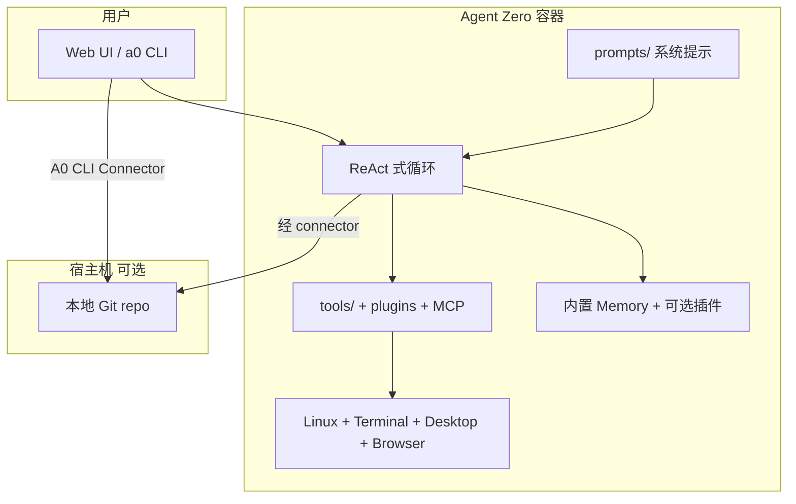

# Agent Zero

> [!tip] 核心本质
> Agent Zero（社区常简称 **A0** / **Agent0**，GitHub 组织 [agent0ai](https://github.com/agent0ai)）是跑在 **Docker 内完整 Linux 环境**上的开源 Agent 工作台：把终端、代码执行、浏览器、桌面 GUI、记忆与插件 hub 交给模型按需组合，而不是预置固定工具链。若没有这类「操作系统级」Runtime，通用个人助手要么被 IDE 宿主绑死，要么只能聊天不能真正改文件、跑命令、开浏览器；Agent Zero 用容器隔离换可审计的全环境操控，并通过 **A0 CLI Connector** 在受控前提下延伸到宿主机真实 repo。

## 命名辨析

| 名称 | 是什么 | 本文 |
| --- | --- | --- |
| **Agent Zero**（agent0ai/agent-zero） | 可部署的 Agent 框架 + Web UI + Linux 桌面 | ✓ |
| **Agent0**（aiming-lab/Agent0） | 零数据自进化 Agent 的 **RL 训练研究**（Curriculum + Executor 共演化） | ✗，见 [[#与 Aiming Lab Agent0 的区别]] |
| **Space Agent**（agent0ai/space-agent） | 同团队更新的「浏览器内 Space 工作台」产品方向 | 相关但未展开 |

下文 **Agent0 / A0** 均指 Agent Zero 产品，除非单独注明研究项目。

## 生命周期与演进

**当前定位**：2026 年 v1.9 前后活跃（~17k GitHub stars）。定位是**透明、可改 prompt/工具/插件**的通用个人助手，而非单任务 SaaS。核心差异：单容器内带 XFCE 桌面、内置 Browser（含 DOM Annotate）、LibreOffice 协作、100+ Plugin Hub；同时可作 MCP Server/Client，支持 OpenAI Codex OAuth 等账号型模型接入。

**预期寿命**：中期。「Agent + 真实环境」需求长期存在；Agent Zero 与 Cursor/Claude Code 等 IDE Agent **互补**（全 Linux 沙箱 vs 原生 IDE 集成）。同团队的 Space Agent 可能吸收部分「易用性」场景，Agent Zero 仍偏 power-user 与可 hack 框架。

**近期演进**：A0 CLI Connector（v1.9+ 内置 connector 路由）连宿主机；Time Travel 工作区快照；SKILL.md 标准 Skill 按需加载；Projects 隔离 memory/secrets/repo；Bring Your Own Browser 经 CLI 驱动本机 Chrome。

**终极威胁**：云厂商托管 Computer Use Agent 内置同等 GUI+终端且更安全；或用户只需轻量编码 Agent（Hermes/Cursor）而不需要整台 Linux VM；容器资源与运维成本阻碍普及。

## 在 Agent 栈中的位置

[[agent]] 定义感知-思考-行动循环；Agent Zero 是**重量级 Runtime 实现**——接近「给 Agent 一台电脑」，而非仅 function calling。



| 对比 | Hermes / Cursor / Claude Code | Agent Zero |
| --- | --- | --- |
| 运行面 | 宿主 IDE 或 CLI，直接碰 workspace | Docker 内 Linux，默认与宿主机隔离 |
| 工具哲学 | 宿主内置 Read/Shell/MCP + Skill | OS 即工具；缺什么让 Agent 写脚本/装包 |
| 扩展 | Skill、Rules、MCP | `prompts/`、`tools/`、Plugin Hub、MCP、A2A |
| 可视化 | 编辑器内 diff | Web UI + Canvas 实时看桌面/浏览器 |
| 典型用户 | 日常编码 | 研究、自动化、跨 GUI/终端/文档的泛任务 |

**Hermes**（[[hermes-agent]]）是**终端编码宿主**；Agent Zero 是**独立智能体操作系统**。可并存：Hermes 写仓库内代码，Agent Zero 跑沙箱内爬虫、Blender、LibreOffice 等重环境任务。

Agent Zero 有**内置记忆管理**（见官方 Memory guide）。**AgentMemory** 是跨宿主模型上下文协议（MCP）记忆层；Plugin Hub 亦有第三方记忆插件。是否要跨 Cursor/Hermes 共享同一记忆库，见 [[agentmemory]]。

Agent Zero 支持 **`SKILL.md` 开放标准**，与 Claude Code、Cursor、Codex 等可移植；加载方式为项目/聊天内按需或 pin（发现与激活机制见 [[skill-loading-library]]）。

## 架构要点

### Docker 内的「真环境」

默认 `docker run -p 80:80 -v a0_usr:/a0/usr agent0ai/agent-zero` 启动 Web UI。Agent 可：

- **Terminal / 代码执行** — 写脚本、装依赖、跑测试（默认 Kali/Linux 系工具链叙事）。
- **Canvas Desktop** — 容器内 XFCE：Blender、LibreOffice Writer/Calc/Impress 等 GUI。
- **内置 Browser** — 导航、点击、截图；**Annotate 模式**对 DOM 元素做 inspect / change / lift / comment。
- **Markdown 协作编辑** — Canvas 内与 Agent 共编同一文档（非 chat 里丢一段文本）。

行为主要由 `prompts/default/agent.system.md` 定义——改 prompt 即改框架人格与策略，符合 [[harness-engineering]]「Harness 可配置」思路。

### 默认工具 vs 自创工具

官方 README 强调：**无大量预置单用途工具**。出厂能力大致包括在线搜索、memory、与用户/子 Agent 通信、代码与终端执行；其余由 Agent **现场编写**或通过插件/MCP 扩展——「运行时造工具」落点为 shell + 文件系统权限（见 [[tool-self-learning]]）。

### 多 Agent 协作

Superior Agent 可 spawn **subordinate agents**，子 Agent 独立 context，完成后向上汇报——对应 [[multi-agent]] 的层级分解，避免单 context 膨胀。

### Projects 与隔离

**Projects** 隔离：工作区、instructions、memory、secrets、knowledge、Git repo 克隆、model presets。类似「每个客户/代码库一个 Agent 工作空间」，项目级 Rules/Skill 分层见 [[agent-context-stack]]。

### Plugin Hub 与 MCP

- **Plugin Hub**：100+ 社区插件（BMAD Method、memory 后端、主题、调度器等），Web UI 一键安装。
- **MCP**：v0.8.5+ 起 Agent Zero 既可作 **MCP Server** 暴露能力，也可把外部 MCP server 注册为工具——与 [[tool-mcp]] 同一协议层。

### A0 CLI Connector

**不是**另一个独立 Agent CLI，而是**已运行的 Agent Zero 实例**到宿主机的桥：

```bash
# 宿主机安装（勿在容器内）
curl -LsSf https://cli.agent-zero.ai/install.sh | sh
a0    # 发现本地或远程 AGENT_ZERO_HOST
```

用途：在**真实本地 repo** 上读写、跑 shell，同时保留 Docker 内 Agent 的 memory/projects/skills。v1.9+ 需实例带 builtin connector，否则 connector 路由 404。

## 典型场景

**适合**

- 需要 **GUI + 终端 + 浏览器** 混合的泛任务（UI 标注改站、Blender 建模、LibreOffice 预算表）。
- 希望 **完全透明** 地改 prompt、工具、插件，自建 specialist Agent Profile。
- 远程 VPS 跑 Agent，本地 `a0` 连上去操作主机文件。
- 实验 multi-agent 研究流、插件开发、与 MCP 工具链集成。

**不适合**

- 日常 IDE 内补全/重构（Cursor/Hermes 更轻）。
- 无法或不愿跑 Docker / 不能接受 VM 资源占用。
- 强合规要求禁止 Agent 有 shell 与网络（需额外硬化，默认模型偏「能干」）。

## 实践与应用

### 安装（观测 2026-05）

```bash
# macOS / Linux 一键
curl -fsSL https://bash.agent-zero.ai | bash

# 或已有 Docker
docker run -p 80:80 -v a0_usr:/a0/usr agent0ai/agent-zero
```

打开 Web UI → 配置 LLM Provider（含 OpenAI Codex OAuth）→ 从具体任务开始。完整步骤见 [Installation guide](https://github.com/agent0ai/agent-zero/blob/main/docs/setup/installation.md)。

### 建议的首批任务（来自官方）

- Browser Annotate：打开模板站，标注 hero，让 Agent 用你项目的 React+Tailwind 复现。
- 协作 spreadsheet：可编辑 ODS 预算模型。
- Desktop：在 Linux 桌面打开 Blender 建简单 3D logo。
- Agent Profile：创建「财务分析」专用人格与 deliverable 风格。

### 安全模型（必读）

Agent Zero 强大在于它使用的是**真实环境**：

- 保持 Docker/隔离运行；勿随意 mount 整个 `$HOME`。
- A0 CLI 的 Read+Write 与远程执行只授予**信任机器**。
- 凭证放 project secrets，勿写进 prompt。
- Time Travel 快照是工作区安全网，**不能替代 Git/备份**。

## 与 Aiming Lab Agent0 的区别

[Aiming Lab Agent0](https://github.com/aiming-lab/Agent0)（论文 [arXiv:2511.16043](https://arxiv.org/abs/2511.16043)）是 **训练时** 框架：从同一 base LLM 初始化 Curriculum Agent 与 Executor Agent，用 RL 共演化、工具集成、零外部标注数据，在 Qwen3-8B-Base 等上提升数学/推理 benchmark。

| | Agent Zero（本文） | Aiming Lab Agent0 |
| --- | --- | --- |
| 目标 | 部署可用的个人/团队 Agent | 提升 base 模型 Agent 能力（研究） |
| 产出 | Web UI、Docker 镜像、插件 | 训练 pipeline、checkpoint |
| 与工具 | 运行时 MCP/终端/浏览器 | 训练期 tool-integrated reasoning |
| 读者 | 工程师、power user | 对齐/Agent 训练研究者 |

若关心零数据自进化训练，应读 `model/training/` 方向文献，而非把 Agent Zero 当训练代码库。

## 坑与边界

| 问题 | 说明 |
| --- | --- |
| 与 IDE Agent 重复 | 同一 repo 上 A0 CLI + Cursor 同时改文件易冲突；划清职责或只用其一写盘 |
| 资源占用 | 桌面 + Browser + LLM 并发吃 CPU/RAM |
| connector 404 | Agent Zero 版本过旧，需 v1.9+ builtin connector |
| 命名混淆 | 搜索 "Agent0" 时过滤 aiming-lab vs agent0ai |
| Memory 分散 | 内置 memory vs [[agentmemory]] MCP；多项目需 Projects 隔离 |

## 进一步阅读

- 官方：[agent-zero.ai](https://www.agent-zero.ai)、[GitHub: agent0ai/agent-zero](https://github.com/agent0ai/agent-zero)、[DeepWiki](https://deepwiki.com/agent0ai/agent-zero)
- 本仓库：[[agent]]、[[multi-agent]]、[[skill]]、[[tool-mcp]]、[[memory]]、[[hermes-agent]]、[[harness-engineering]]
- 同团队：[Space Agent](https://github.com/agent0ai/space-agent)（更易用的 Space 形态）
- 研究同名：[Agent0 论文](https://arxiv.org/abs/2511.16043)（Aiming Lab，非本框架）
