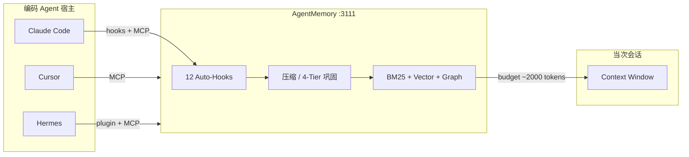

# AgentMemory

> [!tip] 核心本质
> AgentMemory 是面向编码 Agent 的**外部持久记忆运行时**：在后台自动捕获工具调用与会话事件，经压缩与混合检索后，在下一会话以可控 token 预算注入 context。若没有这类层，跨会话只能靠 `MEMORY.md` 或重复口述项目背景——要么全量塞进 context（贵且噪声大），要么每次从零解释；AgentMemory 把 [[memory]] 里的「写入 / 检索 / 遗忘 / 合并」收成单进程服务 + [[tool-mcp|MCP]] 工具面，供 Cursor、Claude Code、Hermes 等宿主共用同一套记忆库。

## 生命周期与演进

**当前定位**：2026 年快速迭代的开源产品（[agent-memory.dev](https://agent-memory.dev)，Apache-2.0），基于 [iii engine](https://iii.dev)；v0.9.x 宣称 LongMemEval-S 上 R@5 约 95.2%，相对「把全部观察塞进 context」约 92% 更少输入 token。单 Node 进程 + 本地磁盘 JSON/SQLite，**不依赖** Redis、Postgres、Qdrant 等外部库（与 Mem0、Letta、Cognee 等对比时的主要卖点）。

**预期寿命**：不确定。记忆层赛道拥挤（Letta/MemGPT、宿主内置 notepad、Karpathy 式 LLM Wiki 文件）；AgentMemory 押注 **跨宿主 MCP + 自动 Hook 捕获 + 混合检索**，能否胜出取决于 token 效率、隐私信任与 iii 生态。

**近期演进**：Connect 适配器持续扩容（Qwen Code、Kiro、Antigravity 等）；`AGENT_ID` + `AGENTMEMORY_AGENT_SCOPE=isolated` 多 Agent 隔离；Hermes 原生插件；JSONL 会话回放导入；Obsidian 导出与 mesh 联邦同步。

**终极威胁**：百万级 context 使「单会话内全记住」足够用；或用户只愿信任 repo 内 markdown（`AGENTS.md` / `MEMORY.md`）而非独立记忆服务；iii-engine 架构升级（v0.11.6+ sandbox 模型）要求 AgentMemory 跟进重构。

## 在记忆栈中的位置

[[memory]] 讨论**范式**（无状态 LLM、External Memory 操作链、与 RAG/Skill 分工）。AgentMemory 是**一种产品化实现**，对应 CoALA 分类里的 **External Memory**，并部分覆盖 In-context 注入（SessionStart 时把检索结果写回对话）。



| 对比维度 | 宿主内置记忆（如 `MEMORY.md`） | AgentMemory |
| --- | --- | --- |
| 规模 | 常有人为行数上限 | 观察级存储，检索 top-K |
| 检索 | 往往整文件进 context | BM25 + 向量 + 知识图谱 RRF 融合 |
| 跨宿主 | 各 Agent 各一份文件 | 同一 MCP/REST 服务共享 |
| 捕获 | 靠模型或用户手写 | Pre/PostToolUse 等 Hook 自动记录 |
| 治理 | 手动编辑 | TTL 衰减、矛盾检测、审计删除 |

**检索增强生成（RAG）** 面向预先策划的静态知识库；AgentMemory 面向**运行时观察**（改了哪个文件、测挂了什么、你选了 jose 而非 jsonwebtoken）。检索底层可复用向量/BM25 思路，**用途不同**（见 [[rag]]、[[memory#Memory 与 RAG 的区别]]）。

Skill 存稳定标准作业程序（SOP）；AgentMemory 偏 **情节记忆（Episodic）+ 个体化事实**（「这个项目 auth 在 `src/middleware/auth.ts`」）。程序性「怎么做发布」仍应进 Skill（见 [[skill]]），勿把完整 SOP 塞进 `memory_save`（上下文分层见 [[agent-context-stack]]）。

## 架构概览

| 组件 | 端口 / 形态 | 作用 |
| --- | --- | --- |
| **agentmemory 服务** | `:3111` REST + iii functions | 存储、压缩、检索、治理 |
| **Viewer** | `:3113`（随服务启动） | 实时观察流、会话回放、图谱可视化 |
| **iii engine** | 本地二进制或 Docker `iiidev/iii:0.11.2` | 事件/worker 运行时；当前版本与 engine 有 pin 关系 |
| **@agentmemory/mcp** | stdio MCP shim | 代理到 `AGENTMEMORY_URL`；无服务时退化为 7 工具本地集 |
| **宿主插件 / hooks** | Claude Code 12 hooks、Codex 6 hooks 等 | 零胶水自动 capture |

**集成深度分三档**（各宿主对照见 [[hermes-agent]]、[[skill-loading-library]]）：

1. **Native plugin + hooks + MCP** — Claude Code、Codex CLI、Copilot CLI、Hermes、OpenClaw、pi：安装 marketplace 插件后，SessionStart/PostToolUse/Stop 等自动进 pipeline。
2. **MCP only** — Cursor、Gemini CLI、Cline、Windsurf：配 universal MCP JSON 即可 recall/save，无自动 hook 时需模型主动调工具。
3. **REST / iii SDK** — Aider、自研 Agent：`mem::smart-search` 等 iii 函数或 `/agentmemory/*` HTTP。

产品自述延伸 [Karpathy LLM Wiki](https://karpathy.ai) 思路：用 gist 式持久笔记 + **置信度打分、生命周期、图谱与混合搜索** 做成可运行服务。

## 记忆流水线

官方描述的端到端路径（观测日期 2026-05，以 [README](https://github.com/rohitg00/agentmemory) 为准）：

**写入（Capture）**

```text
PostToolUse → SHA-256 去重（5min 窗）→ 隐私过滤（密钥/secret）
  → 存 raw observation → LLM 压缩为 facts / concepts / narrative
  → 向量嵌入 → 写入 BM25 + 向量索引

Stop / SessionEnd → 会话摘要 →（可选）图谱实体抽取、slot reflection
```

**读出（Recall）**

```text
SessionStart → 加载 project profile
  → 混合检索（BM25 + vector + graph，RRF k=60，每 session 最多 3 条）
  → 默认 ~2000 token 预算 → 注入对话
```

Hook 负责 **Write**，SessionStart 负责 **Query**，巩固任务负责 **Consolidate/Forget**——对应通用记忆操作链（见 [[memory#记忆操作：写入、检索、遗忘、合并]]）。

### 四层巩固（4-Tier Consolidation）

| 层级 | 内容 | 类比 |
| --- | --- | --- |
| **Working** | 工具调用的 raw observations | 短期工作记忆 |
| **Episodic** | 压缩后的会话摘要 | 「发生了什么」 |
| **Semantic** | 抽取的事实与模式 | 「我知道什么」 |
| **Procedural** | 工作流与决策模式 | 「通常怎么做」 |

可以把这四层理解成「从日志到经验」的逐层沉淀：

- `Working`：高频、细粒度、时效短。记录工具输入输出、报错、文件改动等“刚刚发生”的原始事件，信息最全但噪声也最大。
- `Episodic`：把一段会话压成“事件串”。重点回答「这次 session 做了什么、遇到什么、怎么收尾」。
- `Semantic`：跨会话可复用的事实与规则。重点是去上下文后的稳定知识，例如「项目认证中间件在 `src/middleware/auth.ts`」。
- `Procedural`：沉淀为“做事套路”。例如「先跑 `pnpm test` 再改 schema，再跑 migration」这类可重复执行的流程模式。

每小时会执行一次整理任务（hourly sweep），典型顺序是：

1. **抽取与压缩**：从 `Working` 中抽取可复用事实，写入 `Semantic`；同时把当次会话主线写入 `Episodic`。
2. **去重与合并**：把语义重复或冲突的记忆做归并，避免同一事实出现多条近似版本。
3. **保留策略衰减**：对长期未被检索命中的旧记忆逐步降权（可理解为“遗忘曲线”），让新近且高价值记忆优先被召回。
4. **清理与审计**：达到阈值的低价值记忆会被清理；清理动作会留下审计记录，便于后续追踪“删了什么、为什么删”。

一个直观例子：

- 你在三次会话里都修过“登录 401”。
- `Working` 里会有大量原始报错和命令输出。
- sweep 后，`Episodic` 保留每次排障过程摘要，`Semantic` 可能沉淀为「401 常由过期 JWT + 时钟偏差导致」。
- 如果某条旧结论长期没再命中，系统会先降权，不会立刻硬删；只有持续低价值才会被清理并写入审计。

这个机制在理念上接近 MemGPT 的 `working` ↔ `archival` 分层迁移：把“当前窗口内高噪声信息”逐步转成“长期可检索知识”。区别是 AgentMemory 已把捕获、压缩、检索、衰减、审计做成产品内置流程，你不需要自己搭一套 Runtime 去编排这些后台任务。

### 混合检索

| 流 | 机制 | 条件 |
| --- | --- | --- |
| **BM25** | 词干 + 同义词扩展 | 始终开启 |
| **Vector** | 稠密 embedding 余弦相似 | 配置 embedding provider（推荐本地 `@xenova/transformers`） |
| **Graph** | 实体匹配 + 图遍历 | 查询含可识别实体且开启图谱 |

三路经 **[[rrf|Reciprocal Rank Fusion]]** 合并；中文/JK 可选装 `@node-rs/jieba` 等分词器，否则 CJK 整段 tokenize（召回略弱）。

### 自动 Hook 捕获什么

| Hook | 典型内容 |
| --- | --- |
| `SessionStart` | 项目路径、session ID；触发 recall 注入 |
| `UserPromptSubmit` | 用户 prompt（经隐私过滤） |
| `PreToolUse` / `PostToolUse` | 工具名、输入输出、文件访问模式 |
| `PostToolUseFailure` | 错误上下文（避免重复踩坑） |
| `PreCompact` | compaction 前再注入记忆 |
| `Stop` / `SessionEnd` | 会话摘要与巩固触发 |

## 典型使用场景

**适合**

- 同一 repo 上 Cursor + Claude Code + Hermes 混用，希望**一份**项目记忆。
- 长周期重构：Session 1 定 auth 方案，Session 2 加 rate limit 时不想重讲 JWT 选型理由。
- 需要**可审计**的遗忘与导出（governance、Obsidian mirror、JSONL replay）。

**不适合**

- 一次性脚本、无跨会话需求。
- 强合规场景下不允许第三方进程读 tool output（需自审隐私过滤与部署边界）。
- 团队共享的**权威文档**——仍应以 git 里的 ADR/README 为准；Memory 是 Agent 工作集，不是 source of truth。

## 实践与应用

### 快速启动

```bash
npm install -g @agentmemory/agentmemory   # 或 npx @agentmemory/agentmemory
agentmemory                                 # :3111 服务 + :3113 viewer
agentmemory demo                            # 种子数据 + 验证 hybrid search
agentmemory connect cursor                  # 按宿主生成 wiring（亦支持 claude-code, hermes, codex, …）
```

健康检查：`curl http://localhost:3111/agentmemory/health`。Viewer：`http://localhost:3113`。

### 通用 MCP 配置（Cursor / Claude Desktop / Gemini CLI 等）

合并到宿主 `mcpServers`：

```json
{
  "mcpServers": {
    "agentmemory": {
      "command": "npx",
      "args": ["-y", "@agentmemory/mcp"],
      "env": {
        "AGENTMEMORY_URL": "http://localhost:3111"
      }
    }
  }
}
```

**常见坑**：只配 MCP、未启动 `agentmemory` 服务时，shim 仅暴露 **7 个**本地工具，而非完整 53 工具面——先起服务再连客户端。

### Claude Code / Hermes（插件路径）

Claude Code：marketplace 安装 `rohitg00/agentmemory` 插件 → 自动注册 12 hooks + `.mcp.json`，并附带 8 个 native skills 教 Agent 何时 `memory_smart_search`。

Hermes：first-party Python 插件 + yaml 配置（与 [[hermes-agent]] 联读）；v0.9.x 起 memory provider 端到端可用。

### 多 Agent 隔离

同一机器跑多个 Agent 时，用 `AGENT_ID` 区分命名空间；需硬隔离时设 `AGENTMEMORY_AGENT_SCOPE=isolated`，检索默认只返回本 Agent 记忆（共享记忆需显式 opt-in）。

### 与本仓库 POC 的关系

当前 POC（`poc/poc_server/hermes_adapter.py`）**未**接 AgentMemory，仍直接用 Hermes CLI。若要在问答/融合流水线里复用跨会话项目记忆，典型做法是：Session 前 `memory_profile` / `memory_smart_search`，或将融合结论经 `memory_save` 写回——写入前人工校验可与知识融合流水线并存（见 [[knowledge-fusion]]）。

## 坑与边界

| 问题 | 说明 | 对策 |
| --- | --- | --- |
| MCP 只有 7 个工具 | 未连上 `:3111` 服务 | 先 `agentmemory`，检查 `AGENTMEMORY_URL` |
| iii-engine 版本 pin | v0.11.6+ sandbox 模型尚未完全适配 | 跟随 README 安装 `0.11.2` 或 Docker 镜像 |
| 与 context 内信息冲突 | SessionStart 注入 + 用户刚说的矛盾 | 注入带时间戳；关键决策仍以 repo 文档为准 |
| 隐私 | Hook 会记录 tool I/O | 依赖内置 secret 过滤；敏感 repo 评估是否本地/air-gap |
| Library Drift | 记忆与代码/Skill 不同步 | 定期 `memory_governance_delete`、Obsidian 导出人工审阅；类比 [[skill-loading-library]] |

## 进一步阅读

- 本仓库：[[memory]]（范式）、[[tool-mcp]]（协议）、[[hermes-agent]]（Hermes 插件）、[[memx]]、[[mem0]]（对比选型）、[[agent-context-stack]]（Memory vs Skill vs RAG）
- 官方：[agent-memory.dev](https://agent-memory.dev)、[GitHub: rohitg00/agentmemory](https://github.com/rohitg00/agentmemory)
- 竞品语境：[[memgpt]]（OS 式 Runtime）、[[mem0]]（可插拔记忆 API）、宿主 `MEMORY.md`（轻量 sticky notes）
- 基准：LongMemEval（长程对话记忆评测，官方 cited R@5）
