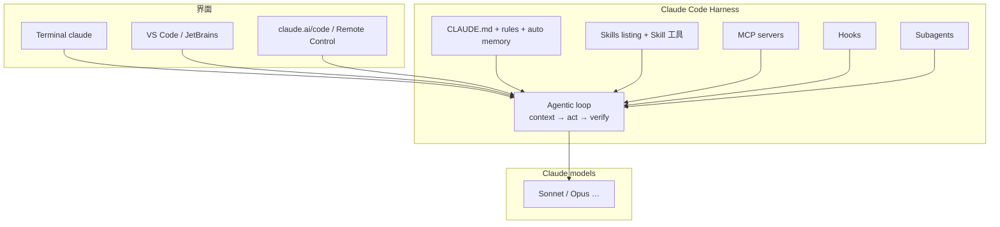

# Claude Code

> [!tip] 核心本质
> Claude Code 是 Anthropic 的**终端 Agent 宿主**：在仓库目录里跑 `claude`，由 Claude 模型驱动「读代码 → 改文件 → 跑 shell → 验证」的 agentic loop，并叠加 `CLAUDE.md`、Skills、[[tool-mcp|MCP]]、Hooks 等扩展层。若没有这类 Harness，模型只能给文本建议而无法安全、可审计地碰你的 git 与测试；Claude Code 把 [[agent]] 的感知-思考-行动循环产品化，且与 Cursor 等同属「编码 Agent 第一梯队」，但栈由 Anthropic 定义（权限、checkpoint、Skill 工具、子 Agent）。

## 生命周期与演进

**当前定位**：2026 年成熟产品期（官方文档 [code.claude.com/docs](https://code.claude.com/docs)）。除终端外，支持 VS Code / JetBrains、Desktop App、claude.ai/code、Remote Control、Slack、CI 等界面；**底层 agentic loop 一致**。执行环境分 Local（默认）、Cloud（Anthropic VM）、Remote Control（本机执行、浏览器遥控）。

**预期寿命**：中长期。Anthropic 原生编码 Agent 载体，与 Claude 模型绑定深，但开放 MCP 与 Agent Skills 标准，生态可移植 Skill 到 Cursor/Hermes/Codex。

**近期演进**：Auto memory、`MEMORY.md` 会话加载；MCP tool search（按需加载 schema 省 context）；Plan mode / Auto 权限模式；`context: fork` 子 Agent；Hooks 扩展（含 MCP tool hooks、agent hooks 实验特性）。

**终极威胁**：Cursor 等 IDE 一体化体验吞掉「纯终端」用户；或模型单次推理足够强，压缩 tool 轮次；跨厂商开放 Harness 使「Claude 专属」优势减弱。

## 在 Agent 栈中的位置

[[agent]] 定义循环；Claude Code 是 **Anthropic Harness 实现**，重点在**仓库内编码与命令行泛任务**（写文档、跑构建、查 git），不是 [[openclaw]] 式 IM 个人助手，也不是 [[hermes-agent]] 式多 provider 自托管 runtime。



| 对比 | Claude Code | Cursor | [[hermes-agent]] | [[openclaw]] |
| --- | --- | --- | --- | --- |
| 厂商 | Anthropic | Cursor | Nous（开源） | 社区（开源） |
| 模型 | Claude 为主 | 多模型 | 200+ provider | 多 provider |
| 主界面 | 终端 + IDE 插件 | IDE 原生 | TUI + Gateway | IM Gateway |
| 项目指令 | `CLAUDE.md`、`.claude/rules/` | Rules / AGENTS.md | context files | `AGENTS.md` / SOUL |
| Skill 路由 | listing ~1% + Skill 工具 | prompt 索引 + `@skill` | 类似 + `skills_list` | ClawHub + workspace |
| 治理 | Hooks + permissions | [[cursor-hooks]] | 配置 + approvals | exec approvals |

Skill **选型与 listing 预算**见专篇 [[claude-code-skill-selection]]，本文只交代产品与上下文分工。

## Agentic loop 与工具

官方三阶段：**gather context → take action → verify**，实际交织进行。

| 工具类别 | 能力 |
| --- | --- |
| File | Read / Edit / Write、重命名与组织 |
| Search | 路径 glob、regex 内容搜索 |
| Execution | shell、测试、git、包管理器 |
| Web | 搜索、拉文档 |
| Code intelligence | 类型错误、定义跳转（需插件） |
| Orchestration | 子 Agent、向用户提问等 |

模型在 loop 内**自选工具**；用户可随时 `Esc` 中断，或在运行中追加纠正。权限模式（`Shift+Tab`）：Default、Auto-accept edits、**Plan mode**（只读）、Auto mode（研究预览）。

**Checkpoint**：每次改文件前快照，本地可 `Esc Esc` 回滚（非 git；远程副作用不可 checkpoint）。

## 上下文资产

Claude Code 把 Soul、Rules、Skill、记忆、模型上下文协议（MCP）与 Hooks 拆成可配置资产，是理解 [[agent-context-stack]] 的**好样本**：

| 资产 | Claude Code 载体 |
| --- | --- |
| Soul / 人格 | 系统层 + `/personality` 等 |
| Rules / 底线 | **`CLAUDE.md`**、**`.claude/rules/*.md`**（可 `paths:` 条件加载） |
| 程序性 SOP | **Skills**（`~/.claude/skills/`、`.claude/skills/`、插件 `plugin:skill`） |
| Episodic / 记忆 | **Auto memory**、项目/用户 **`MEMORY.md`**（会话初加载前 200 行或 25KB） |
| 实时 | **MCP** tools |
| 确定性治理 | **Hooks**（CLAUDE.md 是概率性指引，Hooks 是硬约束——见 [[cursor-hooks]] 对照） |

**CLAUDE.md**：项目根（及向上/嵌套目录）持久指令；`/init` 引导创建。Compaction 后早期对话指令易丢——**常驻规则必须写进 CLAUDE.md**，不要只依赖 chat 历史。

**Compaction**：接近 context 上限时自动摘要；`/compact` 可带 focus；Skill 正文在 compaction 后有保留配额（见 [[claude-code-skill-selection#调用之后：正文如何留在会话里]]）。

## Skills（概要）

Discovery：**会话启动**注入 name + description listing（约上下文 **1%** 预算）；Activation：`/skill-name`、`@`、或 **Skill 工具** 按需加载全文。

Claude Code 采用 **listing + Skill 工具按需加载** 的发现与激活路径（机制 ②，见 [[skill-loading-library]]）。

Frontmatter 要点：`description`、`disable-model-invocation`、`user-invocable`、`paths`、`context: fork`（子 Agent 内跑 Skill）。溢出与 `/doctor` 排查 → [[claude-code-skill-selection]]。

## MCP 与 Hooks

**MCP**：在 `~/.claude/settings.json` 或项目 settings 配置 `mcpServers`；工具名 `mcp__<server>__<tool>`。MCP 定义默认 **deferred**，经 tool search 按需进 context；`/mcp` 查看 token 成本。

**Hooks**：在 settings 里绑生命周期事件（`PreToolUse`、`PostToolUse`、`SessionStart`、`InstructionsLoaded` 等），执行 shell / HTTP / **MCP tool** / prompt / agent 验证。用于格式化、测试门禁、密钥扫描、审计——与 Skill scripts 分工：Hooks 是**横切治理**，Skill 是**任务 SOP**。概念平行于 [[cursor-hooks]]，配置路径与事件表不同。

**AgentMemory** 等：marketplace 插件可注册 **12 hooks + MCP + native skills**，实现跨会话记忆捕获（见 [[agentmemory]]）。

## 会话与并行

- 会话持久化于 `~/.claude/projects/`（JSONL）；`claude --continue` / `--resume` 续聊，`--fork-session` / `/branch` 分叉。
- **新会话 = 新 context**，不自带旧对话；跨会话靠 auto memory + MEMORY.md + CLAUDE.md。
- **Git worktree** 可并行多会话（每 worktree 独立目录）。
- **Subagents**：独立 context，完成后摘要回主会话；长探索/refactor 用 `context: fork` Skill 或 `/agents` 配置。

## 典型场景

**适合**

- Anthropic 订阅用户，要**终端/IDE 一体**的编码 Agent。
- 重视 **CLAUDE.md + Skills + Hooks** 分层治理的团队 repo。
- Plan mode 下先审计划再改代码；checkpoint 快速回滚本地编辑。
- CI / Slack 集成同一 agentic loop。

**不适合**

- 必须**非 Claude 模型**为主力（[[hermes-agent]] / Cursor 多模型更贴）。
- 主要在微信/Telegram **IM 助手**（[[openclaw]] / Hermes Gateway）。
- 不想维护 Anthropic 账号与用量计费。

## 实践与应用

### 安装（观测 2026-05）

```bash
npm install -g @anthropic-ai/claude-code
claude          # 首次浏览器 OAuth
```

亦见官方 [Quickstart](https://code.claude.com/docs/en/quickstart)。项目根建议：

```bash
claude
/init           # 生成 CLAUDE.md 草稿
/doctor         # 安装与 Skill listing 诊断
```

### 常用命令

| 命令 | 作用 |
| --- | --- |
| `claude` | 交互会话 |
| `claude --continue` | 续上一会话 |
| `claude --model <name>` | 指定模型 |
| `/model` | 会话内换模型 |
| `/context` | 查看 context 占用 |
| `/permissions` | 工具权限 |
| `/skills`、`/skill-name` | Skill 列表与调用 |
| `/compact` | 手动压缩上下文 |
| `/agents` | 子 Agent 配置 |

项目级权限：`.claude/settings.json`（allow/deny 命令、Hooks、MCP）。

### 与本仓库的关系

- **Skill 机制**：深度文档在 `agent/skill/` → [[claude-code-skill-selection]]、[[skill-loading-library]]（宿主对照表含 Claude Code 行）。
- **POC**：当前 POC 对接 **Hermes** `hermes chat`，未接 Claude Code；若切换，需 Anthropic API/订阅 + 等价的非交互 CLI（或 SDK），并单独评估 fusion 写入策略。
- **Hooks 对比**：[[cursor-hooks]] 专述 Cursor；Claude Hooks 见 [Hooks guide](https://code.claude.com/docs/en/hooks-guide)。

## 坑与边界

| 问题 | 说明 | 对策 |
| --- | --- | --- |
| 规则只写在对话里 | Compaction 后丢失 | 迁到 `CLAUDE.md` / rules |
| Skill 多 listing 溢出 | description 被裁 | `/doctor`；精写 description；[[claude-code-skill-selection]] |
| CLAUDE.md vs Skill 重复 | Context 浪费、指令冲突 | [[agent-context-stack]] 分工 |
| Hooks 缺失 | 模型「应该跑测试」但不稳定 | PreToolUse/PostToolUse 硬门禁 |
| MCP schema 过大 | Context 被 tool 定义占满 | tool search；按需连 server |
| Checkpoint ≠ git | 只覆盖本地文件编辑 | 重要变更仍要 commit |
| Cloud 执行 | 代码在 Anthropic VM | 敏感 repo 用 Local / 权限审查 |

## 进一步阅读

- 官方：[How Claude Code works](https://code.claude.com/docs/en/how-claude-code-works)、[Skills](https://code.claude.com/docs/en/skills)、[Hooks guide](https://code.claude.com/docs/en/hooks-guide)、[Context window](https://code.claude.com/docs/en/context-window)
- 本仓库：[[claude-code-skill-selection]]、[[skill]]、[[skill-loading-library]]、[[agent-context-stack]]、[[tool-mcp]]、[[memory]]、[[agentmemory]]、[[memx]]、[[claude-managed-agents]]、[[cursor-hooks]]、[[hermes-agent]]、[[openclaw]]
