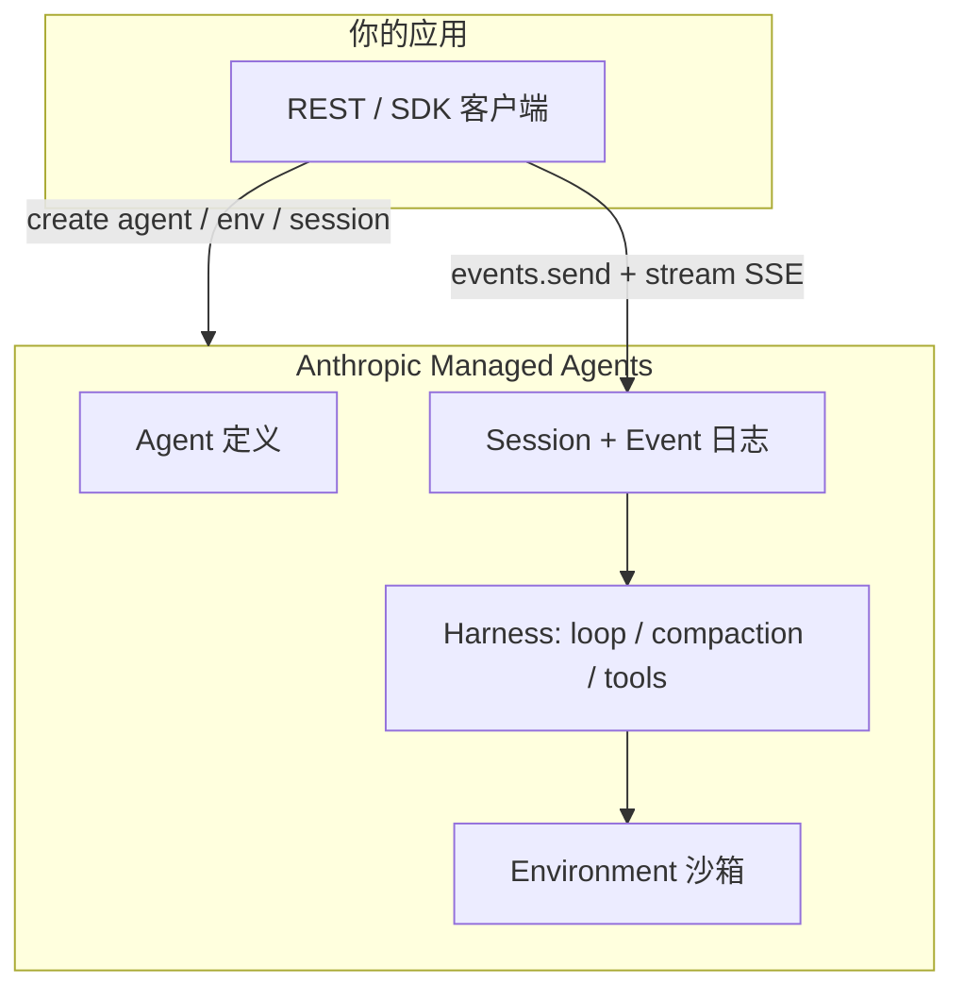

# Claude Managed Agents

> [!tip] 核心本质
> Claude Managed Agents 是 Anthropic 提供的**托管 Agent Harness + 沙箱**：你通过 REST API 定义 Agent（模型、system、tools、MCP、Skills），在 Environment（云沙箱或自托管沙箱）里启动 **Session**，以 **Events** 驱动多轮工具执行；Anthropic 负责 agent loop、compaction、会话持久化与 SSE 流式回传。若没有它，你要自建 [[agent]] 循环、沙箱与状态存储（或只在本地跑 [[claude-code]] / Agent SDK）；Managed Agents 把「长跑、异步、有状态」的生产 Agent 收成 **API 一等公民**，适合不想运维 sandbox 基础设施的应用集成方。

## 命名辨析

| 名称 | 是什么 |
| --- | --- |
| **Claude Managed Agents** | 本文：Anthropic **托管** Harness（REST，`client.beta.agents` / `sessions`） |
| **Claude Agent SDK** | 库：Agent loop 跑在**你的进程/机器**（原 Claude Code SDK） |
| **Claude Code** | 交互式终端/IDE 产品（见 [[claude-code]]） |
| **Messages API** | 纯模型对话；**你自己**实现 tool loop |

官方推荐路径常见为：**Agent SDK 本地原型 → Managed Agents 生产**（见 [Agent SDK overview](https://code.claude.com/docs/en/agent-sdk/overview)）。

## 生命周期与演进

**当前定位**：2026 年 **public beta**（beta header `managed-agents-2026-04-01`；默认对 API 账户开放）。与 Messages API 并列，Anthropic「用 Claude 构建」的第二条主线：**预置 Harness + 托管基础设施**，内置 prompt caching、compaction 等优化。

**预期寿命**：中长期。云厂商托管 Agent Runtime 是工业界方向；具体 API 面、合规选项会演进。

**近期演进**：Claude Platform on AWS 变体；MCP 与 Skills 作为 Agent 配置一部分；研究预览功能（MCP tunnels、dreaming 等需单独申请）。

**终极威胁**：Agent SDK + 自建 K8s 沙箱满足合规与成本；或 Messages API + 自研 loop 足够轻；beta 期行为变更影响生产 SLA。

## Anthropic 三条构建路径

| 路径 | 你负责 | Anthropic 负责 | 典型场景 |
| --- | --- | --- | --- |
| **Messages API** | 整个 tool loop、执行层 | 模型推理 | 完全自定义、细粒度控制 |
| **Agent SDK** | 进程、文件系统、session JSONL | 模型 + 内置工具 loop 库 | CI、本地自动化、贴 repo |
| **Managed Agents** | 应用逻辑、Event 编排、部分 custom tool 执行 | Harness、沙箱、会话/event 持久化 | 长跑任务、少运维、异步 worker |
| **Claude Code（CLI）** | 人交互、本地权限 | 同 SDK 能力 + UI | 日常开发（[[claude-code]]） |



## 四个核心概念

官方模型（[overview](https://platform.claude.com/docs/en/managed-agents/overview)）：

| 概念 | 含义 |
| --- | --- |
| **Agent** | 一次定义、多 Session 复用：model、system prompt、tools、MCP servers、skills |
| **Environment** | Session **在哪跑**：Anthropic **cloud sandbox**，或 **self-hosted sandbox**（合规/数据驻留） |
| **Session** | Agent + Environment 上的一次长跑实例；持久化对话、沙箱文件系统、产出 |
| **Events** | 应用 ↔ Agent 的消息单元：user message、tool results、status；**SSE 流式**；历史服务端持久化 |

工作流：**Create Agent → Create Environment → Start Session → Send events & stream → Steer / interrupt**。

## 能力与内置工具

Harness 内 Claude 可：

- **Bash** — 沙箱内 shell  
- **File ops** — read / write / edit / glob / grep  
- **Web** — search、fetch  
- **MCP** — 接外部工具提供商  

Agent 创建时可配 toolset（如 `agent_toolset_20260401`）、MCP、Skills——与 [[tool-mcp]]、[[skill]] 开放标准同生态，但配置走 **Agent 资源 API** 而非本地 `.claude/`。

**Custom tools**：与 Agent SDK 的 in-process 函数不同——Managed Agents 中 Claude **发起 tool call**，由**你的应用执行**并通过 Events 回传结果（适合接私有 API、合规网关）。

## 与 Agent SDK / Claude Code 对比

| | Managed Agents | Agent SDK | Claude Code |
| --- | --- | --- | --- |
| 运行位置 | Anthropic（或自托管 Environment） | 你的进程 | 本机/Cloud CLI |
| 接口 | REST + beta SDK | Python / TS 库 | 终端 / IDE |
| 工作文件 | **Session 沙箱** | 你的 working directory | 你的 repo |
| Session 状态 | 服务端 event log | 本地 `~/.claude/projects/` JSONL | 同 SDK |
| Custom tools | 应用侧执行 + event 回传 | 进程内 callback | 内置 + MCP |
| 最适合 | 长跑、异步、免运维沙箱 | 原型、贴本地文件系统 | 人机结对编码 |

Many teams：**Claude Code 日常写码 → Agent SDK 脚本化 → Managed Agents 对外产品**。

## 典型场景

**适合**

- 后台 **分钟～小时级** Agent 任务（批量分析、代码生成流水线、研究任务）。  
- 不想维护 **sandbox + session store + compaction**。  
- 需要 **SSE 流式** + 中途 **steer/interrupt**。  
- 可接受 Session 状态在 Anthropic（或 AWS 平台变体）；或用 **self-hosted Environment** 满足驻留。

**不适合**

- 必须 **Zero Data Retention / HIPAA BAA**（官方：Managed Agents **目前不适用** ZDR/BAA；会话有状态设计）。  
- Agent 必须 **直接读写开发者本机 repo** 且无上传沙箱步骤 → [[claude-code]] / Agent SDK。  
- 只要单次 `messages.create` 问答 → Messages API。  
- 要多模型 provider → [[hermes-agent]] 等。

## 实践与应用

### 前置（观测 2026-05）

1. Claude **API key**  
2. 所有请求带 beta header：**`anthropic-beta: managed-agents-2026-04-01`**（官方 SDK 自动设置）  
3. SDK 版本需支持 `client.beta.agents` / `sessions`（过旧 pin 会 400）

### 最小流程（Python 示意）

```python
# 概念步骤 — 以官方 Quickstart 为准
agent = client.beta.agents.create(
    name="Coding Assistant",
    model="claude-opus-4-6",  # 以文档当前模型名为准
    system="You are a helpful coding agent.",
    tools=[{"type": "agent_toolset_20260401"}],
)

env = client.beta.environments.create(
    name="quickstart-env",
    config={"type": "cloud", "networking": {"type": "unrestricted"}},
)

session = client.beta.sessions.create(
    agent=agent.id,
    environment_id=env.id,
    title="Quickstart session",
)

with client.beta.sessions.events.stream(session.id) as stream:
    client.beta.sessions.events.send(
        session.id,
        events=[{"type": "user.message", "content": [{"type": "text", "text": "..."}]}],
    )
    for event in stream:
        ...  # agent.message / agent.tool_use / session.status_idle
```

TypeScript 同理：`@anthropic-ai/sdk` 的 `client.beta.*`。

### Environment 选型

| 类型 | 用途 |
| --- | --- |
| **cloud** | Anthropic 托管沙箱，预装包、可配 networking |
| **self-hosted** | 沙箱在你控制的 infrastructure，合规/驻留 |

详见官方 Environments 文档与 **Claude Platform on AWS** 专篇（行为与 feature 可能与默认云有差异）。

### 速率与合规

- Create 类 endpoint：**300 req/min**；Read/stream：**600 req/min**（org 级）  
- 可随时 **delete session** 与上传文件；Stateful 设计 → 注意数据保留政策  
- 集成对外产品时的 **Branding**：可用「Claude Agent」「Powered by Claude」；**不可**称「Claude Code Agent」或模仿 Claude Code 视觉

## 与本仓库的关系

- **范式**：补全 [[agent]] / [[harness-engineering]] 中「谁跑 Harness」维度——Managed Agents = **vendor-hosted Harness**。  
- **Claude Code**：同一 Claude 工具族，**交互产品 vs API 托管**；Skill/MCP 概念互通，配置面不同。  
- **POC**：当前仍用 Hermes CLI；若接 Managed Agents，需 API Session + 沙箱内文件而非本地 `poc_kb/` 直写——架构会变更为「Agent 产出 → 应用落库」。  
- **记忆**：Session 级持久化由 Anthropic 管；跨产品的 [[agentmemory]] / [[memx]] 是**附加层**，非 Managed Agents 内置。

## 坑与边界

| 问题 | 说明 |
| --- | --- |
| 400 / beta header | 漏 `managed-agents-2026-04-01` 或 SDK 过旧 |
| 与 Claude Code 混淆 | 托管 API ≠ 终端产品；文档与对外命名分开 |
| 合规 | 无 ZDR/HIPAA；regulated 场景审 data retention + self-hosted |
| Beta 行为漂移 | 产出质量与 API 可能在 release 间调整 |
| Custom tool 延迟 | 每次 tool 需 round-trip 到你的服务 |
| 成本 | 模型 token + 托管 runtime；长跑 Session 需预算 |

## 进一步阅读

- 官方：[Managed Agents overview](https://platform.claude.com/docs/en/managed-agents/overview)、[Quickstart](https://platform.claude.com/docs/en/managed-agents/quickstart)、[Agent SDK overview（含对比表）](https://code.claude.com/docs/en/agent-sdk/overview)
- 本仓库：[[claude-code]]、[[agent]]、[[harness-engineering]]、[[tool-mcp]]、[[skill]]、[[multi-agent]]
