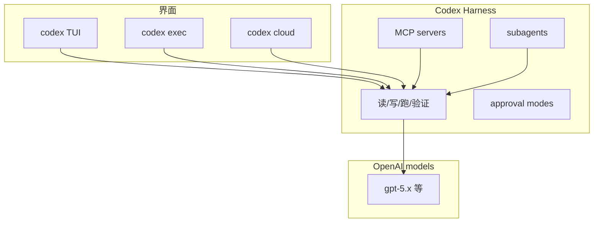

---
tags:
  - product
  - cli
  - openai
  - coding-agent
aliases:
  - Codex CLI
  - OpenAI Codex
  - codex
prerequisites:
  - "[[agent]]"
  - "[[claude-code]]"
  - "[[tool-use]]"
related:
  - "[[tool-mcp]]"
  - "[[agent-sandbox]]"
  - "[[harness-engineering]]"
  - "[[building-effective-agents]]"
  - "[[skill]]"
stability: short
layer: application
updated: 2026-06-15
---

# Codex CLI（OpenAI 终端编码 Agent）

> [!tip] 核心本质
> **Codex CLI** 是 OpenAI 的**本地终端编码 Agent**：Rust 实现，在选定目录内读改文件、跑 shell、接 [[tool-mcp|MCP]]，交互式 TUI 或 `codex exec` 非交互脚本。与 [[claude-code]] 同属「仓库内 agentic loop」第一梯队，但栈属 OpenAI（ChatGPT 订阅含 Codex、模型 `/model` 切换）。没有此类 Harness，模型只能建议而不能可审计地改 git 与跑测试。

适合对比终端编码 Agent 选型、或要把 Codex 当 MCP 服务器编排进多 Agent 流水线。读完应能说出安装方式、与 Claude Code 的差异轴、以及 `exec` / Cloud / subagents 边界。

*检索说明：产品与 CLI 能力对照 [OpenAI Codex CLI 文档](https://developers.openai.com/codex/cli)、[openai/codex GitHub](https://github.com/openai/codex)（观测 2026-06-15）。*

## 生命周期与演进

**当前定位**：2025–2026 成熟 CLI；另有 IDE 插件、Desktop、`codex.app`、**Codex Cloud** 任务与 **Agents SDK** MCP 集成。

**预期寿命**：short。OpenAI 产品线迭代快；Rust 开源核心（Apache-2.0）可延续社区分叉。

**近期演进**：subagents 并行、本地 code review Agent、图输入/生成、Web search、Remote TUI、`codex mcp` 管理 MCP。

**终极威胁**：IDE 一体化（Cursor 等）分流纯终端用户；跨厂商 Harness 标准化削弱「Codex 专属」绑定。

## 1 在 Agent 栈中的位置

[[agent]] 定义循环；Codex CLI 是 **OpenAI Harness**——重点在**编码与 shell 泛任务**，不是 [[openclaw]] 式 IM 助手。

## 2 与 Claude Code 对照

| 维度 | Codex CLI | [[claude-code]] |
| --- | --- | --- |
| 厂商 | OpenAI | Anthropic |
| 实现 | Rust 开源 | 闭源 CLI |
| 订阅 | ChatGPT Plus/Pro/Business 等 | Claude 计划 |
| 项目指令 | `AGENTS.md` 等（随版本） | `CLAUDE.md`、`.claude/rules/` |
| MCP | `~/.codex/config.toml`、`codex mcp` | 项目/用户 MCP 配置 |
| 特色 | Cloud 任务、`exec` 脚本化、可作 MCP server | Hooks、Skill 工具、Plan mode |

二者均可嵌 [[harness-engineering]] 同一范式：权限、沙箱、可恢复会话。

## 3 关键能力

| 能力 | 说明 |
| --- | --- |
| **交互 TUI** | `codex`；`/model` 换模型与 reasoning |
| **exec** | 非交互管道，适合 CI/脚本 |
| **resume** | 本地 transcript 续聊 |
| **MCP** | STDIO/HTTP 服务器；亦可 `codex mcp-server` 被外部 Agent 调 |
| **subagents** | 复杂任务并行子 Agent |
| **Codex Cloud** | 终端发起云端任务、拉回 diff |
| **审批模式** | 编辑/执行前人工确认粒度 |

安装（官方）：macOS/Linux `curl -fsSL https://chatgpt.com/codex/install.sh | sh`；亦 `npm i -g @openai/codex`、`brew install codex`。

## 4 集成与治理

- **Agents SDK**：把 Codex 当 MCP 工具 `codex()` / `codex-reply()` 编排多角色流水线（Designer → Implementer）
- **安全**：配合 [[agent-sandbox]] 理解 workspace-write vs 更广权限
- **评测**：编码 Agent 基准见 [[llm-benchmarks]]（SWE-bench 等）

## 要点收束

- Codex CLI = OpenAI 本地 Rust 编码 Agent + MCP + 可选 Cloud。
- 与 Claude Code 比的是 Harness 生态而非单点模型能力。
- `exec` 与 MCP server 模式适合自动化；交互 TUI 适合日常开发。
- 产品 short 稳定性：跟官方 changelog，少背 API 细节。

## 进一步阅读

### 库内关联

- [[claude-code]] — Anthropic 对照宿主
- [[agent-frameworks]] — 编排层选型
- [[tool-mcp]] — MCP 配置
- [[building-effective-agents]] — 编码 Agent 附录

### 官方

- [Codex CLI](https://developers.openai.com/codex/cli) — 安装、TUI、特性
- [Codex CLI features](https://developers.openai.com/codex/cli/features) — exec、Cloud、MCP
- [Agents SDK + Codex](https://developers.openai.com/codex/guides/agents-sdk) — MCP 编排
- [openai/codex](https://github.com/openai/codex) — 源码与 release
