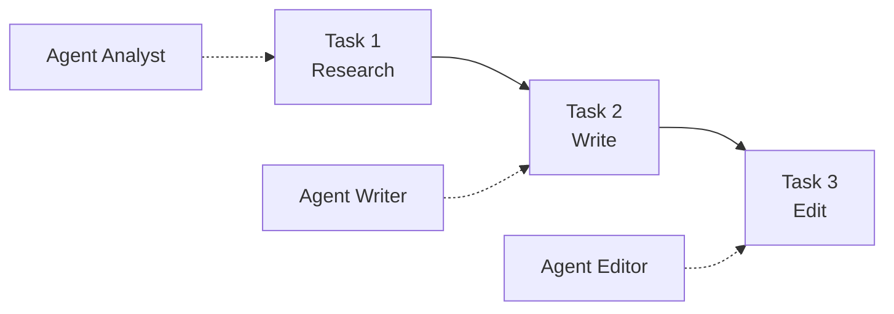

---
tags:
  - framework
  - multi-agent
aliases:
  - CrewAI
  - 角色化多 Agent
prerequisites:
  - "[[agent]]"
  - "[[multi-agent]]"
  - "[[agent-frameworks]]"
related:
  - "[[workflow-patterns]]"
  - "[[langgraph]]"
  - "[[tool-use]]"
  - "[[low-code-agents]]"
stability: short
layer: application
updated: 2026-06-15
---

# CrewAI（角色化多 Agent）

> [!tip] 核心本质
> **CrewAI** 用 **Agent（role/goal/backstory）+ Task + Crew** 把 [[multi-agent]] 落成「剧组分工」：每个成员有角色人设，Task 描述交付物与工具，Crew 用 **Sequential** 或 **Hierarchical** 进程串起协作。与 [[langgraph]] 的显式状态图不同，CrewAI 强调**快速原型**与 YAML 配置；与 [[agent-frameworks]] 横评关系：本篇专讲 Crew 隐喻与适用边界。

适合要演示「研究员 + 写手 + 编辑」式流水线、尚未需要检查点/HITL 的团队。读完应能定义 Agent/Task/Crew、选对 Sequential vs Hierarchical，并知道何时应迁到 LangGraph 生产。

*检索说明：概念与 API 对照 [CrewAI 官方文档](https://docs.crewai.com/)、[GitHub crewAIInc/crewAI](https://github.com/crewaiinc/crewai)（观测 2026-06-15）。*

## 生命周期与演进

**当前定位**：开源 Python 框架；**Crews**（自主协作）与 **Flows**（事件驱动生产流）双产品线——原型常用 Crews，复杂生产倾向 Flows 或 [[langgraph]]。

**预期寿命**：short–mid。API 与商业版演化快；「角色分工」隐喻长期有效。

**近期演进**：Flows 与 Crews 组合；独立于 LangChain 的轻量实现；企业版与托管选项。

**终极威胁**：LangGraph / OpenAI Agents SDK 吞掉编排层；CrewAI 退为演示层或垂直模板。

## 1 核心对象

| 对象 | 作用 |
| --- | --- |
| **Agent** | `role` + `goal` + `backstory`；可配 tools、LLM、`allow_delegation` |
| **Task** | 描述、期望输出、`agent`、可选 `context`（上游 Task 输出） |
| **Crew** | Agents + Tasks + `process`（sequential / hierarchical） |

**Sequential**：Task 按定义顺序执行，输出线性传递。

**Hierarchical**：`manager_llm` 或 `manager_agent` 动态把 Task 分给专家 Agent——接近 [[workflow-patterns]] 的 Orchestrator-Workers，但实现藏在 Crew 进程内。

## 2 设计原则（官方）

- **专才优于通才**：`Technical Documentation Specialist` 优于泛化 `Writer`
- **Task 写清输入输出**：显式 success criteria，减少 Agent 自由发挥
- **YAML 配置**（推荐）或 Python 直接定义
- **Task guardrails** 与异步 Task 用于长流程

与 [[instruction-design]] 同族：backstory 不是装饰，影响工具选择与措辞。

## 3 选型边界

| 选 CrewAI | 选 [[langgraph]] / 其他 |
| --- | --- |
| 角色分工 demo、内部自动化 PoC | 检查点、时间旅行、HITL 审计 |
| 团队熟悉「岗位」隐喻 | 复杂条件分支、子图、长事务恢复 |
| 快速 YAML 迭代 | 强 [[agent-observability]] 与生产 SLO |

详见 [[agent-frameworks]] 对照表。勿对简单 [[workflow]] 上 Crew——Anthropic 口诀仍适用。

## 4 与库内模式

| CrewAI 概念 | 库内节点 |
| --- | --- |
| 角色分工 | [[multi-agent]]、[[workflow-patterns]] Orchestrator |
| 工具 | [[tool-use]]、[[writing-tools-for-agents]] |
| 生产迁移 | [[langgraph]]、[[langsmith]] |
| 零代码替代 | [[low-code-agents]] |

## 要点收束

- CrewAI = Agent + Task + Crew；Sequential 固定流水线，Hierarchical 经理派活。
- role/goal/backstory 与 Task 输出规范是质量杠杆。
- 强项是原型速度，弱项是复杂流调试与生产级状态管理。
- Flows 补事件驱动；长期生产常与其他 Runtime 组合或迁移。

## 进一步阅读

### 库内关联

- [[agent-frameworks]] — LangGraph / AutoGen / AgentScope 横评
- [[multi-agent]] — 拓扑与 Spawn 契约
- [[workflow-patterns]] — Orchestrator-Workers 对照

### 官方

- [CrewAI Docs](https://docs.crewai.com/) — Agents、Tasks、Crews、Flows
- [crewAI GitHub](https://github.com/crewaiinc/crewai) — 安装与示例
