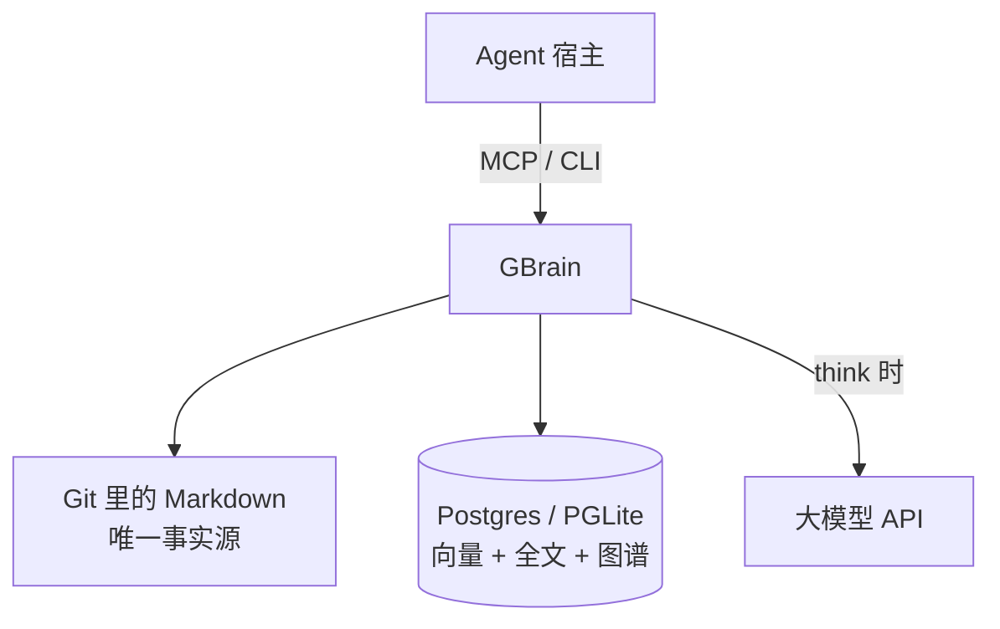
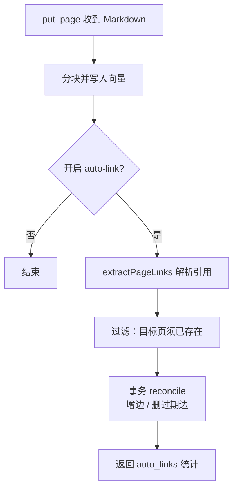
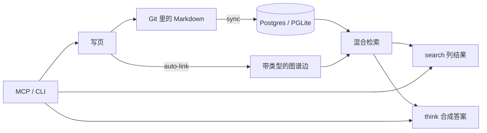
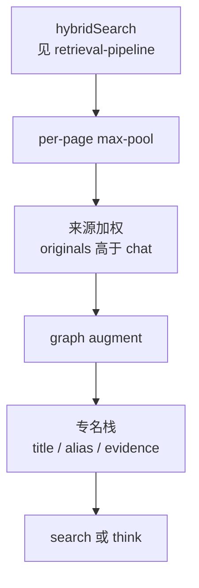

# GBrain

> [!tip] 核心本质
> **GBrain** 是 Garry Tan 开源的 **Agent 外部记忆层**：笔记以 Git 里的 Markdown 为唯一事实源，同步进 Postgres（或本地 PGLite）做检索；每次写页时用规则（不调用大模型）自动连出知识图谱边；对外提供命令行与 MCP，既能返回相关页面，也能合成带引用的答案并标出「大脑还不知道什么」。没有它，编码 Agent 对会议、邮件、投资关系等仍像失忆；只靠向量 chunk，也很难答「Bob 本季度投了谁」这类要沿关系走多步的问句。

适合想**只靠这一篇**搞懂 GBrain 的读者。读完 [[#1 问题语境：搜索给页面，大脑给答案|§1]] 知道解决什么；[[#2 架构：以 Markdown 为源，数据库为索引|§2]] 拼出组件；[[#3 核心原理|§3]] 能串起 **为何这样设计、机制如何跑**；[[#4 检索与回答|§4]] 会选命令；[[#5 数据怎么进大脑|§5]]、[[#7 怎么接入|§7]] 能动手；[[#8 亮点|§8]]、[[#9 局限与代价|§9]] 能判断值不值得上；跟代码看 [[#10 源码导读|§10]]。文末 [[#读完后自测|自测]] 含原理题与用法题。观测日 2026-06-21。

*检索说明：自连线见 [link-extraction.ts](https://github.com/garrytan/gbrain/blob/master/src/core/link-extraction.ts)、[`put_page` / `runAutoLink`](https://github.com/garrytan/gbrain/blob/master/src/core/operations.ts)、[RETRIEVAL.md](https://github.com/garrytan/gbrain/blob/master/docs/architecture/RETRIEVAL.md)；两轴模型见 [brains-and-sources.md](https://github.com/garrytan/gbrain/blob/master/docs/architecture/brains-and-sources.md)；BrainBench 见 [gbrain-evals](https://github.com/garrytan/gbrain-evals)（观测 2026-06-21）。*

## 生命周期与演进

**当前定位**：2026 年 4 月开源（MIT，TypeScript），`stability: short`。产品形态是常驻进程 + 约 43 个 Skill 工作流 + MCP 接口，优先对接 OpenClaw、Hermes 与个人编码 Agent。作者自用规模在 README 中约为 14 万页量级；v0.41 起支持多用户的 **company-brain**（OAuth 作用域隔离）。不是开箱即用的多租户记忆 SaaS。

**预期寿命**：中期。若「Markdown 主权 + 写时连图」被更大厂吸收，可能沉淀为通用模式；在此之前需在 `latest/` 跟踪破坏性更新（项目自述 v0.30 起变更频繁）。

**近期演进**：默认模式包 `gbrain-base-v2`、Agent 可改 schema、合成命令 `gbrain think`、本地 PGLite 秒级初始化、skillopt 用评测集优化 Skill 文本、多模态导入等。

**终极威胁**：上下文足够长且云托管记忆（自动巩固、用户画像）足够省时，自托管运维显得重；若只需搜代码库，专用 codebase 检索更轻。GBrain 的差异化在跨源个人知识、带类型图谱、可 `git diff` 的知识资产。

## 1 问题语境：搜索给页面，大脑给答案

个人 Agent 常卡在两点：跨会话记不住上周会议里 Alice 说的截止日；检索只返回十条相似片段，还要自己拼结论。

GBrain 的产品区分可以概括成两句（原文 slogan）：搜索给你**原始页面**，大脑给你**答案**。README 里的例子：问「明天见 Alice 前要准备什么」，普通工具列五个标题；GBrain 输出一段带引用的准备摘要，并提醒「自 4 月 22 日起没有 Alice 的新条目，邮件和 Slack 未接入，信息可能过期」。

这种 **缺口分析** 把检索从「找到了什么」推进到「能做什么决定、还缺什么信息」，对会议准备、投资跟进等场景比纯 Top-K 更有用。

### 1.1 在 Agent 栈里占哪一层

GBrain 不是大模型，也不是 Agent 框架；它是 Agent **外面的长期记忆与检索服务**。Agent（Cursor、OpenClaw、Hermes 等）通过 MCP 或命令行读写它；它负责存、索引、搜、连图，必要时再调大模型做 `think` 合成。



**图 0：** GBrain 在栈中的位置。

### 1.2 是什么、不是什么

| | 是 | 不是 |
| --- | --- | --- |
| 角色 | 个人/小团队的 **外部记忆 + 检索 + 轻量图谱** | 聊天窗口里的上下文历史 |
| 存什么 | 结构化 Markdown 页面（人物、会议、公司…） | 任意二进制仓库的通用搜索引擎 |
| 怎么连关系 | 写页时用 **规则** 解析 wikilink，不用大模型抽图 | 丢 PDF 就自动建成完美知识图谱 |
| 怎么答 | `search` 给页面；`think` 给合成答案 | 替代 Agent 的推理与工具调用 |
| 运维 | 自托管；要 API Key、数据库、可选 cron | 装完自动巩固的托管 Memory SaaS |

若你只需要「记住用户喜欢深色模式」，几条事实写进 Agent 的 `MEMORY.md` 可能够用；GBrain 面向 **成千上万页、要跨页推理、要 git 管理** 的知识库。

## 2 架构：以 Markdown 为源，数据库为索引

### 2.0 一条「页面」长什么样

GBrain 里最小单位是 **页面（page）**，对应一篇 Markdown 文件，用 **slug** 标识路径，例如 `people/alice-chen`、`meetings/2026-04-22-pricing`。顶部可有 YAML **frontmatter** 声明类型；正文里的 wikilink 会在写库后触发 **自动连边**。

```markdown
---
type: person
---

# Alice Chen

Engineer at [[companies/acme-ai]].
Discussed pricing in [[meetings/2026-04-22-pricing]].
```

被 `[[...]]` 引用的页面 **必须先存在**（已 `capture` / `sync` / `put_page` 进库），边才会连上；只写 `[[bob]]` 不会自动建 `people/bob` 空页。

### 2.1 两种存储引擎，一套接口

GBrain 用 **大脑引擎（BrainEngine）** 抽象统一两种部署（约 47 个契约操作，见 [engine.ts](https://github.com/garrytan/gbrain/blob/master/src/core/engine.ts)）：

| 引擎 | 适合谁 | 特点 |
| --- | --- | --- |
| **PGLite** | 个人，约五万页以内 | 嵌入式 Postgres，`gbrain init --pglite` 约 2 秒，无需 Docker |
| **Postgres + pgvector** | 团队、联邦、大库 | 可接 Supabase 或自托管；company-brain 多用户 |

**大脑仓库（brain repo）** 是权威来源：Markdown 在 Git 里可读、可 fork；数据库管向量、全文、图谱和任务队列。`gbrain sync` 把仓库变更导入库；Git 里删掉的文件在库里做软删除。

### 2.2 两个正交坐标：brain 与 source

读源码或配多库前，先分清两个轴（详见 [brains-and-sources.md](https://github.com/garrytan/gbrain/blob/master/docs/architecture/brains-and-sources.md)）：

| 概念 | 是什么 | 类比 |
| --- | --- | --- |
| **brain（大脑）** | 一个数据库实例 | 一整块「知识库」 |
| **source（来源库）** | 同一 brain 里的一个内容仓库 | 这块库里的一个 Git 仓库 / 笔记目录 |

- `--brain`：操作**哪个数据库**（个人库 vs 挂载的团队库）。
- `--source`：操作**该库里的哪套笔记**（wiki、gstack、essays…）。

个人最简单：**一个 brain + 一个 source**，不用管参数。团队场景可挂载多个 brain；同一 brain 里用多个 source 隔离话题，默认仍可跨 source 搜索。

**company-brain**（v0.41+）是在 Postgres 上做多用户：每人 OAuth 作用域内只能看到自己有权读的页面，适合 10–50 人团队共享机构记忆，仍是一套 Markdown + 索引，不是换了一套产品形态。

### 2.3 写页时自动连图（不调用大模型）

每次 `put_page` 写完一页，会在后置步骤里跑 **自动连边（auto-link）**：解析正文和 frontmatter 里的实体引用，**不调用大模型**，就把带类型的边写入 `links` 表（如 `attended`、`works_at`、`invested_in`、`founded`、`advises`、`mentions`）。正文里引用删了，对应边也会 reconcile 掉。历史库可用 `gbrain extract links` 批量补边。**写时连图原理见 [[#3.2 写时连图：规则抽取、reconcile 与信任边界|§3.2]]。**

实现上，`put_page` 在分块、嵌入完成后调用 `runAutoLink()`；纯解析在 `link-extraction.ts`（不访问数据库，只产出候选边）。返回里有 `auto_links: { created, removed, errors, unresolved }` 统计。



**图 1：** 写页后的自动连边流程。

#### 引用从哪来

| 来源 | 怎么识别 | 例子 |
| --- | --- | --- |
| Markdown 链接 / wikilink | 正则，先去掉代码块 | `[Alice](people/alice)`、`[[people/alice\|Alice]]` |
| 正文里的路径片段 | 限 `people/`、`companies/` 等白名单目录 | `see people/alice-chen for context` |
| Frontmatter 字段 | 字段名映射到边类型和方向 | `attendees:` → `attended` |

边类型由确定性规则推断：引用附近约 240 字内的关键词（如 `founder of` → `founded`）、源页类型（会议页 → `attended`）、以及人物与公司页的简单角色判断。**全程不用大模型**。显示名解析失败会进 `unresolved`，表示图上还有洞。

#### 几条安全边界

- **目标页必须先存在**：auto-link 不会凭空建空页面；边要等目标 slug 入库后才连上。
- **只 reconcile 机器写的边**：`manual` 边不会被自动删掉；并发写同一页用 advisory lock。
- **远程 MCP 默认跳过 auto-link**：防止被注入的假路径污染图谱；本地 CLI 或受信工作区可开启。

[BrainBench](https://github.com/garrytan/gbrain-evals) 在 240 页测试语料上：关闭图谱层时 P@5 低约 31.4 分；图谱负责「事实上相连」，向量负责「措辞上相近」，检索时两者合并。



**图 2：** 写入、同步、连图与查询的关系。

Obsidian 用户若常用跨目录的 `[[basename]]`，可开启 `link_resolution.global_basename`；默认关闭，`gbrain doctor` 会告诉你能多连多少边。

### 2.4 模式包（schema pack）：规定笔记有哪些「类型」

很多笔记工具强制固定目录。GBrain 用 **模式包（schema pack）** 描述一套结构约定：

- 一种笔记属于哪种 **页面类型**（人物、公司、会议……）；
- 这类笔记通常放在哪个路径前缀下；
- 是否允许后台 **抽取结构化事实**。

可以把它想成给整个大脑换一套「分类与字段说明」。**换包不会改 Git 里的原文**，但会改变系统如何解读路径、打标签、建索引和路由「谁更懂这类笔记」。

| 模式包 | 说明 |
| --- | --- |
| **`gbrain-base-v2`**（v0.41.22 起默认） | 15 种页面类型，覆盖人物、公司、交易、邮件等 |
| **`gbrain-recommended`** | 在 base 上增加更多推荐目录 |
| **自定义包** | `detect` → `suggest` → `review-candidates` → `schema use` |

模式包在 `put_page` 时经 `loadActivePack()` 加载（`core/schema-pack/load-active.ts`），传给 `importFromContent()` 做类型推断。有 admin 权限时，Agent 可通过 MCP 的 `schema_apply_mutations` 增量改 schema。

## 3 核心原理

[[#2 架构：以 Markdown 为源，数据库为索引|§2]] 讲**有什么组件**；本节讲 **GBrain 为何这样设计、代码里怎么跑**——每个原理点都连着取舍与实现，不拆成两套叙述。

通用混合检索（向量、BM25、RRF 等）见 [[retrieval-pipeline]]；下文只写 GBrain 在其上**多加**或**不同**的部分。

### 3.1 Markdown 主权：Git 为源、库为索引

Agent 记忆常栽在两处：全塞上下文（难审计、窗口爆），或只存向量库（原文难核对、索引坏了难重建）。GBrain 因此把 **Git 里的 Markdown** 定为唯一事实源——人要能读、diff、回滚；**Postgres / PGLite** 只是派生索引，用来预计算 chunk 嵌入、全文与 `links` 边。`sync` / `put_page` 的流向始终是 **改事实源 → 更新索引**，库不是看不见的真相；索引损坏可从 Git 重建。

代价是要维护 sync、嵌入 API 与库本身，换的是**可读、可协作的知识资产**——这是 GBrain 作为个人知识主权产品的根基，而不是「用了 Postgres」这么简单。

[`engine.ts`](https://github.com/garrytan/gbrain/blob/master/src/core/engine.ts) 的 **BrainEngine** 契约让 CLI 与 MCP 共用 `operations.ts` 里同一套读写语义；存储引擎可换，上述「源 vs 索引」分工不变。

### 3.2 写时连图：规则抽取、reconcile 与信任边界

关系进图谱通常有两条路：写时解析 wikilink / frontmatter，或入库后用 LLM 做 NER。GBrain 选前者——个人 brain 本来就会写 `[[people/alice]]`，用**零 token、可预期、可 reconcile** 换覆盖度：口语里的「他」「那家公司」不会自动成边，这是设计代价，不是 bug。

实现落在 [`put_page`](https://github.com/garrytan/gbrain/blob/master/src/core/operations.ts)：先 `importFromContent()` 分块嵌入，再可选 `writePageThrough()` 回写 Git，最后在**独立事务**里 `runAutoLink()`，不阻塞返回：

```text
importFromContent() → writePageThrough()? → runAutoLink()
```

`link-extraction.ts` 的 **`extractPageLinks`**（纯函数）三路扫描正文：`extractEntityRefs`（链接、wikilink、typed blockquote，先去掉代码块）、白名单目录下的裸 `people/foo` 路径、以及 frontmatter 字段映射（如 `attendees`→`attended`、`key_people`→incoming `works_at`）。边类型由 **`inferLinkType`** 确定性推断：页类型硬编码（`meeting`→`attended`）→ 引用附近 240 字内动词正则 → `person`→`companies/*` 时用整页角色先验（**investor > advisor > employee**）→ 否则 `mentions`。

写完后 **reconcile** 与正文对齐：目标 slug 须已在 `pages` 表（不凭空建页）；**outgoing** 边与 `getLinks(slug)` diff 增删，**incoming** frontmatter 边只动本页 authored 的子集；`manual` 边不自动删。正文删掉 `[[alice]]`，边上也要删——否则读检索时 graph augment 会被过期关系误导。

auto-link 会扫描正文里 `people/foo` 形态字符串。不可信远程 MCP 写入者可植入假 slug，再经 **backlink boost** 抬高搜索排名，污染图与检索。故 `ctx.remote !== false` 时跳过 auto-link；本地 `serve` 或 Git sync 不受限（[[#7.3 用 Cursor / 远程 MCP 时要注意|§7.3]]）——**安全优先于远程写入时的图谱新鲜度**。

### 3.3 检索：写出的关系如何参与读路径

「和 Alice 定价相关的内容」靠 chunk 级混合检索（底层见 [[retrieval-pipeline]]）更合适；「Bob 本季度投了谁」则要沿 `put_page` 写进 `links` 的 **`invested_in` 等 typed 边** 多跳——纯 embedding 常把同领域但无关系的 chunk 排到前面。GBrain 的专有闭环是：**写路径**落边 → **读路径**在 hybrid 召回 seed 之后做 **graph augment**（遍历 typed 边、backlink 加权）。这不是离线 GraphRAG，而是把笔记里**已经写出来的关系**变成检索信号；BrainBench 关图谱层后 P@5 从 ~49 跌到 ~18，说明写时 extract 与读时 augment 是一体的。

在此之上，GBrain 还叠了几层「个人 brain」专有问题——底层 `hybridSearch` 之上、进 `search` / `think` 之前：



**图 3：** GBrain 在通用混合检索之上的专有层。

- **per-page max-pool**：个人 brain 以**页**（人物、会议）为单元，避免同一页多 chunk 挤占 Top-N。
- **来源加权**（`sql-ranking.ts`）：wiki 与 OpenClaw 会话等同库共存时，curated 路径高于 chat/daily；`intent.ts` 判为 temporal 时可绕过 boost 让 daily 浮上。
- **专名栈**：`aliases:` → `page_aliases`、title boost、`create_safety` / evidence 标签——Agent 判断「这页是否已存在、可否不重复建页」时看 evidence，不看裸分。
- **成本分级**：`search` 走 cheap-hybrid（`hybridSearchCached`，默认不开 multi-query 扩展）；`query` 是全控入口。

### 3.4 search 与 think：召回与生成分工

召回错还可以换 query、`--explain`、人工挑页；生成错却会被直接当结论。因此 `search` 只到 `hybridSearchCached`，**不调生成式 LLM**；`think` 在同一召回之上做 **合成 + 引用 + 缺口分析**（哪些源未接入、某页自何日起无更新）——把幻觉从「编造事实」压到「在已有页面上归纳」，也是「大脑给答案」相对「搜索给页面」的产品分界。`think` 需额外 LLM API；`search` 只需嵌入（及可选 rerank）。

### 3.5 怎么验证这些设计

GBrain 用实验验证**自家层**，而非重复测 RRF：BrainBench 验证关 graph / 关 extract 的跌幅；NamedThingBench 门禁专名栈；`gbrain eval replay` 回放真实 query 对比配置变更。见 [gbrain-evals](https://github.com/garrytan/gbrain-evals)、[`SEARCH_MODE_METHODOLOGY.md`](https://github.com/garrytan/gbrain/blob/master/docs/eval/SEARCH_MODE_METHODOLOGY.md)。

## 4 检索与回答：何时用 search，何时用 think

### 4.1 混合检索怎么拼

**底层**（HNSW、BM25、RRF、可选 cross-encoder rerank）是通用混合检索，见 [[retrieval-pipeline]] 与上游 [RETRIEVAL.md](https://github.com/garrytan/gbrain/blob/master/docs/architecture/RETRIEVAL.md)。

**GBrain 叠层**（写时图 → graph augment、来源加权、专名/evidence）见 [[#3.3 检索：写出的关系如何参与读路径|§3.3]]。

默认 **balanced** mode bundle 启用 full stack + zerank-2 rerank。还有 `conservative`、`tokenmax` 等预设。`gbrain search "…" --explain` 看加分来源；专名 miss 用 `gbrain search diagnose "…" --target <slug>`。

### 4.2 三种查询方式

| 命令 | 做什么 | 什么时候用 |
| --- | --- | --- |
| **`gbrain search`** | 按混合分返回 Top 页/块，**不再调大模型** | 往 context 里塞材料、找原文、要低成本 |
| **`gbrain think`** | 先检索，再**合成答案、附引用、做缺口分析** | 会议准备、战略问句——要结论，不要 chunk 列表 |
| **`gbrain agent run`** | 经 Minions 队列跑子 Agent，崩溃可恢复 | 长任务、需要持久化工具循环 |

`gbrain graph-query` 支持多跳遍历；和 `find_trajectory` 等组合，可一次回答复合关系问句。

示例（本地已 `init` 后）：

```bash
gbrain search "Alice 和 Acme 的关系"     # 返回相关页/块，不调大模型
gbrain think "明天见 Alice 前要准备什么"  # 检索 + 合成 + 缺口分析，需大模型 API
```

## 5 数据怎么进大脑

笔记进 GBrain 有三条主路；多数场景混用。

**表 1：** 数据入口

| 方式 | 典型命令 / 入口 | 谁在用 | 结果 |
| --- | --- | --- | --- |
| **采集** | `gbrain capture "…"`、`capture --file`、webhook `/ingest` | 你或 Agent 随手记 | 默认进 `inbox/日期-…`，再整理 |
| **同步** | `gbrain sync`、`gbrain import ~/vault/` | 已有 Git / Obsidian 仓库 | 批量导入 Markdown，建索引 |
| **写页** | MCP / CLI 的 `put_page` | Agent 结构化写入 | 立刻分块、嵌入；本地路径下还可 auto-link |

`sync` 适合「仓库是源头、DB 跟 Git 走」；`capture` 适合「先扔进 inbox 再 triage」；`put_page` 适合 Agent 按 slug 精确更新人物页、会议页。无论哪条路，入库后检索路径相同。

## 6 日常运转：采集、Skill 与夜间巩固

GBrain 设计成 **7×24 常驻进程**，不只靠聊天窗口记东西：

```text
收到消息 → 先查大脑 → 再回复 → 写页 → 自动连边 → 定时同步
```

- **信号检测**：从消息里抓实体、待办、链接，优先查大脑再调外部 API。
- **采集（capture）**：见 [[#5 数据怎么进大脑|§5]]。
- **定时任务（dream cycle）**：cron 触发的夜间批处理——去重人物页、修坏链、打重要性分、跑矛盾检测、巩固事实；让库在你不聊天时仍变干净，不是单次查询功能。
- **Skill 包**：`skills/` 下约 43 份 **Markdown 工作流说明**（不是 TypeScript 业务代码），教 Agent「何时 ingest、何时 enrich、如何路由」；[`RESOLVER.md`](https://github.com/garrytan/gbrain/blob/master/skills/RESOLVER.md) 相当于目录。完整自主安装走 [`INSTALL_FOR_AGENTS.md`](https://github.com/garrytan/gbrain/blob/master/INSTALL_FOR_AGENTS.md)。

**Minions 队列**：基于 Postgres 的任务队列（形态类似 BullMQ），跑 `gbrain agent run` 等长任务；子 Agent 崩溃后可从检查点续跑。

## 7 怎么接入：MCP、宿主与安装

### 7.1 MCP

30 余个按契约定义的工具：`gbrain serve` 走 stdio（Claude Code、Cursor）；`gbrain serve --http` 走 HTTP（OAuth 与管理台）。已有远程大脑时：`gbrain connect https://host/mcp --token gbrain_xxx --install`。

### 7.2 三条上手路径

| 路径 | 做什么 | 适合谁 |
| --- | --- | --- |
| **A. 只给编码 Agent 加记忆** | `init --pglite` → `mcp add` → `capture` / `search` | 先试检索，不一定要 dream cycle |
| **B. 全量自主大脑** | 让 Agent 读 `INSTALL_FOR_AGENTS.md` 自装 DB、Skill、cron | 要用 OpenClaw / Hermes 那套完整闭环 |
| **C. 迁入已有笔记库** | `gbrain import` 或 `sync` + `schema detect` | Obsidian / Git 仓库已有大量 `.md` |

路径 A 最小示例：

```bash
bun install -g github:garrytan/gbrain
gbrain init --pglite          # 需环境变量里的嵌入 API Key，或按提示配置
gbrain doctor                 # 确认健康
gbrain capture "要记住的一条想法"
gbrain search "刚才记了什么"
claude mcp add gbrain -- gbrain serve
```

`think` 还需配置对话用大模型；`search` 只需嵌入模型。

### 7.3 用 Cursor / 远程 MCP 时要注意

经 **远程** MCP（`gbrain connect` 到云端大脑）的 `put_page` 默认不做 auto-link。因此 `ctx.remote !== false` 时跳过连边（见 [[#3.2 写时连图：规则抽取、reconcile 与信任边界|§3.2]] 末段）。若你主要靠 Cursor 写 brain、又希望图谱实时更新，应：

- 本机跑 `gbrain serve`（stdio），或  
- 在 Git 里改 Markdown 后跑 `gbrain sync`，或  
- 用受信工作区 / 本地 CLI 写入  

否则会出现「页写进去了，但 `links` 表没长边」——这是安全设计，不是坏了。

### 7.4 与 OpenClaw、Hermes

文档把 OpenClaw、Hermes 列为「读安装协议就能自装」的一等宿主；作者生产环境也跑在这两者上。选 GBrain 通常是因为要 **Markdown 主权** 和 **自写 Skill 工作流**，不是因为宿主限制。

### 7.5 安装注意

- 推荐 `bun install -g github:garrytan/gbrain`；**不要**用 npm 上被抢注的包名 `gbrain`。
- `init` 前准备至少一种 **嵌入 API**（OpenAI、ZeroEntropy、Voyage 等）；维度不匹配时 `gbrain doctor` 给修复命令。

## 8 亮点

下列是 [[#2 架构：以 Markdown 为源，数据库为索引|§2]]–[[#6 日常运转：采集、Skill 与夜间巩固|§6]] 的浓缩判断；机制见 [[#3 核心原理|§3]]，代价见 [[#9 局限与代价|§9]]。

### 8.1 可审计的记忆资产与写时连图

GBrain 把 **Markdown + Git 定为唯一事实源**：记忆落在可 `git diff`、可 fork 的 `.md` 里，数据库只是派生索引——知识是可审计资产，不是只能经 API 访问的黑盒。多数记忆产品靠入库后再用 LLM 抽实体；GBrain 则在 `put_page` 后用规则解析 wikilink 与 frontmatter，零 LLM 更新 `links` 表，图谱随写作实时刷新，成本低、行为可预期（BrainBench 关图谱约损失 31 P@5 分，说明关系型检索不是装饰）。类型与目录也不必迁就工具自带的单一结构：用 **schema pack** 定义页面类型，还能从现有 vault `detect` 长出自定义包，相当于轻量类型系统。

### 8.2 为 Agent 常驻运行而设计的检索与运行时

产品把 **`search` 与 `think` 分层**（见 [[#3.4 search 与 think：召回与生成分工|§3.4]]）：前者负责召回，后者负责合成、引用与缺口分析，重心在可行动的结论而非 Top-K chunk 列表。定位不是聊天插件，而是 **大脑 daemon**——`INSTALL_FOR_AGENTS.md`、约 43 个 Skill、dream cycle、cron 组成采集、巩固、修引用的常驻管线。工程细节也经得起读源码：远程 MCP 默认跳过 auto-link（见 [[#7.3 用 Cursor / 远程 MCP 时要注意|§7.3]]）、子 Agent 写页沙箱、brain/source 两轴隔离、混合检索可 `--explain` 归因，整体按长期跑、可被 Agent 写来设计。

## 9 局限与代价

亮点与短板一体两面：GBrain 把复杂度和主权留给使用者，下列场景容易踩坑。

### 9.1 运维与编排成本高

需自管数据库、嵌入 API、可选 reranker，并维护 cron 与 Skill。**不是装完就自动变聪明**；记忆巩固要你自己编排 dream cycle 等工作流。v0.30 起破坏性更新频繁，跟版本本身有成本。

### 9.2 图谱能力的硬边界

| 限制 | 后果 |
| --- | --- |
| 不用 LLM 抽关系 | 只有「写得像链接」的内容会连边；口语、隐含关系连不上 |
| 目标页须先存在 | `[[alice]]` 不会自动建页；未入库则边挂起或进 `unresolved` |
| 远程 MCP 默认不连图 | 经 Cursor 等云端写入时，图谱常与聊天脱节 |
| 边类型靠规则 | `works_at` / `invested_in` 等可能误判，需人工或后续修正 |

适合 **结构化笔记 + wikilink**；不适合丢一堆非结构化文档就指望自动长成完美图谱。

### 9.3 定位偏个人与小团队

重心是单人 brain 或小团队 company-brain，不是多租户 Memory SaaS。跨 brain 查询靠 Agent 自行选择查哪个库（非数据库级联邦）。自动巩固、时序记忆、用户画像等需用 cron + Skill 拼装，非开箱能力。

### 9.4 `think` 与安装摩擦

`think` 需再调大模型，有延迟、费用与合成幻觉风险；质量依赖笔记质量与 sync 状态。安装勿用抢注的 npm 包名；纯当通用 MCP 用时，dream cycle、signal 等需自行接线。

### 9.5 不适合指望的场景

- 零运维、接个 API 就自动记忘  
- 非 Markdown 为主、且无 wikilink 习惯的知识库  
- 以云端 MCP 写入为主、又强依赖实时图谱  
- 需要企业级对象权限与运营系统写回（GBrain 是轻量 brain，不是运营平台）

## 10 源码导读

跟实现时建议按「目录 → 写路径 → 读路径」顺序读 [garrytan/gbrain](https://github.com/garrytan/gbrain)。

### 10.1 目录分工

```text
src/
  cli.ts              # 命令行入口
  commands/           # 子命令
  mcp/                # MCP 服务（与 CLI 共用 core）
  core/
    engine.ts         # BrainEngine 接口（读写合同）
    operations.ts     # put_page、search 等操作
    link-extraction.ts # 解析 Markdown 引用（纯函数，不碰 DB）
    import-file.ts    # importFromContent：解析、分块、嵌入
    schema-pack/      # 模式包加载
    postgres-engine/  # Postgres 实现
    pglite-engine/    # 本地嵌入式实现
  schema.sql          # 表结构
skills/               # Agent 工作流说明（Markdown，非 TS 业务逻辑）
```

设计核心：**一套 BrainEngine 合同，两种存储引擎**；CLI 与 MCP 都调 `operations.ts` 里同一批操作。

### 10.2 数据落在哪些表

| 层 | 存什么 |
| --- | --- |
| Git / 磁盘 `.md` | 人类可读的权威原文 |
| `pages` | 页面元数据、类型、slug |
| `chunks` + 嵌入表 | 检索用文本块与向量 |
| `links` | 图谱边（类型、来源、方向） |
| 时间线等 | 按页的时序摘要 |

`gbrain sync` 把 Git 变更导入库；`put_page` 也可在写库后 **回写磁盘**（write-through），两边对齐。

### 10.3 写一页：`put_page` 调用链

[`operations.ts` 中 `put_page`](https://github.com/garrytan/gbrain/blob/master/src/core/operations.ts) 主流程：

```text
1. 权限检查（子 Agent 沙箱、受信工作区等）
2. importFromContent()     # 解析 Markdown、分块、嵌入、写 pages/chunks
3. writePageThrough()     # 可选：回写 Git 目录下的 .md
4. runAutoLink()           # extractPageLinks → 过滤 → reconcile → links 表
5. 时间线、事实抽取队列    # 后台，不阻塞返回
```

`importFromContent`（`import-file.ts`）负责 **可检索**；`runAutoLink` 负责 **可连图**。auto-link 在单独事务里跑，避免阻塞页面写入。

`extractPageLinks`（`link-extraction.ts`）只产出候选边；`runAutoLink` 过滤「目标 slug 必须已在 `pages` 表」，再与已有边 reconcile，增删写入 `links`。

### 10.4 查一次：`search` 与 `think`

GBrain 检索叠层见 [[#3.3 检索：写出的关系如何参与读路径|§3.3]]；search/think 分工见 [[#3.4 search 与 think：召回与生成分工|§3.4]]。

- **`search`**：`operations.ts` → `hybridSearchCached`，返回排序页/块，零生成式 LLM。
- **`think`**：同一召回 → 对话模型合成 + 缺口分析。

多跳关系另有 `graph-query` / `traverseGraph`（在 `engine.ts` 定义，引擎实现）。

### 10.5 建议阅读顺序

1. [brains-and-sources.md](https://github.com/garrytan/gbrain/blob/master/docs/architecture/brains-and-sources.md) — brain / source 两轴  
2. `operations.ts` 的 `put_page` — 写路径总览  
3. `import-file.ts` 的 `importFromContent` — 解析与分块  
4. `link-extraction.ts` — 引用与边类型推断  
5. `engine.ts` 的 `BrainEngine` — 还有哪些能力  
6. `schema.sql` — 表结构  

## 术语速查

| 词 | 含义 |
| --- | --- |
| **slug** | 页面路径 ID，如 `people/alice` |
| **brain** | 一个数据库实例（个人库或挂载的团队库） |
| **source** | 同一 brain 内的一套笔记仓库（wiki、gstack…） |
| **auto-link** | 写页后自动解析 wikilink 写入 `links` 表 |
| **模式包（schema pack）** | 定义页面类型与目录约定的配置 |
| **dream cycle** | cron 夜间批处理：去重、修链、巩固、查矛盾 |
| **Skill** | `skills/` 下 Markdown 工作流，教 Agent 怎么用大脑 |
| **Minions** | Postgres 任务队列，跑长时 Agent 子任务 |
| **缺口分析** | `think` 时标明大脑不知道或可能过期的信息 |

## 读完后自测

能答 **原理题**，说明懂了 GBrain 为何这样设计、机制怎么跑；能答 **用法题**，说明能动手。

**原理**

1. 为什么事实源放 Git、检索放 Postgres，而不是只用一个向量库？代价是什么？  
2. 写时 auto-link 为什么用规则而不用大模型抽关系？`extractPageLinks` 与 `inferLinkType` 怎么配合？代价是什么？  
3. reconcile 时 outgoing 与 incoming frontmatter 边规则有何不同？正文删引用为什么要删边？  
4. GBrain 写出的 `links` 如何进入读路径？graph augment 和纯 chunk RAG 差在哪？BrainBench 关图后 P@5 大约跌多少？  
5. 读路径上 GBrain 相对 [[retrieval-pipeline]] 还叠了哪几层？`create_safety` 解决什么 Agent 问题？  
6. `search` 和 `think` 为什么不能合成一步？  
7. 远程 MCP 默认跳过 auto-link 的威胁模型是什么？

**用法**

8. 一页带 `[[companies/acme]]` 的笔记，边为什么可能仍连不上？  
9. `capture`、`sync`、`put_page` 分别适合什么场景？  
10. 用 Cursor 连远程 brain 写入后图谱不更新，应怎么改路径？

**参考要点**（先自答再对照）：1→§3.1；2→§3.2；3→§3.2；4→§3.3、§3.5；5→§3.3；6→§3.4；7→§3.2、§7.3；8→§2.3；9→§5；10→§7.3。

## 要点收束

- 原理主轴：Git 源 + 派生索引；写时规则连图与 reconcile；写出的边 feed graph augment；专名/evidence 与来源加权；search/think 分层。
- 通用 hybrid 见 [[retrieval-pipeline]]。
- 数据进库：**capture** / **sync** / **put_page**。
- 要列表 **`search`**；要结论与缺口分析 **`think`**。
- Cursor 远程 MCP 默认不 auto-link；本机 `serve` 或 sync Git 才连图。
- 适合愿意维护 Markdown、自托管的个人/小团队；不适合零运维自动记忆。

## 进一步阅读

### 库内关联

- [[memory]] — Agent 记忆范式
- [[graph-rag]] — 离线图索引（可与 GBrain 叠加）
- [[retrieval-pipeline]] — 混合检索与 RRF
- [[openclaw]] / [[hermes-agent]] — 常见宿主
- [[tool-mcp]] — MCP 接法
- [[skill]] — Skill 工作流思路

### 官方与评测

- [garrytan/gbrain](https://github.com/garrytan/gbrain) — README、安装协议、architecture/
- [brains-and-sources.md](https://github.com/garrytan/gbrain/blob/master/docs/architecture/brains-and-sources.md) — 两轴模型
- [garrytan/gbrain-evals](https://github.com/garrytan/gbrain-evals) — BrainBench
- [Company brain 教程](https://github.com/garrytan/gbrain/blob/master/docs/tutorials/company-brain.md) — 多用户部署
