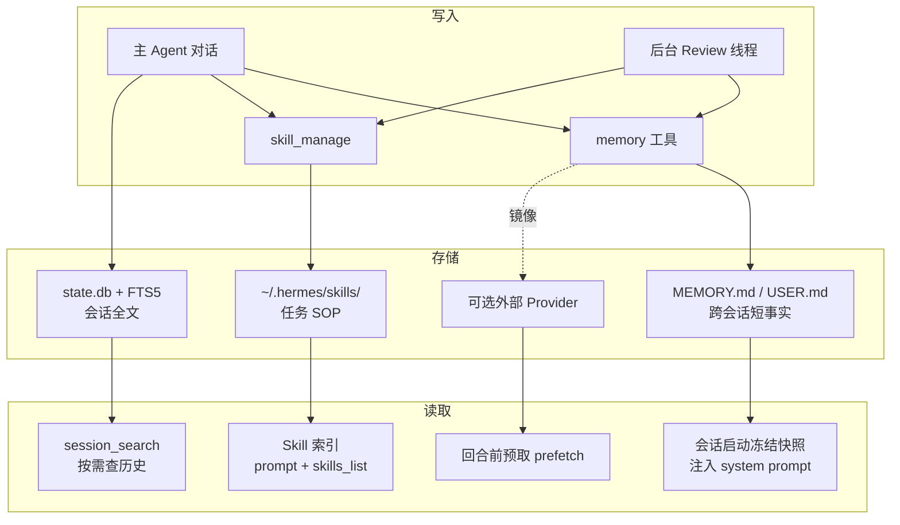
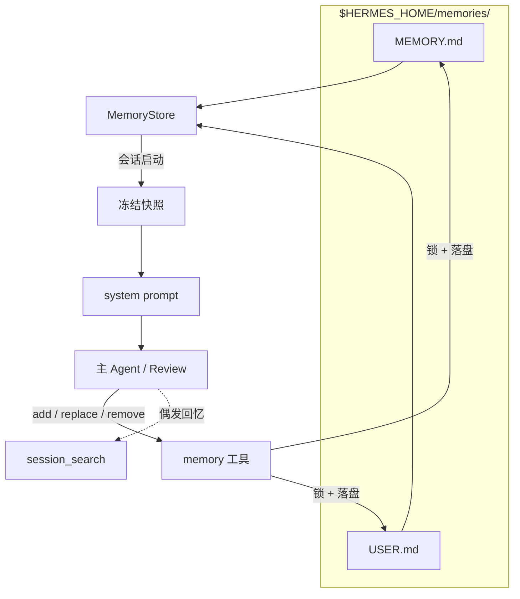
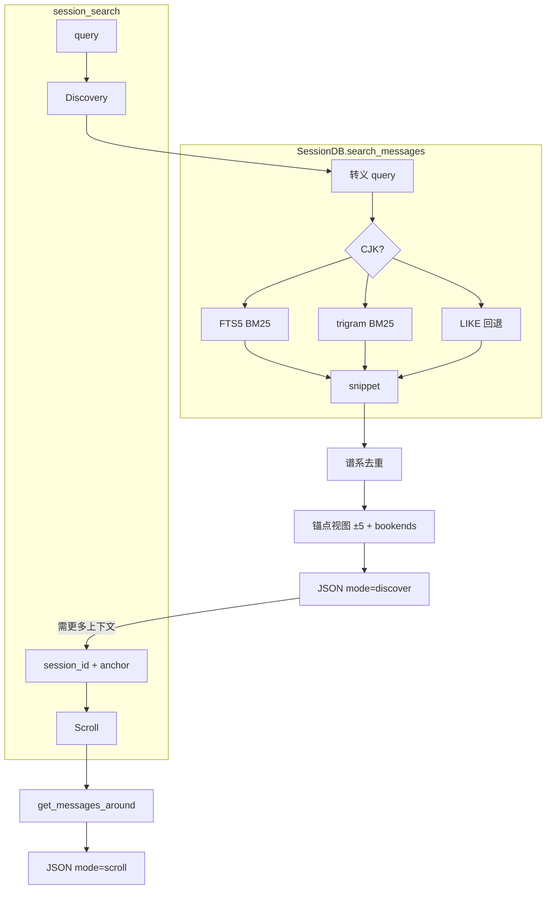

# Hermes Agent 记忆系统

> [!tip] 核心本质
> Hermes 把 [[memory|记忆]] 拆成三条并行管线：**跨会话短事实**（`MEMORY.md` / `USER.md`）、**任务怎么做**（[[skill|Skill]] 库 + `skill_manage`）、**历史会话按需回忆**（SQLite [[fts5|FTS5]] 全文检索）。写入靠主 Agent 即时调用或后台 Review 线程；精选事实靠 LLM 做条目级 `replace` 合并，Skill 库靠 Curator 做规模化归档；读取则分「会话启动整包注入」与「工具按需搜索」两路。没有这套分工，长期运行的个人 Agent 要么每轮失忆，要么把无限历史塞进窗口——前者无法积累，后者上下文与 [[prefix-cache]] 都会失控。

*检索说明：实现细节主要来自 Hermes Agent 官方文档与 `NousResearch/hermes-agent` 源码（观测 2026-06-07，v2026.5.x 量级）；GEPA 进化在独立仓库 `hermes-agent-self-evolution`。*

**怎么读这篇**：先读 [[#三层架构：存储、读取与写入总览|三层架构]] 建立全景；再按你关心的层往下跳——常驻事实看 [[#持久精选记忆（MEMORY.md / USER.md）|持久记忆]]，SOP 与库治理看 [[#程序性记忆（Skill 库）|Skill 库]]，「上周说过什么」看 [[#会话搜索（session_search）|会话搜索]]。若你要调写入行为或对照 prompt，直接看 [[#记忆如何从对话生长（提取与后台 Review）|提取与后台 Review]]。正文里的 `` `反引号` `` 表示工具名、文件名或配置键；实现处会链到 [NousResearch/hermes-agent](https://github.com/NousResearch/hermes-agent) 源文件。

## 生命周期与演进

**当前定位**：Hermes 记忆是「个人 Agent Harness」产品化方案，不是通用 Memory 框架。内置层极简（双文件 + 字符上限 + 冻结快照）；扩展层可插 Honcho / Mem0 / Supermemory 等 provider；Skill 与 Curator 构成程序性记忆的自进化闭环。与 [[agentmemory]]（跨宿主 MCP 记忆服务）互补：只跑 Hermes 用内置即可，要 Cursor + Hermes 共享库再接 MCP。

**预期寿命**：中期。事实 / 流程 / 历史 三层分工在 Agent 工程里稳定；具体阈值（2200 字符、每 10 轮 nudge）会随版本调整。

**近期演进**：Memory 提示改为后台 Review 线程（PR #2235，2026-03）；CJK 检索从 `LIKE` 全表扫升级为 trigram FTS5（PR #16651）；Curator 治理 agent-created Skill 沉积；Honcho 等 provider 插件化；`hermes-agent-self-evolution` 用 GEPA 离线进化 Skill 文本（Phase 1 已落地）。

**终极威胁**：超长上下文「全历史塞窗口」削弱会话搜索价值；云厂商托管记忆 API 降低自托管动力；快速版本迭代使本文实现细节需对照 `hermes doctor` 与官方 Memory 文档复核。

## 三层架构：存储、读取与写入总览

**三层各管一类信息，读写路径不同，写入大多经 `memory` / `skill_manage` 或后台 Review。**



**表 1：** 三层与通用 [[memory]] 对照

| Hermes 层 | 存什么 | 典型内容 | 怎么读 | 与 [[agent-context-stack]] 对应 |
| --- | --- | --- | --- | --- |
| **持久记忆** | `MEMORY.md`（环境/任务）、`USER.md`（用户画像） | 「本项目不用 Vercel」「偏好中文技术博客体」 | 会话启动**整包**注入 system prompt | 个体 Rules + 用户偏好 |
| **Skill 库** | `~/.hermes/skills/*/SKILL.md` 及附属文件 | 调试步骤、格式偏好、工具组合 | prompt 索引 + `skills_list` / `skill_view` | 程序性记忆 / Commands |
| **会话搜索** | `~/.hermes/state.db` 全文 | 历史对话与工具上下文 | `session_search` 按需 BM25 检索 | 外部归档，非默认全量注入 |

Honcho、Mem0 等**外部 Provider** 叠在上述三层旁（预取 / 同步 / 镜像），不替换内置文件与 FTS。机制见 [[#外部 Memory Provider：叠加层|外部 Provider]]。

**读写怎么串起来**：对话进行中，主 Agent 或后台 Review 把稳定事实写入 `memory`、把流程经验写入 `skill_manage`；每条消息同时落进 `state.db` 供日后搜索。新会话启动时，`MEMORY.md` / `USER.md` 拍成**冻结快照**注入前缀；Skill 靠索引发现；偶发「上周怎么做的」才调 `session_search`。

## 持久精选记忆（MEMORY.md / USER.md）

### 2.1 设计意图：有界精选，而非无限归档

通用 Agent 记忆常走两条极端：完全不持久化，或把全量历史 / embedding 索引当记忆。前者每会话失忆，后者 context 膨胀、检索还有漏网。

Hermes 取中间路线——只保留**每轮都应生效的极少声明性事实**，并用**字符上限**硬性限总量（与 tokenizer 解耦，system prompt 开销可预期）：

- `USER.md`：用户画像与沟通偏好
- `MEMORY.md`：环境与任务稳定事实

触顶时**不会**自动摘要，须由 Agent 或后台 Review 用 `replace` 合并条目，或用 `remove` 腾位。历史会话不应无差别升格为常驻记忆；偶发回溯走 [[#会话搜索（session_search）|会话搜索]]。

### 2.2 冻结快照（Frozen Snapshot）与双态一致

Hermes 刻意维护两套状态：

1. **冻结快照**（`_system_prompt_snapshot`）：`load_from_disk()` 时拍下磁盘上两文件的全文，**整段会话不变**，用于 system prompt 注入——同一前缀可复用 KV，保护 [[prefix-cache]]。
2. **活状态**（`memory_entries` / `user_entries`）：`memory` 工具每次写入立即落盘，工具返回值反映最新列表。

因此会出现：**本会话刚写入的记忆，下一条用户消息在 system prompt 里还看不见，但 `memory` 工具返回已是新列表**。这是设计行为；新快照要到 `/new` 或下次启动才进入 system prompt。若需即时生效，只能读工具返回值，或走外部 provider 的 prefetch。

加载时对每条 entry 做威胁模式扫描（`scope=strict`）：命中者在快照中替换为 `[BLOCKED: …]`，活状态保留原文供用户 `remove`——防止恶意内容经记忆链污染 system prompt。

### 2.3 文件格式、MemoryStore 与 memory 工具

源文件：[tools/memory_tool.py](https://github.com/NousResearch/hermes-agent/blob/main/tools/memory_tool.py)

两文件落在 `$HERMES_HOME/memories/`（默认 `~/.hermes/memories/`，按 `profile` 隔离）：

- 纯文本 Markdown，可手改、可 Git diff
- 条目以 `\n§\n` 分隔（section sign `§`）
- 字符上限：`MEMORY.md` 2200（约 8–15 条）、`USER.md` 1375（约 5–10 条）；触顶则 `add` / `replace` 拒绝

`MemoryStore` 负责解析、校验与落盘：每次写入前从磁盘重载，并用 `fcntl` 文件锁避免多会话或手改文件时静默覆盖。

**图 2：** 持久记忆读写路径



`memory` 工具只有 `add`、`replace`、`remove`（读靠 system prompt 注入；部分版本另有 `read` 供排障）：

| 操作 | 做什么 | 说明 |
| --- | --- | --- |
| `add` | 追加一条 | 精确重复会拒绝；近似义不去重 |
| `replace` | 用 `old_text` 子串匹配唯一条目后整段替换 | LLM 驱动的条目级合并（consolidate） |
| `remove` | 子串匹配删除 | 遗忘或纠错 |

**并发与漂移（drift）**：落盘以**磁盘文件为权威**。每次写入前：加文件锁 → 从磁盘重载 → 校验能否按 `§` 规则完整往返 parse。若失败（手改破坏分隔符、另一会话刚写入等），**拒绝本次写入**并留 `.bak.<ts>` 备份，避免用过期内存状态覆盖文件（[issue #26045](https://github.com/NousResearch/hermes-agent/issues/26045)）。按错误信息从 `.bak` 恢复或修好格式后重试。

每次 `add` / `replace` 落盘前，还会检查新条目里有没有**危险句式**：例如「忽略上文指令、按下面做」这类**提示词注入**（injection），或诱导 Agent **往外带密钥、私聊内容**的写法（exfil）。记忆文件走**自己的**一套规则；Curator 整理 Skill、或 Skill 编辑时的安全检查是**另一套**，互不替代。

这与 [[knowledge-fusion]] 里的实体对齐 + 真值发现也不同：内置层是短条目列表 + LLM 手工合并，没有 embedding 聚类或置信度图。

### 2.4 为何持久层用全文注入，而非 RAG / 向量检索

| 收益 | 代价（有意接受） |
| --- | --- |
| 精选事实整包注入，不依赖 query 改写或相似度阈值，**零漏偏好** | 无语义检索；近似义条目靠 Review `replace` 合并 |
| 字符上限固定 token；冻结快照保护 [[prefix-cache]] | 触顶须手工合并，无后台自动摘要 |
| 纯本地 Markdown，可审计、可 Git diff | 无 embedding API；无自动 dedup |

**与会话搜索的分工**：持久层管「应永远在 context 里的关键事实」；历史偶发回忆走 FTS5（见 [[#会话搜索（session_search）|会话搜索]]）；语义用户建模走外部 Provider（见 [[#外部 Memory Provider：叠加层|外部 Provider]]）。

## 程序性记忆（Skill 库）

Skill 记的是**怎么做一类任务**——调试步骤、格式偏好、工具组合。会话里的经验经 `skill_manage` 沉积；库 idle 时由 Curator 做跨 Skill 合并与归档；高频关键 Skill 还可走 GEPA 离线进化。

### 3.1 skill_manage：程序性记忆的写入 API

源文件：[tools/skill_manager_tool.py](https://github.com/NousResearch/hermes-agent/blob/main/tools/skill_manager_tool.py)

| 动作 | 用途 | 说明 |
| --- | --- | --- |
| `create` | 新建 `SKILL.md` | 后台 Review 创建时标 `created_by=agent` |
| `patch` | `old_string` → `new_string` 局部替换 | **首选**更新路径，省 token |
| `edit` | 整文件替换 | 结构大改时用 |
| `write_file` | 写 `references/`、`scripts/`、`templates/` | 细节外置，SKILL.md 只留指针 |
| `delete` / `remove_file` | 删除 | Curator 更常用 archive |

典型触发：复杂任务成功（5+ tool calls）、踩坑后找到正路、用户纠正流程、发现非平凡工作流。谁在何时调用，见 [[#记忆如何从对话生长（提取与后台 Review）|提取与后台 Review]]。

### 3.2 Curator：Skill 库的规模化合并与剪枝

源文件：[agent/curator.py](https://github.com/NousResearch/hermes-agent/blob/main/agent/curator.py)、CLI：[hermes_cli/curator.py](https://github.com/NousResearch/hermes-agent/blob/main/hermes_cli/curator.py)

自进化会不断 `create` Skill，导致近重复与目录膨胀。`hermes curator` 分两阶段：

**阶段 A — 确定性生命周期（无模型）**

- 跟踪 view / use / patch 与最后使用时间
- 状态机：`active` →（30 天未用）`stale` →（90 天未用）`archived` 至 `~/.hermes/skills/.archive/`
- 默认只处理 agent-created Skill；`hermes curator pin <name>` 硬保护；`restore` 可恢复

**阶段 B — 辅助模型 Review**（`max_iterations=8`）

- 空闲时用便宜 aux 模型 fork 短 Agent
- 任务：按 prefix cluster 合并 umbrella、漂移 patch、冗余 archive；**须处理完整 Skill 包**（`references/` 等），禁止只抄 SKILL.md
- `hermes curator run --dry-run` 只出报告不改动

这与 [[knowledge-fusion]] 的「推理前多源合并」同构的是：LLM 在工具约束下做库级合并，而非 RRF 或向量自动并条。

#### 3.2.1 Curator 融合 Prompt 契约

常量 `CURATOR_REVIEW_PROMPT`：[agent/curator.py#L357-L493](https://github.com/NousResearch/hermes-agent/blob/main/agent/curator.py#L357-L493)。定位是 **umbrella 级合并**——把数百个「一会话一 bug」窄 Skill 收成可发现的 class-level 库。

**硬规则摘要**：

| 规则 | 含义 |
| --- | --- |
| 不碰 bundled / hub-installed | 候选列表已过滤为 agent-created |
| 不 delete | 最大破坏动作是 `mv` 到 `.archive/` |
| `pinned=yes` 完全跳过 | |
| 按内容判 overlap，不看 `use_count=0` | |
| 合并须处理 support 文件与相对链接 | 禁止只 flatten SKILL.md |

**三种合并模式**：并入已有 umbrella（patch + archive sibling）→ 新建 umbrella → 降级为 support file 后 archive。结构化输出含 `consolidations` / `prunings` YAML，供下游 tooling 解析。

与后台 Review 的分工：Review 在会话内 patch/create；发现两 Skill 重叠只 note，**库级 merge 交给 Curator**。

### 3.3 GEPA 离线进化（独立仓库）

运行时 Curator 做库治理；[hermes-agent-self-evolution](https://github.com/NousResearch/hermes-agent-self-evolution) 用 DSPy + GEPA 对单个 `SKILL.md` **离线**进化：评测集跑轨迹 → 根据失败反思变异 prompt → 过约束门后提 PR。适合高频关键 Skill 的可度量提升；日常沉积与纠错仍靠在线 `patch`。

## 会话搜索（session_search）

内置持久记忆只承载跨会话短事实；「上周我们怎么做的」走**按需检索**。`session_search` 刻意不做默认 LLM 摘要或 embedding——Agent 应拿到历史消息原文自行归纳。

源文件：[tools/session_search_tool.py](https://github.com/NousResearch/hermes-agent/blob/main/tools/session_search_tool.py)。存储：`~/.hermes/state.db`（SQLite WAL），`messages` + FTS5 虚表 `messages_fts`。详见 [[fts5]]。

### 4.1 双索引与查询路由

| 查询类型 | 引擎 | 排序 |
| --- | --- | --- |
| 英文等 FTS5 默认分词 | `messages_fts` `MATCH` | BM25（`ORDER BY rank`） |
| CJK ≥3 字符 | `messages_fts_trigram` | BM25 rank（PR #16651，替代早期 `LIKE` 全表扫） |
| CJK 1–2 字符 | `LIKE` 回退 | 时间倒序 |

用户输入经 `SessionDB._sanitize_fts5_query()` 转义，防 FTS 语法注入。语义回忆走外部 Provider（如 Honcho `honcho_search`）或主模型读后推理，而非本工具向量路。

### 4.2 Discovery 与 Scroll：先搜后展开

工具从参数推断模式：有 `query` → **Discovery**；有 `session_id` + `around_message_id` → **Scroll**；无参 → 浏览最近会话。

**Discovery**（`_discover()`）：BM25 检索 → 生成 `snippet` → 谱系去重（跳过当前活跃 session）→ 对每个命中取锚点 ±5 条消息 + 会话首末 bookend（各 3 条 user/assistant prose）→ 默认返回 3 个 session。零 LLM 调用。

**Scroll**（`_scroll()`）：不再跑 FTS；围绕 `around_message_id` 取窗口（默认 ±5，上限 20），可分页向前/向后滚。拒绝在当前活跃 session lineage 内 scroll（消息已在 context）。

**图 3：** Discovery / Scroll 调用链



**表 2：** Discovery 单条结果主要字段

| 字段 | 含义 |
| --- | --- |
| `snippet` | 命中摘录，Agent 判断相关性的第一眼 |
| `match_message_id` | Scroll 时的 `around_message_id` |
| `messages` | 命中 ±5 条；锚点带 `"anchor": true` |
| `bookend_start` / `bookend_end` | 会话首/末 3 条 prose，帮助理解全貌 |

可选 `source_filter`、`sort=newest|oldest`（仅 Discovery FTS 路径）。默认过滤 tool 类第三方集成会话的噪声。

### 4.3 与持久记忆的分工

持久记忆管**极少、无需查询即生效**的关键事实；会话搜索管**偶发、需关键词定位**的历史。全盘 promote 到 `MEMORY.md` 会触顶；只靠搜索则缺默认在 context 里的偏好。语义用户建模见 [[#外部 Memory Provider：叠加层|外部 Provider]]。

## 记忆如何从对话生长（提取与后台 Review）

持久记忆与 Skill **不会自动**从对话里长出来——须主 Agent 识别信号即时写入，或由后台 Review 定期扫描。

> **与 [[knowledge-extraction]] / [[knowledge-fusion]] 的边界**：本仓库那两篇描述 Wiki/RAG 流水线的「候选断言 → 实体对齐 → 冲突消解」；Hermes 内置 Review 不产出 JSON 候选包，而是在对话快照上由 LLM 直接调 `memory` / `skill_manage`，融合语义是条目级 `replace` 与 Skill `patch`。

### 5.1 何时触发写入

| 路径 | 触发条件 | 执行者 | 工具 |
| --- | --- | --- | --- |
| **主 Agent 即时** | 用户说「记住」、任务中识别稳定事实 | 主循环 | `memory`（及必要时 `skill_manage`） |
| **Memory / Skill 提示 → Review** | 默认每 10 个用户轮（`memory.nudge_interval`）；用过 `memory` 会重置计数；Skill 提示可合并为 combined | `background_review.py` 派生线程 | 仅 `memory` + `skill_manage`（≤5 迭代） |
| **外部 provider** | 每回合结束 sync；部分在 session end 批量提取 | Provider 队列 | `honcho_*` / `mem0_*` 等 |

2026-03 前，Memory 提示拼在用户消息末尾，主 Agent 有时先调 `memory` 再干活（PR #2235）。现改为：主回复交付后再 `spawn_background_review_thread`，对话快照只读，零额外延迟，不污染 transcript。

### 5.2 后台 Review 怎么工作

源文件：[agent/background_review.py](https://github.com/NousResearch/hermes-agent/blob/main/agent/background_review.py)

- Fork 一个 `AIAgent`：继承父级 model、provider、auth、已缓存的 system prompt（与 [[prefix-cache]] 对齐）
- `quiet_mode=True`，`skip_context_files=True`；禁用子 Agent 的 nudge（防递归）
- `skip_memory=True` 对外部 provider：Review 只写内置 `MemoryStore`，避免 Review 元提示泄漏给 Honcho/Mem0
- 工具白名单：非 memory/skill 工具运行时拒绝
- 专用 prompt 作为 fork 后的 `user_message` 追加在对话快照之后；按触发类型三选一（下节）

### 5.3 后台 Review Prompt 契约

Prompt 常量：[background_review.py#L34-L235](https://github.com/NousResearch/hermes-agent/blob/main/agent/background_review.py#L34-L235)（观测 2026-06-07）。

| 触发 | 常量 | 写入目标 |
| --- | --- | --- |
| 仅 Memory nudge | `_MEMORY_REVIEW_PROMPT` | `memory(target=…)` |
| 仅 Skill nudge | `_SKILL_REVIEW_PROMPT` | `skill_manage` |
| 两者同时 | `_COMBINED_REVIEW_PROMPT` | 上两者并行 |

#### 5.3.1 Memory Review：声明性事实

扫描用户是否暴露 persona、偏好、个人细节，或对 Agent 行为/工作方式的期望。有信号则 `memory` 写入；无则 `Nothing to save.` 并停止。

`target` 路由：`user` → `USER.md`（画像与沟通偏好），`memory`（默认）→ `MEMORY.md`（环境/任务事实）。当前 prompt 仍泛称「memory tool」，[PR #30220](https://github.com/NousResearch/hermes-agent/pull/30220) 计划把 USER/MEMORY 路由与「一事实一库、禁止跨库重复」写进 prompt。

触顶时须 `replace` 把多条观察压成更短条目。已知风险：Review fork 共享活状态，但 prompt 未必注入当前条目列表，存在基于旧快照覆盖的可能（[issue #9055](https://github.com/NousResearch/hermes-agent/issues/9055)）。

#### 5.3.2 Skill Review：程序性经验

Hermes **经验提取写 Skill 的主 prompt**（比 Memory prompt 长得多）。核心约定：

**库形态**：class-level umbrella Skill——丰富 `SKILL.md` + `references/`（及可选 `templates/`、`scripts/`），而非「一会话一 Skill」。

**行动偏置**：「Be ACTIVE — most sessions produce at least one skill update」；与 Memory Review 允许频繁 `Nothing to save.` 不对称（社区 [issue #27645](https://github.com/NousResearch/hermes-agent/issues/27645) 讨论是否改为信号驱动）。

**有信号时的四步优先级**（择最早可行）：

1. Patch **本会话已加载**的 Skill
2. Patch **已有 umbrella**（`skills_list` + `skill_view` 定位）
3. `write_file` 加 support 文件，`SKILL.md` 留指针
4. `create` 新 class-level umbrella（命名禁止 PR 号、错误串等会话 artifact）

**Memory vs Skill 分流（硬性）**：Memory =「用户是谁 + 当前运营状态」；Skill =「这类任务怎么做（含用户偏好嵌入）」。用户抱怨「你总是先解释再答」→ 必须 patch 对应任务类 Skill，不能只 `memory`。

**保护边界**：禁止 edit bundled / Hub-installed；环境缺依赖等只 capture **FIX** 进 setup 类 Skill，不 capture  transient error 或一次性任务叙事。发现两 Skill 重叠只 note，merge 交给 Curator。

#### 5.3.3 Combined Review

Memory nudge 与 Skill nudge 同轮触发：上半 Memory，下半 Skills（压缩版四步 ladder）。两维都有信号则都 act；genuinely 都没有才 `Nothing to save.` — 但勿把 null 当默认。

## 外部 Memory Provider：叠加层

内置三层始终存在；外部 Provider 在其旁叠加，不替换 `MEMORY.md`、Skill 库与会话 FTS。

### 6.1 统一接入模型

`memory.provider` 可切换 Honcho、Mem0、Supermemory、RetainDB 等（`plugins/memory/`）。统一四步：**回合前 prefetch**、**回合后 sync**、内置 `memory` 写入可镜像到外部、注入 provider 专用工具。

### 6.2 代表路线：Honcho 与 Mem0

[[honcho]]（观测 2026-06-07）走重推理：消息入队后异步做演绎 / 归纳 / 溯因 / 合并巩固，维护 peer card 与 session summary；Hermes 侧双层注入——base context（summary + representation + card）+ dialectic supplement（LLM 合成）。工具含 `honcho_search`、`honcho_reasoning`、`honcho_conclude` 等。专文见 [[honcho]]。

Mem0 走托管式事实提取 + 语义检索 + rerank + 自动 dedup，工具较薄（`mem0_search`、`mem0_profile`、`mem0_conclude`）。

### 6.3 recallMode 与 Review 隔离

`recallMode`：`hybrid`（自动注入 + 工具）、`context`（只注入）、`tools`（只工具）——控制外部 Provider 与内置冻结快照如何分配 context 预算。

后台 Review 不碰外部 Provider（`skip_memory=True`），避免 Review 元提示污染第三方用户模型。

## 实践与调优

### 7.1 配置项速查

| 配置 | 默认 | 作用 |
| --- | --- | --- |
| `memory.memory_enabled` / `user_profile_enabled` | 依 setup | 开关双层内置记忆 |
| `memory.nudge_interval` | `10` | 多少用户轮触发 memory review |
| `memory.memory_char_limit` / `user_char_limit` | 2200 / 1375 | 文件字符上限 |
| `memory.provider` | 空（仅内置） | 外部记忆插件 |
| `curator.enabled` | true | 后台 Skill 维护 |
| `curator.prune_builtins` | true | 是否 archive 长期未用 bundled skill |

### 7.2 运维命令

```bash
hermes memory setup          # 选择内置或外部 provider
hermes curator run --dry-run # 预览 Skill 合并/归档
hermes curator pin my-skill  # 禁止 Curator 动该 Skill
hermes curator restore foo   # 从 .archive 恢复
```

会话内：`/new` 刷新冻结快照与 Memory 提示计数；`/compress` 分裂会话谱系但历史仍可通过 FTS 查到。

### 7.3 常见坑

| 现象 | 原因 | 对策 |
| --- | --- | --- |
| 刚写入记忆，回复仍「不知道」 | 冻结快照本会话不变 | `/new` 或下一会话；或读 tool 返回 |
| `add` 报超限 | 字符上限，无自动 merge | `replace` 合并或 `remove` 过时事实 |
| memory 写入被拒 drift | 手动改乱 `§` 格式 | 按错误信息恢复 `.bak`，逐条 `add` |
| Skill 爆炸、发现变慢 | 只 create 不 maintain | 开 Curator；`pin`；周期性 `curator run` |
| 中文搜不到旧会话 | 查询太短 | 至少 3 个汉字；或换英文关键词 |
| 内置与 git 文档冲突 | memory 学到过时约定 | 权威以 git 为准；`remove` 过时 entry |

### 7.4 选型：内置 vs AgentMemory vs 外部 Provider

| 需求 | 建议 |
| --- | --- |
| 仅 Hermes、要极简可控 | 内置 `MEMORY.md` / `USER.md` + 会话搜索 |
| 跨 Cursor/Hermes 共享 | [[agentmemory]] MCP |
| 要语义用户建模 + 矛盾推理 | Honcho provider |
| 要托管式事实提取 + 向量搜 | Mem0 provider |
| 要可度量改 Skill 文案 | `hermes-agent-self-evolution` GEPA |

## 进一步阅读

### 库内关联

- [[hermes-agent]] — Hermes 全貌与本文定位
- [[memory]]、[[skill]] — 通用记忆三分法与程序性 SOP
- [[fts5]]、[[bm25]] — 会话搜索底层索引与排序
- [[knowledge-fusion]]、[[knowledge-extraction]] — 与 Hermes 内置融合/提取的边界对照
- [[agentmemory]]、[[honcho]]、[[skill-loading-library]] — 跨宿主 MCP、外部 provider 与 Skill 发现机制

### 官方文档

- [Persistent Memory](https://hermes-agent.nousresearch.com/docs/user-guide/features/memory)
- [Memory Providers](https://hermes-agent.nousresearch.com/docs/user-guide/features/memory-providers)
- [Sessions / session_search](https://hermes-agent.nousresearch.com/docs/user-guide/sessions)
- [Skills / skill_manage](https://hermes-agent.nousresearch.com/docs/user-guide/features/skills)
- [Curator](https://hermes-agent.nousresearch.com/docs/user-guide/features/curator)
- [Session Storage（开发者）](https://hermes-agent.nousresearch.com/docs/developer-guide/session-storage)

### 源码与 Prompt 原文

- [background_review.py#L34-L235](https://github.com/NousResearch/hermes-agent/blob/main/agent/background_review.py#L34-L235) — Review 三常量
- [curator.py#L357-L493](https://github.com/NousResearch/hermes-agent/blob/main/agent/curator.py#L357-L493) — Curator 融合
- [hermes_state.py#L2214-L3180](https://github.com/NousResearch/hermes-agent/blob/main/hermes_state.py#L2214-L3180) — `search_messages` / `get_anchored_view`
- [memory_tool.py](https://github.com/NousResearch/hermes-agent/blob/main/tools/memory_tool.py)、[skill_manager_tool.py](https://github.com/NousResearch/hermes-agent/blob/main/tools/skill_manager_tool.py)、[session_search_tool.py](https://github.com/NousResearch/hermes-agent/blob/main/tools/session_search_tool.py)
- [PR #2235](https://github.com/NousResearch/hermes-agent/pull/2235) 后台 Review、[PR #30220](https://github.com/NousResearch/hermes-agent/pull/30220) Review 路由、[PR #16651](https://github.com/NousResearch/hermes-agent/pull/16651) CJK trigram FTS5

### 外部参考

- [hermes-agent-self-evolution](https://github.com/NousResearch/hermes-agent-self-evolution) — GEPA 离线 Skill 进化
- [Honcho Reasoning](https://docs.honcho.dev/v3/documentation/core-concepts/reasoning) — Honcho 推理管线
