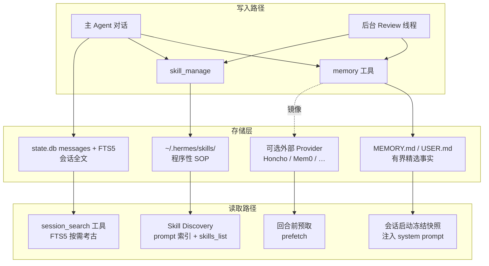
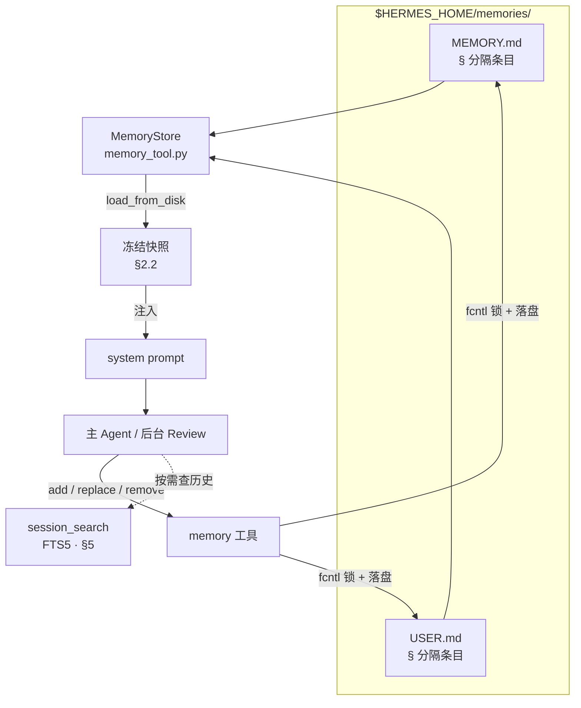

# Hermes Agent 记忆系统

> [!tip] 核心本质
> Hermes Agent 把 [[memory|记忆]] 拆成三条可并行的管线：有界精选事实（`MEMORY.md` / `USER.md`）、程序性 SOP（[[skill|Skill]] 库 + `skill_manage`）、会话考古（SQLite [[fts5|FTS5]] 全文检索）。提取靠主 Agent 与后台 Review 双轨；融合靠 LLM 驱动的 `replace` / `patch` 与 Curator 生命周期，而非向量聚类或真值发现（Truth Discovery）公式；检索在「永远在线」层用冻结快照（Frozen Snapshot）注入上下文（context），在「按需回忆」层用 BM25 关键词路 + 书挡式上下文组装。若没有这套分工，长期运行的个人 Agent 要么每次失忆，要么把无限历史塞进窗口——前者无法积累，后者上下文与前缀缓存（prefix cache）都会失控。

*检索说明：实现细节主要来自 Hermes Agent 官方文档与 `NousResearch/hermes-agent` 源码（观测 2026-06-07，v2026.5.x 量级）；GEPA 进化在独立仓库 `hermes-agent-self-evolution`。*

**适合谁读**：已了解 [[hermes-agent]] 全貌、想搞清「记忆从哪来、怎么压缩、怎么查」的工程师。读完「三层架构」与「后台 Review」即可建立心智模型；「会话搜索」与「Curator」两节适合要调优检索或 Skill 库治理的读者。

*正文约定：**加粗**仅用于生命周期标签与表格行首；`` `反引号` `` 为工具名、文件名、配置键与 API；开源实现处标注源文件并链至 [NousResearch/hermes-agent](https://github.com/NousResearch/hermes-agent) 对应路径。*

## 生命周期与演进

**当前定位**：Hermes 记忆是「个人 Agent Harness」产品化方案，不是通用 Memory 框架。内置层极简（双文件 + 字符硬顶 + 冻结快照）；扩展层可插 Honcho / Mem0 / Supermemory 等 provider；Skill 与 Curator 构成自进化闭环的程序性记忆侧。与 [[agentmemory]]（跨宿主 MCP 记忆服务）互补：只跑 Hermes 用内置即可，要 Cursor+Hermes 共享库再接 MCP。

**预期寿命**：中期。三层分工（事实 / 流程 / 历史）在 Agent 工程里稳定；具体阈值（2200 字符、每 10 轮 nudge）会随版本调整。

**近期演进**：inline nudge 改为后台 Review 线程（PR #2235，2026-03）；CJK 检索从 `LIKE` 全表扫升级为 trigram FTS5（PR #16651）；Curator 治理 agent-created Skill 沉积；Honcho 等 provider 插件化；`hermes-agent-self-evolution` 用 GEPA 离线进化 Skill 文本（Phase 1 已落地）。

**终极威胁**：超长上下文「全历史塞窗口」削弱会话搜索价值；云厂商托管记忆 API 降低自托管动力；快速版本迭代使本文实现细节需对照 `hermes doctor` 与官方 Memory 文档复核。

## 三层架构：写什么、放哪、何时用

本节建立 Hermes 记忆的全景图，并与通用 [[memory]] 三分法对齐。



表 1：三层与通用 Memory 对照

| Hermes 层 | 物理形态 | 解决什么问题 | 典型内容 | 与 [[agent-context-stack]] 对应 |
| --- | --- | --- | --- | --- |
| **持久记忆（Durable memory）** | `MEMORY.md`（环境/任务事实）、`USER.md`（用户画像） | 跨会话始终应生效的短事实 | 「本项目不用 Vercel」「用户偏好中文技术博客体」 | 个体 Rules + 用户偏好 |
| **Skills（程序性记忆）** | `~/.hermes/skills/*/SKILL.md` + `references/` 等 | 怎么做一类任务的 SOP | 调试步骤、格式偏好、工具组合 | 程序性记忆 / Commands |
| **会话搜索（Session search）** | `~/.hermes/state.db` + FTS5 | 「上周我们怎么做的」按需召回 | 历史对话片段、工具调用上下文 | 外部归档 + 检索，非默认全量注入 |

上文三层（`MEMORY.md` / Skill / 会话搜索）是 Hermes 默认且始终存在的内置记忆。若在配置里启用 Honcho、Mem0 等外部 Memory Provider，它们不会替换这三层，而是在旁边多跑一套读写管线：

- 读：每轮用户消息到达后、主 Agent 回复前，provider 按当前对话 预取（prefetch） 相关记忆并注入上下文（context）（图中 `EXT → PREF`）；
- 写：每轮对话结束后 同步（sync） 到 provider，供其后台做事实提取、语义索引等；
- 镜像：主 Agent 或后台 Review 调用内置 `memory` 工具写入 `MEMORY.md` / `USER.md` 时，同一条内容可同步复制到外部库（图中虚线 `MT -.镜像.-> EXT`），两套存储并行维护。

因此是「内置三层 + 可选外部层」，而非二选一。各 provider 的差异、`recallMode` 与 Honcho/Mem0 选型见 [[#外部 Memory Provider：叠加层与检索模式|外部 Memory Provider]]。

## 内置精选记忆（Curated Memory）：有界容量与冻结快照

### 2.1 双文件存储与条目模型

本节说明 Hermes 持久记忆（Durable memory） 层的设计立场：用什么技术存「跨会话必生效的短事实」，以及相对向量/RAG 路线的收益。实现细节见段末规格表。

#### 2.1.1 设计原理：有界精选，而非无限归档

通用 Agent 记忆常走两条极端：要么不持久化（每会话失忆），要么把全量历史或 embedding 索引当记忆（context 膨胀、检索有漏网）。Hermes 内置层取中间路线——只存体量极小、但每轮都应生效的声明性事实，并硬性限制总量。

双文件分工来自「记什么」而非「怎么存」：

- `USER.md`：谁在用、交流偏好、长期用户画像（persona）（「偏好中文技术博客体」「不要用 bullet 堆砌」）。
- `MEMORY.md`：当前环境与任务稳定事实（「本项目是 Obsidian vault」「不用 Vercel 部署」）。

两文件分别设字符硬顶（`MEMORY.md` 2200、`USER.md` 1375），属于有界上下文（context）设计：上限与 tokenizer 解耦，保证注入 `system prompt` 的开销可预期；同时促使 Agent 或后台 Review 通过 `replace` 将多条观察 合并（consolidate） 为更短、信息密度更高的单条，而非将会话搜索中的条目无差别升格为常驻记忆。超限后 `add`/`replace` 直接拒绝——不提供后台自动摘要（summarization）；遗忘与合并由 LLM 在工具层显式执行（[[#2.3 `memory` 工具：CRUD 语义与「融合」边界|§2.3]]），与 [[knowledge-fusion]] 中的 embedding 聚类 + 真值发现（Truth Discovery） 属于不同技术路线。

#### 2.1.2 技术选型：本地 Markdown 条目列表

源文件：[tools/memory_tool.py](https://github.com/NousResearch/hermes-agent/blob/main/tools/memory_tool.py)

`MemoryStore` 类负责持久记忆的解析、校验与落盘：读入 `\n§\n` 分隔的条目、检查字符硬顶、每次写入前从磁盘重载，并用 `fcntl` 文件锁避免多会话并发或手改文件时静默覆盖（冲突处理见 [[#2.3 `memory` 工具：CRUD 语义与「融合」边界|§2.3]]）。

数据写在 `$HERMES_HOME/memories/`（默认 `~/.hermes/memories/`，按 `profile` 隔离）下的两个 Markdown 文件，纯文本、可手改、可 Git diff，不经向量库或外部服务：

- `MEMORY.md` — 环境与任务事实；
- `USER.md` — 用户画像与偏好。

每条记忆是一段可含换行的短文本，条与条之间以 `\n§\n` 分隔。字符硬顶（与 tokenizer 无关）：`MEMORY.md` 2200 字符、`USER.md` 1375 字符。

读与写机制不同，图 2 概括完整链路。读在会话启动时一次性完成：`load_from_disk()` 将两文件的全部条目拍成冻结快照（[[#2.2 冻结快照（Frozen Snapshot）与双态一致|§2.2]]），整段挂入 `system prompt`；此后本会话内 Agent 直接看见这些事实，本层不提供关键词或向量检索，也无需先调 `search`。写由主 Agent 或后台 Review 调用 `memory` 工具触发：`add` 在列表末尾追加一条；`replace` / `remove` 传入 `old_text`，在现有条目中子串匹配唯一条目后整段替换或删除。多条观察合成一条更短更全的文本，即 合并（consolidate），通常通过多次 `replace` 完成；触顶时不做后台自动摘要（summarization），须先 `remove` 或 `replace` 腾出空间再 `add`。

本层与会话搜索职责分离：查「历史会话里说过什么」应走 [[#会话搜索（Session Search）：检索范式与算法|§5]] 的 `session_search`（BM25 / FTS5）。内置记忆只承担跨会话常驻、每轮都应生效的短事实；会话搜索按需考古，二者存储、预算与调用路径均独立。

图 2 — MemoryStore 读写路径（相对 [[#三层架构：写什么、放哪、何时用|§三层架构]] 全景图，仅展开 `MEMORY.md` / `USER.md` 一层）



#### 2.1.3 相对 RAG / 向量记忆的好处

| 收益 | 机制 |
| --- | --- |
| **关键偏好零漏召回** | 精选事实整包注入 `system prompt`，不依赖 query 改写或相似度阈值 |
| **上下文预算可预期** | 字符硬顶 ≈ 固定 token 上限；不会随记忆库增长拖垮前缀缓存（prefix cache）（[[#2.2 冻结快照（Frozen Snapshot）与双态一致|§2.2]]） |
| **运维与调试简单** | 打开 `~/.hermes/memories/` 即可审计；出错可手改或 `remove`，无需重建索引 |
| **强制精选（curation）** | 超限拒绝写入，要求 Agent 合并或删除过时条目，避免无差别持久化 |
| **离线可用** | 纯本地文件；无 embedding API、无外部 Memory 服务依赖 |
| **与会话搜索分工清晰** | 内置记忆管「永远在线」；偶发考古走 FTS5（[[#会话搜索（Session Search）：检索范式与算法|§5]]），互不抢预算 |

代价亦需纳入设计权衡：该层不依赖语义检索，同义表述无法命中；字符硬顶触顶后须通过 `replace` 手工压缩，无自动去重（dedup）。

#### 2.1.4 实现规格

- 路径：`$HERMES_HOME/memories/`（某一 `profile` 作用域，默认 `~/.hermes/memories/`）。
- 文件：`MEMORY.md`（Agent 对环境与任务的观察）、`USER.md`（用户偏好与期望）。
- 条目分隔符：`§`（section sign）。每条记忆是一段可含换行的文本块，块间用 `\n§\n` 分隔。
- 容量硬上限（字符计，与 tokenizer 无关）：`MEMORY.md` 2200 字符（约 8–15 条）；`USER.md` 1375 字符（约 5–10 条）。超限则 `add` / `replace` 拒绝并返回当前用量，要求先 `replace` 合并或 `remove`。

### 2.2 冻结快照（Frozen Snapshot）与双态一致

Hermes 刻意维护两套状态——冻结快照与活状态：

1. `_system_prompt_snapshot`（冻结快照）：在 `load_from_disk()` 时捕获，整段会话不变。用于 `system prompt` 注入，保护 LLM 前缀缓存（prefix cache）（同一前缀可复用 KV）。
2. `memory_entries` / `user_entries`（活状态）：`memory` 工具每次 `add`/`replace`/`remove` 后立即写盘；工具返回反映活状态。

因此会出现「本会话内刚写入的记忆，下一条用户消息在 `system prompt` 里还看不见，但 `memory` 工具响应已是新列表」——设计如此，新快照要到 `/new` 或下次启动才进入 `system prompt`。若需即时生效，只能依赖工具返回值或外部 provider 的预取（prefetch）路径。

加载时对每条 entry 做 威胁模式扫描（threat pattern scan）（`scope=strict`）：命中者在快照中替换为 `[BLOCKED: …]` 占位，活状态保留原文供用户 `remove`——防止供应链或恶意工具向 `system prompt` 投毒。

### 2.3 `memory` 工具：CRUD 语义与「融合」边界

`memory` 工具只有 `add`、`replace`、`remove`（无 `read`——读靠 `system prompt` 注入；部分版本另有 `read` 供排障）。

| 操作 | 机制 | 融合含义 |
| --- | --- | --- |
| `add` | 追加一条；精确重复拒绝 | 增量写入，不自动去重近似义 |
| `replace` | `old_text` 子串匹配唯一条目后整段替换 | LLM 驱动的条目级融合：把多条事实合并成一条更短更全的 `replace` |
| `remove` | 子串匹配删除 | 遗忘 / 纠错 |

并发与漂移：每次写前 `fcntl` 文件锁 + 从磁盘 `_reload_target`；若磁盘内容无法经 `§` 解析往返（手改 `MEMORY.md`/`USER.md`、`skill_manage` 的 `patch`、并发会话写入），触发 漂移防护（drift guard）——拒绝写入并留 `.bak.<ts>`，避免静默丢数据（issue #26045）。

安全：写入内容经 `injection`/`exfil` 模式扫描；与 Curator / Skill 的 guard 独立。

这与 [[knowledge-fusion]] 里「实体对齐 + 真值发现（Truth Discovery）」不同：Hermes 内置层是 `§` 分隔的短条目列表 + LLM 手工合并（consolidate），没有 embedding 聚类或置信度加权图。

## 记忆提取：主循环、Memory 提示（Memory nudge）与后台 Review

### 3.1 提取触发矩阵

| 路径 | 触发条件 | 执行者 | 可用工具 | 用户可见性 |
| --- | --- | --- | --- | --- |
| **主 Agent 即时写入** | 用户说「记住」、任务中识别稳定事实 | 主循环 | `memory`（全 toolset 之一） | 正常 tool 流 |
| **Memory 提示 → 后台 Review** | 默认每 10 个用户轮（`memory.nudge_interval`）；用过 `memory` 工具会重置计数 | [background_review.py](https://github.com/NousResearch/hermes-agent/blob/main/agent/background_review.py) 派生线程 | 仅 `memory` + `skill_manage`（≤5 迭代） | 完成后可选摘要「Memory updated」 |
| **Skill 提示 → 同上 Review** | 单轮工具迭代 ≥ 阈值（与 memory 合并为 combined prompt） | 同上 | 同上 | 同上 |
| **外部 provider** | 每回合结束同步（sync）；部分在 session end 批量提取 | Provider 后台队列 | `honcho_*` / `mem0_*` 等 | 依 `recallMode` |

2026-03 之前，Memory 提示文本拼接在用户消息末尾，导致约 43% 消息带「向后看」指令，主 Agent 有时先调 `memory` 再干活（PR #2235）。现改为：主回复交付后再 `spawn_background_review_thread`，对话快照只读，零额外延迟，不污染 transcript。

### 3.2 后台 Review 的实现要点

源文件：[agent/background_review.py](https://github.com/NousResearch/hermes-agent/blob/main/agent/background_review.py)

该模块实现后台 Review 线程（观测 2026-06-07）：

- Fork 一个 `AIAgent`：继承父级的 model、provider、auth、已缓存的 system prompt（prefix cache 对齐）。
- `quiet_mode=True`，`skip_context_files=True`；禁用子 Agent 的 nudge（防递归）。
- `skip_memory=True` 对外部 provider：Review 只写内置 `MemoryStore`，避免把 Review prompt 泄漏给 Honcho/Mem0。
- 工具白名单：非 memory/skill 工具在运行时拒绝；危险 command approval 自动 deny。
- Review 用专用 prompt（`_MEMORY_REVIEW_PROMPT` / `_SKILL_REVIEW_PROMPT` / `_COMBINED_REVIEW_PROMPT`），明确要求区分 用户画像 → 持久记忆 vs 任务类偏好 → 程序性记忆（Skill）。

Memory Review 关注两类信号：用户画像（persona）、偏好与个人细节；对 Agent 行为方式的期望。Skill Review 则偏主动（「空跑是错失学习机会」），并规定更新优先级：先 `patch` 本会话已加载的 Skill → 再扩展现有 umbrella → `references/` 支撑文件 → 最后才新建 class-level Skill；禁止把「浏览器坏了」一类环境偶发失败固化成永久约束。

### 3.3 记忆 vs Skill：提取分流原则

Hermes 用 prompt 工程硬性分流，避免把所有东西都塞进 `MEMORY.md`：

- 持久记忆（Memory）：谁是用户、当前稳定环境与状态（「这个项目用 Obsidian vault」）。
- 程序性记忆（Skill）：怎么做一类事、格式/流程纠错（「写技术文用因果段，不要 bullet 堆砌」应进相关 Skill 的 pitfall，而非只写 `USER.md`）。

用户抱怨「你总是先解释再答」时，Review prompt 要求 Skill 正文嵌入教训，单靠 `memory` 不够——这是程序性记忆与声明性记忆的边界实践。

## Skill 库：程序性记忆、沉积与 Curator 融合

### 4.1 skill_manage：提取与增量更新

源文件：[tools/skill_manager_tool.py](https://github.com/NousResearch/hermes-agent/blob/main/tools/skill_manager_tool.py)

`skill_manage` 工具是 Hermes 的程序性记忆写入 API：

| 动作 | 用途 | 融合特点 |
| --- | --- | --- |
| `create` | 新建 `SKILL.md` | 背景 Review 创建的标 `created_by=agent`（`skill_provenance` ContextVar） |
| `patch` | `old_string` → `new_string` 局部替换 | 首选更新路径，token 省 |
| `edit` | 整文件替换 | 大改结构时用 |
| `write_file` | 写 `references/`、`scripts/`、`templates/` | 会话细节与知识库外置，SKILL.md 只留指针 |
| `delete` / `remove_file` | 删除 | Curator 更常用 archive 而非 delete |

触发场景（官方 Skills 文档）：复杂任务成功（5+ tool calls）、踩坑后找到正路、用户纠正流程、发现非平凡工作流。

### 4.2 Curator：Skill 库的规模化融合与剪枝

源文件：[agent/curator.py](https://github.com/NousResearch/hermes-agent/blob/main/agent/curator.py)（核心逻辑）、[hermes_cli/curator.py](https://github.com/NousResearch/hermes-agent/blob/main/hermes_cli/curator.py)（`hermes curator` CLI）

Curator 是 Skill 层的「融合优化器」，由 `hermes curator` 命令驱动（观测 2026-06-07），分确定性（Deterministic）与 LLM 两阶段。自进化循环会不断 `create` Skill，导致近重复（near-duplicate）与目录膨胀（catalog bloat）。

阶段 A — 确定性生命周期（无模型）

- 跟踪 view / use / patch 次数与最后使用时间。
- 状态机：`active` →（默认 30 天未用）`stale` →（90 天未用）`archived` 至 `~/.hermes/skills/.archive/`。
- 仅处理 agent-created Skill；Hub 安装与 bundled 默认不 patch/合并（bundled 可在 `prune_builtins: true` 时仅 archive）。
- `hermes curator pin <name>` 硬保护；`restore` 可恢复。

阶段 B — 辅助模型 Review（`max_iterations=8`）

- 空闲时（如数小时无活动）用便宜 aux 模型 fork 短 Agent。
- 工具仅限 `skills_list`、`skill_view`、`skill_manage(patch)`、`terminal mv`（archive）。
- 任务：发现重叠 Skill 合并、漂移逻辑 patch、冗余 archive；合并时必须处理 `references/` 等附属目录，禁止只抄 SKILL.md 正文。

这与 [[knowledge-fusion]] 的「推理前多源合并」同构的是 LLM 在约束工具下的库级合并（consolidate），而非 RRF 或向量相似度自动并条。RFC #16077 指出未来可在 Python 层预计算 `last_reviewed_hash`、描述重叠候选再调模型——当前仍以模型发现为主。

### 4.3 GEPA 离线进化（独立仓库）

运行时 Curator 做库治理；[hermes-agent-self-evolution](https://github.com/NousResearch/hermes-agent-self-evolution) 用 DSPy + GEPA（Genetic-Pareto Prompt Evolution，ICLR 2026 Oral）对单个 `SKILL.md` 离线进化：

1. 把 Skill 包成 DSPy module；
2. 用 batch_runner 跑评测集，收集 执行轨迹（execution traces）；
3. GEPA 根据「为何失败」反思，变异 prompt 文本；
4. 约束门（测试、体积、benchmark）通过后提 PR。

这是 Skill 文本的梯度无关搜索优化，与在线 `patch` 互补：前者适合高频关键 Skill 的 measurable 提升，后者适合日常沉积与纠错。

## 会话搜索（Session Search）：检索范式与算法

### 5.1 设计立场：关键词考古，非向量摘要

源文件：[tools/session_search_tool.py](https://github.com/NousResearch/hermes-agent/blob/main/tools/session_search_tool.py)

`session_search` 工具刻意 不做 默认 LLM 摘要或 embedding 检索（官方 Sessions 文档，观测 2026-06-07）。哲学是：历史会话已结构化存盘，Agent 应拿到真实消息原文，自己读、自己归纳——避免摘要丢细节。

存储：`~/.hermes/state.db`（SQLite WAL），`messages` 表存 role/content/tool_calls；`messages_fts` 为 FTS5 external content 虚表，INSERT/UPDATE/DELETE 触发器同步索引。详见 [[fts5]]。

### 5.2 检索算法：双索引 + 查询路由

| 查询类型 | 引擎 | 排序 | 说明 |
| --- | --- | --- | --- |
| 英文等 FTS5 默认分词 | `messages_fts` `MATCH` | BM25（`ORDER BY rank`） | 支持 `AND`/`OR`、短语 `"…"`、前缀 |
| CJK ≥3 字符 | `messages_fts_trigram` trigram tokenizer | BM25 rank | 替代早期 `LIKE '%…%'` 全表扫（PR #16651） |
| CJK 1–2 字符 | `LIKE` 回退 | 时间倒序 | trigram 需 ≥3 字符（9 UTF-8 字节）才可靠 |

用户输入经 `_sanitize_fts5_query()` 转义，防注入式 FTS 语法破坏。

这与 [[rag]] 典型「embed → ANN」不同：会话搜索是 确定性倒排 + BM25，优势在错误码、命令、专有名词精确命中；弱点在同义改写。Hermes 未把向量路并入 `session_search`；语义回忆可交给外部 Memory Provider（如 Honcho `honcho_search`）或主模型读后推理。

### 5.3 召回组装：发现（Discovery）+ 滚动（Scroll）两阶段范式

Discovery（发现）（传 `query`）：

1. FTS5 命中消息 → 按 会话谱系（session lineage）（`parent_session_id` 链）去重，避免压缩分裂会话重复展示。
2. 每个命中 session 返回结构化包：
   - `snippet`：FTS5 `snippet()` 高亮片段；
   - `bookend_start` / `bookend_end`：会话首 3 与末 3 条 user+assistant（目标与结论）；
   - `messages`：命中点 ±5 条上下文，锚点消息标记；
   - 元数据：title、source（cli/telegram/…）、时间。

Scroll（滚动）（传 `session_id` + `around_message_id`）：

- 不再跑 FTS，按 message id 滑窗 ±`window`（默认 10）精读。

这是 搜索 → 展开（Search → Expand） 两阶段检索体验，类似经典搜索引擎的「摘要 + 点进全文」，把 token 预算花在 Agent 真正需要的窗口上，而非一次塞入整会话。

可选过滤：`source_filter`、`sort=newest` 等；角色默认排除 `tool` 消息降噪（工具输出仍可被索引，但列表可过滤）。

### 5.4 与持久记忆（Durable Memory）的分工

官方 Memory 文档的一句话边界：

- 持久记忆（Memory）：应永远在 context 里的关键事实（容量极小）。
- 会话搜索（Session search）：「我们上周讨论过 X 吗」类偶发回忆。

若把一切都升格（promote）到 `MEMORY.md`，会迅速触顶并失去字符预算；若只靠会话搜索，则缺「无需查询即生效」的偏好。Hermes 用字符硬顶强迫 精选（curation）。

## 外部 Memory Provider：叠加层与检索模式

`memory.provider` 可切换 Honcho、Mem0、Supermemory、RetainDB 等（官方 Memory Providers 文档）。插件架构（`plugins/memory/`）统一：

1. 回合前 预取（prefetch） 相关记忆（可配置非阻塞）；
2. 回合后 同步（sync） 对话到 provider；
3. 内置 `memory` 写入可 镜像 到外部；
4. 注入 provider 专用工具（语义搜、结论管理等）。

Honcho（观测 2026-06-07）代表「重推理」路线：消息入队后异步做演绎（deduction）/ 归纳（induction）/ 溯因（abduction）/ 合并巩固（consolidation，含冗余与矛盾处理），维护 peer card 与 session summary；Hermes 侧双层注入——基础上下文（base context）（summary + representation + card）+ 辩证补充（dialectic supplement）（LLM 合成，冷/热启动 prompt 切换）。工具含 `honcho_search`、`honcho_reasoning`、`honcho_conclude` 等。

Mem0 代表「服务端 LLM 事实提取 + 语义检索 + 重排序（rerank）+ 自动去重（dedup）」路线，工具较薄（`mem0_search`、`mem0_profile`、`mem0_conclude`）。

`recallMode`：`hybrid`（自动注入 + 工具）、`context`（只注入）、`tools`（只工具）——控制外部 Memory Provider 与内置冻结快照如何争抢上下文（context）预算。

后台 Review 故意不碰 外部 Memory Provider，避免 Review 元提示污染第三方用户模型。

## 实践与调优

### 7.1 配置项速查

| 配置 | 默认 | 作用 |
| --- | --- | --- |
| `memory.memory_enabled` / `user_profile_enabled` | 依 setup | 开关双层内置记忆 |
| `memory.nudge_interval` | `10` | 多少用户轮触发 memory review |
| `memory.memory_char_limit` / `user_char_limit` | 2200 / 1375 | 文件字符上限 |
| `memory.provider` | 空（仅内置） | 外部记忆插件 |
| `curator.enabled` | true | 后台 Skill 维护 |
| `curator.prune_builtins` | true | 是否 archive 长期未用 bundled skill |

### 7.2 运维命令

```bash
hermes memory setup          # 选择内置或外部 provider
hermes curator run --dry-run # 预览 Skill 合并/归档
hermes curator pin my-skill  # 禁止 Curator 动该 Skill
hermes curator restore foo   # 从 .archive 恢复
```

会话内：`/new` 刷新冻结快照与 Memory 提示计数；`/compress` 分裂会话谱系（session lineage）但历史仍可通过 FTS 查到。

### 7.3 常见坑

| 现象 | 原因 | 对策 |
| --- | --- | --- |
| 刚写入记忆，回复仍「不知道」 | 冻结快照本会话不变 | `/new` 或下一会话；或读 tool 返回 |
| `add` 报超限 | 字符硬顶，无自动 merge | 让 Agent `replace` 合并条目或 `remove` 过时事实 |
| memory 写入被拒 drift | 手动改乱 `§` 格式 | 按错误信息恢复 `.bak`，逐条 `add` |
| Skill 爆炸、发现（Discovery）变慢 | 自进化只 create 不 maintain | 开 Curator；手动 `pin`；周期性 `curator run` |
| 中文搜不到旧会话 | 查询太短 | 至少 3 个汉字；或换英文关键词 |
| 内置与 git 文档冲突 | memory 学到过时约定 | 权威以 git 为准；`remove` 过时 entry |

### 7.4 选型：内置 vs AgentMemory vs 外部 Provider

| 需求 | 建议 |
| --- | --- |
| 仅 Hermes、要极简可控 | 内置 `MEMORY.md` / `USER.md` + 会话搜索 |
| 跨 Cursor/Hermes 共享 | [[agentmemory]] MCP |
| 要语义用户建模 + 矛盾推理 | Honcho provider |
| 要托管式事实提取 + 向量搜 | Mem0 provider |
| 要 measurable 改 Skill 文案 | `hermes-agent-self-evolution` GEPA |

## 进一步阅读

- 官方：[Persistent Memory](https://hermes-agent.nousresearch.com/docs/user-guide/features/memory)、[Memory Providers](https://hermes-agent.nousresearch.com/docs/user-guide/features/memory-providers)、[Sessions / session_search](https://hermes-agent.nousresearch.com/docs/user-guide/sessions)、[Skills / skill_manage](https://hermes-agent.nousresearch.com/docs/user-guide/features/skills)、[Curator](https://hermes-agent.nousresearch.com/docs/user-guide/features/curator)、[Session Storage（开发者）](https://hermes-agent.nousresearch.com/docs/developer-guide/session-storage)
- 源码：[tools/memory_tool.py](https://github.com/NousResearch/hermes-agent/blob/main/tools/memory_tool.py)、[tools/skill_manager_tool.py](https://github.com/NousResearch/hermes-agent/blob/main/tools/skill_manager_tool.py)、[tools/session_search_tool.py](https://github.com/NousResearch/hermes-agent/blob/main/tools/session_search_tool.py)、[agent/background_review.py](https://github.com/NousResearch/hermes-agent/blob/main/agent/background_review.py)、[agent/curator.py](https://github.com/NousResearch/hermes-agent/blob/main/agent/curator.py)、[PR #2235 后台 Review](https://github.com/NousResearch/hermes-agent/pull/2235)、[PR #16651 CJK trigram FTS5](https://github.com/NousResearch/hermes-agent/pull/16651)
- 本仓库：[[hermes-agent]]、[[memory]]、[[skill]]、[[fts5]]、[[bm25]]、[[knowledge-fusion]]、[[knowledge-extraction]]、[[agentmemory]]、[[skill-loading-library]]
- 进化：[hermes-agent-self-evolution](https://github.com/NousResearch/hermes-agent-self-evolution)（GEPA Skill 优化）
- 外部：[Honcho Reasoning](https://docs.honcho.dev/v3/documentation/core-concepts/reasoning)
