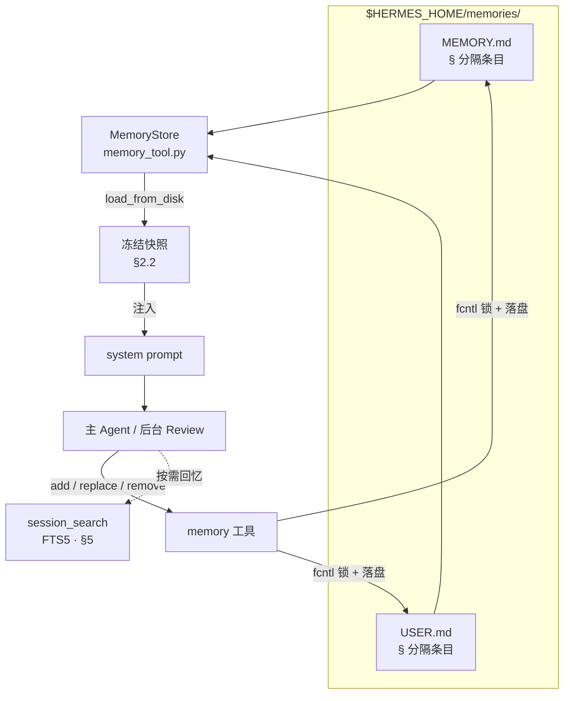
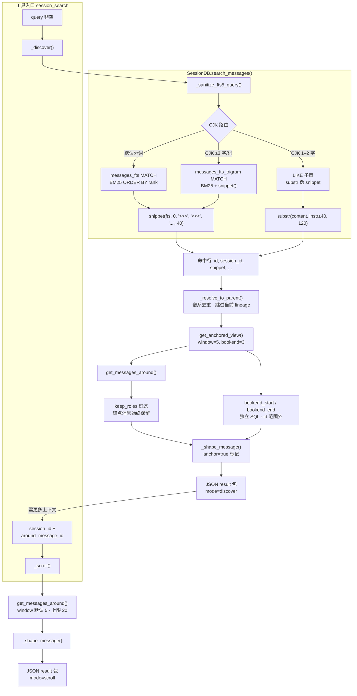

# Hermes Agent 记忆系统

> [!tip] 核心本质
> Hermes Agent 把 [[memory|记忆]] 拆成三条可并行的管线：有界精选事实（`MEMORY.md` / `USER.md`）、程序性 SOP（[[skill|Skill]] 库 + `skill_manage`）、历史会话检索（SQLite [[fts5|FTS5]] 全文检索）。提取靠主 Agent 与后台 Review 双轨；融合靠 LLM 驱动的 `replace` / `patch` 与 Curator 生命周期；读取分「永远在线」冻结快照注入与「按需」BM25 会话搜索两路。若没有这套分工，长期运行的个人 Agent 要么每次失忆，要么把无限历史塞进窗口——前者无法积累，后者上下文与前缀缓存（prefix cache）都会失控。

*检索说明：实现细节主要来自 Hermes Agent 官方文档与 `NousResearch/hermes-agent` 源码（观测 2026-06-07，v2026.5.x 量级）；GEPA 进化在独立仓库 `hermes-agent-self-evolution`。*

**适合谁读**：已了解 [[hermes-agent]] 全貌、想搞清「记忆从哪来、怎么压缩、怎么查」的工程师。读完 [[#三层架构：写什么、放哪、何时用|§1 三层架构]] 与 [[#3.2 后台 Review 的实现要点|§3.2 后台 Review]] 即可建立心智模型；[[#3.3 后台 Review Prompt 契约|§3.3]] 与 [[#4.2.1 Curator 融合 Prompt 契约|§4.2.1]] 给出提取/融合的可对照 prompt 契约；[[#会话搜索（Session Search）：检索范式与算法|§5 会话搜索]] 与 [[#4.2 Curator：Skill 库的规模化融合与剪枝|§4.2 Curator]] 适合要调优检索或 Skill 库治理的读者。

*正文约定：**加粗**仅用于生命周期标签与表格行首；`` `反引号` `` 为工具名、文件名、配置键与 API；开源实现处标注源文件并链至 [NousResearch/hermes-agent](https://github.com/NousResearch/hermes-agent) 对应路径。*

## 生命周期与演进

**当前定位**：Hermes 记忆是「个人 Agent Harness」产品化方案，不是通用 Memory 框架。内置层极简（双文件 + 字符硬顶 + 冻结快照）；扩展层可插 Honcho / Mem0 / Supermemory 等 provider；Skill 与 Curator 构成自进化闭环的程序性记忆侧。与 [[agentmemory]]（跨宿主 MCP 记忆服务）互补：只跑 Hermes 用内置即可，要 Cursor+Hermes 共享库再接 MCP。

**预期寿命**：中期。三层分工（事实 / 流程 / 历史）在 Agent 工程里稳定；具体阈值（2200 字符、每 10 轮 nudge）会随版本调整。

**近期演进**：inline nudge 改为后台 Review 线程（PR #2235，2026-03）；CJK 检索从 `LIKE` 全表扫升级为 trigram FTS5（PR #16651）；Curator 治理 agent-created Skill 沉积；Honcho 等 provider 插件化；`hermes-agent-self-evolution` 用 GEPA 离线进化 Skill 文本（Phase 1 已落地）。

**终极威胁**：超长上下文「全历史塞窗口」削弱会话搜索价值；云厂商托管记忆 API 降低自托管动力；快速版本迭代使本文实现细节需对照 `hermes doctor` 与官方 Memory 文档复核。

## 三层架构：写什么、放哪、何时用

本节建立 Hermes 记忆的全景图，并与通用 [[memory]] 三分法对齐。


**表 1：** 三层与通用 Memory 对照

| Hermes 层 | 物理形态 | 解决什么问题 | 典型内容 | 与 [[agent-context-stack]] 对应 |
| --- | --- | --- | --- | --- |
| **持久记忆（Durable memory）** | `MEMORY.md`（环境/任务事实）、`USER.md`（用户画像） | 跨会话始终应生效的短事实 | 「本项目不用 Vercel」「用户偏好中文技术博客体」 | 个体 Rules + 用户偏好 |
| **Skills（程序性记忆）** | `~/.hermes/skills/*/SKILL.md` + `references/` 等 | 怎么做一类任务的 SOP | 调试步骤、格式偏好、工具组合 | 程序性记忆 / Commands |
| **会话搜索（Session search）** | `~/.hermes/state.db` + FTS5 | 「上周我们怎么做的」按需召回 | 历史对话片段、工具调用上下文 | 外部归档 + 检索，非默认全量注入 |

上文三层是 Hermes 默认且始终存在的内置记忆；Honcho、Mem0 等外部 Provider 在其旁叠加读写管线（预取 / 同步 / 镜像，见图 `EXT`），不替换内置层。机制与选型见 [[#外部 Memory Provider：叠加层与检索模式|§6 外部 Provider]]。

## 内置精选记忆（Curated Memory）：有界容量与冻结快照

### 2.1 双文件存储与条目模型

本节展开持久记忆层：设计立场（[[#2.1.1 设计原理：有界精选，而非无限归档|§2.1.1]]）、`MemoryStore` 实现（[[#2.1.2 技术选型：本地 Markdown 条目列表|§2.1.2]]）、相对 RAG 取舍（[[#2.1.3 相对 RAG / 向量记忆的取舍|§2.1.3]]）。

#### 2.1.1 设计原理：有界精选，而非无限归档

通用 Agent 记忆常走两条极端：要么不持久化（每会话失忆），要么把全量历史或 embedding 索引当记忆（context 膨胀、检索有漏网）。Hermes 内置层取中间路线——只存每轮都应生效的极少声明性事实，并用字符硬顶硬性限总量（与 tokenizer 解耦，保证 `system prompt` 开销可预期）。

`USER.md` 记用户画像与偏好，`MEMORY.md` 记环境与任务稳定事实；分工来自「记什么」而非存储技术（文件形态见 [[#2.1.2 技术选型：本地 Markdown 条目列表|§2.1.2]]）。超限后 `add`/`replace` 直接拒绝，无后台自动摘要——须由 Agent 或后台 Review 经 `replace` 合并（consolidate）或 `remove` 腾出空间（[[#2.3 `memory` 工具：CRUD 语义与「融合」边界|§2.3]]）。历史会话不得无差别升格为常驻记忆，偶发考古走 [[#会话搜索（Session Search）：检索范式与算法|§5]] 的 `session_search`。

#### 2.1.2 技术选型：本地 Markdown 条目列表

源文件：[tools/memory_tool.py](https://github.com/NousResearch/hermes-agent/blob/main/tools/memory_tool.py)

`MemoryStore` 类负责持久记忆的解析、校验与落盘：读入 `\n§\n` 分隔的条目、检查字符硬顶、每次写入前从磁盘重载，并用 `fcntl` 文件锁避免多会话并发或手改文件时静默覆盖（冲突处理见 [[#2.3 `memory` 工具：CRUD 语义与「融合」边界|§2.3]]）。

数据写在 `$HERMES_HOME/memories/`（默认 `~/.hermes/memories/`，按 `profile` 隔离）的 `MEMORY.md` / `USER.md` 中：纯文本、可手改、可 Git diff。条目以 `\n§\n` 分隔（`§`，section sign）；字符硬顶 `MEMORY.md` 2200（约 8–15 条）、`USER.md` 1375（约 5–10 条），超限则 `add` / `replace` 拒绝。

读与写机制不同，图 2 概括完整链路：

1. 读（会话启动）：`load_from_disk()` 拍成冻结快照（[[#2.2 冻结快照（Frozen Snapshot）与双态一致|§2.2]]）注入 `system prompt`；本层无关键词/向量检索。
2. 写（`memory` 工具）：主 Agent 或后台 Review 调用 `add` / `replace` / `remove`；`replace` / `remove` 以 `old_text` 子串匹配唯一条目。
3. 合并与触顶：多条观察经多次 `replace` 合并（consolidate）；触顶须先 `remove` 或 `replace` 再 `add`（原理见 [[#2.1.1 设计原理：有界精选，而非无限归档|§2.1.1]]）。

**图 2：** MemoryStore 读写路径（相对 [[#三层架构：写什么、放哪、何时用|§1 三层架构]] 全景图，仅展开 `MEMORY.md` / `USER.md` 一层）



#### 2.1.3 相对 RAG / 向量记忆的取舍

**表 2：** 相对向量/RAG 的杠杆与代价（无语义检索、触顶须手工 `replace` 压缩、无自动 dedup）

| 收益 | 机制 |
| --- | --- |
| **零漏偏好** | 精选事实整包注入 `system prompt`，不依赖 query 改写或相似度阈值 |
| **预算可预期** | 字符硬顶固定 token 开销；配合 [[#2.2 冻结快照（Frozen Snapshot）与双态一致|§2.2]] 保护 prefix cache |
| **可审计、离线** | 纯本地 Markdown，可手改 / Git diff；无 embedding API 或外部 Memory 服务依赖 |

### 2.2 冻结快照（Frozen Snapshot）与双态一致

Hermes 刻意维护两套状态——冻结快照与活状态：

1. `_system_prompt_snapshot`（冻结快照）：在 `load_from_disk()` 时捕获，整段会话不变。用于 `system prompt` 注入，保护 LLM 前缀缓存（prefix cache）（同一前缀可复用 KV）。
2. `memory_entries` / `user_entries`（活状态）：`memory` 工具每次 `add`/`replace`/`remove` 后立即写盘；工具返回反映活状态。

因此会出现「本会话内刚写入的记忆，下一条用户消息在 `system prompt` 里还看不见，但 `memory` 工具响应已是新列表」——设计如此，新快照要到 `/new` 或下次启动才进入 `system prompt`。若需即时生效，只能依赖工具返回值或外部 provider 的预取（prefetch）路径。

加载时对每条 entry 做 威胁模式扫描（threat pattern scan）（`scope=strict`）：命中者在快照中替换为 `[BLOCKED: …]` 占位，活状态保留原文供用户 `remove`——防止供应链或恶意工具向 `system prompt` 投毒。

### 2.3 `memory` 工具：CRUD 语义与「融合」边界

`memory` 工具只有 `add`、`replace`、`remove`（无 `read`——读靠 `system prompt` 注入；部分版本另有 `read` 供排障）。

| 操作 | 机制 | 融合含义 |
| --- | --- | --- |
| `add` | 追加一条；精确重复拒绝 | 增量写入，不自动去重近似义 |
| `replace` | `old_text` 子串匹配唯一条目后整段替换 | LLM 驱动的条目级融合：把多条事实合并成一条更短更全的 `replace` |
| `remove` | 子串匹配删除 | 遗忘 / 纠错 |

并发与漂移：每次写前 `fcntl` 文件锁 + 从磁盘 `_reload_target`；若磁盘内容无法经 `§` 解析往返（手改 `MEMORY.md`/`USER.md`、`skill_manage` 的 `patch`、并发会话写入），触发 漂移防护（drift guard）——拒绝写入并留 `.bak.<ts>`，避免静默丢数据（issue #26045）。

安全：写入内容经 `injection`/`exfil` 模式扫描；与 Curator / Skill 的 guard 独立。

这与 [[knowledge-fusion]] 里「实体对齐 + 真值发现（Truth Discovery）」不同：Hermes 内置层是 `§` 分隔的短条目列表 + LLM 手工合并（consolidate），没有 embedding 聚类或置信度加权图。写入路径讲完后，[[#记忆提取：主循环、Memory 提示（Memory nudge）与后台 Review|§3 记忆提取]] 说明谁在何时触发这些写入。

## 记忆提取：主循环、Memory 提示（Memory nudge）与后台 Review

持久记忆与 Skill 不会自动从对话里长出来——须有人（主 Agent 或后台 Review）识别信号并调用 `memory` / `skill_manage`。本节按「何时触发 → 线程怎么跑 → prompt 契约」展开；[[#3.3 后台 Review Prompt 契约|§3.3]] 是 Hermes 经验提取的主文档，[[#4.1 skill_manage：提取与增量更新|§4.1]] 则对应工具 API 与 Curator 侧库治理。

### 3.1 提取触发矩阵

| 路径 | 触发条件 | 执行者 | 可用工具 | 用户可见性 |
| --- | --- | --- | --- | --- |
| **主 Agent 即时写入** | 用户说「记住」、任务中识别稳定事实 | 主循环 | `memory`（全 toolset 之一） | 正常 tool 流 |
| **Memory 提示 → 后台 Review** | 默认每 10 个用户轮（`memory.nudge_interval`）；用过 `memory` 工具会重置计数 | [background_review.py](https://github.com/NousResearch/hermes-agent/blob/main/agent/background_review.py) 派生线程 | 仅 `memory` + `skill_manage`（≤5 迭代） | 完成后可选摘要「Memory updated」 |
| **Skill 提示 → 同上 Review** | 单轮工具迭代 ≥ 阈值（与 memory 合并为 combined prompt） | 同上 | 同上 | 同上 |
| **外部 provider** | 每回合结束同步（sync）；部分在 session end 批量提取 | Provider 后台队列 | `honcho_*` / `mem0_*` 等 | 依 `recallMode` |

2026-03 之前，Memory 提示文本拼接在用户消息末尾，导致约 43% 消息带「向后看」指令，主 Agent 有时先调 `memory` 再干活（PR #2235）。现改为：主回复交付后再 `spawn_background_review_thread`，对话快照只读，零额外延迟，不污染 transcript。

### 3.2 后台 Review 的实现要点

源文件：[agent/background_review.py](https://github.com/NousResearch/hermes-agent/blob/main/agent/background_review.py)

该模块实现后台 Review 线程（观测 2026-06-07）：

- Fork 一个 `AIAgent`：继承父级的 model、provider、auth、已缓存的 system prompt（prefix cache 对齐）。
- `quiet_mode=True`，`skip_context_files=True`；禁用子 Agent 的 nudge（防递归）。
- `skip_memory=True` 对外部 provider：Review 只写内置 `MemoryStore`，避免把 Review prompt 泄漏给 Honcho/Mem0。
- 工具白名单：非 memory/skill 工具在运行时拒绝；危险 command approval 自动 deny。
- Review 用专用 prompt（`_MEMORY_REVIEW_PROMPT` / `_SKILL_REVIEW_PROMPT` / `_COMBINED_REVIEW_PROMPT`），作为 fork 后的 `user_message` 追加在对话快照之后；契约全文与分流规则见 [[#3.3 后台 Review Prompt 契约|§3.3]]。

源码模块头注释还指向 bundled skill `hermes-agent-dev` 的 `references/self-improvement-loop.md`（自进化 invariant 与 PR 审查准则）；该文件随 Hermes 版本变动，以 [background_review.py](https://github.com/NousResearch/hermes-agent/blob/main/agent/background_review.py) 顶部 docstring 为准。

### 3.3 后台 Review Prompt 契约

Prompt 常量定义于 [agent/background_review.py#L34-L235](https://github.com/NousResearch/hermes-agent/blob/main/agent/background_review.py#L34-L235)（观测 2026-06-07，`main` 分支）。`spawn_background_review_thread` 按触发类型择一，再拼上工具白名单后缀（「只能调用 memory 与 skill 管理工具」）。

**表 3：** Review prompt 选择

| 触发 | 常量 | 写入目标 |
| --- | --- | --- |
| 仅 Memory nudge | `_MEMORY_REVIEW_PROMPT` | `memory(target=…)` |
| 仅 Skill nudge | `_SKILL_REVIEW_PROMPT` | `skill_manage` |
| 两者同时 | `_COMBINED_REVIEW_PROMPT` | 上两者并行 |

**与 [[knowledge-extraction]] / [[knowledge-fusion]] 的边界**：本仓库那两篇描述 Wiki/RAG 流水线的「候选断言 → 实体对齐 → 冲突消解」；Hermes 内置 Review 不产出 JSON 候选包，而是在对话快照上由 LLM 直接调 `memory` / `skill_manage`。融合语义是条目级 `replace` 与 Skill `patch`，不是 Truth Discovery 或 RRF。

#### 3.3.1 `_MEMORY_REVIEW_PROMPT`（声明性记忆提取）

上游 prompt 较短，核心契约：

1. 扫描用户是否暴露 persona、欲望、偏好、个人细节；
2. 扫描用户对 Agent 行为/工作方式的期望；
3. 有信号则 `memory` 写入；无则回复 `Nothing to save.` 并停止。

**工具路由（prompt 未写全、实现已支持）**：`memory` 的 `target` 取 `memory`（默认 → `MEMORY.md`：环境/任务稳定事实）或 `user`（→ `USER.md`：用户画像与沟通偏好），见 [memory_tool.py](https://github.com/NousResearch/hermes-agent/blob/main/tools/memory_tool.py) 工具 schema。工程意图是 persona/偏好进 `user`、项目/环境事实进 `memory`；当前 `_MEMORY_REVIEW_PROMPT` 仍泛称「memory tool」，未逐条点名 `target=`——[PR #30220](https://github.com/NousResearch/hermes-agent/pull/30220) 计划把 USER/MEMORY 路由写进 prompt，并强调「一事实一库、禁止跨库重复」。

融合（consolidate）：prompt 未单独讲触顶合并；触顶时须 `replace` 把多条观察压成更短条目（[[#2.3 `memory` 工具：CRUD 语义与「融合」边界|§2.3]]）。Review fork 共享父 Agent 的 `_memory_store` 活状态，但不像 Gateway reset flush 那样在 prompt 里注入当前条目列表——存在基于旧快照覆盖的风险（[issue #9055](https://github.com/NousResearch/hermes-agent/issues/9055)）；Gateway flush 路径已有「勿覆盖除非会话 genuinely supersedes」措辞。

#### 3.3.2 `_SKILL_REVIEW_PROMPT`（程序性记忆 / 经验提取）

这是 Hermes **经验提取与写入 Skill 的主 prompt**（比 Memory prompt 长一个数量级）。结构化契约如下。

**库形态目标**：CLASS-LEVEL umbrella Skill——每个 Skill 有丰富 `SKILL.md` + `references/`（及可选 `templates/`、`scripts/`），而非「一会话一 Skill」的扁平窄条目。

**行动偏置**：「Be ACTIVE — most sessions produce at least one skill update」；空跑被 framing 为「错失学习机会」，与 Memory Review 允许频繁 `Nothing to save.` 不对称（社区 [issue #27645](https://github.com/NousResearch/hermes-agent/issues/27645) 讨论是否应改为信号驱动 null outcome）。

**信号（任一即应行动）**：

| 信号 | 写入方式 |
| --- | --- |
| 用户纠正风格/语气/格式/verbosity（含 frustration 语句） | **Skill 正文** embed 偏好，不单写 memory |
| 用户纠正 workflow / 步骤顺序 | Skill 的 pitfall 或显式步骤 |
| 非平凡 technique、fix、workaround、调试路径 | 捕获进相关 Skill |
| 本会话 loaded/consulted 的 Skill 过时或缺步 | 立即 `patch` |

**四步优先级（有信号时择最早可行）**：

1. **Patch 本会话已加载 Skill**（`/skill-name` 或 `skill_view` 读过的）；
2. **Patch 已有 umbrella**（`skills_list` + `skill_view` 定位）；
3. **`write_file` 加 support 文件**——`references/`（会话细节或 condensed 知识库）、`templates/`（可复制脚手架）、`scripts/`（可重跑探针）；SKILL.md 加一行指针；
4. **`create` 新 CLASS-LEVEL umbrella**——命名禁止 PR 号、错误串、codename、「fix-X/debug-Y」等会话 artifact。

**Memory vs Skill 分流（prompt 硬性）**：Memory =「用户是谁 + 当前运营状态」；Skill =「这类任务怎么做（含用户偏好嵌入）」。用户抱怨「你总是先解释再答」→ 必须 patch 对应任务类 Skill，不能只 `memory`。

**保护与不 capture**：

- **禁止 edit**：bundled（如 `hermes-agent`）、Hub-installed（`hermes skills install`）；仅 protected 时需更新则 `Nothing to save.`。
- **可 patch**：`hermes curator pin` 只防 Curator archive/合并，不防内容更新。
- **禁止 capture**：环境缺依赖/未装包、对工具能力的否定断言（「X 工具不可用」）、已自行恢复的 transient error、一次性任务叙事。
- 环境类问题只 capture **FIX**（安装命令、config 步骤）进 setup/troubleshooting 类 Skill。

与 Curator 分工：Review 发现两 Skill 重叠时只 note，库级 merge 交给 [[#4.2.1 Curator 融合 Prompt 契约|§4.2.1]]。

#### 3.3.3 `_COMBINED_REVIEW_PROMPT`

Memory nudge 与 Skill nudge 同轮触发时使用：上半 Memory（persona/偏好 → `memory`），下半 Skills（复用 [[#3.3.2 `_SKILL_REVIEW_PROMPT`（程序性记忆 / 经验提取）|§3.3.2]] 的信号表与四步 ladder，压缩版）。结尾：「两维都有信号则都 act； genuinely 都没有才 `Nothing to save.` — 但勿把 null 当默认。」

## Skill 库：程序性记忆、沉积与 Curator 融合

[[#3.3.2 `_SKILL_REVIEW_PROMPT`（程序性记忆 / 经验提取）|§3.3.2]] 在会话内驱动 Skill 沉积；本节说明写入 API（`skill_manage`）、库 idle 时的 Curator 合并，以及离线 GEPA 进化。读法：先工具语义（[[#4.1 skill_manage：提取与增量更新|§4.1]]），再规模化融合（[[#4.2 Curator：Skill 库的规模化融合与剪枝|§4.2]] + [[#4.2.1 Curator 融合 Prompt 契约|§4.2.1]]）。

### 4.1 skill_manage：提取与增量更新

源文件：[tools/skill_manager_tool.py](https://github.com/NousResearch/hermes-agent/blob/main/tools/skill_manager_tool.py)

`skill_manage` 工具是 Hermes 的程序性记忆写入 API：

| 动作 | 用途 | 融合特点 |
| --- | --- | --- |
| `create` | 新建 `SKILL.md` | 背景 Review 创建的标 `created_by=agent`（`skill_provenance` ContextVar） |
| `patch` | `old_string` → `new_string` 局部替换 | 首选更新路径，token 省 |
| `edit` | 整文件替换 | 大改结构时用 |
| `write_file` | 写 `references/`、`scripts/`、`templates/` | 会话细节与知识库外置，SKILL.md 只留指针 |
| `delete` / `remove_file` | 删除 | Curator 更常用 archive 而非 delete |

触发场景（官方 Skills 文档）：复杂任务成功（5+ tool calls）、踩坑后找到正路、用户纠正流程、发现非平凡工作流。

### 4.2 Curator：Skill 库的规模化融合与剪枝

源文件：[agent/curator.py](https://github.com/NousResearch/hermes-agent/blob/main/agent/curator.py)（核心逻辑）、[hermes_cli/curator.py](https://github.com/NousResearch/hermes-agent/blob/main/hermes_cli/curator.py)（`hermes curator` CLI）

Curator 是 Skill 层的「融合优化器」，由 `hermes curator` 命令驱动（观测 2026-06-07），分确定性（Deterministic）与 LLM 两阶段。自进化循环会不断 `create` Skill，导致近重复（near-duplicate）与目录膨胀（catalog bloat）。

阶段 A — 确定性生命周期（无模型）

- 跟踪 view / use / patch 次数与最后使用时间。
- 状态机：`active` →（默认 30 天未用）`stale` →（90 天未用）`archived` 至 `~/.hermes/skills/.archive/`。
- 仅处理 agent-created Skill；Hub 安装与 bundled 默认不 patch/合并（bundled 可在 `prune_builtins: true` 时仅 archive）。
- `hermes curator pin <name>` 硬保护；`restore` 可恢复。

阶段 B — 辅助模型 Review（`max_iterations=8`）

- 空闲时（如数小时无活动）用便宜 aux 模型 fork 短 Agent。
- 工具：`skills_list`、`skill_view`、`skill_manage(patch|create|write_file|delete)`、`terminal`（`mv` 至 `.archive/` 或搬迁 support 文件）。
- 任务：prefix cluster 级 umbrella 合并、漂移 patch、冗余 archive；合并须处理完整 Skill 包（`references/` / `templates/` / `scripts/` / `assets/`），禁止只抄 SKILL.md。
- Prompt 契约见 [[#4.2.1 Curator 融合 Prompt 契约|§4.2.1]]；`hermes curator run --dry-run`  prepend `CURATOR_DRY_RUN_BANNER`，只出报告不 mutate。

这与 [[knowledge-fusion]] 的「推理前多源合并」同构的是 LLM 在约束工具下的库级合并（consolidate），而非 RRF 或向量相似度自动并条。RFC #16077 指出未来可在 Python 层预计算 `last_reviewed_hash`、描述重叠候选再调模型——当前仍以模型发现为主。

#### 4.2.1 Curator 融合 Prompt 契约

常量 `CURATOR_REVIEW_PROMPT` 定义于 [agent/curator.py#L357-L493](https://github.com/NousResearch/hermes-agent/blob/main/agent/curator.py#L357-L493)；干跑 banner 为同文件 `CURATOR_DRY_RUN_BANNER`（L330 起）。这是 Hermes Skill 库规模化融合的主 prompt——与 [[#3.3.2 `_SKILL_REVIEW_PROMPT`（程序性记忆 / 经验提取）|§3.3.2]] 的会话级沉积互补：Review 写 narrow Skill，Curator 把 cluster 收成 umbrella。

**定位**：「UMBRELLA-BUILDING consolidation pass」——目标是有 discoverability 的 class-level 库，数百个「一会话一 bug」窄 Skill 被视为**库失败**，不是特性。

**硬规则（prompt 不可违反）**：

| # | 规则 |
| --- | --- |
| 1 | 不碰 bundled / hub-installed（候选列表已过滤为 agent-created） |
| 2 | 不 delete；最大破坏动作是 `mv` 到 `~/.hermes/skills/.archive/` |
| 3 | `pinned=yes` 的 Skill 完全跳过 |
| 4 | 不因 `use_count=0` 跳过合并——按**内容**判 overlap，不按计数 |
| 5 | 「trigger 两两不同」不是保留理由；问「维护者会写 N 个 Skill 还是一个带 N 小节？」 |

**工作流**：

1. 扫候选列表，找 **prefix cluster**（如 `hermes-config-*`、`gateway-*`、`mcp-*` 等，预期 10–25 簇）；
2. 每簇 2+ 成员：定 umbrella class，选/建 umbrella，吸收 sibling；
3. 三种 consolidate 模式：
   - **a. MERGE INTO EXISTING UMBRELLA** — patch 加 labeled 小节 → archive sibling；
   - **b. CREATE NEW UMBRELLA** — `skill_manage create` 写 class-level SKILL.md → archive 窄 sibling；
   - **c. DEMOTE TO SUPPORT FILES** — 有价值但过窄的内容 `mv` 进 umbrella 的 `references/` / `templates/` / `scripts/` → archive 原 sibling。
4. 包完整性：有 support 文件或 SKILL.md 内相对链接时，禁止只 flatten 正文；须整包 re-home + 改链接，或整包 archive 不动。
5. 名称过窄（含 PR 号、错误串、audit/salvage artifact）→ 降为 subsection 或 support file。
6. 迭代多轮；prompt 期望 **≥10 archives**，否则「停太早」。

**结构化输出（下游 tooling 解析）**：人类摘要 +  fenced YAML，字段：

```yaml
consolidations:
  - from: <old-skill-name>
    into: <umbrella-skill-name>
    reason: <one short sentence>
prunings:
  - name: <skill-name>
    reason: <one short sentence>
```

每个进 `.archive/` 的 Skill 必须出现在 `consolidations` 或 `prunings` 之一。`skill_manage(action=delete)` 归档时须传 `absorbed_into=<umbrella>`（已 merge）或 `absorbed_into=""`（纯 prune），供 cron 引用迁移。

与后台 Review 的分工：[[#3.3.2 `_SKILL_REVIEW_PROMPT`（程序性记忆 / 经验提取）|§3.3.2]] 在会话内 patch/create；Curator 在库 idle 时做跨 Skill 合并。Review 发现 overlap 只 mention，不自行 merge 多 Skill 目录。

### 4.3 GEPA 离线进化（独立仓库）

运行时 Curator 做库治理；[hermes-agent-self-evolution](https://github.com/NousResearch/hermes-agent-self-evolution) 用 DSPy + GEPA（Genetic-Pareto Prompt Evolution，ICLR 2026 Oral）对单个 `SKILL.md` 离线进化：

1. 把 Skill 包成 DSPy module；
2. 用 batch_runner 跑评测集，收集 执行轨迹（execution traces）；
3. GEPA 根据「为何失败」反思，变异 prompt 文本；
4. 约束门（测试、体积、benchmark）通过后提 PR。

这是 Skill 文本的梯度无关搜索优化，与在线 `patch` 互补：前者适合高频关键 Skill 的 measurable 提升，后者适合日常沉积与纠错。

## 会话搜索（Session Search）：检索范式与算法

内置持久记忆只承载跨会话短事实；「上周我们怎么做的」走按需检索。本节说明为何不用向量默认路、FTS5 双索引如何路由，以及 Discovery → Scroll 两阶段如何省 token（[[#5.3 召回组装：Discovery + Scroll 两阶段范式|§5.3]] 含完整调用链）。

### 5.1 设计立场：关键词检索，非向量摘要

源文件：[tools/session_search_tool.py](https://github.com/NousResearch/hermes-agent/blob/main/tools/session_search_tool.py)

`session_search` 刻意不做默认 LLM 摘要或 embedding 检索——Agent 应拿到历史消息原文自行归纳（与 [[#2.1.3 相对 RAG / 向量记忆的取舍|§2.1.3]] 的向量路线分工）。存储：`~/.hermes/state.db`（SQLite WAL），`messages` + FTS5 虚表 `messages_fts`（触发器同步）。详见 [[fts5]]。

### 5.2 检索算法：双索引 + 查询路由

| 查询类型 | 引擎 | 排序 | 说明 |
| --- | --- | --- | --- |
| 英文等 FTS5 默认分词 | `messages_fts` `MATCH` | BM25（`ORDER BY rank`） | 支持 `AND`/`OR`、短语 `"…"`、前缀 |
| CJK ≥3 字符 | `messages_fts_trigram` trigram tokenizer | BM25 rank | 替代早期 `LIKE '%…%'` 全表扫（PR #16651） |
| CJK 1–2 字符 | `LIKE` 回退 | 时间倒序 | trigram 需 ≥3 字符（9 UTF-8 字节）才可靠 |

用户输入经 `SessionDB._sanitize_fts5_query()`（[hermes_state.py#L2775](https://github.com/NousResearch/hermes-agent/blob/main/hermes_state.py#L2775)）转义，防 FTS 语法注入。三条路径如何产出 `snippet` 字段见 [[#5.3.1 Discovery：从 query 到结构化包|§5.3.1]]。语义回忆走外部 Provider（如 Honcho `honcho_search`）或主模型读后推理，而非 `session_search` 向量路。

### 5.3 召回组装：Discovery + Scroll 两阶段范式

`session_search` 从参数推断模式（无显式 `mode`）：传 `query` → **Discovery**；传 `session_id` + `around_message_id` → **Scroll**；无参 → Browse 最近会话。Discovery 与 Scroll 构成「搜索 → 展开」体验：先用 BM25 + snippet 定位会话与命中点，再按需滑窗精读，token 花在 Agent 真正需要的窗口上。

**图 3：** Discovery / Scroll 调用链（源：[session_search_tool.py](https://github.com/NousResearch/hermes-agent/blob/main/tools/session_search_tool.py)、[hermes_state.py](https://github.com/NousResearch/hermes-agent/blob/main/hermes_state.py)）



#### 5.3.1 Discovery：从 query 到结构化包

Discovery 由 `_discover()` 编排（[session_search_tool.py#L393](https://github.com/NousResearch/hermes-agent/blob/main/tools/session_search_tool.py#L393)），零 LLM 调用。

1. **FTS 检索 + snippet 生成** — 调 `SessionDB.search_messages()`（[hermes_state.py#L2863](https://github.com/NousResearch/hermes-agent/blob/main/hermes_state.py#L2863)）：
   - 入口先 `_sanitize_fts5_query()`（[L2775](https://github.com/NousResearch/hermes-agent/blob/main/hermes_state.py#L2775)）转义引号、冒号、加号等 FTS5 特殊字符，保留合法短语与 boolean；
   - 非 CJK：`messages_fts MATCH ?`，排序 `ORDER BY rank`（BM25）或叠加 `sort=newest|oldest`；
   - CJK ≥3 字且无短 token：走 `messages_fts_trigram`（PR #16651）；
   - CJK 1–2 字或 mixed 短 token：`LIKE '%…%'` 回退，按时间倒序。
2. **snippet 字段从哪来** — 三条路径产出同一 JSON 键 `snippet`，机制不同：

| 路径 | SQL / 逻辑 | 高亮标记 | 典型宽度 |
| --- | --- | --- | --- |
| 英文等默认 FTS5 | `snippet(messages_fts, 0, '>>>', '<<<', '...', 40)` | `>>>` … `<<<` 包住命中词 | FTS5 在命中列切 ~40 token 窗口 |
| CJK trigram FTS5 | `snippet(messages_fts_trigram, 0, '>>>', '<<<', '...', 40)` | 同上 | 同上 |
| CJK LIKE 回退 | `substr(content, max(1, instr(content, ?)-40), 120)` | **无** FTS 高亮，纯子串 | 固定 120 字符 |

检索完成后 `search_messages` **剔除** `content` 全文（只留 snippet 省 token），并可选附加 ±1 条 `context` 预览——Discovery 组装**不**用该 `context`，而用下一步的 ±5 窗口。

3. **谱系去重** — `_resolve_to_parent()` 沿 `parent_session_id` 走到 lineage root；同一谱系只保留首个命中（保留原始 `session_id` 以便与 FTS 命中 `id` 配对）。跳过当前活跃 session lineage，避免 `/compress` 分裂后会话重复展示。

4. **锚点视图 + bookends** — 对每个幸存命中调 `get_anchored_view(hit_sid, msg_id, window=5, bookend=3)`（[hermes_state.py#L2292](https://github.com/NousResearch/hermes-agent/blob/main/hermes_state.py#L2292)）：
   - 内部先 `get_messages_around()`（[L2214](https://github.com/NousResearch/hermes-agent/blob/main/hermes_state.py#L2214)）：锚点 ±`window` 条消息（Discovery 固定 `window=5`）；
   - `bookend_start` / `bookend_end`：各取 session 内首/末 `bookend` 条 **user+assistant** 且 `length(content)>0`，且 id 落在 window **之外**（window 已覆盖开头/结尾则为空）——一次调用同时给出「会话目标」与「结论」；
   - window 默认 `keep_roles=("user","assistant")` 过滤 tool 消息，**锚点消息本身不受过滤**（tool 命中仍可见）。

5. **响应整形** — `_shape_message(m, anchor_id=msg_id)` 瘦身字段并在锚点打 `"anchor": true`；`_format_timestamp()` 格式化 `when`；合并 `get_session()` 元数据。

**表 4：** Discovery 单条 `results[]` 字段 ↔ 来源函数

| 字段 | 来源 | 含义 |
| --- | --- | --- |
| `snippet` | `search_messages` → FTS5 `snippet()` 或 LIKE `substr` | 命中 excerpt；Agent 判断「是否相关」的第一眼 |
| `match_message_id` | FTS 命中行 `id` | Scroll 时的 `around_message_id` |
| `messages` | `get_anchored_view` → `window` → `_shape_message` | 命中 ±5 条；锚点带 `anchor: true` |
| `bookend_start` / `bookend_end` | `get_anchored_view` bookend SQL | 会话首/末 3 条 user+assistant  prose |
| `messages_before` / `messages_after` | `get_messages_around` 边界计数 | `< window` 表示已到 session 头/尾 |
| `session_id`, `title`, `source`, `when`, `model` | `get_session` + 命中行 | 列表展示与过滤 |
| `parent_session_id` | lineage root ≠ hit session 时 | 压缩/分裂谱系提示 |

默认 `limit=3` 个 session；内部先 `search_messages(..., limit=50)`  widen 再去重，保证谱系去重后仍有足够 distinct session。

#### 5.3.2 Scroll：Discovery 之后的精读

传 `session_id` + `around_message_id`（通常来自 Discovery 的 `match_message_id`）进入 `_scroll()`（[session_search_tool.py#L269](https://github.com/NousResearch/hermes-agent/blob/main/tools/session_search_tool.py#L269)）：

- **不再跑 FTS**，无 snippet、无 bookends；
- 直接 `get_messages_around(session_id, around_message_id, window=window)`，`window` 默认 5、clamp 至 [1, 20]；
- 拒绝在当前活跃 session lineage 内 scroll（消息已在 context）；
- 若 `session_id` 为父会话而 `around_message_id` 落在子会话（压缩/委派），自动 **lineage rebind** 到 owning session 并重取窗口；
- 分页：`messages[-1].id` 作新 anchor 向前滚，`messages[0].id` 向后滚；`messages_before` / `messages_after` < `window` 表示触顶。

#### 5.3.3 过滤与降噪

可选 `source_filter`、`sort=newest|oldest`（仅 Discovery FTS 路径；CJK LIKE 回退固定时间倒序）。默认 `role_filter` 为 `user` + `assistant`（检索侧）；`exclude_sources` 含 `tool` 类第三方集成会话。Bookend 与 window 均跳过空 content 的 tool-call-only assistant turn，避免挤掉有效 prose。

### 5.4 与持久记忆的分工

与 [[#2.1.1 设计原理：有界精选，而非无限归档|§2.1.1]] 同一边界：持久记忆管极少、应永远在 context 里的关键事实；会话搜索管「上周讨论过 X 吗」类偶发回忆。全盘 promote 到 `MEMORY.md` 会触顶；只靠搜索则缺无需查询即生效的偏好。需要语义用户建模或托管事实提取时，见 [[#外部 Memory Provider：叠加层与检索模式|§6 外部 Provider]]。

## 外部 Memory Provider：叠加层与检索模式

[[#三层架构：写什么、放哪、何时用|§1 三层架构]] 中的 `EXT` 节点在此展开：外部 Provider 叠加在内置三层旁，不替换 `MEMORY.md` / Skill / 会话 FTS。选型见 [[#7.4 选型：内置 vs AgentMemory vs 外部 Provider|§7.4]]。

### 6.1 统一接入模型

`memory.provider` 可切换 Honcho、Mem0、Supermemory、RetainDB 等（`plugins/memory/` 插件架构）。统一四步：回合前预取（prefetch）、回合后同步（sync）、内置 `memory` 写入可镜像到外部、注入 provider 专用工具。

### 6.2 代表路线：Honcho 与 Mem0

Honcho（观测 2026-06-07）走重推理：消息入队后异步做演绎（deduction）/ 归纳（induction）/ 溯因（abduction）/ 合并巩固（consolidation，含冗余与矛盾处理），维护 peer card 与 session summary；Hermes 侧双层注入——基础上下文（base context）（summary + representation + card）+ 辩证补充（dialectic supplement）（LLM 合成，冷/热启动 prompt 切换）。工具含 `honcho_search`、`honcho_reasoning`、`honcho_conclude` 等。

Mem0 走托管式事实提取 + 语义检索 + 重排序（rerank）+ 自动去重（dedup），工具较薄（`mem0_search`、`mem0_profile`、`mem0_conclude`）。

### 6.3 recallMode 与 Review 隔离

`recallMode`：`hybrid`（自动注入 + 工具）、`context`（只注入）、`tools`（只工具）——控制外部 Provider 与内置冻结快照如何争抢上下文（context）预算。

后台 Review 不碰外部 Provider（见 [[#3.2 后台 Review 的实现要点|§3.2]] `skip_memory=True`），避免 Review 元提示污染第三方用户模型。机制与选型对照见 [[#实践与调优|§7 实践与调优]]。

## 实践与调优

配置阈值、CLI 与常见故障的对照表；不涉及新机制，可与前文按需跳转。

### 7.1 配置项速查

| 配置 | 默认 | 作用 |
| --- | --- | --- |
| `memory.memory_enabled` / `user_profile_enabled` | 依 setup | 开关双层内置记忆 |
| `memory.nudge_interval` | `10` | 多少用户轮触发 memory review |
| `memory.memory_char_limit` / `user_char_limit` | 2200 / 1375 | 文件字符上限 |
| `memory.provider` | 空（仅内置） | 外部记忆插件 |
| `curator.enabled` | true | 后台 Skill 维护 |
| `curator.prune_builtins` | true | 是否 archive 长期未用 bundled skill |

### 7.2 运维命令

```bash
hermes memory setup          # 选择内置或外部 provider
hermes curator run --dry-run # 预览 Skill 合并/归档
hermes curator pin my-skill  # 禁止 Curator 动该 Skill
hermes curator restore foo   # 从 .archive 恢复
```

会话内：`/new` 刷新冻结快照与 Memory 提示计数；`/compress` 分裂会话谱系（session lineage）但历史仍可通过 FTS 查到。

### 7.3 常见坑

| 现象 | 原因 | 对策 |
| --- | --- | --- |
| 刚写入记忆，回复仍「不知道」 | 冻结快照本会话不变 | `/new` 或下一会话；或读 tool 返回 |
| `add` 报超限 | 字符硬顶，无自动 merge | 让 Agent `replace` 合并条目或 `remove` 过时事实 |
| memory 写入被拒 drift | 手动改乱 `§` 格式 | 按错误信息恢复 `.bak`，逐条 `add` |
| Skill 爆炸、发现（Discovery）变慢 | 自进化只 create 不 maintain | 开 Curator；手动 `pin`；周期性 `curator run` |
| 中文搜不到旧会话 | 查询太短 | 至少 3 个汉字；或换英文关键词 |
| 内置与 git 文档冲突 | memory 学到过时约定 | 权威以 git 为准；`remove` 过时 entry |

### 7.4 选型：内置 vs AgentMemory vs 外部 Provider

| 需求 | 建议 |
| --- | --- |
| 仅 Hermes、要极简可控 | 内置 `MEMORY.md` / `USER.md` + 会话搜索 |
| 跨 Cursor/Hermes 共享 | [[agentmemory]] MCP |
| 要语义用户建模 + 矛盾推理 | Honcho provider |
| 要托管式事实提取 + 向量搜 | Mem0 provider |
| 要 measurable 改 Skill 文案 | `hermes-agent-self-evolution` GEPA |

## 进一步阅读

### 库内关联

- [[hermes-agent]] — Hermes 全貌与本文定位
- [[memory]]、[[skill]] — 通用记忆三分法与程序性 SOP
- [[fts5]]、[[bm25]] — 会话搜索底层索引与排序
- [[knowledge-fusion]]、[[knowledge-extraction]] — 与 Hermes 内置融合/提取的边界对照
- [[agentmemory]]、[[skill-loading-library]] — 跨宿主 MCP 与 Skill 发现机制

### 官方文档

- [Persistent Memory](https://hermes-agent.nousresearch.com/docs/user-guide/features/memory)
- [Memory Providers](https://hermes-agent.nousresearch.com/docs/user-guide/features/memory-providers)
- [Sessions / session_search](https://hermes-agent.nousresearch.com/docs/user-guide/sessions)
- [Skills / skill_manage](https://hermes-agent.nousresearch.com/docs/user-guide/features/skills)
- [Curator](https://hermes-agent.nousresearch.com/docs/user-guide/features/curator)
- [Session Storage（开发者）](https://hermes-agent.nousresearch.com/docs/developer-guide/session-storage)

### 源码与 Prompt 原文

- [background_review.py#L34-L235](https://github.com/NousResearch/hermes-agent/blob/main/agent/background_review.py#L34-L235) — Review 三常量（[[#3.3 后台 Review Prompt 契约|§3.3]]）
- [curator.py#L357-L493](https://github.com/NousResearch/hermes-agent/blob/main/agent/curator.py#L357-L493) — Curator 融合（[[#4.2.1 Curator 融合 Prompt 契约|§4.2.1]]）
- [hermes_state.py#L2214-L3180](https://github.com/NousResearch/hermes-agent/blob/main/hermes_state.py#L2214-L3180) — `search_messages` / `get_anchored_view` / snippet SQL（[[#5.3.1 Discovery：从 query 到结构化包|§5.3.1]]）
- [memory_tool.py](https://github.com/NousResearch/hermes-agent/blob/main/tools/memory_tool.py)、[skill_manager_tool.py](https://github.com/NousResearch/hermes-agent/blob/main/tools/skill_manager_tool.py)、[session_search_tool.py](https://github.com/NousResearch/hermes-agent/blob/main/tools/session_search_tool.py)
- [PR #2235](https://github.com/NousResearch/hermes-agent/pull/2235) 后台 Review、[PR #30220](https://github.com/NousResearch/hermes-agent/pull/30220) Review 路由、[PR #16651](https://github.com/NousResearch/hermes-agent/pull/16651) CJK trigram FTS5

### 外部参考

- [hermes-agent-self-evolution](https://github.com/NousResearch/hermes-agent-self-evolution) — GEPA 离线 Skill 进化（[[#4.3 GEPA 离线进化（独立仓库）|§4.3]]）
- [Honcho Reasoning](https://docs.honcho.dev/v3/documentation/core-concepts/reasoning) — [[#6.2 代表路线：Honcho 与 Mem0|§6.2]] Honcho 路线
