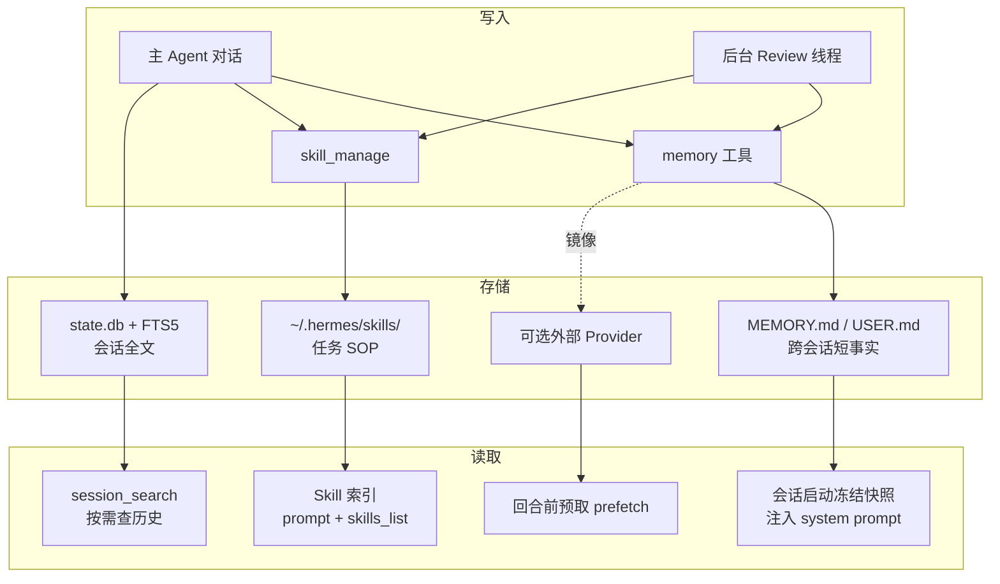
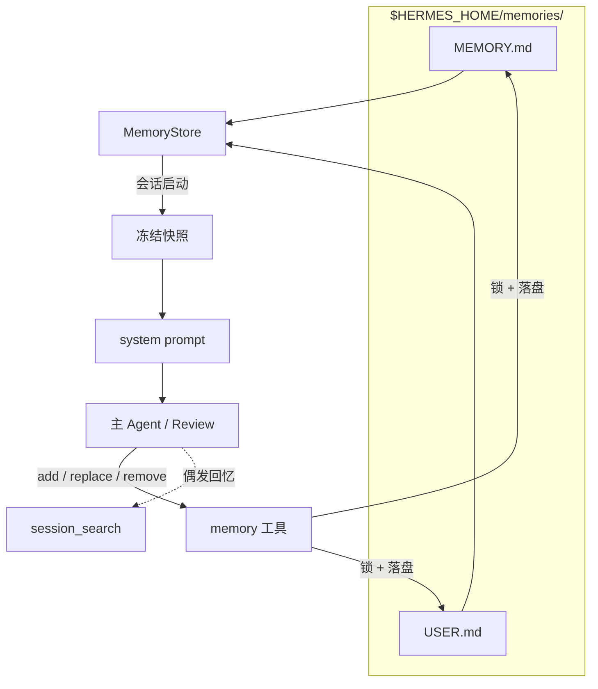
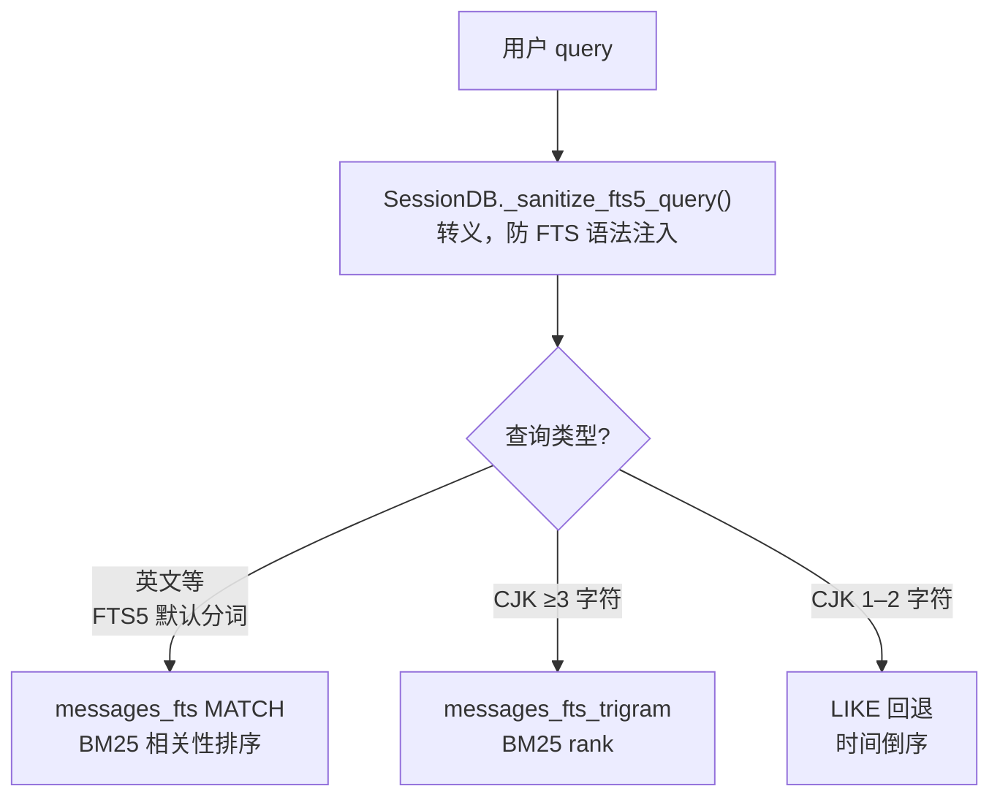
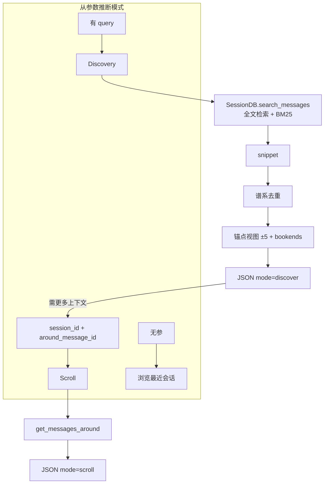
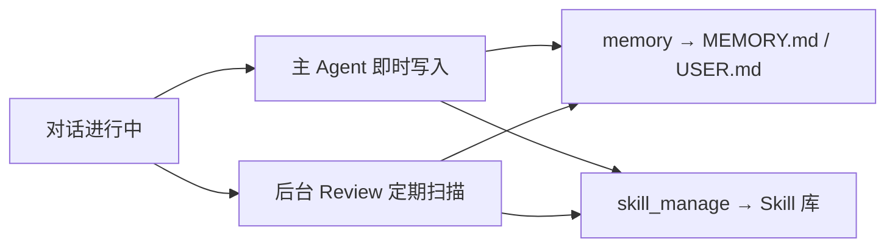

# Hermes Agent 记忆系统

> [!tip] 核心本质
> Hermes 把 [[memory|记忆]] 拆成三条并行管线：**跨会话短事实**（`MEMORY.md` / `USER.md`）、**任务怎么做**（[[skill|Skill]] 库 + `skill_manage`）、**历史会话按需回忆**（SQLite [[fts5|FTS5]] 全文检索）。写入靠主 Agent 即时调用或后台 Review 线程；精选事实靠 LLM 做条目级 `replace` 合并，Skill 库靠 Curator 做规模化归档；读取则分「会话启动整包注入」与「工具按需搜索」两路。没有这套分工，长期运行的个人 Agent 要么每轮失忆，要么把无限历史塞进窗口——前者无法积累，后者上下文与 [[prefix-cache]] 都会失控。

*检索说明：实现细节主要来自 Hermes Agent 官方文档与 `NousResearch/hermes-agent` 源码（观测 2026-06-07，v2026.5.x 量级）；GEPA 进化在独立仓库 `hermes-agent-self-evolution`。*

**怎么读这篇**：先读 [[#三层架构：存储、读取与写入总览|三层架构]] 建立全景；再按你关心的层往下跳——常驻事实看 [[#持久精选记忆（MEMORY.md / USER.md）|持久记忆]]，SOP 与库治理看 [[#程序性记忆（Skill 库）|Skill 库]]，「上周说过什么」看 [[#会话搜索（session_search）|会话搜索]]。若你要调写入行为或对照 prompt，直接看 [[#记忆如何从对话生长（提取与后台 Review）|提取与后台 Review]]。正文里的 `` `反引号` `` 表示工具名、文件名或配置键；实现处会链到 [NousResearch/hermes-agent](https://github.com/NousResearch/hermes-agent) 源文件。

## 生命周期与演进

**当前定位**：Hermes 记忆是「个人 Agent Harness」产品化方案，不是通用 Memory 框架。内置层极简（双文件 + 字符上限 + 冻结快照）；扩展层可插 Honcho / Mem0 / Supermemory 等 provider；Skill 与 Curator 构成程序性记忆的自进化闭环。只跑 Hermes 用内置即可；要 Cursor + Hermes 共享库再接跨宿主模型上下文协议（MCP）记忆服务（见 [[agentmemory]]）。

**预期寿命**：中期。事实 / 流程 / 历史 三层分工在 Agent 工程里稳定；具体阈值（2200 字符、每 10 轮 nudge）会随版本调整。

**近期演进**：Memory 提示改为后台 Review 线程（PR #2235，2026-03）；CJK 检索从 `LIKE` 全表扫升级为 trigram FTS5（PR #16651）；Curator 治理 agent-created Skill 沉积；Honcho 等 provider 插件化；`hermes-agent-self-evolution` 用 GEPA 离线进化 Skill 文本（Phase 1 已落地）。

**终极威胁**：超长上下文「全历史塞窗口」削弱会话搜索价值；云厂商托管记忆 API 降低自托管动力；快速版本迭代使本文实现细节需对照 `hermes doctor` 与官方 Memory 文档复核。

## 三层架构：存储、读取与写入总览

**三层各管一类信息，读写路径不同，写入大多经 `memory` / `skill_manage` 或后台 Review。**



**表 1：** 三层与通用 [[memory]] 对照

| Hermes 层 | 存什么 | 典型内容 | 怎么读 | 在上下文栈中的角色 |
| --- | --- | --- | --- | --- |
| **持久记忆** | `MEMORY.md`（环境/任务）、`USER.md`（用户画像） | 「本项目不用 Vercel」「偏好中文技术博客体」 | 会话启动**整包**注入 system prompt | 个体 Rules + 用户偏好 |
| **Skill 库** | `~/.hermes/skills/*/SKILL.md` 及附属文件 | 调试步骤、格式偏好、工具组合 | prompt 索引 + `skills_list` / `skill_view` | 程序性记忆 / Commands |
| **会话搜索** | `~/.hermes/state.db` 全文 | 历史对话与工具上下文 | `session_search` 按需 BM25 检索 | 外部归档，非默认全量注入 |

Honcho、Mem0 等**外部 Provider** 叠在上述三层旁（预取 / 同步 / 镜像），不替换内置文件与 FTS。机制见 [[#外部 Memory Provider：叠加层|外部 Provider]]。

**读写怎么串起来**：对话进行中，主 Agent 或后台 Review 把稳定事实写入 `memory`、把流程经验写入 `skill_manage`；每条消息同时落进 `state.db` 供日后搜索。新会话启动时，`MEMORY.md` / `USER.md` 拍成**冻结快照**注入前缀；Skill 靠索引发现；偶发「上周怎么做的」才调 `session_search`。

## 持久精选记忆（MEMORY.md / USER.md）

### 2.1 设计意图：有界精选，而非无限归档

通用 Agent 记忆常走两条极端：完全不持久化，或把全量历史 / embedding 索引当记忆。前者每会话失忆，后者 context 膨胀、检索还有漏网。

Hermes 取中间路线——只保留**每轮都应生效的极少声明性事实**，并用**字符上限**硬性限总量（与 tokenizer 解耦，system prompt 开销可预期）：

- `USER.md`：用户画像与沟通偏好
- `MEMORY.md`：环境与任务稳定事实

触顶时**不会**自动摘要，须由 Agent 或后台 Review 用 `replace` 合并条目，或用 `remove` 腾位。历史会话不应无差别升格为常驻记忆；偶发回溯走 [[#会话搜索（session_search）|会话搜索]]。

### 2.2 冻结快照（Frozen Snapshot）与双态一致

Hermes 刻意维护两套状态：

1. **冻结快照**（`_system_prompt_snapshot`）：`load_from_disk()` 时拍下磁盘上两文件的全文，**整段会话不变**，用于 system prompt 注入——同一前缀可复用 KV，保护 [[prefix-cache]]。
2. **活状态**（`memory_entries` / `user_entries`）：`memory` 工具每次写入立即落盘，工具返回值反映最新列表。

因此会出现：**本会话刚写入的记忆，下一条用户消息在 system prompt 里还看不见，但 `memory` 工具返回已是新列表**。这是设计行为；新快照要到 `/new` 或下次启动才进入 system prompt。若需即时生效，只能读工具返回值，或走外部 provider 的 prefetch。

加载时对每条 entry 做威胁模式扫描（`scope=strict`）：命中者在快照中替换为 `[BLOCKED: …]`，活状态保留原文供用户 `remove`——防止恶意内容经记忆链污染 system prompt。

### 2.3 文件格式、MemoryStore 与 memory 工具

源文件：[tools/memory_tool.py](https://github.com/NousResearch/hermes-agent/blob/main/tools/memory_tool.py)

两文件落在 `$HERMES_HOME/memories/`（默认 `~/.hermes/memories/`，按 `profile` 隔离）：

- 纯文本 Markdown，可手改、可 Git diff
- 条目以 `\n§\n` 分隔（section sign `§`）
- 字符上限：`MEMORY.md` 2200（约 8–15 条）、`USER.md` 1375（约 5–10 条）；触顶则 `add` / `replace` 拒绝

`MemoryStore` 负责解析、校验与落盘：每次写入前从磁盘重载，并用 `fcntl` 文件锁避免多会话或手改文件时静默覆盖。

**图 2：** 持久记忆读写路径



`memory` 工具只有 `add`、`replace`、`remove`（读靠 system prompt 注入；部分版本另有 `read` 供排障）：

| 操作 | 做什么 | 说明 |
| --- | --- | --- |
| `add` | 追加一条 | 精确重复会拒绝；近似义不去重 |
| `replace` | 用 `old_text` 子串匹配唯一条目后整段替换 | LLM 驱动的条目级合并（consolidate） |
| `remove` | 子串匹配删除 | 遗忘或纠错 |

**并发与漂移（drift）**：落盘以**磁盘文件为权威**。每次写入前：加文件锁 → 从磁盘重载 → 校验能否按 `§` 规则完整往返 parse。若失败（手改破坏分隔符、另一会话刚写入等），**拒绝本次写入**并留 `.bak.<ts>` 备份，避免用过期内存状态覆盖文件（[issue #26045](https://github.com/NousResearch/hermes-agent/issues/26045)）。按错误信息从 `.bak` 恢复或修好格式后重试。

每次 `add` / `replace` 落盘前，还会检查新条目里有没有**危险句式**：例如「忽略上文指令、按下面做」这类**提示词注入**（injection），或诱导 Agent **往外带密钥、私聊内容**的写法（exfil）。记忆文件走**自己的**一套规则；Curator 整理 Skill、或 Skill 编辑时的安全检查是**另一套**，互不替代。

内置层是短条目列表 + LLM 手工 `replace` 合并，没有 embedding 聚类、置信度图或自动真值消解。

### 2.4 为何持久层用全文注入，而非 RAG / 向量检索

| 收益 | 代价（有意接受） |
| --- | --- |
| 精选事实整包注入，不依赖 query 改写或相似度阈值，**零漏偏好** | 无语义检索；近似义条目靠 Review `replace` 合并 |
| 字符上限固定 token；冻结快照保护 [[prefix-cache]] | 触顶须手工合并，无后台自动摘要 |
| 纯本地 Markdown，可审计、可 Git diff | 无 embedding API；无自动 dedup |

**与会话搜索的分工**：持久层管「应永远在 context 里的关键事实」；历史偶发回忆走 FTS5（见 [[#会话搜索（session_search）|会话搜索]]）；语义用户建模走外部 Provider（见 [[#外部 Memory Provider：叠加层|外部 Provider]]）。

## 程序性记忆（Skill 库）

Skill 记的是**怎么做一类任务**——调试步骤、格式偏好、工具组合。会话里的经验经 `skill_manage` 沉积；库 idle 时由 Curator 做跨 Skill 合并与归档；高频关键 Skill 还可走 GEPA 离线进化。

### 3.1 skill_manage：程序性记忆的写入 API

源文件：[tools/skill_manager_tool.py](https://github.com/NousResearch/hermes-agent/blob/main/tools/skill_manager_tool.py)

| 动作 | 用途 | 说明 |
| --- | --- | --- |
| `create` | 新建 `SKILL.md` | 后台 Review 创建时标 `created_by=agent` |
| `patch` | `old_string` → `new_string` 局部替换 | **首选**更新路径，省 token |
| `edit` | 整文件替换 | 结构大改时用 |
| `write_file` | 写 `references/`、`scripts/`、`templates/` | 细节外置，SKILL.md 只留指针 |
| `delete` / `remove_file` | 删除 | Curator 更常用 archive |

典型触发：复杂任务成功（5+ tool calls）、踩坑后找到正路、用户纠正流程、发现非平凡工作流。谁在何时调用，见 [[#记忆如何从对话生长（提取与后台 Review）|提取与后台 Review]]。

### 3.2 Curator：Skill 库的规模化合并与剪枝

源文件：[agent/curator.py](https://github.com/NousResearch/hermes-agent/blob/main/agent/curator.py)、CLI：[hermes_cli/curator.py](https://github.com/NousResearch/hermes-agent/blob/main/hermes_cli/curator.py)

自进化会不断 `create` Skill，导致近重复与目录膨胀。`hermes curator` 分两阶段：

**阶段 A — 确定性生命周期（无模型）**

- 跟踪 view / use / patch 与最后使用时间
- 状态机：`active` →（30 天未用）`stale` →（90 天未用）`archived` 至 `~/.hermes/skills/.archive/`
- 默认只处理 agent-created Skill；`hermes curator pin <name>` 硬保护；`restore` 可恢复

**阶段 B — 辅助模型 Review**（`max_iterations=8`）

- 空闲时用便宜 aux 模型 fork 短 Agent
- 任务：按名称前缀把相近 Skill 归成大类、修正过时内容、归档冗余条目；**须处理完整 Skill 包**（`references/` 等），禁止只抄 SKILL.md
- `hermes curator run --dry-run` 只出报告不改动

Curator 在工具约束下由 LLM 做库级合并（patch + 归档），不走 RRF 或向量自动并条。

#### 3.2.1 Curator 融合 Prompt 契约

常量 `CURATOR_REVIEW_PROMPT`：[agent/curator.py#L357-L493](https://github.com/NousResearch/hermes-agent/blob/main/agent/curator.py#L357-L493)。定位是 **按大类归并**——把数百个「一会话一 bug」的零碎 Skill 收成按任务类别整理、容易发现的 Skill 库。（Hermes 源码 prompt 里把这种总括 Skill 叫 *umbrella*，本文统一称 **大类 Skill**。）

**硬规则摘要**：

| 规则 | 含义 |
| --- | --- |
| 不碰 bundled / hub-installed | 候选列表已过滤为 agent-created |
| 不 delete | 最大破坏动作是 `mv` 到 `.archive/` |
| `pinned=yes` 完全跳过 | |
| 按内容判 overlap，不看 `use_count=0` | |
| 合并须处理 support 文件与相对链接 | 禁止只 flatten SKILL.md |

**三种合并模式**：并入已有大类 Skill（patch 正文 + 归档被合并的兄弟 Skill）→ 新建一个大类 Skill → 降级为附属参考文件后归档。结构化输出含 `consolidations` / `prunings` YAML，供下游 tooling 解析。

与后台 Review 的分工：Review 在会话内 patch/create；发现两 Skill 重叠只 note，**库级 merge 交给 Curator**。

### 3.3 GEPA 离线进化（独立仓库）

运行时 Curator 做库治理；[hermes-agent-self-evolution](https://github.com/NousResearch/hermes-agent-self-evolution) 用 DSPy + GEPA 对单个 `SKILL.md` **离线**进化：评测集跑轨迹 → 根据失败反思变异 prompt → 过约束门后提 PR。适合高频关键 Skill 的可度量提升；日常沉积与纠错仍靠在线 `patch`。

## 会话搜索（session_search）

内置持久记忆只承载跨会话短事实；「上周我们怎么做的」走**按需检索**。`session_search` 刻意不做默认 LLM 摘要或 embedding——Agent 应拿到历史消息原文自行归纳。

源文件：[tools/session_search_tool.py](https://github.com/NousResearch/hermes-agent/blob/main/tools/session_search_tool.py)。存储：`~/.hermes/state.db`（SQLite WAL），`messages` + FTS5 虚表 `messages_fts` 与 `messages_fts_trigram`。详见 [[fts5]]。

### 4.1 双索引与查询路由

`session_search` 搜的是 `messages` 里的历史对话。一种切词方式没法同时照顾好英文和中文，所以 Hermes 在**同一份消息**上维护**两张** FTS5 虚表——**双索引**：

| 索引表 | 切词方式 | 擅长 |
| --- | --- | --- |
| `messages_fts` | FTS5 默认（unicode61） | 英文等按词切分的文本 |
| `messages_fts_trigram` | 连续三字一切（trigram） | 中文等无空格文本的子串匹配 |

调用搜索时不必手动指定用哪张表；`SessionDB.search_messages()` 会根据 query 形态**自动分流**——**查询路由**。下图是分流规则（`LIKE` 是索引不够用时的兜底，一般不单独算作「第三套索引」）：



CJK ≥3 字符路径见 [PR #16651](https://github.com/NousResearch/hermes-agent/pull/16651)，替代早期 CJK 查询的 `LIKE` 全表扫。

**CJK** 是 **C**hinese（中文）、**J**apanese（日文）、**K**orean（韩文）的缩写；检索语境里泛指**不靠空格分词**的书写文本（主要是中文）。英文可按词切分后直接走 FTS5；中文若用默认分词，整句常被当成少量大块 token，搜「检索」未必能命中「会话检索」，所以 Hermes 对 **≥3 个汉字的查询**走 trigram（按连续三字切分）索引；**只有 1–2 个字**时 trigram 区分度不够，只能退化为 `LIKE` 模糊匹配并按时间排序。

语义回忆走外部 Provider（如 Honcho `honcho_search`）或主模型读后推理，而非本工具向量路。

### 4.2 Discovery 与 Scroll：先搜后展开

`session_search` 是**一个工具、三种用法**。没有单独的 `mode` 开关；Hermes 根据**传了什么参数**自动选行为——**从参数推断模式**：

| 传参 | 模式 | 在解决什么问题 |
| --- | --- | --- |
| `query` | **Discovery** | 不记得在哪次聊天说过，**按关键词跨会话搜索** |
| `session_id` + `around_message_id` | **Scroll** | 已定位到某条消息，**把前后几句对话摊开读** |
| 无 | **浏览** | 先看看**最近聊过什么** |

典型流程是 **Discovery → Scroll**：先「大海捞针」，再围绕锚点「翻页读上下文」。


**Discovery：跨会话搜索。** Agent 传入 `query`（如「部署 Vercel」）时，系统在所有历史会话里做全文检索（见 [[#4.1 双索引与查询路由|4.1]]），默认返回约 3 个相关会话。每条结果含：命中摘录（`snippet`）、锚点前后各 5 条消息、会话首尾各 3 条 prose——帮 Agent 判断「是不是这次」。**零 LLM 调用**，纯检索。实现（`_discover()`）：BM25 → `snippet` → 谱系去重（跳过当前活跃 session）→ 锚点视图 + bookend → 返回 JSON `mode=discover`。

**Scroll：单会话内展开。** Discovery 结果里的 `match_message_id` 即 Scroll 的 `around_message_id`。若摘录不够，Agent 带上 `session_id` 与锚点再调一次：**不再跑 FTS**，只在该会话内取锚点前后窗口（默认 ±5，上限 20），可继续向前/向后滚。实现（`_scroll()`）：`get_messages_around()` → JSON `mode=scroll`。当前正在进行的会话不能 Scroll——那些消息已在 context。

**图 3：** Discovery / Scroll 调用链（实现细节）



检索如何按中英文分流见 [[#4.1 双索引与查询路由|4.1]]，本图只展示 Discovery / Scroll 主链路。

**表 2：** Discovery 单条结果主要字段

| 字段 | 含义 |
| --- | --- |
| `snippet` | 命中摘录，Agent 判断相关性的第一眼 |
| `match_message_id` | Scroll 时的 `around_message_id` |
| `messages` | 命中 ±5 条；锚点带 `"anchor": true` |
| `bookend_start` / `bookend_end` | 会话首/末 3 条 prose，帮助理解全貌 |

可选 `source_filter`、`sort=newest|oldest`（仅 Discovery FTS 路径）。默认过滤 tool 类第三方集成会话的噪声。

### 4.3 与持久记忆的分工

持久记忆管**极少、无需查询即生效**的关键事实；会话搜索管**偶发、需关键词定位**的历史。全盘 promote 到 `MEMORY.md` 会触顶；只靠搜索则缺默认在 context 里的偏好。语义用户建模见 [[#外部 Memory Provider：叠加层|外部 Provider]]。

## 记忆如何从对话生长（提取与后台 Review）

聊天记录写进 `state.db` 后，**不会自动**变成 `MEMORY.md` 里的常驻事实，也不会自动变成 Skill 库里的 SOP。Hermes 要有人（Agent）**主动识别信号并写入**，路径有两条：

| 路径 | 什么时候写 | 谁写 |
| --- | --- | --- |
| **主 Agent 即时** | 用户说「记住」，或任务进行中识别到稳定事实 / 流程经验 | 主对话循环 |
| **后台 Review** | 默认每 10 个用户轮扫描一次对话快照（PR #2235 后独立线程，不拖慢主回复） | `background_review.py` 派生的子 Agent |

两条路径最终都调同一套工具：**稳定事实** → `memory`（必要时 `replace` 合并条目）；**这类任务怎么做** → `skill_manage`（优先 `patch` 已有大类 Skill）。Review 是在**只读对话快照**上跑一轮短 Agent，白名单只有 `memory` 与 `skill_manage`，**不**先产出 JSON 候选包再入库——这是产品内嵌的即时沉淀路线，而非 Wiki/RAG 式的「候选断言 → 实体对齐 → 冲突消解」流水线（后者见 [[knowledge-extraction]]、[[knowledge-fusion]]）。



细节见 [[#5.1 何时触发写入|5.1]]（触发条件）、[[#5.2 后台 Review 怎么工作|5.2]]（线程机制）、[[#5.3 后台 Review Prompt 契约|5.3]]（写入规则）。

### 5.1 何时触发写入

| 路径 | 触发条件 | 执行者 | 工具 |
| --- | --- | --- | --- |
| **主 Agent 即时** | 用户说「记住」、任务中识别稳定事实 | 主循环 | `memory`（及必要时 `skill_manage`） |
| **Memory / Skill 提示 → Review** | 默认每 10 个用户轮（`memory.nudge_interval`）；用过 `memory` 会重置计数；Skill 提示可合并为 combined | `background_review.py` 派生线程 | 仅 `memory` + `skill_manage`（≤5 迭代） |
| **外部 provider** | 每回合结束 sync；部分在 session end 批量提取 | Provider 队列 | `honcho_*` / `mem0_*` 等 |

2026-03 前，Memory 提示拼在用户消息末尾，主 Agent 有时先调 `memory` 再干活（PR #2235）。现改为：主回复交付后再 `spawn_background_review_thread`，对话快照只读，零额外延迟，不污染 transcript。

### 5.2 后台 Review 怎么工作

源文件：[agent/background_review.py](https://github.com/NousResearch/hermes-agent/blob/main/agent/background_review.py)

主 Agent 把回复交给用户之后，若本轮满足 Memory / Skill nudge 条件，`run_agent.py` 会 **`spawn_background_review_thread`**：在**独立守护线程**里 fork 一个短生命周期的子 Agent，专门扫一遍「刚才聊了什么、有没有值得沉淀的」。用户无感知、主 transcript 不变、主回复也不被拖慢。


**子 Agent 从父 Agent「继承」什么、又刻意「隔离」什么**

| 继承（与主会话共享） | 隔离（Review 专用约束） |
| --- | --- |
| 同一 model、provider、auth | `quiet_mode=True`：不往 CLI 打日志，用户看不见 Review 过程 |
| 已缓存的 system prompt（利于 [[prefix-cache]] 前缀复用） | `skip_context_files=True`：不再加载工作区 `AGENTS.md` 等上下文文件 |
| 父 Agent 的 `MemoryStore` 活状态（`memory` 写入立即落盘） | 禁用子 Agent 自己的 nudge：Review 里不能再 spawn Review，防递归 |
| | `skip_memory=True`：**不**初始化外部 memory provider（Honcho / Mem0 等） |

**`skip_memory=True` 容易误解，值得单独说清**：Review fork **不会**连上 Honcho、Mem0 等外部插件，避免 Review 的 harness 元提示经 `prefetch` / `sync` 泄漏进用户的第三方记忆库（[PR #27190](https://github.com/NousResearch/hermes-agent/commit/973f27e95631aaecbda5e32e3fa9e5d7f6a2e1d3)）。但内置 `MEMORY.md` / `USER.md` 的 **`MemoryStore` 会从父 Agent 重新绑定**，所以 Review 调 `memory(action="add")` 仍会正常写本地文件——只是**不写外部 provider**。

**工具白名单**：子 Agent 运行时若调用 memory / skill 以外的工具，直接拒绝。Review 的任务是「从对话里提取并写入」，不是再跑一轮/bash/搜网页。

**Prompt 怎么喂**：fork 后的 `user_message` = **只读对话快照** + **Review 专用指令**（Memory / Skill / Combined 三选一，见 [[#5.3 后台 Review Prompt 契约|5.3]]）。子 Agent 在快照后面读规则、扫信号、调工具；**不会**把 Review 指令或工具调用写回主会话 transcript。

**失败与边界**：Review 线程内异常全部捕获，**不能**拖垮主会话；无值得保存的内容时 prompt 要求回复 `Nothing to save.` 并停止，避免空转。

### 5.3 后台 Review Prompt 契约

三条 prompt 常量定义在 [agent/background_review.py](https://github.com/NousResearch/hermes-agent/blob/main/agent/background_review.py)（`_MEMORY_REVIEW_PROMPT` / `_SKILL_REVIEW_PROMPT` / `_COMBINED_REVIEW_PROMPT`）。fork 子 Agent 收到的是：**上文只读对话快照** + **下述指令之一**（观测 2026-06-07）。

| 触发 | 选用 prompt | 允许调用的工具 |
| --- | --- | --- |
| 仅 Memory nudge | `_MEMORY_REVIEW_PROMPT` | `memory` |
| 仅 Skill nudge | `_SKILL_REVIEW_PROMPT` | `skill_manage` |
| 两者同轮 | `_COMBINED_REVIEW_PROMPT` | 上两者 |

#### 5.3.1 Memory Review：声明性事实

**Prompt 原文（节选）**

```text
Review the conversation above and consider saving to memory if appropriate.

Focus on:
1. Has the user revealed things about themselves — their persona, desires, preferences, or personal details worth remembering?
2. Has the user expressed expectations about how you should behave, their work style, or ways they want you to operate?

If something stands out, save it using the memory tool. If nothing is worth saving, just say 'Nothing to save.' and stop.
```

**逻辑怎么读**

| Prompt 在问什么 | 设计意图 |
| --- | --- |
| 用户画像、欲望、偏好、个人细节 | 写入 `USER.md` 类信息——「这个人是谁、怎么沟通」 |
| 对 Agent 行为/工作方式的期望 | 若偏运营状态则进 `MEMORY.md`；若偏「做某类任务的方式」应走 Skill（见 5.3.2 分流） |
| 有信号才 `memory`，否则 `Nothing to save.` | **保守写入**：Memory Review 默认可以什么都不做，和 Skill Review 的「Be ACTIVE」形成对比 |

**Prompt 没写、但工具层有的规则**：`memory` 工具支持 `target=user|memory`，分别落 `USER.md` / `MEMORY.md`；当前 Review prompt 仍泛称「memory tool」，未显式教模型分流。[PR #30220](https://github.com/NousResearch/hermes-agent/pull/30220) 计划把路由与「一事实一库、禁止跨库重复」写进 prompt。触顶时工具层要求用 `replace` 合并条目。

**已知风险**：Review fork 共享父 Agent 活状态，但 prompt 未必注入当前条目列表，存在基于旧认知覆盖的可能（[issue #9055](https://github.com/NousResearch/hermes-agent/issues/9055)）。

#### 5.3.2 Skill Review：程序性经验

Skill Review prompt 比 Memory 长一个数量级——它是 Hermes **经验提取的主契约**。下面按「目标形态 → 何时动 → 怎么动 → 边界」拆原文。

**① 库形态与行动偏置**

```text
Be ACTIVE — most sessions produce at least one skill update, even if small. A pass that does nothing is a missed learning opportunity, not a neutral outcome.

Target shape of the library: CLASS-LEVEL skills, each with a rich SKILL.md and a `references/` directory … Not a long flat list of narrow one-session-one-skill entries.
```

**逻辑**：先定「库应该长什么样」（大类 Skill + 附属文件），再要求**大多数会话至少 patch 一次**——空跑被视为漏学，不是中性结果。社区 [issue #27645](https://github.com/NousResearch/hermes-agent/issues/27645) 讨论是否改回信号驱动。

**② 什么算「有信号」**

```text
Signals to look for (any one of these warrants action):
• User corrected your style, tone, format … 'stop doing X' … are FIRST-CLASS skill signals, not just memory signals.
• User corrected your workflow, approach, or sequence of steps.
• Non-trivial technique, fix, workaround, debugging path … emerged.
• A skill that got loaded … turned out to be wrong, missing a step, or outdated. Patch it NOW.
```

**逻辑**：用户抱怨语气/格式/步骤，或会话里踩坑找到正路、或已加载 Skill 过时——**任一即 warrant action**。尤其把「别啰嗦、别这样排版」标成 **Skill 信号而非 Memory 信号**，避免偏好只进 `USER.md` 却不在任务 SOP 里生效。

**③ 四步优先级（有信号时择最早可行）**

```text
1. UPDATE A CURRENTLY-LOADED SKILL … PATCH that one first.
2. UPDATE AN EXISTING UMBRELLA (via skills_list + skill_view).
3. ADD A SUPPORT FILE … `references/` / `templates/` / `scripts/` … pointer in SKILL.md.
4. CREATE A NEW CLASS-LEVEL UMBRELLA … name MUST NOT be a PR number, error string … session artifact.
```

**逻辑**：尽量**改已有**而非**新建**——先本会话在用的，再库里有的大类 Skill，再只加 support 文件，最后才 `create`。第 4 步命名约束防止「fix-pr-1234-today」类一次性 Skill 污染库。

**④ Memory vs Skill 硬性分流**

```text
Memory captures 'who the user is and what the current situation and state of your operations are'; skills capture 'how to do this class of task for this user'. When they complain about how you handled a task, the skill that governs that task needs to carry the lesson.
```

**逻辑**：用户画像/运营状态 → `memory`；「这类任务今后怎么做（含嵌入的偏好）」→ **patch 对应 Skill**。例：「你总是先解释再答」必须写进相关任务类 Skill，不能只 `memory`。

**⑤ 保护边界与禁止捕获**

```text
Protected skills (DO NOT edit these): Bundled … Hub-installed …

Do NOT capture: Environment-dependent failures … Negative claims about tools ('browser tools do not work') … Session-specific transient errors … One-off task narratives.

If a tool failed because of setup state, capture the FIX … never 'this tool does not work' as a standalone constraint.
```

**逻辑**：bundled / Hub Skill 不可 edit（pinned 可 patch 内容，Curator 才不能 archive）。**环境缺依赖、工具偶发失败、一次性任务**不应固化成 Skill——否则会 months 后仍自我引用过时约束。setup 类问题只 capture **FIX**（安装命令、配置步骤），不 capture「某工具永远不可用」。

**⑥ 重叠 Skill 的处理**

```text
If you notice two existing skills that overlap, note it in your reply — the background curator handles consolidation at scale.
```

**逻辑**：Review 只 **note**，库级 merge 交给 [[#3.2 Curator：Skill 库的规模化合并与剪枝|Curator]]。

#### 5.3.3 Combined Review：同轮双维扫描

Memory nudge 与 Skill nudge 同轮触发时用 `_COMBINED_REVIEW_PROMPT`——本质是 Memory 段 + 压缩版 Skill 段拼在一起。

**Prompt 原文（节选）**

```text
Review the conversation above and update two things:

**Memory**: who the user is. Did the user reveal persona, desires, preferences … Save facts about the user and durable preferences with the memory tool.

**Skills**: how to do this class of task. Be ACTIVE — most sessions produce at least one skill update.

… [Skill 四步 ladder 与保护边界，同 5.3.2 压缩版] …

Act on whichever of the two dimensions has real signal. If genuinely nothing stands out on either, say 'Nothing to save.' and stop — but don't reach for that conclusion as a default.
```

**逻辑怎么读**

| 维度 | 问什么 | 默认倾向 |
| --- | --- | --- |
| Memory | 用户是谁、有何 durable 偏好 | 有信号才写；无则跳过 |
| Skills | 这类任务今后怎么做 | Be ACTIVE；Skill 段仍倾向至少一次更新 |
| 收尾 | 两维 genuinely 都没有才 `Nothing to save.` | **勿把 null 当默认**——Combined 比纯 Memory 更 push Skill 侧行动 |

完整 prompt 原文见 [background_review.py#L34-L235](https://github.com/NousResearch/hermes-agent/blob/main/agent/background_review.py#L34-L235)。

## 外部 Memory Provider：叠加层

内置三层始终存在；外部 Provider 在其旁叠加，不替换 `MEMORY.md`、Skill 库与会话 FTS。

### 6.1 统一接入模型

`memory.provider` 可切换 Honcho、Mem0、Supermemory、RetainDB 等（`plugins/memory/`）。统一四步：**回合前 prefetch**、**回合后 sync**、内置 `memory` 写入可镜像到外部、注入 provider 专用工具。

### 6.2 代表路线：Honcho 与 Mem0

[[honcho]]（观测 2026-06-07）走重推理：消息入队后异步做演绎 / 归纳 / 溯因 / 合并巩固，维护 peer card 与 session summary；Hermes 侧双层注入——base context（summary + representation + card）+ dialectic supplement（LLM 合成）。工具含 `honcho_search`、`honcho_reasoning`、`honcho_conclude` 等。专文见 [[honcho]]。

Mem0 走托管式事实提取 + 语义检索 + rerank + 自动 dedup，工具较薄（`mem0_search`、`mem0_profile`、`mem0_conclude`）。

### 6.3 recallMode 与 Review 隔离

`recallMode`：`hybrid`（自动注入 + 工具）、`context`（只注入）、`tools`（只工具）——控制外部 Provider 与内置冻结快照如何分配 context 预算。

后台 Review 不碰外部 Provider（`skip_memory=True`），避免 Review 元提示污染第三方用户模型。

## 实践与调优

### 7.1 配置项速查

| 配置 | 默认 | 作用 |
| --- | --- | --- |
| `memory.memory_enabled` / `user_profile_enabled` | 依 setup | 开关双层内置记忆 |
| `memory.nudge_interval` | `10` | 多少用户轮触发 memory review |
| `memory.memory_char_limit` / `user_char_limit` | 2200 / 1375 | 文件字符上限 |
| `memory.provider` | 空（仅内置） | 外部记忆插件 |
| `curator.enabled` | true | 后台 Skill 维护 |
| `curator.prune_builtins` | true | 是否 archive 长期未用 bundled skill |

### 7.2 运维命令

```bash
hermes memory setup          # 选择内置或外部 provider
hermes curator run --dry-run # 预览 Skill 合并/归档
hermes curator pin my-skill  # 禁止 Curator 动该 Skill
hermes curator restore foo   # 从 .archive 恢复
```

会话内：`/new` 刷新冻结快照与 Memory 提示计数；`/compress` 分裂会话谱系但历史仍可通过 FTS 查到。

### 7.3 常见坑

| 现象 | 原因 | 对策 |
| --- | --- | --- |
| 刚写入记忆，回复仍「不知道」 | 冻结快照本会话不变 | `/new` 或下一会话；或读 tool 返回 |
| `add` 报超限 | 字符上限，无自动 merge | `replace` 合并或 `remove` 过时事实 |
| memory 写入被拒 drift | 手动改乱 `§` 格式 | 按错误信息恢复 `.bak`，逐条 `add` |
| Skill 爆炸、发现变慢 | 只 create 不 maintain | 开 Curator；`pin`；周期性 `curator run` |
| 中文搜不到旧会话 | 查询太短 | 至少 3 个汉字；或换英文关键词 |
| 内置与 git 文档冲突 | memory 学到过时约定 | 权威以 git 为准；`remove` 过时 entry |

### 7.4 选型：内置 vs AgentMemory vs 外部 Provider

| 需求 | 建议 |
| --- | --- |
| 仅 Hermes、要极简可控 | 内置 `MEMORY.md` / `USER.md` + 会话搜索 |
| 跨 Cursor/Hermes 共享 | [[agentmemory]] MCP |
| 要语义用户建模 + 矛盾推理 | Honcho provider |
| 要托管式事实提取 + 向量搜 | Mem0 provider |
| 要可度量改 Skill 文案 | `hermes-agent-self-evolution` GEPA |

## 进一步阅读

### 库内关联

- [[hermes-agent]] — Hermes 全貌与本文定位
- [[memory]]、[[skill]] — 通用记忆三分法与程序性 SOP
- [[fts5]]、[[bm25]] — 会话搜索底层索引与排序
- [[knowledge-fusion]]、[[knowledge-extraction]] — Wiki/RAG 流水线的通用融合与提取抽象
- [[agentmemory]]、[[honcho]]、[[skill-loading-library]] — 跨宿主 MCP、外部 provider 与 Skill 发现机制

### 官方文档

- [Persistent Memory](https://hermes-agent.nousresearch.com/docs/user-guide/features/memory)
- [Memory Providers](https://hermes-agent.nousresearch.com/docs/user-guide/features/memory-providers)
- [Sessions / session_search](https://hermes-agent.nousresearch.com/docs/user-guide/sessions)
- [Skills / skill_manage](https://hermes-agent.nousresearch.com/docs/user-guide/features/skills)
- [Curator](https://hermes-agent.nousresearch.com/docs/user-guide/features/curator)
- [Session Storage（开发者）](https://hermes-agent.nousresearch.com/docs/developer-guide/session-storage)

### 源码与 Prompt 原文

- [background_review.py#L34-L235](https://github.com/NousResearch/hermes-agent/blob/main/agent/background_review.py#L34-L235) — Review 三常量
- [curator.py#L357-L493](https://github.com/NousResearch/hermes-agent/blob/main/agent/curator.py#L357-L493) — Curator 融合
- [hermes_state.py#L2214-L3180](https://github.com/NousResearch/hermes-agent/blob/main/hermes_state.py#L2214-L3180) — `search_messages` / `get_anchored_view`
- [memory_tool.py](https://github.com/NousResearch/hermes-agent/blob/main/tools/memory_tool.py)、[skill_manager_tool.py](https://github.com/NousResearch/hermes-agent/blob/main/tools/skill_manager_tool.py)、[session_search_tool.py](https://github.com/NousResearch/hermes-agent/blob/main/tools/session_search_tool.py)
- [PR #2235](https://github.com/NousResearch/hermes-agent/pull/2235) 后台 Review、[PR #30220](https://github.com/NousResearch/hermes-agent/pull/30220) Review 路由、[PR #16651](https://github.com/NousResearch/hermes-agent/pull/16651) CJK trigram FTS5

### 外部参考

- [hermes-agent-self-evolution](https://github.com/NousResearch/hermes-agent-self-evolution) — GEPA 离线 Skill 进化
- [Honcho Reasoning](https://docs.honcho.dev/v3/documentation/core-concepts/reasoning) — Honcho 推理管线
