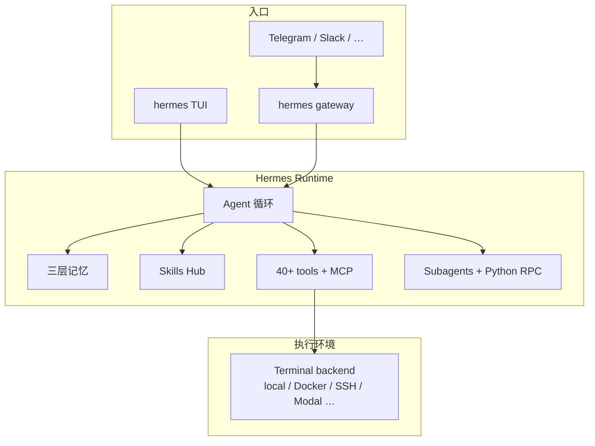

# Hermes Agent

> [!tip] 核心本质
> Hermes Agent 是 [Nous Research](https://nousresearch.com) 开源的**自进化 Agent 运行时**：终端 TUI + 可选 Messaging Gateway，把模型、40+ 工具、三层记忆、Skill 与 cron 自动化串成可长期运行的个人 Agent。若没有这类宿主，你只能绑在单一 IDE 或单次 chat API 上——无跨会话记忆、无 CLI 脚本化、也难在 Telegram 上遥控 VPS 里的任务；Hermes 把「选模型 → 调工具 → 存记忆 → 长任务子 Agent → 定时投递」收成 `hermes` 一条命令面，本仓库 POC 亦通过 `hermes chat -q … --quiet` 对接知识问答与融合流水线。

## 生命周期与演进

**当前定位**：2026 年高速迭代（GitHub [NousResearch/hermes-agent](https://github.com/NousResearch/hermes-agent)，MIT，v2026.5.x 量级）。定位不仅是「编码 copilot」，而是**可部署在 VPS / Modal / Daytona 上的持久 Agent**：支持 200+ 模型 provider（OpenRouter、Anthropic、OpenAI、本地 endpoint 等），`hermes model` 切换无需改代码。差异化卖点：**内置学习闭环**（任务后自动建 Skill、使用中改进 Skill、周期性 memory nudge、FTS5 会话检索）+ **Gateway**（Telegram / Discord / Slack / WhatsApp / Signal / Email 与 CLI 共享会话）。

**预期寿命**：中期。CLI + Gateway 形态在「个人 Agent 基础设施」层有长期需求；与 Cursor/Claude Code 重叠在编码场景，但 Hermes 偏**自托管、多模型、跨平台触达**。OpenClaw 用户可通过 `hermes claw migrate` 迁入。

**近期演进**：Nous Portal OAuth + Tool Gateway（搜索/图像/TTS/云浏览器一站式）；六种 terminal backend（local、Docker、SSH、Singularity、Modal、Daytona）；agentskills.io 标准 Skill Hub；与 [[agentmemory]] 等 MCP 记忆插件；Windows 原生 early beta。

**终极威胁**：IDE 内置 Agent 吞掉纯编码场景；云厂商托管 Agent 提供同等 Gateway 而无需自运维；产品 surface 变动快（2026 春曾数周多个 major release）， pinning 版本前需 `hermes doctor` 验收。

## 在 Agent 栈中的位置

[[agent]] 描述通用循环；Hermes 是**全功能 Harness 产品**——接近 [[harness-engineering]] 里的「搭系统让模型长期可靠干活」，且大量行为可配置（`prompts/`、toolset、personality、context files）。



| 对比 | Cursor / Claude Code | Codex CLI | Hermes |
| --- | --- | --- | --- |
| 绑定 | IDE 或厂商 CLI | OpenAI 模型 | 任意 OpenAI-compatible provider |
| 部署 | 本机 IDE | 本机 CLI | 本机 / VPS / serverless backend |
| 触达 | 编辑器内 | 终端 | 终端 + 消息平台 Gateway |
| 记忆 | 产品内置 / Rules | 会话为主 |  durable memory + session search + Skill |
| 学习闭环 | 弱 | 弱 | 自动建 Skill、GEPA 式改进（官方叙事） |
| 脚本化 | 有限 | `codex` 非交互 | `hermes chat -q … --quiet` |

**Agent Zero**（[[agent-zero]]）是 Docker 内**整台 Linux 桌面**工作台；Hermes 是**轻量命令行界面（CLI）/ 网关（Gateway）**，终端 backend 可 Docker 但不强制图形界面（GUI）。编码日常优先 Hermes/Cursor；GUI/Blender/Annotate 浏览器选 Agent Zero。

Hermes **内置**三层记忆（见下节）。**AgentMemory** 是跨宿主模型上下文协议（MCP）记忆服务，Hermes 有 first-party 插件可接。只跑 Hermes 生态用内置即可；要 Cursor + Hermes 共享记忆库再接 AgentMemory MCP（见 [[agentmemory]]）。

## 核心机制

### 三层记忆

官方实践分层（观测 2026-05）：

| 层 | 存什么 | 何时用 |
| --- | --- | --- |
| **Durable memory** | 稳定事实、偏好、项目约定（如「本项目不用 Vercel deploy」） | 应长期影响行为 |
| **Skills** | 可复用 SOP：命令、验证步骤、坑点（[[skill]] 程序性记忆） | 任务匹配 description 时 Activation |
| **Session search** | 过去对话与工作的 [[fts5\|FTS5]] 检索 + LLM 摘要 | 用户提「上次我们怎么做的」 |

Memory 存易变个体事实，Skill 存稳定流程——对应上下文栈中的记忆层与程序性规程（见 [[memory]]、[[agent-context-stack]]）。Hermes 把两者都产品化，并加 **Honcho dialectic user modeling**（用户画像随会话加深）。实现细节（提取、融合、全文检索（FTS5）、Curator）见 [[hermes-agent-memory]]。

### Skill：Discovery 与 Activation

Hermes 在发现阶段（Discovery）与激活阶段（Activation）上的典型行为如下（宿主对照表见 [[skill-loading-library]]）：

| 维度 | Hermes 行为 |
| --- | --- |
| Discovery | 机制 ①+③：启动 **prompt 内嵌索引** + 工具 **`skills_list`** |
| Activation | **`skill_view`**、slash **`/skill-name`** |
| 常见 listing 失败 | Hub Skill **未 install**；**`plugin:skill`** 命名空间；**frontmatter toolset** 过滤 |

**分发 ≠ 运行时**：`npx skills add` 装到磁盘后，仍可能因未 install / 过滤而不出现在 listing——发布 Skill 需在 Hermes 上实测 Discovery + Activation。

Skills 兼容 [agentskills.io](https://agentskills.io) 开放标准，与 Claude Code、Cursor、Codex 的 `SKILL.md` 可移植；Hermes 还会在复杂任务后**自动创建 Skill** 并在使用中自我改进（官方「closed learning loop」）。

### 工具、MCP 与 Terminal Backend

- **40+ 内置工具** + **toolset** 配置（`hermes tools`）：web search、browser、vision、TTS、代码执行等。
- **[[tool-mcp]]**：可挂载任意 MCP server 扩展能力（见官方 MCP Integration 文档）。
- **Terminal backend**（六种）：本地 shell、Docker、SSH 远程、Singularity、Modal、Daytona——后两者支持 idle 休眠、按需唤醒，适合低成本 VPS/serverless。

安全相关：`hermes doctor`、command approval、DM pairing、容器隔离——见官方 Security 文档；生产环境勿默认全开危险 toolset。

### 子 Agent 与 Python RPC

[[multi-agent]] 的层级实现：spawn **隔离子 Agent**（独立会话与终端），并行 workstream；还可写 **Python 脚本经 RPC 调工具**，把多步 pipeline 压成「零 context 成本」的单轮——适合批处理与 [[tool-self-learning]] 式沉淀。

### Gateway 与 Cron

- **`hermes gateway`**：单进程对接 Telegram、Discord、Slack 等；与 CLI **跨平台续聊**（手机上开任务，终端接着干）。
- **Cron**：自然语言定义定时任务（日报、备份、审计），结果投递到任意已接平台。

## 典型场景

**适合**

- 要**自托管**个人 Agent，模型 provider 自由切换（含便宜本地/国产 endpoint +  frontier fallback）。
- 长运行任务 + **Telegram 遥控** VPS 上的 Hermes。
- 重视 **跨会话记忆 + 自动 Skill 沉淀** 的个人工作流。
- 脚本/CI 调用：`hermes chat -q … --quiet`（本 POC 模式）。

**不适合**

- 主要需求是 IDE 内 inline 补全与 diff 审查（Cursor 更顺手）。
- 只要 OpenAI 原生、最低延迟交互（Codex CLI 更贴）。
- 需要完整 Linux 桌面 GUI 自动化（见 [[agent-zero]]）。
- 无法接受快速版本迭代带来的 breaking change 风险。

## 实践与应用

### 安装（观测 2026-05）

```bash
# Linux / macOS / WSL2
curl -fsSL https://raw.githubusercontent.com/NousResearch/hermes-agent/main/scripts/install.sh | bash
source ~/.bashrc   # 或 ~/.zshrc
hermes             # 进入 TUI
```

安装器处理 uv、Python 3.11、依赖等；Windows 原生为 early beta，生产环境更推荐 **WSL2** 跑 Linux 安装脚本。

### 常用命令

```bash
hermes              # 交互 CLI
hermes setup        # 全量配置向导（含 OpenClaw 迁移检测）
hermes setup --portal   # Nous Portal OAuth + Tool Gateway
hermes model        # 切换 provider / 模型
hermes tools        # 启用 toolset
hermes gateway      # 消息网关（配合 gateway setup / start）
hermes doctor       # 诊断
hermes update       # 更新
hermes chat -q "你的问题" --quiet   # 非交互，供脚本/POC
```

会话内 slash（CLI 与多数消息平台共享）：`/new`、`/model`、`/skills`、`/compress`、`/usage`、`/personality` 等——详见 [CLI 文档](https://hermes-agent.nousresearch.com/docs/user-guide/cli)。

### 非交互与自动化

POC 与流水线场景：

```bash
hermes chat -q "根据以下节点内容回答：…" --quiet
```

注意 timeout（POC 默认 120s）、stderr 错误码、以及 `--quiet` 下无 tool 流式可见性——调试时先用交互 `hermes`。

### MCP 与 AgentMemory

通用 MCP 配置与其他宿主相同：在 Hermes 配置中注册 server（官方 [MCP Integration](https://hermes-agent.nousresearch.com/docs/user-guide/features/mcp)）。AgentMemory 提供 **Hermes 原生插件**路径，可与内置 memory 并存或替代——见 [[agentmemory#Claude Code / Hermes（插件路径）]]。

### Context Files 与项目约定

Hermes 支持 **context files**（含 `AGENTS.md` 等） shaping 每次对话，与 Cursor Rules / [[agent-context-stack]] 中 Rules 层类似；durable memory 存**运行中学到**的约定，二者勿重复堆同一事实。

## 坑与边界

| 问题 | 说明 | 对策 |
| --- | --- | --- |
| Skill 装了但 listing 没有 | Hub 未 install、`plugin:`、toolset 过滤 | [[skill-loading-library#Discovery 例外]]；`/skills` 验收 |
| 版本漂移 | 2026 春高频 release | 升级前 `hermes doctor`；关键 flow 写进 Skill 测试 |
| `hermes chat` 超时 | 复杂任务 > POC 120s | 调 timeout 或改交互会话 |
| 记忆与文档冲突 | durable memory 与 repo README 不一致 | 权威以 git 为准；memory 标注来源与时间 |
| Windows 路径 | 原生 beta vs WSL2 | 团队统一 WSL2 安装 |
| 安全 | 远程 Gateway + shell 工具 | command approval、隔离 backend、最小 toolset |

## 进一步阅读

- 官方：[hermes-agent.nousresearch.com/docs](https://hermes-agent.nousresearch.com/docs/)（Quickstart、Skills、Memory、MCP、Architecture）
- 本仓库：[[hermes-agent-memory]]（记忆实现深潜）、[[skill-loading-library]]、[[skill]]、[[memory]]、[[agentmemory]]、[[tool-mcp]]、[[agent]]、POC [README](../../poc/README.md)
- 对比：[[openclaw]]（多通道个人助手 + ClawHub）、[[agent-zero]]（OS 级沙箱）、[[claude-code-skill-selection]]（Claude listing 预算）
- 生态：[agentskills.io Skills Hub](https://agentskills.io)、[Nous Portal](https://portal.nousresearch.com)
