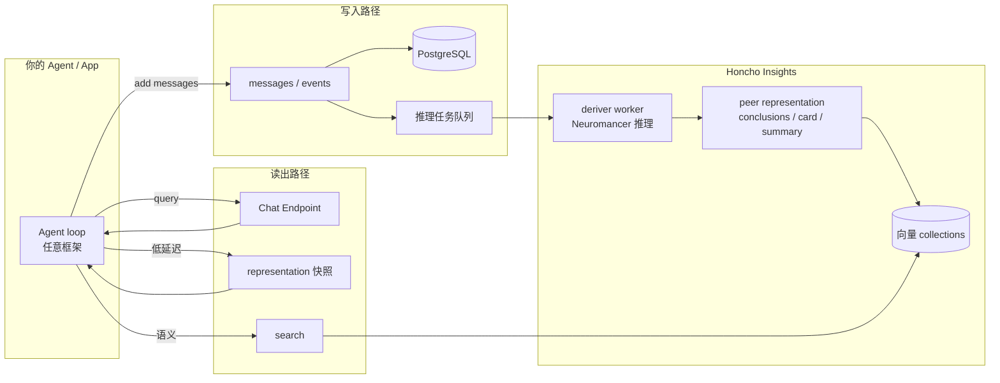
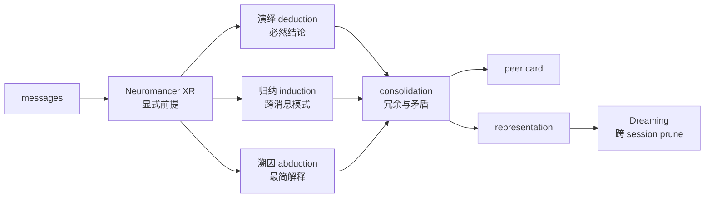

# Honcho

> [!tip] 核心本质
> Honcho（[Plastic Labs](https://plasticlabs.ai)，[honcho.dev](https://honcho.dev)）是面向有状态 Agent 的**推理优先记忆基础设施**：写入消息与事件后，后台用形式逻辑与定制推理模型（Neuromancer 系列）异步提炼结论、维护 peer 表征（representation），再经 Chat / Representation / Search 等接口注入任意 LLM——**不是**把历史对话当 chunk 做向量 RAG。若没有这层，跨会话「用户是谁、在乎什么、前后矛盾怎么 reconcile」只能交给主模型当场读全量 transcript；Honcho 把 [[memory]] 里的 External Memory 收成 **workspace → peer → session → message** 数据模型 + 持续推理管线，换更高 token 效率与可查询的用户建模。

*（观测日期 2026-06-08；基于官方 v3 文档与 GitHub README。）*

适合已理解 [[memory]] 范式、要在「托管事实提取」与「深度用户建模」之间做选型的读者；读完 [[#在记忆栈中的位置|§1]] 与 [[#典型场景与选型|§5]] 即可决策是否与 [[mem0]] / [[agentmemory]] 并列接入。机制深潜见 [[#数据模型与系统架构|§2]]、[[#推理管线：从消息到表征|§3]]。

## 生命周期与演进

**当前定位**：2026 年活跃开源（GitHub [plastic-labs/honcho](https://github.com/plastic-labs/honcho)，约 4.9k stars，AGPL-3.0）+ 托管 API（[api.honcho.dev](https://api.honcho.dev)）。v3 将系统拆为 **Storage**（同步 CRUD）与 **Insights**（异步推理队列 + deriver worker）。社区基准营销称 LongMemEval-S、LoCoMo、BEAM 等榜单前列且 context 占用偏低——第三方综述见延伸阅读，需独立复现。

**预期寿命**：中期。「Agent 需要跨会话记住人」的需求长期存在；具体推理模型、API 面与 benchmark 叙事会继续变（v2→v3 已是一次架构重整）。

**近期演进**：多 peer 视角（A 对 B 的认知）、Dreaming 跨会话巩固、Chat Endpoint 自然语言查记忆、Hermes / OpenClaw / MCP 等宿主集成文档扩容；Neuromancer 在演绎/归纳/溯因与 consolidation 上持续迭代。

**终极威胁**：宿主内置足够好的用户记忆 + 百万级 context 使「单会话读完一切」够用；或市场收敛到更轻的 [[mem0]] 式 add/search 而「重推理记忆」只留垂直场景；AGPL 自托管与商业托管的许可边界也可能限制部分企业采用。

## 在记忆栈中的位置

Honcho 实现**应用侧外部记忆（External Memory）**（写入/检索/遗忘范式见 [[memory]]）。检索增强生成（RAG）面向静态知识库相似度召回；Honcho 面向**随时间演化的实体（peer）**并主动推理潜在结论（latent conclusions）（见 [[rag]]）。

**图 1：** Honcho 写路径同步落库、读路径可走 Chat（LLM 合成）或 representation 快照（低延迟）。

| 对比 | Honcho | [[mem0]] | [[agentmemory]] | [[memgpt]] |
| --- | --- | --- | --- | --- |
| 核心叙事 | 推理优先、peer 表征 | add/search 托管提取 | Hook 捕获 + 混合检索 | OS 式分页 + Runtime |
| 写入触发 | API 批量 messages | `add` pipeline | Pre/PostToolUse 等 | Agent 自编辑 memory tools |
| 后台处理 | 演绎/归纳/溯因 + Dreaming | V3 ADD-only + entity link | 压缩 + 图谱巩固 | archival 分页 |
| 读出 | representation / Chat / search | hybrid semantic+BM25 | SessionStart ~2k token 注入 | recall 进 working context |
| 多 peer / 群聊 | 一等公民（peer 统一建模） | user_id / agent_id 隔离 | AGENT_ID scope | 单 Agent 为主 |
| 集成 | REST、MCP、Hermes provider | SDK/MCP/20+ 框架 | MCP + 多宿主 Hook | 跑在 Letta 内 |
| 许可 | AGPL-3.0（自托管） | Apache-2.0 OSS | Apache-2.0 | 视组件而定 |

Honcho 偏**情节记忆 + 个体化用户模型**（偏好、矛盾调和后的结论）；稳定 SOP 仍应进 [[skill]]，静态文档进 [[rag]]（见 [[agent-context-stack]]）。

## 数据模型与系统架构

本节说明四个存储原语如何支撑「peer 中心」设计，以及 Storage / Insights 如何分工。

### 2.1 四原语

| 原语 | 作用 | 典型用法 |
| --- | --- | --- |
| Workspace | 顶层隔离（dev/staging/prod 或不同产品） | 多租户、配置级联默认值 |
| Peer | 任意持续变化实体（用户、Agent、项目、观念） | 跨 session 累积 representation |
| Session | 一次交互线程的时间边界 | 群聊、子任务、工具 trace 会话 |
| Message | 触发推理的数据单元 | 对话轮次、事件、文档片段、tool 输出 |

用户与 Agent 都建模为 peer——多 Agent 协作、群聊、sub-agent 时各自更新自身表征，并可配置 multi-peer perspective（peer A 对 peer B 的结论）。

### 2.2 Storage 与 Insights

- **Storage 服务**：同步 API——创建 workspace/peer/session、批量写入 message（单次最多 100 条）、元数据 JSONB。消息立即写入 PostgreSQL。
- **Insights 服务**：异步——deriver worker 消费按 session 排序的队列，保证同一 peer 表征更新的时序一致；产出写入内部 collections 并向量索引，供 search 与 representation 读取。

配置从 workspace 级联到 peer、session（推理深度、是否 `observe_me`、perspective 开关等），可自带 LLM provider（OpenAI、Anthropic 等）。

### 2.3 读出产物

| 产物 | 延迟特征 | 用途 |
| --- | --- | --- |
| Conclusions | 经推理提炼 | 演绎/归纳/溯因结论，可 API 列举 |
| Representation | 低延迟静态快照 | 直接拼进 system prompt |
| Peer card | 紧凑身份摘要 | 冷启动人设 |
| Session summary / context | 会话级压缩 | 长对话 token 控制 |
| Chat Endpoint | 需 LLM 一轮 | 自然语言问「这人预算敏感吗」 |

## 推理管线：从消息到表征

Honcho 的差异点在「记忆 = 持续学习」而非「记忆 = 索引」。官方将推理分为显式抽取与三类逻辑扩展，并由 Dreaming 做跨会话巩固。

### 3.1 逻辑分层

**图 2：** 简化推理链；实际 worker 内步骤更多，且与 session 队列串行。

- 显式（explicit）：消息里直接陈述的事实，作为前提。
- 演绎：由前提必然推出的结论（例：「素食」+「坚果过敏」→ 饮食限制）。
- 归纳：跨多条消息的模式（例：多次提 deadline、少提爱好 → 时间压力大）。
- 溯因：对行为的 plausible 解释（未明说但最简假设）。
- consolidation：合并冗余、调和矛盾——新信息与旧结论冲突时更新而非无限堆积。
- Dreaming：后台持续任务，跨 session / peer 修剪与合成，即使用户不再发新消息也可提高表征保真度。

`observe_me: false` 可关闭对某 peer 的推理（只存不 derive），用于纯日志或合规场景。

### 3.2 异步与一致性

写入 API 不等待推理完成；session 级队列保证同一 peer 的推理任务按时间顺序处理，避免乱序结论。检索侧可用「尚未完成推理」的较旧 snapshot——集成方应接受最终一致性，或在关键回合前轮询 representation 版本 / 使用 Chat 确认。

## 部署与集成

### 4.1 托管 vs 自托管

| 形态 | 适合 | 注意 |
| --- | --- | --- |
| Managed API | 快速验证、免运维 | [api.honcho.dev](https://api.honcho.dev) + API key |
| Self-hosted | 数据主权、内网 | Docker 起 FastAPI + Postgres + worker；AGPL-3.0 义务 |
| SDK | 应用内嵌 | Python / TypeScript 客户端（见官方 quickstart） |

### 4.2 典型集成四步

官方 README 归纳：**Ingest → Reason（后台）→ Query → Inject**。

1. 把用户/Agent 发言、tool trace 写入 session messages。
2. 后台自动更新 peer representation（无需应用轮询）。
3. 回合前调用 `representation`（低延迟）或 `chat`（复杂问句）或 `search`。
4. 将返回文本并入 system / developer message，再调主模型。

### 4.3 宿主与 Hermes

- **MCP / Claude Code / OpenClaw** 等：官方集成文档与社区插件持续增加。
- **Hermes**：`memory.provider` 可选 Honcho 插件（见 [[hermes-agent-memory#6.2 代表路线：Honcho 与 Mem0|§6.2]]）——prefetch 注入 base context（summary + representation + card）+ dialectic supplement；工具含 `honcho_search`、`honcho_reasoning`、`honcho_conclude` 等。Hermes 默认关闭外部 provider，内置 `MEMORY.md` 仍保留。

## 典型场景与选型

### 5.1 适合

- 需要**跨会话用户画像**且愿为推理延迟/成本付账（后台 token 由 Honcho 承担，非主对话逐字计费）。
- **多 peer**（用户 + 多个 Agent、群聊、sub-agent）需分别维护表征与视角。
- 要在矛盾信息上**主动 reconcile**（预算、偏好变更），而非堆叠矛盾 memory 条目。
- 长程对话评测类场景，且关注 benchmark 上「少 context 高准确」叙事（需自测验证）。

### 5.2 不适合

- 只要「30 秒接好 add/search」→ [[mem0]] 更轻。
- 编码 Agent **零配置 Hook 捕获**全仓库观察 → [[agentmemory]]、[[memx]]。
- 纯静态文档 QA → [[rag]] 即可。
- 强 AGPL 规避或不愿运行 Postgres + worker 集群 → 评估托管或换许可更宽松的方案。
- 要求**同步强一致**「写完立刻可检索到最新结论」→ 需额外等待策略或接受 snapshot 滞后。

### 5.3 与 Mem0 的快速对照

| 维度 | 选 Honcho | 选 Mem0 |
| --- | --- | --- |
| 抽象 | peer 表征 + 逻辑结论 | 扁平 memory 条目 + hybrid 检索 |
| 推理 | 内置重管线 + Dreaming | V3 ADD-only 提取 + entity link |
| 运维 | 自托管组件较多 | Library/Server 相对轻 |
| 多 Agent 建模 | peer 原生 | filters 隔离 |

## 实践要点与边界

### 6.1 观测到的工程习惯

- 长会话用 **session summary** 控 token，跨会话靠 **peer representation**，勿每次拉全量 messages。
- 低延迟路径优先 `GET representation`；复杂过滤问句用 Chat Endpoint。
- Workspace 级默认推理深度，对高敏 peer 关闭 `observe_me` 或降级 perspective。
- 自托管监控 deriver 队列深度与推理失败重试，避免表征长期落后。
- Honcho 记「谁、偏好、历史结论」；流程 SOP 不进 Honcho（程序性规程见 [[skill]]）。

### 6.2 坑与诚实边界

| 问题 | 说明 |
| --- | --- |
| 最终一致性 | 写入后推理异步完成前，representation 可能略旧 |
| AGPL | 自托管修改分发需遵守 AGPL；商业条款见 Plastic Labs |
| 基准营销 | LongMem/LoCoMo 高分来自官方/第三方博文，生产域需自有 eval |
| 非 Runtime | 不提供 shell/browser；只管理记忆与上下文 |
| 与 RAG 混淆 | Honcho 不替代文档库；结构化知识库仍用 [[rag]] |
| 成本模型 | 主对话省 token，但后台推理有独立算力；托管定价随产品变 |

## 进一步阅读

### 库内关联

- [[memory]] — External Memory 范式与操作链
- [[mem0]] — 更轻的 add/search 对照
- [[agentmemory]] — 编码 Agent Hook + MCP 路线
- [[hermes-agent-memory]] — Hermes 内置记忆与 Honcho provider 接入
- [[rag]] — 静态知识检索分工
- [[knowledge-fusion]] — 矛盾调和的通用框架（与 consolidation 概念相邻）

### 官方文档

- [Overview](https://honcho.dev/docs/v3/documentation/introduction/overview) — 四原语与定位
- [Architecture](https://honcho.dev/docs/v3/documentation/core-concepts/architecture) — Storage / Insights 数据流
- [Reasoning](https://honcho.dev/docs/v3/documentation/core-concepts/reasoning) — Neuromancer 与逻辑分层
- [Peer Representations](https://honcho.dev/docs/v3/documentation/core-concepts/representation) — conclusions、observe_me、perspective
- [Chat Endpoint](https://honcho.dev/docs/v3/documentation/features/chat) — 自然语言查询记忆
- [GitHub README](https://github.com/plastic-labs/honcho) — 快速开始与自托管

### 外部参考

- [Honcho review (andrew.ooo, 2026)](https://andrew.ooo/posts/honcho-plastic-labs-agent-memory-review/) — 基准数字与 Mem0 对照叙事
- [Hermes Memory Providers](https://hermes-agent.nousresearch.com/docs/user-guide/features/memory-providers) — Honcho 在 Hermes 中的 prefetch / 工具面
