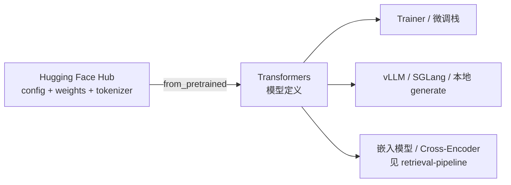

---
tags:
  - framework
  - huggingface
  - inference
  - training
aliases:
  - Transformers
  - Hugging Face Transformers
  - HF Transformers
  - transformers 库
prerequisites:
  - "[[llm]]"
  - "[[tokenization]]"
related:
  - "[[transformer]]"
  - "[[embedding]]"
  - "[[llm]]"
  - "[[retrieval-pipeline]]"
  - "[[structured-json-output]]"
stability: long
layer: application
updated: 2026-06-14
---

# Hugging Face Transformers

> [!tip] 核心本质
> Transformers 是 Hugging Face 维护的**模型定义框架**：用统一的配置（Config）、模型（Model）与预处理器（Preprocessor）描述文本、视觉、音频与多模态网络，并通过 Hugging Face Hub 上的 `from_pretrained` 一键加载权重。若没有这层「定义共识」，Hub 上百万级 checkpoint 无法被训练框架、推理引擎与 RAG 管线复用——每个仓库都要自带一套加载与 forward 代码。

适合已理解 [[llm]] 与 [[tokenization]]、要在**本地推理、微调或 RAG 嵌入**里加载开源权重的读者。读完 [[#2 核心对象与 Hub 加载|§2]] 会用 Auto 类；[[#3 两条使用路径|§3]] 帮你在 Pipeline 与手写 forward 间选型；与 [[transformer]] 分工：本文讲**库与 Hub**，不讲注意力数学。

*检索说明：定位与 API 对照 [Transformers 文档](https://huggingface.co/docs/transformers/en/index)、[Loading models](https://huggingface.co/docs/transformers/main/models)、[Auto classes](https://huggingface.co/docs/transformers/model_doc/auto)、[GitHub README](https://github.com/huggingface/transformers/blob/main/README.md)（观测 2026-06-14）。*

## 生命周期与演进

**当前定位**：开源 ML 生态的「模型定义枢纽」。官方表述为：一旦架构在 Transformers 中实现，多数训练框架（Axolotl、DeepSpeed、FSDP 等）与推理引擎（vLLM、SGLang、TGI 等）可复用同一套 config/权重格式；Hub 上标注 `library=transformers` 的 checkpoint 超过 **100 万**（以 Hub 统计为准，随时间增长）。

**预期寿命**：长期。新架构会持续以 PR 形式进入库；但「Config + PretrainedModel + from_pretrained」模式已是事实标准。

**近期演进**：多模态与视觉语言模型（VLM）类增多；`generate` 支持流式与多种解码策略；与 `torch.compile`、FlashAttention 等在 Trainer 侧集成；大模型加载默认走 Accelerate 的 **device_map** 分片。

**终极威胁**：若主流权重永久封闭在专有 API、且 Hub 不再托管可下载定义，Transformers 的枢纽地位会削弱；短期内开源权重与本地 Agent/RAG 仍强依赖此栈。

## 1 问题从哪来

Hub 上的 checkpoint 本质是「权重文件 + 配置 JSON」。仅有文件不够：你还需知道**层怎么堆、词表怎么编、forward 输入输出张量长什么样**。

早期每个模型仓库自带一份 PyTorch 脚本，接口互不兼容——换模型就要换加载代码。Transformers 把「架构定义」收进库内统一实现，Hub 只存 `config.json`、权重（常见 **Safetensors**）与 tokenizer 文件；本地用同一套 API 加载不同模型 ID。

这与 [[transformer]] 一文的关系：后者解释**为什么**用 Self-Attention；本文解释**怎样**在工程里实例化某一版 GPT/Llama/Qwen 并跑起来。

## 2 核心对象与 Hub 加载

每个架构在库中通常对应三类对象（官方称「三个主类」）：

**表 1 — 三类核心对象**

| 对象 | 典型类 | 作用 |
| --- | --- | --- |
| Config | `LlamaConfig`、`AutoConfig` | 超参、层数、词表大小等；**不含**权重 |
| Model | `LlamaForCausalLM`、`AutoModelForCausalLM` | 网络结构与 forward；`from_pretrained` 灌权重 |
| Preprocessor | `AutoTokenizer`、 `AutoProcessor` | 文本 tokenize 或多模态预处理 |

**Auto 类**根据 Hub 上的 `config.json` 里 `model_type` 自动选具体架构，避免手写「这是 Llama 还是 Qwen」：

```python
from transformers import AutoTokenizer, AutoModelForCausalLM

model_id = "meta-llama/Llama-3.2-1B-Instruct"
tokenizer = AutoTokenizer.from_pretrained(model_id)
model = AutoModelForCausalLM.from_pretrained(
    model_id,
    device_map="auto",   # 大模型：Accelerate 分片到 GPU/CPU
    dtype="auto",        # 按 config 或硬件选 float16/bfloat16
)
```

`from_pretrained` 可从 Hub 模型 ID 或本地目录加载；首次运行会下载到缓存（环境变量 `HF_HOME` / `TRANSFORMERS_CACHE`）。

**图 1 — Transformers 在开源栈中的位置**



## 3 两条使用路径

### 3.1 Pipeline：任务级快速推理

[`pipeline`](https://huggingface.co/docs/transformers/main_classes/pipelines) 把 tokenizer、模型与后处理封成一条 API，适合原型与批处理任务（分类、NER、摘要、**text-generation** 等）：

```python
from transformers import pipeline

gen = pipeline("text-generation", model="distilbert/distilgpt2", max_new_tokens=32)
print(gen("Hello, ")[0]["generated_text"])
```

Pipeline 自动选 `AutoModelFor*` 任务头；换 `model=` 即可换 checkpoint，适合「先跑通再优化」。

### 3.2 AutoModel + generate：可控生成

要控 KV cache、logits 处理器、批量张量或自定义循环时，用手写路径：

```python
inputs = tokenizer("Explain RAG in one sentence.", return_tensors="pt").to(model.device)
out = model.generate(**inputs, max_new_tokens=64, do_sample=True, temperature=0.7)
print(tokenizer.decode(out[0], skip_special_tokens=True))
```

因果语言模型（Causal LM）用 `AutoModelForCausalLM`；编码器式嵌入（如 BERT 类）用 `AutoModel`；序列分类等用 `AutoModelForSequenceClassification`——任务与 `AutoModelFor*` 的映射见官方 [Auto 文档](https://huggingface.co/docs/transformers/model_doc/auto)。

## 4 训练、推理与相邻库

Transformers 不只推理：

| 组件 | 用途 |
| --- | --- |
| **Trainer** | 微调入口：混合精度、`torch.compile`、分布式、FlashAttention 等（见 [Trainer](https://huggingface.co/docs/transformers/main_classes/trainer)） |
| **generate** | 解码策略、流式输出、停止条件 |
| **Accelerate** | 大模型 `device_map="auto"`、meta device 惰性加载 |
| **Tokenizers** | Rust 实现的 Fast tokenizer，与 `AutoTokenizer` 配合 |
| **Safetensors** | 权重存储格式，加载更安全、更快 |
| **Datasets** | 常与 Trainer 联用（本文不展开） |

生产**高吞吐 LLM 服务**时，往往仍用 Transformers 加载或导出权重，再交给 **vLLM / SGLang** 等引擎做连续批处理——引擎复用 Transformers 的模型定义或从 Hub 转换。本地 **RAG 嵌入**见 [[retrieval-pipeline]] 与 [[embedding]]；Bi-Encoder 常通过 `sentence-transformers`（构建于 Transformers 之上）或直接用 `AutoModel`。

## 5 实践要点

### 5.1 选型：Pipeline 还是 AutoModel

| 场景 | 建议 |
| --- | --- |
| 快速验证 Hub 模型、标准 NLP 任务 | Pipeline |
| Agent 循环、自定义 logits、训练 loop | AutoModel + Trainer / 自写 loop |
| 线上 QPS、长上下文批推理 | Transformers 加载 → 导出或交给 vLLM 等 |

### 5.2 大模型与内存

- `device_map="auto"`：按 GPU/CPU 内存自动切层（依赖 Accelerate）。
- 量化（bitsandbytes、GPTQ 等）常在 examples 或相邻库中，需查具体模型 card。
- 仅推理时可 `model.eval()` 并 `torch.inference_mode()`。

### 5.3 trust_remote_code 与自定义架构

Hub 上部分模型含**自定义 modeling 代码**。`from_pretrained(..., trust_remote_code=True)` 会执行仓库内 Python 定义——只应对**可信来源**开启；否则应等待架构合入官方 Transformers 版本。

### 5.4 与 Agent / RAG 的衔接

- **本地 LLM Agent**：`AutoModelForCausalLM` + 框架侧 [[function-calling]] / [[tool-use]]（Transformers 本身不提供 Agent Runtime）。
- **检索**：嵌入模型、Cross-Encoder 重排多用 Transformers 或 sentence-transformers 加载；索引算法见 [[ann]]、[[recall-at-k]]。
- **结构化输出**：解码约束与 API 层 [[structured-json-output]] 正交；Transformers 负责 forward，格式约束在生成参数或下游框架。

## 6 常见误区

- **Transformers ≠ Hugging Face 全家桶**：Hub、Datasets、PEFT、Diffusers（扩散模型）是相邻项目；文本 LLM 核心在本库。
- **Transformers ≠ [[transformer]] 架构**：一个是 Python 库，一个是神经网络结构。
- **Pipeline 不适合所有生产路径**：高定制推理通常要脱离 Pipeline 以控性能与缓存。
- **忽略 tokenizer 与 chat template**：Instruct 模型需 `apply_chat_template` 才能正确拼对话格式，否则效果骤降。
- **盲目 trust_remote_code**：等同远程代码执行，仅用于可信 repo。

## 要点收束

- Transformers = 统一 **Config / Model / Preprocessor** + Hub **`from_pretrained`**，是开源权重的模型定义层。
- **Auto 类**按 config 选架构；**Pipeline** 快、**AutoModel + generate** 可控。
- 训练用 **Trainer**，大模型用 **device_map**；高 QPS 常再交给 vLLM 等推理引擎。
- 与 [[transformer]]（原理）、[[embedding]]（向量）、[[retrieval-pipeline]]（RAG 用法）分工阅读。

## 进一步阅读

### 库内关联

- [[transformer]] — Self-Attention 与 Decoder-only 原理
- [[tokenization]] — 分词与 BPE 概念
- [[embedding]] — 向量表示与 Bi-Encoder
- [[retrieval-pipeline]] — 嵌入模型在检索链中的位置
- [[llm]] — 大语言模型能力边界

### 外部参考

- [Transformers 文档](https://huggingface.co/docs/transformers/en/index) — 总览、Pipeline、Trainer、generate
- [Loading models](https://huggingface.co/docs/transformers/main/models) — `from_pretrained`、device_map、自定义模型
- [Auto classes](https://huggingface.co/docs/transformers/model_doc/auto) — 任务与 `AutoModelFor*` 映射
- [GitHub：huggingface/transformers](https://github.com/huggingface/transformers) — 源码与发布说明
- [Hugging Face Hub 模型](https://huggingface.co/models?library=transformers&sort=trending) — 浏览 checkpoint
