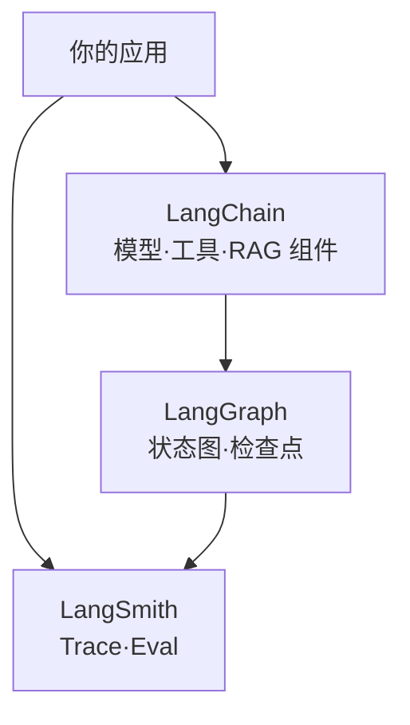

---
tags:
  - framework
  - orchestration
  - langchain
aliases:
  - LangChain
  - langchain
prerequisites:
  - "[[agent]]"
  - "[[rag]]"
related:
  - "[[langgraph]]"
  - "[[agent]]"
  - "[[workflow]]"
  - "[[reAct]]"
  - "[[harness-engineering]]"
  - "[[rag]]"
  - "[[retrieval-pipeline]]"
  - "[[function-calling]]"
  - "[[tool-mcp]]"
stability: mid
layer: application
updated: 2026-06-14
---

# LangChain

> [!tip] 核心本质
> **LangChain** 是面向大语言模型应用的**开源组合框架**（[langchain-ai/langchain](https://github.com/langchain-ai/langchain)）：用统一接口把**模型、工具、检索器、向量库**等可互换组件串成链路与 Agent，降低换模型商、接数据源、做 [[rag]] 原型的成本。它不是 [[agent]] 的同义词——只是众多 **Runtime / Harness** 实现之一；复杂有状态编排由同生态的 [[langgraph]] 承担，可观测与评测由 **LangSmith**（商业平台，框架无关）承担。若把「Agent = LangChain」写进架构，会忽略手写循环、Claude Code、OpenAI Agents SDK 等同等路径，并在需要检查点、人机中断时选错层。

适合已读 [[agent]]、[[rag]]，要在 **LangChain / LangGraph / LangSmith** 之间分工、或判断「是否值得引入框架抽象」的读者。读完 [[#2 生态分层：组合、编排、可观测|§2]] 能画清栈内位置；[[#4 何时用 LangChain、何时上 LangGraph|§4]] 给出选型口诀。图编排细节与示例 demo 见 [[langgraph]] §5；Harness 取舍见 [[harness-engineering]]。

*检索说明：[LangChain README](https://github.com/langchain-ai/langchain)、[LangChain overview](https://docs.langchain.com/oss/python/langchain/overview)、[LangGraph overview](https://docs.langchain.com/oss/python/langgraph/overview)、[Building LangGraph](https://www.langchain.com/blog/building-langgraph)（观测 2026-06-14）。*

## 生命周期与演进

**当前定位**：LangChain 公司开源栈的**组合与集成层**（mid）。官方定位 *The agent engineering platform* 的底座：Python 包 `langchain`（及 [LangChain.js](https://github.com/langchain-ai/langchainjs)）提供 `init_chat_model`、工具绑定、检索组件与 **`create_agent`** 等 Agent 抽象；更高层还有 **Deep Agents**（规划、子 Agent、文件系统，[文档](https://docs.langchain.com/oss/python/deepagents/)）。

**预期寿命**：中期。集成广度与社区模板仍是 RAG/Agent 原型首选之一；API 与包拆分持续变（如 `langchain-classic` 承接旧 Chain）。

**近期演进**：Agent 抽象明确建在 **LangGraph** 之上（文档称 LangChain 提供 integrations + 可组合 Agent harness，LangGraph 提供 durable execution）；与 LangSmith 追踪、评测、部署产品线绑定加深；集成目录覆盖主流模型商与向量库（[Integrations](https://docs.langchain.com/oss/python/integrations/providers/overview)）。

**终极威胁**：云厂商托管 Agent + 原生 [[tool-mcp|MCP]] 使「换模型接口」变便宜，组合层价值下降；团队若只需极简 [[reAct]] 循环，框架抽象反而增排障成本（[Anthropic: Building effective agents](https://www.anthropic.com/engineering/building-effective-agents) 亦提醒勿过度框架化）。

## 1 问题语境：为什么需要组合层

早期做大模型应用的三类摩擦：

1. **模型商接口各异** — OpenAI、Anthropic、本地 vLLM 的请求/响应格式不同，换模型要改调用代码。
2. **数据与工具碎片化** — [[rag]] 要接向量库、文档加载器、[[bm25]]/稠密召回；Agent 要接 [[function-calling]] 与外部 API，每样一套 SDK。
3. **原型快、定制难** — 线性 Chain 易搭，一旦出现**循环、分支、持久状态、人审**，散落在 if/else 里难测难观测。

LangChain（2022 起）主要解决 **(1)(2) 的组合问题**；社区反馈「易上手、难定制、难上生产」推动 **LangGraph**（2024）解决 **(3) 编排**；**LangSmith**（2023–2024 GA）解决**追踪与评测**。三者是**分层互补**，不是互斥竞品。

## 2 生态分层：组合、编排、可观测

**表 1 — LangChain 公司栈（2026 官方文档口径）**

| 层 | 产品 | 解决什么 | 典型用法 |
| --- | --- | --- | --- |
| **组合 / Agent harness** | **LangChain** | 模型、工具、Retriever 统一接口；`create_agent` 拼 Agent | 快速 RAG、换模型商、标准工具绑定 |
| **编排 Runtime** | **[[langgraph\|LangGraph]]** | 有状态图、循环、检查点、人机中断、持久执行 | CRAG 降级、多步工具环、长事务恢复 |
| **可观测 / 评测** | **LangSmith** | Trace、数据集评测、生产监控；**框架无关** | `LANGSMITH_TRACING=true` + API Key |
| **高阶 Agent 模板** | **Deep Agents** | 规划、子 Agent、文件系统、上下文管理（基于 LangGraph） | 复杂任务开箱模板 |
| **遗留 API** | **langchain-classic** | 旧 Chain、community 重导出 | 维护旧代码；新项目优先主包 |



官方 [LangGraph 生态说明](https://docs.langchain.com/oss/python/langgraph/overview)：**LangGraph 可独立使用**；与 LangChain 集成时获得完整集成目录与 Agent 抽象，但并非强制绑定。

## 3 核心机制：LangChain 提供什么

### 3.1 统一模型与消息接口

现代入口包括 `init_chat_model("openai:gpt-5.5")` 等形式（[README](https://github.com/langchain-ai/langchain)），用**字符串提供商前缀**切换后端，减少换模型时的调用层改写。这与 [[llm]] 选型中「多模型商实验」直接相关。

### 3.2 可组合组件

LangChain 的价值集中在**集成目录**，而非某一种魔法 Agent：

| 组件类 | 作用 | 本库相关节点 |
| --- | --- | --- |
| **Chat / Embedding 模型** | 统一调用各厂商 API | [[llm]]、[[embedding]] |
| **Document Loader / Splitter** |  ingest 与切块 | [[rag]]、[[knowledge-extraction]] |
| **VectorStore / Retriever** | 向量检索与混合召回 | [[retrieval-pipeline]]、[[ann]] |
| **Tools** | 绑定 [[function-calling]] 可调用函数 | [[tool-use]] |
| **Agent harness** | `create_agent`：模型 + 工具 + prompt + middleware | [[agent]]、[[harness-engineering]] |

检索侧常见模式：`EnsembleRetriever` 等多路召回与 [[rrf]] 风格融合——见 [[retrieval-pipeline]] 工程表。

### 3.3 Agent：create_agent 与 LangGraph 的关系

2026 年官方文档将 LangChain 的 Agent 层描述为**可高度配置的 harness**，推荐通过 **`create_agent`** 组装模型、工具、提示与中间件；**底层编排由 LangGraph 承担**（[overview](https://docs.langchain.com/oss/python/langchain/overview)）。因此：

- **简单 Agent 循环**（工具调用直到结束）→ 往往 `create_agent` 即可；
- **显式图、并行分支、检查点、HITL** → 应直接使用 [[langgraph]] 建模（如 [[query-transformation]] 中的 CRAG Fallback）。

LangChain 团队自述：LangGraph 是对早期 LangChain Chain/Agent 的**生产向重启**——优先可控性与耐久执行，而非「五分钟 demo」（[Building LangGraph](https://www.langchain.com/blog/building-langgraph)）。

## 4 何时用 LangChain、何时上 LangGraph

**表 2 — 选型（与 [[workflow]]、手写循环对照）**

| 场景 | 更合适的层 |
| --- | --- |
| 线性 RAG：加载 → 检索 → 生成 | LangChain 组件即可；图不必上 |
| 标准工具 Agent，无复杂状态 | `create_agent` / LangChain Agent |
| 检索失败 → 改写 → 再检索 → 降级 | [[langgraph]] 状态图（见 [[query-transformation]]） |
| 长任务断点恢复、人审节点、多 Agent 子图 | [[langgraph]] + 可选 LangSmith |
| 流程完全可预先定义、少 LLM 分支 | [[workflow]] 代码控制流可能更简单 |
| 工具稳定、团队愿自维护 | 数十行 [[reAct]] 循环，见 [[agent]] |

**LangSmith**：开发与生产期建议开启 tracing（`LANGSMITH_TRACING=true`），**不依赖** LangChain——其他框架亦可接入（[LangSmith 首页](https://www.langchain.com/)）。本篇不展开 LangSmith API；待专文 `langsmith`（map 占位）。

## 5 实践要点与常见误区

### 5.1 最小示例（Python）

```python
from langchain.chat_models import init_chat_model

model = init_chat_model("openai:gpt-4o-mini")
result = model.invoke("Hello, world!")
```

RAG 与 Agent 教程见官方 [RAG tutorial](https://python.langchain.com/docs/tutorials/rag/)（URL 可能随文档站迁移至 `docs.langchain.com`）。

### 5.2 常见误区

- **Agent = LangChain**：错。[[agent]] 是架构；LangChain 是可选 Runtime（[[agent]]、[[reAct]] 已说明）。
- **所有项目都要 LangGraph**：错。简单链路上 LangGraph 增加图与检查点概念负担。
- **LangChain 已过时**：片面。旧版 Chain API 已迁 `langchain-classic`；主包聚焦 Agent harness + 集成，需按**当前文档**选型而非 2023 教程。
- **上了 LangChain 就不用管 Harness**：错。提示、工具 schema、记忆、权限仍在应用层——见 [[harness-engineering]]。
- **LangSmith 锁定 LangChain**：错。可观测层框架无关，但商业服务需评估数据出境与成本。

## 要点收束

- **LangChain** = 模型/工具/检索的**组合与集成框架**，不是 Agent 定义本身。
- 公司栈分层：**LangChain（组合）→ LangGraph（编排）→ LangSmith（观测）**；Deep Agents 为更高模板。
- **`create_agent`** 是常用 Agent 入口，复杂状态与生产耐久性应看 [[langgraph]]。
- 适合**快速 RAG、多模型商切换、丰富集成**；极简或强定制场景可手写循环。
- 与 [[agent]]、[[rag]]、[[retrieval-pipeline]] 读原理；与 [[langgraph]] 读编排；版本敏感，以官方文档为准。

## 进一步阅读

### 库内关联

- [[langgraph]] — 有状态图、检查点、CRAG 等生产编排
- [[agent]] — Agent 不等于某框架；Runtime 职责
- [[harness-engineering]] — 何时薄循环、何时上图框架
- [[rag]] / [[retrieval-pipeline]] — LangChain 在检索链中的位置
- [[query-transformation]] — LangGraph CRAG 范例
- [[function-calling]] / [[tool-mcp]] — 工具绑定与 MCP 供给层分工
- [[workflow]] — 可定义流程时与 Agent 框架的取舍

### 外部参考

- [LangChain overview（官方）](https://docs.langchain.com/oss/python/langchain/overview)
- [LangChain GitHub](https://github.com/langchain-ai/langchain)
- [LangGraph overview](https://docs.langchain.com/oss/python/langgraph/overview)
- [Integrations 目录](https://docs.langchain.com/oss/python/integrations/providers/overview)
- [Building LangGraph（官方博客）](https://www.langchain.com/blog/building-langgraph)
- [LangSmith](https://www.langchain.com/langsmith) — 追踪与评测（框架无关）
- [Deep Agents 文档](https://docs.langchain.com/oss/python/deepagents/)
