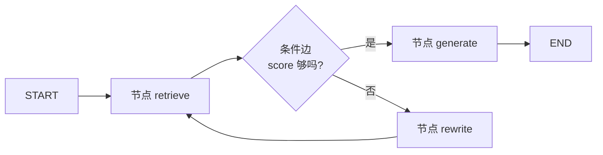

---
tags:
  - framework
  - orchestration
  - langchain
aliases:
  - LangGraph
  - lang graph
prerequisites:
  - "[[agent]]"
  - "[[langchain]]"
related:
  - "[[agent]]"
  - "[[langchain]]"
  - "[[workflow]]"
  - "[[query-transformation]]"
  - "[[crag]]"
  - "[[reAct]]"
  - "[[harness-engineering]]"
  - "[[rag]]"
  - "[[multi-agent]]"
stability: mid
layer: application
updated: 2026-06-14
---

# LangGraph

> [!tip] 核心本质
> **LangGraph**（[langchain-ai/langgraph](https://github.com/langchain-ai/langgraph)）是用**有状态图（stateful graph）**编排 Agent 与工作流的低层 **Runtime**：节点是计算步骤，边是固定或条件转移，**检查点（checkpointer）**在超步边界持久化状态，支持失败恢复、人机中断与跨回合记忆。若没有图式 Runtime，「检索失败 → 改写 → 再检索 → 降级回答」会散落在 if/else 里，难以观测、复现与版本化；LangGraph 把 [[crag]]、[[query-transformation]] 与 [[reAct]] 工具环收成可编译的图。

适合已读 [[agent]]、[[langchain]]，要在**生产编排**层理解 LangGraph **核心能力**与最小 API 的读者。读完 [[#3 核心能力一览|§3]] 能说出与组合层、[[workflow]] 的分工；[[#5 示例小 demo|§5]] 分五段独立可运行片段（线性图、条件边、检查点、人机中断、工具环）。原理层 ReAct/RAG 见 `agent/pattern/`、`agent/retrieval/`。

*检索说明：[LangGraph README](https://github.com/langchain-ai/langgraph)、[Graph API](https://docs.langchain.com/oss/python/langgraph/graph-api)、[Persistence](https://docs.langchain.com/oss/python/langgraph/persistence)、[Interrupts](https://docs.langchain.com/oss/python/langgraph/interrupts)（观测 2026-06-14）。*

## 生命周期与演进

**当前定位**：LangChain 公司栈的**编排 Runtime**（mid）；与 [[langchain]] 组合层分工——后者拼模型/工具/Retriever，LangGraph 管**循环、分支、耐久执行、HITL**。可**不依赖** LangChain 单独使用（README 明确）；与 LangSmith 追踪、Studio 可视化、Deployment 部署产品线集成。

**预期寿命**：中期。「状态机 + 检查点 + 可观测」是 Agent 工业化常见答案；具体 API 会变，图编排思路会留。

**近期演进**：`interrupt()` / `Command(resume=…)` 人机回路；Checkpointer 与 **Store** 分工（线程内状态 vs 跨线程长期记忆）；子图（subgraph）、并行扇出；LangChain `create_agent` 底层编译为 LangGraph。

**终极威胁**：云托管 Agent Runtime 内置同等能力；短链任务被更强单次推理覆盖，图仅保留长事务、人审与多 Agent 协调。

## 1 问题语境：何时需要图 Runtime

[[langchain]] 的线性 Chain 或 `create_agent` 适合**标准工具环**与快速 RAG。一旦出现：

- **条件分支** — 检索分低才改写（CRAG），工具失败才重试；
- **显式循环** — 多轮 [[reAct]] 直到 `END`；
- **耐久与恢复** — 长任务跨进程、失败后从检查点续跑；
- **人机中断** — 写库、发邮件前人工批准；

用裸 Python if/else 也能写，但状态散落、难 trace、难测「从第 N 步恢复」。LangGraph 把**控制流与状态更新**收成 `StateGraph` + `compile()`，并对接 LangSmith 逐步可视化。

## 2 与 [[langchain]]、[[workflow]]、行为模式的分工

**表 1 — 文档与职责**

| 层次 | 放哪 | 内容 |
| --- | --- | --- |
| ReAct / Planning 等**行为模式** | `agent/pattern/` | 模型该怎么想、怎么分工 |
| 查询改写、RAG **原理** | `agent/retrieval/` | 何时改写、召回策略 |
| **组合集成** | [[langchain]] | 模型、Retriever、Tool 绑定 |
| **图编排 Runtime** | 本文 | StateGraph、检查点、interrupt |
| **确定性流程** | [[workflow]] | 步骤可预先写死、少 LLM 分支 |

选型口诀：**流程可完全定义 → [[workflow]]**；**要 LLM 分支/循环/持久 → LangGraph**；**只需换模型商接向量库 → [[langchain]] 组件即可**（见 [[harness-engineering]]）。

## 3 核心能力一览

官方 [README](https://github.com/langchain-ai/langgraph) 与文档归纳的**生产向**能力如下——这是 LangGraph 相对「手写循环」的主要增量。

**表 2 — LangGraph 核心能力**

| 能力 | 含义 | 典型 API / 概念 |
| --- | --- | --- |
| **有状态图** | 共享 `State` 在节点间传递；节点返回**部分更新**并合并 | `StateGraph(State)`、`add_node` |
| **条件路由** | 按状态决定下一节点，支持循环 | `add_conditional_edges` |
| **耐久执行（durable execution）** | 超步边界写检查点；失败/重启后续跑 | `compile(checkpointer=…)`、`thread_id` |
| **人机中断（HITL）** | 运行中暂停，等人输入后 `resume` | `interrupt()`、`Command(resume=…)` |
| **记忆分层** | 线程内 checkpoint vs 跨线程 store | `InMemorySaver` / PostgresSaver；`InMemoryStore` |
| **流式与调试** | 逐步 `stream`；LangSmith 看每步状态 | `graph.stream()`、LangSmith trace |
| **子图与并行** | 多 Agent 子图、map-reduce 扇出 | `add_node` 嵌编译子图、Send API（进阶） |



上图对应 [[crag]]：先检索打分，不够再改写，避免每问都改写。

## 4 心智模型：StateGraph 怎么转

1. **定义 State** — 常用 `TypedDict`；消息列表用 `Annotated[..., add_messages]` 或子类 `MessagesState`，避免 append 覆盖 bug。
2. **注册节点** — 函数 `(state) -> partial_update`；只做一步业务（检索、调 LLM、调工具）。
3. **连边** — `add_edge` 固定转移；`add_conditional_edges` 用路由函数返回下一节点名（或 `END`）。
4. **编译** — `graph = builder.compile(checkpointer=…)`；启用 checkpointer 时 **invoke 必须带 `thread_id`**。
5. **运行** — `invoke` / `stream`；中断后用 `Command(resume=value)` 继续。

**检查点粒度**：保存在**超步（super-step）边界**，不是节点函数执行到一半——中断或重试时，**整个节点函数会重跑**；节点内副作用须考虑幂等（[Graph API](https://docs.langchain.com/oss/python/langgraph/graph-api)）。

## 5 示例小 demo

以下片段**相互独立**，便于复制到笔记本分段运行；模型/检索处用占位函数，替换为你的 [[langchain]] 组件即可。

### 5.1 最小线性图

```python
from typing import TypedDict
from langgraph.graph import StateGraph, START, END

class State(TypedDict):
    text: str

def append_exclaim(state: State) -> dict:
    return {"text": state["text"] + "!"}

builder = StateGraph(State)
builder.add_node("exclaim", append_exclaim)
builder.add_edge(START, "exclaim")
builder.add_edge("exclaim", END)

graph = builder.compile()
graph.invoke({"text": "hello"})
# => {'text': 'hello!'}
```

### 5.2 条件边：CRAG 式「先检索，不够再改写」

```python
from typing import TypedDict
from langgraph.graph import StateGraph, START, END

class RAGState(TypedDict):
    query: str
    score: float
    answer: str

def retrieve(state: RAGState) -> dict:
    # 替换为真实 retriever + grader
    return {"score": 0.4}

def rewrite(state: RAGState) -> dict:
    return {"query": state["query"] + " （改写后）"}

def generate(state: RAGState) -> dict:
    return {"answer": f"基于「{state['query']}」生成"}

def route_after_retrieve(state: RAGState) -> str:
    return "generate" if state["score"] >= 0.5 else "rewrite"

builder = StateGraph(RAGState)
builder.add_node("retrieve", retrieve)
builder.add_node("rewrite", rewrite)
builder.add_node("generate", generate)
builder.add_edge(START, "retrieve")
builder.add_conditional_edges("retrieve", route_after_retrieve)
builder.add_edge("rewrite", "retrieve")  # 改写后回到检索
builder.add_edge("generate", END)

graph = builder.compile()
graph.invoke({"query": "用户问题", "score": 0.0, "answer": ""})
```

与 [[query-transformation]] §CRAG 一致：**仅低分触发改写**，控制延迟。机制全文见 [[crag]]。

### 5.3 检查点：同一会话 thread 可续跑

```python
from typing import Annotated, TypedDict
from langgraph.graph import StateGraph, START, END
from langgraph.graph.message import add_messages
from langgraph.checkpoint.memory import InMemorySaver

class State(TypedDict):
    messages: Annotated[list, add_messages]
    turn: int

def chat_turn(state: State) -> dict:
    return {
        "messages": [{"role": "assistant", "content": f"turn {state['turn']}"}],
        "turn": state["turn"] + 1,
    }

builder = StateGraph(State)
builder.add_node("chat", chat_turn)
builder.add_edge(START, "chat")
builder.add_edge("chat", END)

checkpointer = InMemorySaver()
graph = builder.compile(checkpointer=checkpointer)

config = {"configurable": {"thread_id": "user-42"}}
graph.invoke({"messages": [], "turn": 1}, config)
graph.invoke({"messages": [], "turn": 1}, config)  # 同 thread 会加载上次 checkpoint

snapshot = graph.get_state(config)
# snapshot.values 含累积后的 messages、turn
```

生产环境将 `InMemorySaver` 换为 `PostgresSaver` 等（`langgraph-checkpoint-postgres`）；长期用户画像可用 **Store**（与 checkpointer 分工见 [Persistence](https://docs.langchain.com/oss/python/langgraph/persistence)）。

### 5.4 人机中断：批准后再继续

```python
from typing import TypedDict
from langgraph.graph import StateGraph, START, END
from langgraph.types import interrupt, Command
from langgraph.checkpoint.memory import InMemorySaver

class State(TypedDict):
  approved: bool
  result: str

def human_gate(state: State) -> dict:
    answer = interrupt("是否批准执行？")  # 首次运行在此暂停
    return {"approved": answer == "yes", "result": "已执行" if answer == "yes" else "已取消"}

builder = StateGraph(State)
builder.add_node("gate", human_gate)
builder.add_edge(START, "gate")
builder.add_edge("gate", END)

graph = builder.compile(checkpointer=InMemorySaver())
config = {"configurable": {"thread_id": "approval-1"}}

# 第一次 invoke 会在 interrupt 处结束；用 Command(resume="yes") 继续
graph.invoke({"approved": False, "result": ""}, config)
graph.invoke(Command(resume="yes"), config)
```

适合发邮件、改生产数据等**高风险工具**节点；与 [[harness-engineering]] 的人审策略一致。

### 5.5 工具环：条件边实现 [[reAct]] 式循环

```python
from typing import Literal, TypedDict
from langgraph.graph import StateGraph, START, END

class AgentState(TypedDict):
    messages: list
    step: int

def call_model(state: AgentState) -> dict:
    # 替换为 bind_tools 的 LLM；若返回 tool_calls 则进入 tools 节点
    return {"messages": state["messages"] + [{"role": "ai", "tool_call": "search"}]}

def run_tools(state: AgentState) -> dict:
    return {"messages": state["messages"] + [{"role": "tool", "content": "..."}], "step": state["step"] + 1}

def should_continue(state: AgentState) -> Literal["tools", "__end__"]:
    last = state["messages"][-1]
    if state["step"] >= 5:
        return END
    return "tools" if "tool_call" in last else END

builder = StateGraph(AgentState)
builder.add_node("agent", call_model)
builder.add_node("tools", run_tools)
builder.add_edge(START, "agent")
builder.add_conditional_edges("agent", should_continue)
builder.add_edge("tools", "agent")

graph = builder.compile()
```

生产上更常用 [[langchain]] 的 `create_agent`（底层即 LangGraph）；需要**自定义分支、并行子图或细粒度检查点**时再手写上图。

## 6 选型与常见误区

| 更适合 LangGraph | 可不用 LangGraph |
| --- | --- |
| CRAG / 多分支 RAG | 单次 retrieve → generate |
| 长任务 + 检查点恢复 | 无状态一次性调用 |
| 人审、多 Agent 子图 | 纯 [[workflow]] 代码管道 |
| 要 LangSmith 逐步 trace 的复杂图 | 极简 [[reAct]] 几十行循环 |

- **LangGraph = LangChain**：错。LangGraph 可独立；[[langchain]] 是组合层（见 [[langchain]] §2）。
- **有检查点就不用 [[memory]] 产品**：片面。Checkpointer 管**线程内图状态**；跨会话用户画像常还要 Store 或 [[mem0]] 等。
- **节点里随便写副作用**：重试会重跑整节点，须幂等。
- **任何 Agent 都要上图**：Anthropic 等建议简单任务避免过度框架化（[[harness-engineering]]）。

## 要点收束

- LangGraph = **有状态图 Runtime**：节点 + 边 + 编译；条件边表达 CRAG、工具环。
- **五大生产能力**：耐久检查点、`thread_id` 续跑、HITL `interrupt`、记忆 store、流式/可观测。
- **与 [[langchain]]**：组件在 LangChain，编排在 LangGraph；`create_agent` 是快捷路径。
- **与 [[workflow]]**：流程可写死用代码；要 LLM 动态分支用图。
- §5 五段 demo 可独立运行：线性 → CRAG 条件边 → checkpointer → interrupt → ReAct 环。

## 进一步阅读

### 库内关联

- [[langchain]] — 生态分层与何时不必上图
- [[crag]] — 检索评估与三态纠错机制
- [[query-transformation]] — 低分 Fallback 与 query 改写
- [[reAct]] — 工具环行为模式
- [[workflow]] — 确定性控制流对比
- [[harness-engineering]] — 薄循环 vs 框架、人审
- [[rag]] / [[retrieval-pipeline]] — 检索节点在图中的位置
- [[multi-agent]] — 子图与多角色协调

### 外部参考

- [LangGraph overview](https://docs.langchain.com/oss/python/langgraph/overview)
- [Graph API](https://docs.langchain.com/oss/python/langgraph/graph-api) — State、边、编译
- [Persistence](https://docs.langchain.com/oss/python/langgraph/persistence) — Checkpointer vs Store
- [Interrupts](https://docs.langchain.com/oss/python/langgraph/interrupts) — HITL 模式
- [Quickstart](https://docs.langchain.com/oss/python/langgraph/quickstart)
- [Building LangGraph（官方博客）](https://www.langchain.com/blog/building-langgraph)
- [LangGraph GitHub](https://github.com/langchain-ai/langgraph)
