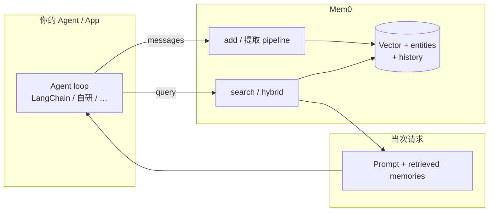

# Mem0

> [!tip] 核心本质
> Mem0（[mem0.ai](https://mem0.ai)，读作 “mem-zero”）是**可插拔的 Agent 记忆层**：对你的现有 Agent / 应用提供 `add` / `search`，把对话与 Agent 行为蒸馏成跨会话持久记忆，检索后再注入 prompt——**不替换**你的 Runtime。若没有这层，每个框架都要自建提取、向量库、去重与召回；Mem0 把 [[memory]] 的 External Memory 收成 **Library / 自托管 Server / Cloud Platform** 三种形态，2026 年 V3 算法强调 **ADD-only 单遍提取 + 实体链接 + 多信号混合检索**。

## 生命周期与演进

**当前定位**：2026 年成熟产品 + 活跃开源（GitHub [mem0ai/mem0](https://github.com/mem0ai/mem0)）。定位是 **memory infrastructure**，非 [[memgpt]] 式全栈 Runtime。官方宣称在 LoCoMo、LongMemEval、BEAM 等基准上有公开 [evaluation framework](https://github.com/mem0ai/memory-benchmarks)；2026 年 4 月 V3 算法（单遍 ADD-only、hybrid search、entity linking）取代早期 Graph Memory 路径。

**预期寿命**：中期。「记忆层 bolt-on」需求长期存在；具体算法与 SDK 面会继续变（V2→V3 已是一次 breaking 级迁移）。

**近期演进**：21+ 框架集成文档；MCP / Agent Harness 插件；Platform **Agent signup**（Agent 无邮箱 mint API key）；企业 SOC 2 / HIPAA / BYOK。

**终极威胁**：宿主内置 memory（Claude、OpenAI）+ 足够好则独立 Mem0 价值下降；[[agentmemory]] / [[memx]] 等 Hook 原生捕获在编码 Agent 场景更贴 workspace。

## 在记忆栈中的位置

[[memory]] 定义写入/检索/遗忘；Mem0 实现 **应用侧 External Memory**，与 [[rag]] 不同——RAG 面向静态知识库，Mem0 面向**运行时交互与 Agent 确认的事实**。



| 对比 | Mem0 | [[agentmemory]] | [[memx]] | [[memgpt]] |
| --- | --- | --- | --- | --- |
| 形态 | **记忆库 API** | 记忆服务 + iii | 宿主 Hook 插件 | **Agent Runtime** |
| 集成 | SDK / REST / MCP | MCP + 多宿主 Hook | Claude/Codex/OpenClaw native | Agent 跑在 Letta 内 |
| 提取 | 平台 pipeline（V3 ADD-only） | Hook 观察 + 压缩 | turn 编译 + lineage | Agent 自编辑 tools |
| 检索 | semantic + BM25 + entity | BM25+vector+graph RRF | hybrid + query compiler | recall/archival paging |
| 锁定 | 低 | 低–中 | 中（Hook 绑定） | 高 |

与 [[agent-context-stack]]：Mem0 存 **Episodic / 个体化陈述**；程序性 SOP 仍应进 [[skill]]，静态文档进 RAG。

## V3 记忆算法（观测 2026-04）

官方 [migration guide](https://docs.mem0.ai/migration/oss-v2-to-v3) 要点：

**写入（Extraction）**

- **Single-pass ADD-only**：一次 LLM 调用生成新记忆，**不** in-place UPDATE/DELETE；新事实累积，旧条目靠治理策略而非覆盖写。  
- **Agent-generated facts**：Agent 确认的操作与用户信息同等入库。  
- **Entity linking**：抽取实体（人名、组织等），嵌入并跨记忆链接，检索时 boost。

**检索（Retrieval）**

- **Multi-signal hybrid**：语义向量 + BM25 关键词 + 实体匹配，并行打分融合为 `score`。  
- 可选 `mem0ai[nlp]`（spaCy）与 **fastembed** 本地 embedding，降低对外部 API 依赖。

**Graph Memory**：V3 移除独立 Graph Memory 产品面，由 **entity linking** 替代关系 boost。

## 三种部署形态

| 形态 | 适合 | 入口 |
| --- | --- | --- |
| **Library** | 原型、嵌入现有 Python/TS 进程 | `pip install mem0ai` / npm |
| **Self-hosted Server** | 团队自建、合规、Dashboard + API Key | `docker compose`（Postgres+pgvector 等） |
| **Mem0 Platform** | 零运维生产、全功能 | [app.mem0.ai](https://app.mem0.ai) |

**Library 默认**（可 `Memory.from_config` 覆盖）：OpenAI LLM/embedder、本地 Qdrant（`/tmp/qdrant`）、SQLite history。  
**Server 默认**：Postgres + pgvector；可换 20+ vector store（见文档）。

## 集成面

- **框架**：LangChain、LangGraph、CrewAI、Vercel AI SDK、AutoGen 等（[integrations](https://docs.mem0.ai/integrations)）。  
- **MCP / Plugin**：作记忆插件接到 Cursor 类宿主（与 [[tool-mcp]] 同协议层）。  
- **多租户**：`user_id` / `agent_id` / `run_id` 与 `filters` 隔离检索（API 与 OSS 对齐）。

不改变 Agent loop：在 session 前 `search`，回合后 `add`——「drop-in」叙事。

## 典型场景

**适合**

- 已有 Agent 框架，只要 **persistent memory API**。  
- 客服/助手 **用户偏好** 跨会话。  
- 需要 **Cloud 或自托管** 选型，并要 SOC2/HIPAA 路径（Platform）。  
- 快速 A/B：Library 本地试，再上 Platform。

**不适合**

- 要 **Agent 自编辑 OS 式分页** → [[memgpt]]。  
- 要 **编码 Agent 零配置 Hook 捕获** → [[agentmemory]]、[[memx]]。  
- 纯 **静态文档问答** → [[rag]] 即可，不必 Mem0。  
- 强 **每条记忆 trace 到 source turn** 审计 → 对比 [[memx]] lineage 模型。

## 实践与应用

### Cloud（Platform）

```python
import os
from mem0 import MemoryClient

client = MemoryClient(api_key=os.getenv("MEM0_API_KEY"))

client.add(
    [{"role": "user", "content": "I am vegetarian and allergic to nuts."}],
    user_id="user_123",
)

results = client.search(
    "What dietary restrictions should recipes avoid?",
    filters={"user_id": "user_123"},
)
```

### 开源 Library（本地）

```python
from mem0 import Memory

m = Memory()  # 或 Memory.from_config(...)

m.add("I prefer pytest over unittest.", user_id="dev_alex")
hits = m.search("testing framework preference", user_id="dev_alex")
```

升级 V3：`pip install --upgrade "mem0ai[nlp]"`；从 V2 迁移见官方 migration guide。

### Agent 自助开户

Platform 提供 [agent signup](https://docs.mem0.ai/platform/agent-signup)：AI Agent 可无邮箱 mint API key（适合自动化集成，注意密钥治理）。

## 与本仓库的关系

- **范式**：补 [[memory]] 中 External Memory 的**产品化选项**；与 [[agentmemory]]、[[memx]]、[[memgpt]] 并列于 `latest/`。  
- **POC**：当前用 Hermes CLI，未接 Mem0；若集成，典型在 `POST /api/ask` 前 `search`、融合后 `add`（需定义 `user_id`/`agent_id` 与隐私边界）。  
- **论文**：Mem0 团队 [ECAI 2025](https://mem0.ai/research) 长程记忆工作；V3 技术报告见 2026 changelog。

## 坑与边界

| 问题 | 说明 |
| --- | --- |
| V2→V3 breaking | Graph Memory 移除；参数与 `filters` 约定变化 |
| ADD-only | 矛盾事实会累积；需应用层或 Platform 治理删除 |
| 默认依赖 OpenAI | Library 默认要 `OPENAI_API_KEY`；可换 embedder/LLM |
| 非 Runtime | 不提供 shell/browser；只管理记忆 |
| 与 RAG 混淆 | Mem0 记「谁说了什么」；RAG 记「文档里有什么」 |
| 基准营销 | 自研 benchmark 需独立复现；看 [memory-benchmarks](https://github.com/mem0ai/memory-benchmarks) |

## 进一步阅读

- 官方：[docs.mem0.ai](https://docs.mem0.ai)、[Quickstart](https://docs.mem0.ai/quickstart)、[Platform vs OSS](https://docs.mem0.ai/platform/overview)  
- 算法：[OSS V2→V3 migration](https://docs.mem0.ai/migration/oss-v2-to-v3)、[State of AI Agent Memory 2026](https://mem0.ai/blog/state-of-ai-agent-memory-2026)  
- 本仓库：[[memory]]、[[agentmemory]]、[[memx]]、[[memgpt]]、[[rag]]、[[tool-mcp]]
