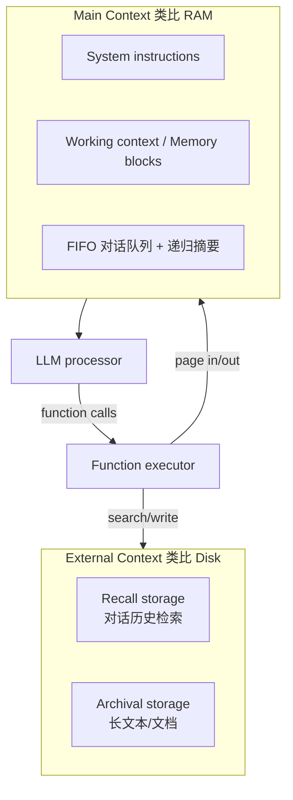

# MemGPT / Letta

> [!tip] 核心本质
> **MemGPT**（2023 论文）提出把 LLM 上下文当作 **RAM**、把外部存储当作 **磁盘**，用 function call 做虚拟分页——Agent **自-directed** 地在 main context 与 archival/recall 之间搬数据，从而在固定 context window 上营造「无限记忆」幻觉。**Letta**（原 MemGPT 开源项目演进后的平台）把该思想产品化为 **有状态 Agent Runtime**：Agent 不只「用记忆库」，而是**住在 Letta 里**，通过 memory blocks、recall/archival 工具自编辑 persona 与事实。若没有这套 OS 式分层，要么全量塞进 prompt，要么由应用层替 Agent 决定记什么——MemGPT/Letta 把 [[memory]] 的读写决策**交给 Agent 自己的 tool loop**。

## 命名与沿革

| 名称 | 说明 |
| --- | --- |
| **MemGPT / MemoryGPT** | UC Berkeley 等论文与早期开源（[arXiv:2310.08560](https://arxiv.org/abs/2310.08560)） |
| **Letta** | 当前商业/开源平台品牌（[letta.com](https://www.letta.com)，[docs.letta.com](https://docs.letta.com)） |
| **Letta Code** | 记忆优先的终端编码 Agent（`@letta-ai/letta-code`） |
| **Letta ADE** | Agent Development Environment（可视化调试记忆与工具） |

研究原型与生产 API 现统一在 **Letta** 品牌下；社区仍常用 **MemGPT** 指论文中的「LLM 即 OS」架构。本文 **MemGPT** 偏概念与机制，**Letta** 偏 2026 产品面。

## 生命周期与演进

**当前定位**：MemGPT 论文（2023）是 [[memory]] 领域引用最多的 **OS 式分页** 原型之一；Letta 平台宣称托管 **百万级 stateful agents** 量级（第三方评测常引），提供 Cloud API、自托管 Docker、Letta Code、Sleep-time agents、共享 memory blocks 等。

**预期寿命**：**OS 式 memory 分层**（long）会留；具体 Letta API、定价与 Letta Code 排名会变（mid/short）。

**近期演进**：Conversations API（多并行会话共享记忆）；Letta Code 在 Terminal-Bench 等编码基准上的 OSS 叙事；与 [[claude-code]] / ReAct 式 loop 的融合重构。

**终极威胁**：超长 context + 宿主内置 memory 使显式 paging 边缘化；**纯记忆库**（[[mem0]]、[[agentmemory]]）足够好时，全栈 Runtime 锁定成本过高。

## 在 Agent 栈中的位置

[[memory]] 讲 External / In-context 三分法；MemGPT 论文聚焦 **In-context（main）↔ External（archival/recall）** 的**自主换页**。



| 对比 | MemGPT/Letta | [[agentmemory]] / [[memx]] | [[mem0]] |
| --- | --- | --- | --- |
| 形态 | **Agent Runtime**（Agent 跑在平台内） | **记忆层插件/服务**（bolt-on） | 记忆 API 库 |
| 谁决定记什么 | **Agent 自编辑**（memory tools） | 多为 Hook 捕获 + 后台编译/检索 | 提取 pipeline + API |
|  metaphor | OS 分页、queue eviction | 混合检索、Hook、MCP | 向量+图，易集成 |
| 锁定 | 高（换 Runtime） | 低（MCP/宿主插件） | 低 |

与 [[harness-engineering]]：Letta 是 **Harness + Memory 合一**；与 [[claude-managed-agents]] 同属「平台跑 Agent」，但 Letta 卖点是 **自编辑 memory 层级** 而非 Anthropic 托管沙箱。

## MemGPT 论文：核心机制

### 虚拟上下文管理

固定 context window 下，MemGPT 用 **function calling** 实现：

- **Page in**：从 recall/archival 检索进 main context  
- **Page out**：FIFO 队列 eviction、写入 archival/working context  
- **Function chaining**：`request_heartbeat=true` 连续多步检索再 yield 给用户  

### Main context 组成（论文）

| 部分 | 作用 |
| --- | --- |
| **System instructions** | 只读：控制流、各 memory 层用法、function schema |
| **Working context** | 可读写块：用户关键事实、persona |
| **FIFO queue** | 滚动消息；队首含被 evict 消息的**递归摘要** |

### Queue Manager 与 memory pressure

- 超 **warning token**（如 70%）：插入系统警告，促 Agent 把重要信息迁到 working/archival  
- 超 **flush token**（如 100%）：evict 约 50% 队列、更新递归摘要；evicted 仍在 recall storage，可函数读回  

评估域：**多 session 对话**、**长文档分析**（[research.memgpt.ai](https://research.memgpt.ai) 基准与数据）。

## Letta 平台：2026 产品映射

Letta 文档将论文思想落实为可部署概念（[docs.letta.com](https://docs.letta.com)）：

| 概念 | 含义 |
| --- | --- |
| **Memory blocks** | In-context 内**持久、可编辑**段落（persona、human、自定义 label）；多 Agent **可共享**同一 block |
| **Core memory** | 当前 prompt 内由 blocks 承载的「RAM 式」状态 |
| **Recall memory** | 可搜索的对话/事件历史（cache 式检索层） |
| **Archival memory** | 向量索引的长期存储 |
| **Sleep-time agents** | 后台 Agent 与主 Agent 共享记忆，空闲时整理/学习（`enable_sleeptime=True`） |
| **Perpetual history** | 无限消息史；context 靠 paging 而非截断丢弃 |

Agent 通过 **tools 编辑/检索** 各层——不是单独 ETL pipeline 替 Agent 决定「值得记」。

### 交付形态

| 形态 | 用途 |
| --- | --- |
| **Letta API / Cloud** | `pip install letta-client`，创建 agent、发 message |
| **Self-hosted Docker** | `base_url` 指向自建服务 |
| **Letta Code** | `npm install -g @letta-ai/letta-code`，终端编码 Agent |
| **Letta ADE** | 可视化检查 memory、工具、运行轨迹 |

## 典型场景

**适合**

- 需要 **跨周/月会话** 的助手，且希望 Agent **自己**维护 persona 与用户模型。  
- 构建 **Agent-first** 产品，接受 Runtime 在 Letta 内。  
- 研究/复现 **OS 式 memory**、queue eviction、自编辑 memory 论文实验。  
- 多 Agent **共享 memory block**（团队 persona、项目事实）。

**不适合**

- 已有 [[hermes-agent]] / LangGraph / 自研 loop，只想加记忆 → [[mem0]]、[[agentmemory]]、[[memx]] 更轻。  
- 编码为主、已有 [[claude-code]] 工作流 → Letta Code 需单独评估，非默认替换。  
- 要强 **数据驻留 + 零第三方 Runtime** → 自托管 Letta 或 file/MCP 记忆。

## 实践与应用

### Letta API 最小示例（观测 2026-05）

```python
from letta_client import Letta

client = Letta(api_key="YOUR_KEY")  # 或 base_url= 自建

agent = client.agents.create(
    model="openai/gpt-4o",  # 以文档当前模型 id 为准
    memory_blocks=[
        {"label": "persona", "value": "I am a helpful assistant."},
        {"label": "human", "value": "The human's name is Alex."},
    ],
)

response = client.agents.messages.create(
    agent_id=agent.id,
    messages=[{"role": "user", "content": "Remember I prefer pytest over unittest."}],
)
```

Memory block 的 CRUD、archival 搜索、多 agent 共享见 [Letta memory guide](https://docs.letta.com/guides/agents/memory)。

### Letta Code

```bash
npm install -g @letta-ai/letta-code
```

面向「记忆优先」本地编码；与 [[claude-code]]、[[hermes-agent]] 同属终端 Agent 赛道，底层 Runtime 不同。

## 坑与边界

| 问题 | 说明 |
| --- | --- |
| Runtime 锁定 | 选 Letta = 选平台，非单纯 memory SDK |
| 自编辑可靠性 | Agent 可能漏记/误记；需 ADE 观测与 block 治理 |
| 成本 | Cloud 订阅 + 模型 token；长跑 Agent 预算 |
| 与 MemGPT 论文 1:1 | 产品 API 已演进，术语有 blocks/sleeptime 等扩展 |
| 命名 | 搜「MemGPT」可能见到 Letta Code、Mem0 对比文；认准 letta.com |

## 进一步阅读

- 论文：[MemGPT (2023)](https://arxiv.org/abs/2310.08560)  
- 平台：[Letta Docs](https://docs.letta.com)、[Letta Python SDK](https://docs.letta.com/api/python/)  
- 本仓库：[[memory]]、[[agentmemory]]、[[memx]]、[[mem0]]、[[agent-context-stack]]、[[agent]]、[[reAct]]
