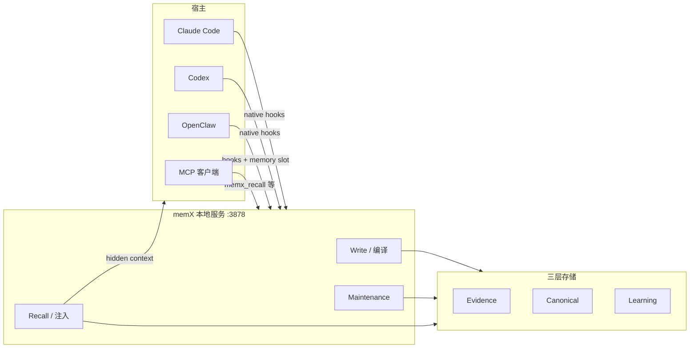

# memX

> [!tip] 核心本质
> memX（[NeoLi00/memX](https://github.com/NeoLi00/memX)，MIT）是面向编码 Agent 的**自学习、自维护本地记忆插件**：把已完成回合编译成可检索、可溯源的结构化记忆，在回答前只注入与当前 query 相关的**紧凑 evidence 行**。若没有这类层，宿主内置 `MEMORY.md` 或手工摘要无法解释「这条记忆从哪来」、也难在 correction 后自动 supersede 旧事实；memX 用 **Evidence → Canonical → Learning 三层存储 + 统一 lineage**，并通过 **原生 Hooks**（Claude Code / Codex / OpenClaw）或 **MCP**（通用客户端）接到同一本地服务（默认 `http://127.0.0.1:3878`）。

## 命名辨析

| 名称 | 是什么 | 本文 |
| --- | --- | --- |
| **memX**（NeoLi00） | Agent 记忆插件 + 本地 memory engine | ✓ |
| **MemX**（[memx.app](https://memx.app)） | 手机端个人知识库（照片/PDF/语音 + MCP 查询） | ✗ |
| **MemEx**（Databricks 等） | 可编程 Python scratchpad / 信念图研究项目 | ✗ |
| **MemryX** | AI 加速芯片公司 | ✗ |

下文 **memX** 均指 NeoLi00 的 Agent 记忆插件。

## 生命周期与演进

**当前定位**：2026 年 5 月前后快速迭代（~140 GitHub stars 量级，单维护者为主）。宣称 LongMemEval-S **R@3 94.2%**、30 个工程案例 **100%** 召回（官方 benchmark 表，观测 2026-05）。与 [[agentmemory]] 同属「第三方记忆层 + 多宿主 Hook/MCP」，但 memX 强调 **每条可召回记忆必须 trace 到 turn/source**、原生宿主默认 **隐藏 MCP 工具**（防 duplicate recall 与 audit 侧信道）。

**预期寿命**：不确定。记忆插件赛道与 [[agentmemory]]、[[mem0]]、宿主内置 auto memory 重叠；memX 差异化在 **typed 三层对象模型 + query compiler 检索契约 + OpenClaw memory slot 集成**。

**近期演进**：Claude Code / Codex native plugin marketplace；OpenClaw `before_prompt_build` + `agent_end` hooks；本地 embedding 默认 `multilingual-e5-small`；CJK 混合检索。

**终极威胁**：宿主内置记忆足够好且可审计；AgentMemory 等更大生态吞掉 Hook 适配；单 maintainer 项目运维风险。

## 在记忆栈中的位置

[[memory]] 讲范式；memX 是 **External Memory 实现**，并接管 prompt 注入（非把全文塞进 user message）。



| 对比 | memX | [[agentmemory]] |
| --- | --- | --- |
| 引擎 | 自研 TS memory engine | iii engine |
| 默认端口 | `:3878` | `:3111` |
| 宿主 Hook | Claude Code、Codex、OpenClaw 原生 | 12 hooks + 多 Connect 适配器 |
| 默认 MCP 暴露（原生宿主） | **`none`**（防重复） | shim 代理全工具面 |
| 溯源 | turn / source_segment 强制 lineage | observation + 图谱 |
| 规模/生态 | 早期、MIT、GitHub 安装 | 高 star、Plugin Hub |

与 workspace **`MEMORY.md`**：memX 注入时会指示 Agent **勿把 workspace MEMORY 当作活跃后端**（除非用户显式问那些文件）——避免与 OpenClaw/Claude 内置文件式记忆双写冲突。

## 架构要点

核心契约：**可召回的记忆必须能 trace 回 turn、source segment 或 derived object**（见官方 [ARCHITECTURE.md](https://github.com/NeoLi00/memX/blob/main/ARCHITECTURE.md)）。

### 宿主适配

| 宿主 | 集成方式 | 默认 MCP |
| --- | --- | --- |
| **Claude Code** | native plugin + lifecycle hooks → `MemxTurnEnvelope` | hidden（`--mcp-tools none`） |
| **Codex** | 同上 | hidden |
| **OpenClaw** | memory slot + `before_prompt_build`（recall）+ `agent_end`（capture） | native + hooks |
| **任意 MCP 客户端** | `memx_recall`、`memx_remember`、`memx_observe` 等 | **full**（无原生 hook 时） |

Hooks 只 POST envelope 到本地服务；**DB、embedding worker、maintenance 均在 service 内**，不在 hook 里起 worker。默认 **host-scoped DB**：Codex 与 Claude Code 不共享库，除非手动改 database path / actor。

### 三层记忆对象

| 层 | 存什么 | 典型表/对象 |
| --- | --- | --- |
| **Evidence** | 回合原文、分段、任务连续性 | `conversation_chunks`、`source_segments`、`conversation_tasks` |
| **Canonical** | 可打分、supersede 的结构化记忆 | `facts`、`state_kv`、`episodic_events`、`entities`、`graph_edges`、向量索引 |
| **Learning** | 置信、抽象、审计 | `memory_beliefs`、`abstraction_candidates`、`retrieval_audit` |

**Write path**：`agent_end` 捕获 turn → 持久 evidence → **LLM 语义编译**（`TurnSemanticFrame`：唯一语义抽取路径）→ policy 物化为 fact/state/event/graph。

**Maintenance path**：批量扫描长 `source_segments`、更新 belief、supersede 旧 fact、晋升抽象——与 write 共用同一对象模型。

**Recall path**：query compiler（LLM 产出 retrieval contract）→ 混合候选（FTS/BM25 + embedding + 图）→ evidence packet → **hidden runtime context** 注入 prompt 上方。

### 能力摘要（官方）

- 项目决策、偏好、任务状态、长文本 evidence 与 turn 链接  
- 实体/图关系（repo、文件、blocker、outcome）  
- 重复 evidence → 可复用 guidance（不丢来源）  
- correction supersede、stale task 衰减  
- 紧凑 evidence 行注入（非整段 transcript）

## 典型场景

**适合**

- 已在 **Claude Code / Codex / OpenClaw** 上工作，要**可溯源**的跨会话工程记忆。  
- 需要 **Hook 自动 capture/recall**，又不希望 Agent 同时看见 MCP memory 工具导致双写。  
- 重视 **fact/state/graph** 结构化维护，而非纯向量 chunk 堆叠。

**不适合**

- 需要 **Hermes / Cursor** 一等 native 适配（memX 未列；可用 generic MCP，无 lifecycle hook 优势）。  
- 要 **跨宿主共享同一记忆库** 且不想改 DB path（默认 host-scoped）。  
- 不愿跑 **本地 LLM API**（memX 用语义模型做 compile/recall planning；可 Ollama，但需可靠 JSON）。

## 实践与应用

### 前置

- Node.js **22.14+** 或 **24**  
- OpenClaw：**2026.3.25+**  
- 本地 embedding 默认需 **Python 3**（`sentence-transformers-local` / `multilingual-e5-small`）  
- 配置 **`--llm-provider`**、`--llm-base-url`、`--llm-model`**（及 API key）供 compile/maintenance/recall 使用——选 **快、便宜、JSON 稳定** 的模型，不必与编码 Agent 同模型

### Quickstart（观测 2026-05）

```bash
# Claude Code — 装 plugin + hooks + 本地服务（MCP 默认 none）
npx -y -p github:NeoLi00/memX memx quickstart claude-code \
  --llm-provider openai-compatible \
  --llm-base-url https://api.openai.com/v1 \
  --llm-model gpt-4o-mini \
  --llm-api-key sk-...

# Codex / OpenClaw / 纯 MCP 同理
npx -y -p github:NeoLi00/memX memx quickstart codex ...
npx -y -p github:NeoLi00/memX memx quickstart openclaw ...
npx -y -p github:NeoLi00/memX memx quickstart mcp ...
```

`--dry-run` 预览；端口冲突时改 `--memx-url http://127.0.0.1:3888`。若 `:3878` 已被**非 memX 管理**的服务占用，quickstart **会停止**而非静默复用。

### 服务管理

```bash
npx -y -p github:NeoLi00/memX memx service status
npx -y -p github:NeoLi00/memX memx service restart
npx -y -p github:NeoLi00/memX memx service stop
```

### 卸载

```bash
npx -y -p github:NeoLi00/memX memx uninstall claude-code   # 或 codex / openclaw
```

备份配置后移除 memX 自有项；Claude/Codex 会停服务、卸 plugin 与 marketplace snapshot。

### 宿主集成要点

- **Claude Code**（[[claude-code]]）：memX 走 native hooks，专管记忆，不替代格式化/测试门禁类 hook（横切治理见 [[cursor-hooks]]）。  
- **OpenClaw**（[[openclaw]]）：memX 占 memory slot；与 workspace `MEMORY.md` 分工见上文。  
- 若同时装 **AgentMemory**（[[agentmemory]]）：避免双插件同时 auto-capture 同一 turn；择一或显式隔离 actor/DB。

## 坑与边界

| 问题 | 说明 | 对策 |
| --- | --- | --- |
| 双 recall | Hook + MCP tools 同时开 | 原生宿主保持 `--mcp-tools none` |
| 与 MEMORY.md 冲突 | 两套「长期记忆」 | 以 memX 为运行时后端；或只用文件式 |
| 额外 LLM 成本 | compile/recall 要独立 model | 选小模型；Ollama 本地 |
| 端口/服务 | 3878 被占 | 指定 `--memx-url` 或停旧服务 |
| Host 不共享 | Codex ≠ Claude DB |  intentional；跨宿主需改 path |
| 成熟度 | 早期单 repo | pin GitHub ref；`memx service status` 验收 |
| 命名搜索 | 易混 memx.app / MemEx | 认准 NeoLi00/memX |

## 进一步阅读

- 官方：[GitHub NeoLi00/memX](https://github.com/NeoLi00/memX)、[ARCHITECTURE.md](https://github.com/NeoLi00/memX/blob/main/ARCHITECTURE.md)、[README-ch.md](https://github.com/NeoLi00/memX/blob/main/README-ch.md)
- 本仓库：[[memory]]、[[agentmemory]]、[[mem0]]、[[claude-code]]、[[openclaw]]、[[tool-mcp]]、[[agent-context-stack]]
