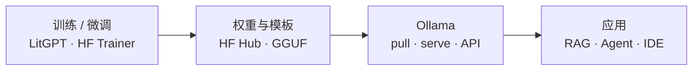

---
tags:
  - ollama
  - local-llm
  - inference
aliases:
  - Ollama
prerequisites:
  - "[[llm]]"
related:
  - "[[local-llama-pretrain]]"
  - "[[sft]]"
  - "[[langchain]]"
  - "[[claude-code]]"
  - "[[openclaw]]"
  - "[[rag]]"
  - "[[huggingface-transformers]]"
stability: mid
layer: application
updated: 2026-06-15
---

# Ollama

> [!tip] 核心本质
> **Ollama** 是面向本机的**开源大模型运行时与模型分发层**（[ollama/ollama](https://github.com/ollama/ollama)）：把 GGUF 等量化权重、对话模板、默认参数打包成可 `pull` 的模型镜像，在本地起 HTTP 服务（默认 `11434`），用 **llama.cpp** 做硬件加速推理。它不是训练器——不负责从零预训练或全量微调；若把「本地搞模型」全等同于 Ollama，会与 [[local-llama-pretrain|从零预训练]]、[[sft|监督微调]]、以及高吞吐 serving（vLLM 等）混为一谈，在算力、隐私与集成方式上选错层。

适合要在笔记本或内网**跑通开源模型**、并接到 [[rag]]、[[langchain]]、[[claude-code]]、[[openclaw]] 等工具的读者。读完 [[#1 本地推理 friction：Ollama 解决什么|§1]] 能分清「下载权重推理」与训练；[[#2 架构：守护进程、模型库与推理引擎|§2]] 画清组件；[[#4 API 与 OpenAI 兼容|§4]] 与 [[#5 Modelfile：定制上下文与行为|§5]] 覆盖集成与定制；[[#6 选型边界：何时用、何时不用|§6]] 给出替代路径。

*检索说明：[Ollama README](https://github.com/ollama/ollama/blob/main/README.md)、[API Introduction](https://docs.ollama.com/api/introduction)、[OpenAI compatibility](https://docs.ollama.com/openai)、[Modelfile](https://docs.ollama.com/modelfile)、[Quickstart](https://docs.ollama.com/quickstart)（观测 2026-06-15）。*

## 生命周期与演进

**当前定位**：个人与中小团队**本地/边缘推理**的事实标准之一（mid）。单二进制覆盖 macOS、Windows、Linux 与官方 Docker 镜像；[模型库](https://ollama.com/library) 提供 Llama、Qwen、Gemma、DeepSeek 等一键 `pull`；`ollama launch` 可把同一后端接到 Claude Code、Codex、OpenClaw 等宿主（[Quickstart](https://docs.ollama.com/quickstart)）。

**预期寿命**：中期。本地隐私、离线、零 API 费的需求持续；但「只聊天」会被更多 IDE/助手内置本地栈分流。

**近期演进**：OpenAI 兼容层扩展至 `/v1/responses`、工具调用与视觉（[OpenAI compatibility](https://docs.ollama.com/openai)，v0.13.3+）；推理后端向 **llama-server**（上游 llama.cpp）集中，以更快跟进新架构与量化格式（社区 PR 方向，如 [ollama#15122](https://github.com/ollama/ollama/pull/15122)）；云侧 `https://ollama.com/api` 与本地 API 同形，便于混合部署。

**终极威胁**：云厂商低价 API + 端侧 NPU 原生运行时压缩「自托管 HTTP 推理」场景；多卡高并发生产仍倾向 vLLM/TGI，Ollama 的定位是**易用运行时**而非集群 serving。

## 1 本地推理 friction：Ollama 解决什么

要在本机跑一个大模型，裸链路通常包括：找 GGUF/Safetensors 权重、对齐 tokenizer 与 chat template、编译或绑定 **llama.cpp**、再自己写 HTTP 或进程间调用。任一步出错，表现为乱码、复读、或「能加载但不像官方助手」。

Ollama 把上述步骤收成三层能力：

1. **模型分发** — 类似容器镜像：`ollama pull llama3.2` 拉取 manifest + 分块 blob，断点续传（`/api/pull`）。
2. **运行时** — 常驻 `ollama serve`（安装后常以后台服务运行）；`ollama run` 等 CLI 实为向该服务发 REST 请求。
3. **稳定 API** — 原生 `/api/chat`、`/api/generate`、`/api/embeddings` 等，以及 **`/v1/*` OpenAI 兼容** 面，让现有 SDK 改 `base_url` 即可接入。

因此 Ollama 与 [[local-llama-pretrain]] 的关系是：**前者消费已训好的权重，后者生产权重**。与 [[sft]] / QLoRA 的关系：微调在 PyTorch/LitGPT 等栈完成；可用 Modelfile 的 `ADAPTER` 挂载 LoRA，或导入 GGUF，但 Ollama 本身不是训练框架。

**图 1 — Ollama 在「本地模型」栈中的位置**



## 2 架构：守护进程、模型库与推理引擎

### 2.1 单进程服务 + 薄 CLI

实现语言为 **Go**（[README](https://github.com/ollama/ollama/blob/main/README.md)）。用户感知的 `ollama run gemma4` 背后，是本地 **HTTP 服务**（默认 `http://localhost:11434`）负责模型生命周期：下载、缓存、加载进 GPU/Metal/CPU 内存、多请求调度、空闲卸载。

CLI 子命令（`pull`、`list`、`ps`、`create`、`show` 等）与语言 SDK（[ollama-python](https://github.com/ollama/ollama-python)、[ollama-js](https://github.com/ollama/ollama-js)）都指向同一 API。API **无严格版本号**，官方承诺向后兼容，破坏性变更会写在 Release Notes（[API Introduction](https://docs.ollama.com/api/introduction)）。

### 2.2 模型存储与 manifest

每个逻辑模型由 **Modelfile 衍生的 manifest** 描述：基础权重 blob、对话模板（`TEMPLATE`）、系统提示、默认 `PARAMETER`（如 `num_ctx`、`temperature`）。存储在本地目录（常见为 `~/.ollama/models`），内容寻址，与 OCI 镜像类似的 pull/push 体验。

`ollama show <model>`（或 `POST /api/show`）可查看模板、许可证与参数，是排查「为什么和官网 demo 不一样」的第一站。

### 2.3 推理后端：llama.cpp

官方文档将 [llama.cpp](https://github.com/ggml-org/llama.cpp) 列为 **Supported backends**。Ollama 不重新实现注意力内核；它负责选后端、spawn runner、在 CPU/CUDA/Metal/Vulkan/ROCm 等路径上加载 GGUF。Safetensors 架构模型也可通过 Modelfile `FROM <目录>` 导入（见 [Modelfile — FROM](https://docs.ollama.com/modelfile)）。

若你需要改 kernel、追最新 llama.cpp commit 做实验，应直接使用 llama.cpp 或自建绑定；Ollama 换的是**运维与集成成本**，不是底层算子自由度。

## 3 CLI 与模型生命周期

### 3.1 安装与首次运行

各平台一键安装脚本见 [README — Download](https://github.com/ollama/ollama/blob/main/README.md)（macOS/Linux `install.sh`，Windows `install.ps1`，或 Docker `ollama/ollama`）。

```bash
# 交互菜单：选模型、launch 集成
ollama

# 拉取并进入对话
ollama pull llama3.2
ollama run llama3.2
```

[Quickstart](https://docs.ollama.com/quickstart)（2026-06 观测）还强调 **`ollama launch`**：例如 `ollama launch claude`（[[claude-code]]）、`ollama launch openclaw`（[[openclaw]]）、`ollama launch codex`，把本地模型注入已有编码 Agent，而不仅是终端聊天。

### 3.2 常用命令语义

| 命令 | 作用 |
| --- | --- |
| `ollama pull <name>` | 从 registry 下载模型层 |
| `ollama run <name>` | 加载（若未加载）并交互聊天 |
| `ollama ps` | 查看当前内存中已加载模型 |
| `ollama list` | 本地已 pull 的模型 |
| `ollama rm <name>` | 删除本地模型 |
| `ollama cp <src> <dst>` | 复制别名（便于 OpenAI 兼容层使用 `gpt-3.5-turbo` 等默认名） |
| `ollama create <name> -f Modelfile` | 从 Modelfile 构建自定义模型 |
| `ollama show <name> --modelfile` | 导出可编辑 Modelfile |

服务未启动时可显式 `ollama serve`；多数桌面安装会注册为系统服务。

## 4 API 与 OpenAI 兼容

### 4.1 原生 REST

基址：`http://localhost:11434/api`（云模型：`https://ollama.com/api`）。

**表 1 — 常用原生端点**

| 端点 | 用途 |
| --- | --- |
| `POST /api/chat` | 多轮对话（messages），默认流式 |
| `POST /api/generate` | 单轮补全（prompt） |
| `POST /api/embeddings` | 向量嵌入（RAG 索引） |
| `POST /api/pull` / `push` | 模型同步 |
| `GET /api/tags` | 列出本地模型 |
| `GET /api/ps` | 运行中模型 |

示例（非流式）：

```bash
curl http://localhost:11434/api/chat -d '{
  "model": "llama3.2",
  "messages": [{"role": "user", "content": "Hello!"}],
  "stream": false
}'
```

Python 官方 SDK：`pip install ollama`，`from ollama import chat`（[README](https://github.com/ollama/ollama/blob/main/README.md)）。

### 4.2 OpenAI 兼容 `/v1`

将 `base_url` 设为 `http://localhost:11434/v1/`，`api_key` 填任意非空（如 `ollama`，服务端忽略），即可用 OpenAI SDK：

```python
from openai import OpenAI

client = OpenAI(base_url="http://localhost:11434/v1/", api_key="ollama")
r = client.chat.completions.create(
    model="llama3.2",
    messages=[{"role": "user", "content": "Say this is a test"}],
)
print(r.choices[0].message.content)
```

[OpenAI compatibility](https://docs.ollama.com/openai) 列明：**部分**兼容——支持流式、工具调用、部分模型的 reasoning summary；`/v1/responses` 仅**无状态**（无 `previous_response_id` / `conversation`）。OpenAI API **不能**设置 `num_ctx`；更大上下文须用 Modelfile `PARAMETER num_ctx` 后 `ollama create` 新模型名。

依赖默认模型名（如 `gpt-3.5-turbo`）的遗留工具，可用 `ollama cp llama3.2 gpt-3.5-turbo` 做本地别名。

### 4.3 与框架集成

[[langchain]] / LangGraph、LlamaIndex、Continue、LiteLLM 等均提供 Ollama 集成（社区列表见 [README — Community Integrations](https://github.com/ollama/ollama/blob/main/README.md)）。典型模式：RAG 用 `POST /api/embeddings` 或兼容 embedding 端点建索引，生成走 `ChatOllama` 或 OpenAI 兼容客户端——编排逻辑仍在应用层，Ollama 只充当 **Model Provider**。

## 5 Modelfile：定制上下文与行为

Modelfile 是声明式「模型镜像配方」（[Modelfile Reference](https://docs.ollama.com/modelfile)），核心指令：

| 指令 | 含义 |
| --- | --- |
| `FROM` | 基座：已有模型名、GGUF 路径、或 Safetensors 目录 |
| `PARAMETER` | 运行默认：`num_ctx`（默认 2048）、`temperature`、`stop` 等 |
| `TEMPLATE` | Go template 语法的完整 prompt 模板 |
| `SYSTEM` | 系统角色内容 |
| `ADAPTER` | LoRA / QLoRA 适配器（路径相对 Modelfile） |
| `MESSAGE` | 少样本对话示例 |

最小示例：

```text
FROM llama3.2
PARAMETER num_ctx 8192
PARAMETER temperature 0.7
SYSTEM You are a concise technical assistant.
```

```bash
ollama create my-assistant -f Modelfile
ollama run my-assistant
```

`ollama show --modelfile <base>` 可从官方模型反查模板，避免手写错 special token。导入自有微调权重时，常见路径是：训练栈导出 GGUF 或 Safetensors → `FROM` 指向文件/目录 → `create` → API 调用新名称。

## 6 选型边界：何时用、何时不用

**表 2 — 与相邻工具的分工**

| 需求 | 更合适的层 | 说明 |
| --- | --- | --- |
| 本机聊天、原型、接 IDE/Agent | **Ollama** | 安装快、模型库全、OpenAI 兼容 |
| 从零预训练 Llama 小模型 | [[local-llama-pretrain]]、nanochat、LitGPT | Ollama 不训练 |
| 全量 / LoRA 微调 | HF Trainer、LitGPT、Axolotl 等 | 训完再导入 Ollama |
| 改 kernel、极致延迟调优 | llama.cpp 直连 | 无 manifest/registry 负担 |
| 多卡高 QPS、生产 SLA | vLLM、TGI、TensorRT-LLM | 批处理与调度更强 |
| 纯 GUI 玩模型、少写 API | LM Studio 等 | 同类本地运行时，选型偏交互 |

**隐私与合规**：推理数据不出本机（未启用云 API 时），适合内网 Copilot 原型；但仍须注意模型许可证（`LICENSE` 指令与 `show` 输出）与日志落盘策略。

**运维注意**：单模型默认会占满可用 VRAM；并发多模型需关注 `ollama ps` 与内存压力下的卸载行为。容器部署时挂载卷持久化 `~/.ollama`，并限制对外暴露 11434（无内置鉴权，生产应加反向代理或仅 bind localhost）。

**常见误解**：

- `ollama pull` ≠ 训练 — 只是下载已有 checkpoint。
- OpenAI 兼容 ≠ 100% 行为一致 — 工具 schema、上下文长度、多模态能力因模型而异，须对照 [OpenAI compatibility](https://docs.ollama.com/openai) 能力表。
- 本地模型 ≠ 一定够聪明 — 小参数量模型在复杂 Agent 规划上仍弱，需配合 [[rag]]、小模型分工或云模型回退。

## 要点收束

- Ollama 是**本地模型运行时 + 注册表 + HTTP API**，推理依托 **llama.cpp**，不是训练框架。
- 工作流：`pull` → `run` 或 `serve` + REST；与 Claude Code / OpenClaw 等可用 `ollama launch` 一键对接。
- 集成优先 **`/v1` OpenAI 兼容** 或官方 Python/JS SDK；改上下文用 **Modelfile `num_ctx`** 再 `create`。
- 预训练与大规模微调走 [[local-llama-pretrain]] / [[sft]]；高并发生产考虑 vLLM 等专业 serving。

## 进一步阅读

### 库内关联

- [[local-llama-pretrain]] — 下载权重 vs 从零预训练；Ollama 出现在「路径 A：推理」
- [[sft]] — 在基座上改行为；与 Modelfile `ADAPTER` 导入衔接
- [[langchain]] — 组合层如何接 Ollama 作 ChatModel / Embeddings
- [[rag]] — 嵌入 + 生成的本地流水线
- [[claude-code]]、[[openclaw]] — `ollama launch` 典型宿主

### 官方文档

- [Ollama 仓库 README](https://github.com/ollama/ollama/blob/main/README.md) — 安装、SDK、集成列表
- [API Introduction](https://docs.ollama.com/api/introduction) — 基址、库、版本策略
- [OpenAI compatibility](https://docs.ollama.com/openai) — `/v1` 能力矩阵与限制
- [Modelfile Reference](https://docs.ollama.com/modelfile) — 参数默认值与模板变量
- [Quickstart](https://docs.ollama.com/quickstart) — 交互菜单与 `launch` 集成
- [模型库](https://ollama.com/library) — 可用模型名与标签
