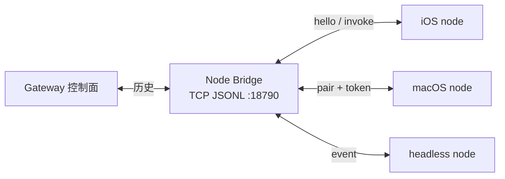

# Node Bridge

> [!tip] 核心本质
> **Node Bridge** 是 OpenClaw Gateway 与 **node 客户端**之间曾使用的一条 **专用传输通道**：TCP 上按行传 JSON（JSONL），只承载 node 所需的窄 RPC 与 `invoke` 回传，而不是把完整 Gateway WebSocket API 暴露到局域网。若没有 Bridge 这类「窄桥」，要么远程设备拿不到相机/Canvas/exec 能力，要么只能把整块控制面绑到外网——安全面过大。

本文只介绍 **Bridge 是什么、怎么工作、为何退场**；node 配对、命令清单、`openclaw node run` 等用法见 [[openclaw]] 与官方 [Nodes](https://docs.openclaw.ai/nodes) 文档。

## 生命周期与演进

**当前定位**：OpenClaw 官方将 [Bridge protocol](https://docs.openclaw.ai/gateway/bridge-protocol) 标为 **历史参考**——当前构建 **不再启动** TCP bridge 监听，`bridge.*` 配置键已从 schema 移除。node 客户端改走 [Gateway WebSocket 协议](https://docs.openclaw.ai/gateway/protocol)（默认端口 **18789**），在 `connect` 时声明 `role: "node"`。

**预期寿命**：协议本身已 **退役**；名称仍出现在旧教程、配置片段与社区讨论里，读资料时需知道「Bridge = 旧线，WS = 新线」。

**近期演进**：Bridge 能力并入 Gateway WS 后，握手统一为 device pairing + `invoke` / `event` 帧；独立 **18790** 端口与 `bridge.bind` 等键作废。

**终极威胁**：无（作为独立协议已结束生命周期）；若误按旧文档配 `bridge.tls` 或连 18790，只会连不上，应改读 Gateway protocol。

## 1. Bridge 在栈里的位置

OpenClaw 里三个词常一起出现，但指的不是同一件事：

| 词 | 指什么 |
| --- | --- |
| **Gateway** | 跑模型、接 IM、路由工具的控制面进程 |
| **Node** | 连上 Gateway 的 **客户端角色**（手机、Mac App、无头主机），对外提供设备能力 |
| **Node Bridge** | Gateway 与 node 之间 **曾用的那条 TCP JSONL 链路**（传输 + 帧格式 + 配对握手） |

Bridge 解决的是 **「线怎么拉」**：用什么端口、传什么帧、未配对时怎么拦。Node 解决的是 **「谁在线上、能干什么」**：声明 `camera`、`canvas`、`system.run` 等 capability。

**图 1：** 历史拓扑（当前 node 直连 Gateway WS :18789，不再经独立 Bridge 端口）

## 2. 为何单独做一条 Bridge

官方列出的设计动机（[Bridge protocol](https://docs.openclaw.ai/gateway/bridge-protocol)）：

1. **安全边界** — Bridge 只开放 **小 allowlist** 的 RPC，不是完整 operator API。
2. **配对与身份** — Gateway 掌握 node 准入；每个 node 绑定 token，未配对拒绝 `hello`。
3. **发现** — 局域网 Bonjour 发现 Gateway，或在 Tailscale 上用 MagicDNS / tailnet IP 直连。
4. **与 Loopback WS 分工** — 完整 WebSocket 控制面默认留在本机（或 SSH 隧道后访问）；远程 **node** 走 Bridge，避免把 CLI/UI 用的全量 API 绑到 `0.0.0.0`。

一句话：**Bridge = 给外围设备用的细管道；WS = 给本机/可信 operator 用的粗管道。** 后来两条管道合并成 **一条 WS**，靠 `role` 区分权限，Bridge 监听才下线。

## 3. 传输与握手

**传输**

- TCP，**一行一个 JSON 对象**（JSONL）
- 历史默认监听端口：**18790**（与 Gateway WS 的 **18789** 分开）
- 可选 TLS：`bridge.tls.enabled`（配置键已废弃，仅作读旧文档用）

**配对握手**（四步）

1. Client 发 `hello`（node 元数据 + 已配对 token）
2. 未配对 → Gateway 回 `error`（`NOT_PAIRED` / `UNAUTHORIZED`）
3. Client 发 `pair-request`
4. 人工批准后 Gateway 发 `pair-ok`、`hello-ok`

配对通过后，node 才参与 `invoke` 往返。

## 4. 帧类型（在 Bridge 上跑什么）

| 方向 | 帧 | 作用 |
| --- | --- | --- |
| Client → Gateway | `req` / `res` | 限定范围的 Gateway RPC（chat、sessions、config、health、voicewake、skills.bins 等） |
| Client → Gateway | `event` | node 上行信号（语音转写、agent 请求、chat 订阅、exec 生命周期） |
| Gateway → Client | `invoke` / `invoke-res` | 让 node 执行 `canvas.*`、`camera.*`、`screen.record`、`location.get`、`sms.send` 等 |
| Gateway → Client | `event` | 已订阅 session 的 chat 更新 |
| 双向 | `ping` / `pong` | 保活 |

`exec.finished` / `exec.denied` 等 exec 生命周期事件：node 上报，Gateway 映射为系统事件（历史行为；现 WS 上语义延续，传输已换）。

Allowlist  enforcement 曾在 `src/gateway/server-bridge.ts`（**已删除**）。

## 5. 今天还用 Node Bridge 吗

**不用。** 当前 OpenClaw：

- 不监听 18790，不识别 `bridge.*` 配置
- node 与 operator 共用 **Gateway WebSocket**（18789），握手里带 `role: "node"` 与 device 身份
- 逻辑上仍是 Gateway 发 `invoke`、node 回 `invoke-res`——只是 **不再叫 Bridge、不再走独立 TCP**

读 2025 年前后的文章若出现「连 bridge 18790」「`bridge.bind: tailnet`」，应理解为 **历史部署**，对照 [Gateway protocol](https://docs.openclaw.ai/gateway/protocol) 迁移。

## 进一步阅读

### 库内关联

- [[openclaw]] — Gateway 产品总览；node 能力与 CLI 不在本篇展开

### 官方文档

- [Bridge protocol](https://docs.openclaw.ai/gateway/bridge-protocol) — Node Bridge 权威历史说明（页面即声明已移除）
- [Gateway protocol](https://docs.openclaw.ai/gateway/protocol) — 当前 node/operator 共用 WS
- [Nodes](https://docs.openclaw.ai/nodes) — node 角色与配对（传输已非 Bridge）
