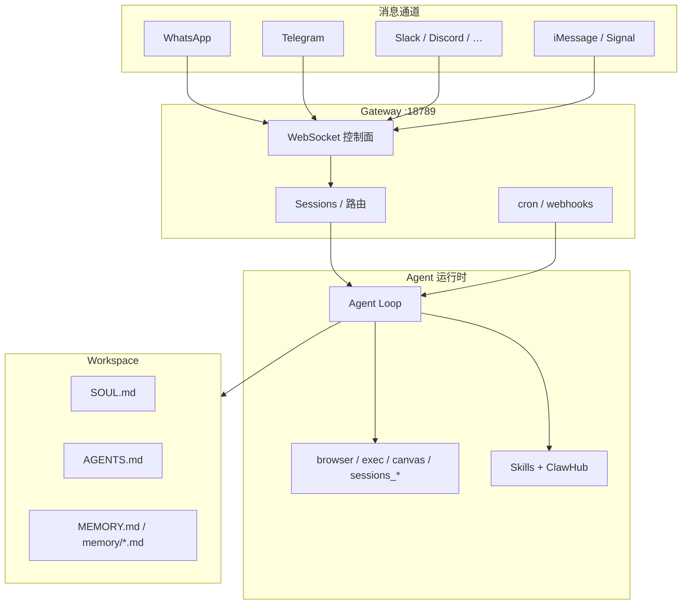

# OpenClaw

> [!tip] 核心本质
> OpenClaw 是跑在你自己设备上的**个人 AI 助手 Gateway**：一个长期驻留的 Node.js 控制面，把 WhatsApp、Telegram、Slack、Discord、iMessage 等通道统一成同一会话与工具运行时，Agent 在 workspace 里读写文件、跑 shell、控浏览器、画 Canvas。若没有这类 Gateway，模型只能困在网页 chat 里——无法「在你常用的 IM 里随时唤醒、记住你的偏好、定时推任务结果」；OpenClaw 把**通道 + 会话 + Skills 市场（ClawHub）+ 本地 workspace 文件（SOUL / AGENTS / MEMORY）**收成 `openclaw onboard` 一条安装路径，强调 local-first、always-on 的个人助手，而非 IDE 内嵌 copilot。

## 命名与沿革

| 名称 | 说明 |
| --- | --- |
| **OpenClaw** | 当前品牌（[openclaw.ai](https://openclaw.ai)，GitHub [openclaw/openclaw](https://github.com/openclaw/openclaw)） |
| **Clawdbot / Moltbot** | 早期项目名；配置目录可能仍为 `~/.clawdbot/`、`~/.moltbot/` |
| **ClawHub** | 官方 Skill + Plugin  registry（[clawhub.ai](https://clawhub.ai)，`clawhub` CLI） |

创始人 Peter Steinberger（PSPDFKit）从 hobby 项目发展为 2026 年极高关注的开源个人助手；与 [Nous Hermes Agent](https://hermes-agent.nousresearch.com) **不是同一项目**，但 Hermes 提供 `hermes claw migrate` 导入 OpenClaw 配置（见 [[#与 Hermes Agent 的关系]]）。

## 生命周期与演进

**当前定位**：2026 年 v2026.5.x beta 量级（TypeScript 为主，~370k+ GitHub stars 观测日 2026-05-31）。 slogan：**「Gateway 只是控制面，产品才是助手」**——用户通过已有聊天 App 对话，Gateway（默认 `127.0.0.1:18789` WebSocket）维护 provider 连接、会话状态、工具与 cron。差异化：**通道覆盖极广**（含 WeChat、QQ、Feishu、Matrix 等）、Companion App（macOS 菜单栏 / iOS / Android nodes）、Live Canvas（A2UI）、Voice Wake、多 Agent 路由到不同 workspace。

**预期寿命**：中期。个人本地/自托管助手需求长期存在；与 [[hermes-agent]]、Cursor、[[agent-zero]] 分场景共存。ClawHub 生态（700+ 社区 Skill 量级，第三方称）是护城河，也带来供应链风险。

**近期演进**：OAuth 订阅（OpenAI Codex 等）；`openclaw onboard --install-daemon`（launchd/systemd）；多 Agent `workspace-{agentId}`；ClawHub 统一 Skill + native plugin catalog。

**终极威胁**：厂商内置助手吞掉 IM 集成价值；ClawHub Skill 恶意代码事件损害信任；高频 beta 发布增加运维成本；用户转向 Hermes 等带更强「学习闭环」的 runtime。

## 在 Agent 栈中的位置

[[agent]] 定义执行循环；OpenClaw 是 **Harness + 消息 Gateway 合一** 的个人助手产品，哲学偏「always-on 数字员工」，而非「打开 IDE 才存在的编码 Agent」。



| 对比 | OpenClaw | [[hermes-agent]] | Cursor / Claude Code |
| --- | --- | --- | --- |
| 栈 | Node.js / TypeScript | Python | IDE 内置 |
| 主场景 | IM 个人助手、always-on | VPS Agent + 学习闭环 + Gateway | 仓库内编码 |
| 通道 | 20+ 种，含微信/QQ | Telegram/Discord/Slack 等（少而精） | 无原生 IM |
| Skill 生态 | **ClawHub** 市场 + workspace skills | agentskills.io + 自动建 Skill | Cursor Skills / Claude Skills |
| 记忆 | workspace `MEMORY.md` 等文件 | durable + session search + Skill | 产品内置 / Rules |
| 典型部署 | 本机 daemon + 可选 Tailscale | 本机 / Modal / SSH backend | 本机 IDE |

与 [[agent-zero]]：Agent Zero 是 Docker 内整台 Linux 桌面；OpenClaw 是**轻量 Gateway + 可选本机 shell**，Companion 可暴露相机/屏幕等 node 能力，但不以完整 VM 桌面为主叙事。

与 [[agentmemory]]：AgentMemory 列出 **OpenClaw** 为 native plugin + MCP 宿主之一——可把跨宿主记忆层接在 OpenClaw 上，与 workspace 内 `MEMORY.md` 并存或分工（见 [[agent-context-stack]]）。

## 架构要点

### Gateway 控制面

官方架构（[docs.openclaw.ai/concepts/architecture](https://docs.openclaw.ai/concepts/architecture)）：

- **单 host 一个 Gateway** — 例如 WhatsApp（Baileys）会话只在此处维持。
- **WebSocket API** — macOS App、CLI、WebChat、自动化客户端经 WS 连 `connect` → `agent` / `send` 等 typed 请求。
- **Nodes** — iOS/Android/macOS 以 `role: node` 接入，提供 `canvas.*`、`camera.*`、`screen.record` 等设备能力；需 **device pairing** 与签名握手。与 node 之间的传输曾称 **Node Bridge**（TCP :18790），已退役，见 [[openclaw-node-bridge]]。
- **Canvas HTTP** — 同端口提供 `/__openclaw__/canvas/`、`/__openclaw__/a2ui/` 供 Agent 驱动可视化工作区。

远程访问优先 **Tailscale / VPN**；备选 SSH 隧道 `ssh -N -L 18789:127.0.0.1:18789 user@host`。

### Workspace 与上下文文件

OpenClaw 用 **workspace 目录** 承载人格、指令与记忆，与 [[agent-context-stack]] 高度对齐：

| 文件 | 作用 |
| --- | --- |
| **`SOUL.md`** | 人格 / persona（类似 Soul 层） |
| **`AGENTS.md`** | 工作区指令、边界（Rules / 项目说明） |
| **`MEMORY.md`** | 长期记忆条目（`§` 分隔等约定） |
| **`USER.md`** | 用户画像 |
| **`memory/*.md`** | 按日期的记忆片段，可合并进 MEMORY |
| **`skills/`** | 本地 Skill（`SKILL.md` 标准） |

多 Agent 时可用 `workspace-{agentId}/`；配置在 `~/.openclaw/openclaw.json`（或 legacy `clawdbot.json` / `moltbot.json`）。

### Skills 与 ClawHub

- **本地**：`workspace/skills/`、`~/.openclaw/skills/`、`~/.agents/skills/` 等路径（与 Hermes 迁移文档中的四源一致）。
- **ClawHub**：`clawhub search`、`clawhub install author/skill`、`clawhub update --all`；向量检索 + 版本化发布；亦支持 **native code/bundle plugins**（需 `openclaw.compat` manifest）。
- 与 [[skill-loading-library]]：OpenClaw 使用 **AgentSkills / SKILL.md** 开放格式，Discovery/Activation 因宿主实现而异；安装 Skill ≠ 自动信任——需审查 ClawHub 来源（见坑）。

### 内置能力与工具

- **Browser** — 内置浏览器自动化；可配 CDP、headless；Annotate/Canvas 与 UI 协作相关能力在快速演进。
- **Exec** — shell 命令；`approvals.exec` 控制 auto / smart / manual；`exec-approvals.json` 命令 allowlist。
- **Cron** — 自然语言或配置定时任务，Gateway 异步 push 到通道。
- **Session tools** — `sessions_list`、`sessions_history`、`sessions_send`（多会话协作）。
- **[[tool-mcp]]** — `mcp.servers` 配置 stdio/HTTP MCP，与内置工具并列。

聊天命令（跨通道）：`/status`、`/new`、`/reset`、`/compact`、`/think`、`/verbose`、`/usage`、`/restart`、`/activation mention|always` 等。

## 典型场景

**适合**

- 想在 **WhatsApp / Telegram / 微信** 等日常 App 里私聊个人助手。
- 需要 **always-on daemon**（systemd/launchd）+ 手机 Companion 节点。
- 重视 **ClawHub 现成 Skill** 广度，快速装「查邮件、控 Hue、写 Obsidian」类能力。
- local-first：数据在自家机器，provider 自选（Anthropic、OpenAI、本地模型等）。

**不适合**

- 主要工作是 **IDE 内代码审查与 diff**（Cursor/Claude Code 更贴）。
- 要 **Python 研究型 learning loop、RL trajectory**（[[hermes-agent]] 更贴）。
- 无法承受 **Gateway + IM 凭证** 的安全运维（配对、allowlist、Skill 供应链）。
- 只要无 GUI 的纯脚本 `chat -q`（Hermes/POC 式非交互更直接）。

## 实践与应用

### 安装（观测 2026-05）

推荐路径：

```bash
openclaw onboard --install-daemon   # 向导：Gateway、workspace、通道、Skills
openclaw gateway status             # 确认 daemon
```

亦可官网 one-liner 或 clone + `pnpm install`（见 [Getting started](https://docs.openclaw.ai/start/getting-started)）。**Windows 强烈建议 WSL2**；原生 Windows 支持有限。

手动前台调试：

```bash
openclaw gateway --port 18789 --verbose
```

### 常用 CLI

```bash
openclaw onboard          # 首次配置
openclaw gateway          # 启动 / 管理 Gateway
openclaw skills list      # 已装 Skills
openclaw update --channel stable | dev
```

ClawHub：

```bash
clawhub login
clawhub search "obsidian"
clawhub install <author>/<skill-name>
clawhub update --all
```

### 与本仓库的关系

当前 POC（`poc/poc_server/hermes_adapter.py`）对接的是 **Hermes** `hermes chat`，**未**直接集成 OpenClaw。若要用 OpenClaw 驱动同一知识融合流水线，需经 Gateway WS API 或社区桥接，或迁移到 Hermes 后保留 `hermes chat -q` 脚本面——选型见下节。

## 与 Hermes Agent 的关系

二者常被并列对比：**OpenClaw** 偏「多通道个人助手 + ClawHub 技能市场」；**Hermes** 偏「自进化 Agent runtime + 多 terminal backend + Nous 生态」。功能重叠在 Gateway、Memory、Skills、MCP，但实现栈与哲学不同（Node vs Python）。

**从 OpenClaw 迁到 Hermes**（官方 [迁移指南](https://hermes-agent.nousresearch.com/docs/guides/migrate-from-openclaw)）：

```bash
hermes claw migrate --dry-run          # 预览
hermes claw migrate --migrate-secrets  # 含 API key（需显式确认）
```

迁移项包括：`SOUL.md`、`MEMORY.md` / `USER.md`、四源 Skills → `~/.hermes/skills/openclaw-imports/`、模型 provider、MCP servers、部分 messaging token；**WhatsApp 需重新 QR 配对**；cron/plugins 等可能进 archive 需手工重建。

**反向**：无官方「Hermes → OpenClaw」一键工具；若重视 ClawHub 与 iMessage/微信通道，留在 OpenClaw 或双跑（注意 workspace 写冲突）。

## 坑与边界

| 问题 | 说明 | 对策 |
| --- | --- | --- |
| **Skill 供应链** | ClawHub 第三方 Skill 可含恶意 shell | 装前读 `SKILL.md` 与脚本；优先高信任作者；最小权限 exec |
| Gateway 暴露 | 非 loopback 绑定 + 弱 auth | 默认本地；远程用 Tailscale；配置 `gateway.auth` |
| Device pairing | 新 node 需批准 | 勿自动批准不可信设备 |
| Beta 频道 | `v2026.5.x-beta` 频繁变 | 生产用 stable channel；升级前备份 `~/.openclaw` |
| 记忆与 git 冲突 | `MEMORY.md` 与 repo 文档不一致 | 权威事实以 git 为准；memory 作 Agent 工作集 |
| 与 Hermes 双跑 | 同一 repo 双 Agent 改文件 | 划清 workspace；或 migrate  Consolidate 到一侧 |
| Legacy 路径 | `~/.clawdbot`、`moltbot.json` | 迁移工具自动检测；新装统一 `~/.openclaw` |

## 进一步阅读

- 官方：[openclaw.ai](https://openclaw.ai)、[docs.openclaw.ai](https://docs.openclaw.ai)（Architecture、Gateway、Security、Onboarding）
- ClawHub：[clawhub.ai](https://clawhub.ai)、[openclaw/clawhub](https://github.com/openclaw/clawhub)
- 本仓库：[[hermes-agent]]（对比与迁移）、[[skill-loading-library]]、[[skill]]、[[memory]]、[[agentmemory]]、[[tool-mcp]]、[[agent-context-stack]]
- 迁移：[Migrate from OpenClaw | Hermes](https://hermes-agent.nousresearch.com/docs/guides/migrate-from-openclaw)
