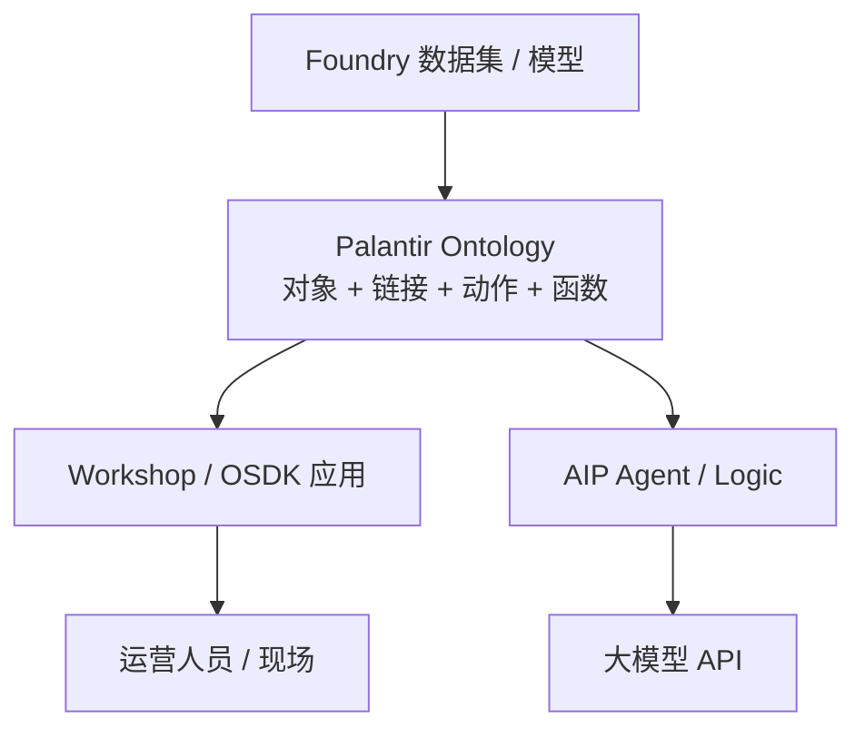
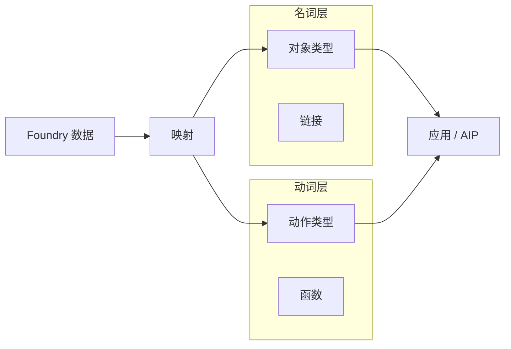
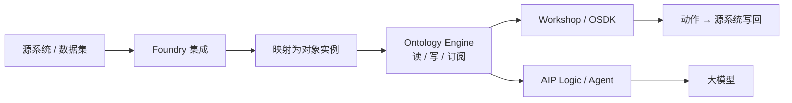

# Palantir Ontology

> [!tip] 核心本质
> **Palantir Ontology** 是 Foundry 里的 **运营层世界模型**：把数据集、虚拟表和模型输出映射成企业中的 **对象、链接、属性**，并定义经权限管控的 **动作与函数**，让大模型和 Agent 在**有类型、能写回、可审计**的数字孪生上推理和执行，而不是只在相似文本上联想。没有这一层，企业 Agent 多半停在文档检索；有了它，人工智能平台（AIP）才能把模型拴在「可信数据 + 业务逻辑 + 受控操作」上，走 **本体增强生成（OAG）**。

适合想**只靠这一篇**搞懂 Palantir Ontology 的读者。读完 [[#1 问题语境|§1]] 知道解决什么、不是什么；[[#2 架构：名词层与动词层|§2]] 拼出组件；[[#3 核心原理|§3]] 能复述**为什么**这样设计；[[#4 OAG 与 AIP|§4]]、[[#5 本体怎么长出来|§5]] 能说明落地路径；[[#7 怎么接 Agent|§7]] 会区分 OSDK 与两套 MCP；[[#8 亮点|§8]]、[[#9 局限与代价|§9]] 能判断值不值得投入。文末 [[#读完后自测|自测]] 含原理题与用法题。观测日 2026-06-21。

*检索说明：[Foundry Ontology overview](https://www.palantir.com/docs/foundry/ontology/overview/)、[Ontology system](https://www.palantir.com/docs/foundry/architecture-center/ontology-system/)、[Palantir MCP](https://www.palantir.com/docs/foundry/palantir-mcp/overview/)、[Ontology MCP](https://www.palantir.com/docs/foundry/ontology-mcp/overview/)、[OSDK](https://www.palantir.com/docs/foundry/ontology-sdk/overview/)、[AIP 降幻觉](https://blog.palantir.com/reducing-hallucinations-with-the-ontology-in-palantir-aip-288552477383)（观测 2026-06-21）。*

## 生命周期与演进

**当前定位**：Palantir 架构**中心层**（`stability: mid`）。早于本轮大模型热潮；2024–2026 随 AIP、OAG、本体 MCP（OMCP）成为「企业 Agent 怎么接地」的常见参照。官方强调 **以决策为中心**，而不只是 **以数据为中心**：建模企业如何做决定，不是只登记有哪些表。

**预期寿命**：中期。平台闭源，但「先建世界模型，再让 Agent 读写」的思路已被多家 context layer 产品复述；**对象—动作—治理** 三元组仍可作为架构对照尺。

**近期演进**：AIP Agent Studio / Logic、AIP Analyst（约 2026 GA）、AIP Autopilot、OMCP（beta）、Palantir MCP（GA，70+ 工具）。

**终极威胁**：轻量自托管记忆 + 通用 MCP 在中小场景够用；纯超长上下文若被接受为「足够接地」，会削弱重平台投入——高监管、必须写回运营系统的场景仍偏这条路线。

## 1 问题语境：光能答还不够，还要能动手

企业常问：「哪些客户订单受港口延误影响？能不能自动改配送窗口？」

向量 [[rag]] 能召回提到「延误」「订单」的段落，但通常做不到：确认「客户订单」是同一类业务实体；调用已审批的流程写回 ERP；按角色拒绝未授权修改。

Palantir 的论点是：运营场景需要 **数字孪生**——语义上对齐工厂、订单、客户，并允许在治理下 **改变** 系统状态。官方把 Ontology 描述为坐在集成数据之上的 **运营层（operational layer）**，许多部署里它就是组织的数字孪生。

### 1.1 在企业 AI 栈里占哪一层

Ontology **不是**大模型，也**不是** Foundry 里的原始数据湖。它是 **数据之上的语义与动作层**；AIP 把各家大模型拴在这一层上；一线应用（Workshop、Object Explorer）和人机工作流也读同一套对象。



**图 0：** Ontology 在栈中的位置。

### 1.2 是什么、不是什么

| | 是 | 不是 |
| --- | --- | --- |
| 角色 | 企业 **运营数字孪生** + Agent 接地层 | 静态数据目录或元数据清单 |
| 存什么 | **对象类型** 与其实例、链接、受控 **动作** | 季度更新一次的 OWL 文件归档 |
| 怎么答 | OAG：查 **对象**、调 **函数**、经审批 **动作** 写回 | 纯 chunk 向量检索 |
| 治理 | 对象级安全、审计、应用作用域 | 检索到什么就生成什么 |
| 产品边界 | Foundry + AIP 一体 | 可单独拎出去的开源框架 |

日常说的「ontology 很火」在 Palantir 语境里，指的是 **这套 Foundry 产品层**，不是语义网课程里的抽象本体论。歧义索引见 [[ontology]]。

## 2 架构：名词层与动词层

### 2.0 一个对象长什么样（直觉）

Ontology 里的实例是 **对象（object）**，不是一行裸 SQL。下面用供应链场景示意（非真实 API，只为建立直觉）：

| 元素 | 例子 |
| --- | --- |
| **对象类型** | `CustomerOrder`（客户订单） |
| **属性** | `orderId`、`status`、`promisedDeliveryDate` |
| **链接** | `CustomerOrder → belongsTo → Customer` |
| **动作类型** | `UpdateDeliveryWindow`（改配送窗口，带审批与写回 ERP） |
| **函数** | `forecastDemand(orderIds)`（Prophet 预测，给 Agent 当工具） |

Agent 问「受延误影响的订单」时，应落到 **同一 `CustomerOrder` 类型** 的实例上查询，而不是在多篇 PDF 里找相似段。

### 2.1 语义元素（名词层）

| 概念 | 干什么 |
| --- | --- |
| **对象类型（Object type）** | 业务实体类：工厂、订单、客户 |
| **属性（Property）** | 字段与元数据（含安全标记） |
| **链接类型（Link type）** | 对象间关系 |
| **接口（Interface）** | 多对象类型的共同「形状」，支持多态 |

数据源要 **映射** 进上述类型，而不是只在 catalog 里登记表名。目的是支撑 Object Explorer、Workshop 等 **终端工作流**，不是做静态文档。

### 2.2 动力元素（动词层）

| 概念 | 干什么 |
| --- | --- |
| **动作类型（Action type）** | 经治理的写操作或流程：采集现场数据、触发下游系统 |
| **函数（Function）** | 可演进业务逻辑，供应用与大模型工具调用 |

只有名词层时 Agent 只能读和说；没有动词层就不能在合规下 **改** 运营系统。只有表连接、没有对象抽象，每个应用都会重复造领域模型。



**图 1：** 数据映射进 Ontology；应用与 AIP 共用同一世界模型。

### 2.3 语言、引擎、工具链

[架构文档][ontology-system] 把底层概念分成三块（不是三个单独进程）：

| 块 | 职责 |
| --- | --- |
| **语言（Language）** | 对象、链接、动作、函数、安全策略的形式化表达 |
| **引擎（Engine）** | 大规模读（SQL、订阅变更）与写（事务、批变更、CDC 镜像运营系统） |
| **工具链（Toolchain）** | OSDK、DevOps 治理、应用托管——Ontology 当 **应用后端** |

## 3 核心原理

[[#2 架构：名词层与动词层|§2]] 讲**有什么**；本节讲**为什么**——读完应能解释取舍，而不只是背名词。

### 3.1 为什么是「决策中心」，不是「数据中心」

数据湖回答「有哪些表、多少行」；运营 AI 要问「**现在**该对哪些订单改配送、谁有权限改、改完写去哪」。

Ontology 把 **决策所需的语义（对象）与能力（动作）** 建成一层共享模型，让人、应用、Agent 不再各自从原始表重新理解业务。RAG 文档里写了「客户」不等于系统里有一个可写回的 `Customer` 对象——决策链会断在「读到了字，动不了系统」。

### 3.2 为什么名词和动词必须成对

| 只有名词层 | 只有动词/脚本 |
| --- | --- |
| Agent 能查、能聊 | 能改系统 |
| 不能合规写回 | 每个集成一套 ad-hoc API，无统一对象语义 |
| 幻觉表现为「说错」 | 幻觉表现为「改错对象」 |

Palantir 把 **动作类型** 与对象绑在同一 Ontology 里，是为了让「能做什么」和「对谁做」同一套治理，而不是让 LLM 自己猜该调哪个 REST 端点。

### 3.3 为什么是 OAG，而不是裸 RAG

| | RAG | OAG（本体增强生成） |
| --- | --- | --- |
| 锚定单位 | 文本 chunk | **带类型的对象** + 属性 |
| 计算 | 主要靠 LLM 编 | **函数**（预测、规则）+ LLM 编排 |
| 写回 | 通常没有 | **动作类型**，带权限与审计 |
| 典型失败 | 指代漂移、片面证据 | 在已有对象上仍可能合成错，但边界更清 |

OAG 不是否定检索，而是在检索之外给 LLM **工具**：查对象、跑函数、提交动作。供应链 copilot 示例：拉历史订单对象、调 Prophet 函数、在 UI 展示调用了哪些工具——降低「流畅但无依据」的幻觉。

### 3.4 为什么拆 Palantir MCP 与 OMCP

| | Palantir MCP | OMCP（本体 MCP） |
| --- | --- | --- |
| 角色 | **建**本体：改类型、连应用 | **用**本体：读对象、执行已登记动作 |
| 写生产数据 | **不能** | **能**（限应用作用域） |
| 风险 | 误改 schema | 数据离开 Foundry 进入外部 LLM |

拆开的原理：**改世界规则** 与 **在世界里行动** 权限模型不同。让外部 Copilot 连 OMCP 时，文档明确要求评估合规——数据会出平台边界。

### 3.5 为什么 AIP 不是「又一个更大的模型」

AIP 是 **编排与治理层**：模型路由、Agent Studio、Logic 工具链、Autopilot 追踪、评测。大模型负责语言与规划；**真相**在 Ontology 的对象状态，**计算**在函数，**副作用**在动作。把 AIP 当成模型会误以为「换更大模型就够用」——运营 AI 的瓶颈常在 **接地与写回**，不在参数量。

## 4 OAG 与 AIP：怎么一起工作

**本体增强生成（OAG）** 在 [[rag]] 之上，让大模型通过工具访问 Ontology 的对象、属性、函数。[官方 Logic 博文][aip-logic-oag] 的供应链例子：不只搜文档，还拉订单对象、跑预测函数，并展示工具调用链。

**AIP 组件（概念级）**

| 组件 | 作用 |
| --- | --- |
| **AIP Logic** | 编排 LLM + Ontology 工具（数据工具、逻辑工具） |
| **Agent Studio** | 配置多步 Agent 网络 |
| **AIP Analyst** | 对话查 Ontology、可视化、执行动作 |
| **AIP Autopilot** | 多 Agent 工作流追踪与调试 |

相对纯 RAG 的三条增量（与 [[#3.3 为什么是 OAG，而不是裸 RAG|§3.3]] 对应）：锚定到对象、计算外置到函数、写回走动作类型。

## 5 本体怎么长出来

Ontology 不是一次导入表格就结束；典型路径如下。

**表 1：** 建设路径

| 阶段 | 做什么 | 谁参与 |
| --- | --- | --- |
| **接入数据** | 数据集、虚拟表、模型输出进 Foundry | 数据工程师 |
| **定义语义** | 建对象类型、属性、链接；做映射 | 本体构建者 + 业务 |
| **定义动力** | 建动作类型、函数；接 ERP/现场系统 | 应用 + 合规 |
| **交付应用** | Workshop、OSDK 应用、AIP Logic / Agent | 开发者 + 运营 |
| **对外 Agent** | Developer Console 开 OMCP，划应用作用域 | 平台 + 安全 |

个人 brain 式「随手记 Markdown」不是这条路径的目标；Ontology 面向 **已集成运营数据、要写回、要审计** 的企业。

## 6 AIP 落地形态（运行时）

一线使用通常经过：

```text
用户 / Agent 意图 → AIP Logic / Analyst → 查 Ontology 对象
                  → 调函数（预测、规则）→ 可选：提交动作类型 → 写回运营系统
```

- **Object Explorer / Workshop**：人查对象、点动作。  
- **AIP Logic**：把 LLM 与 Ontology 工具绑成可复用流程。  
- **OMCP**：外部 Agent 在 **应用作用域** 内读写在册动作。

## 7 怎么接 Agent

### 7.1 本体软件开发包（OSDK）

[OSDK][osdk-overview] 让 TypeScript、Python、Java 等 **直接读写 Ontology**：类型由本体生成，token 按应用裁剪对象子集，权限跟用户走。适合把 Foundry 当后端做自定义运营应用——官方称 **用业务语言写的业务 SDK**。

### 7.2 两套 MCP，不要混

| | **Palantir MCP** | **OMCP** |
| --- | --- | --- |
| 给谁用 | 建本体的开发者 | 消费本体的外部 Agent |
| 能做什么 | 70+ 工具：改类型、搜本体、管 Developer Console | 暴露对象、动作、查询为 MCP tools |
| 能写生产数据吗 | **不能** | **能**（限已登记动作） |
| 状态 | GA | Beta |

协议机制见 [[tool-mcp]]。连 OMCP 前须评估：**数据会离开 Foundry 进入外部大模型**（原理见 [[#3.4 为什么拆 Palantir MCP 与 OMCP|§3.4]]）。

### 7.3 三条接触路径（怎么「用上」Ontology）

| 路径 | 适合谁 |
| --- | --- |
| **A. 在 Foundry 内用 AIP** | 已有 Foundry，从 Logic / Analyst 起步 |
| **B. OSDK 写应用** | 要把 Ontology 嵌进自研 React / 后端 |
| **C. OMCP 接外部 Agent** | Copilot、Gemini Enterprise 等要读写在册动作 |

未买 Foundry 的读者：本文仍可用于理解 **架构参照**；动手需平台账号与官方教程（[learn.palantir.com](https://learn.palantir.com)）。

## 8 亮点

下列是 [[#2 架构：名词层与动词层|§2]]–[[#6 AIP 落地形态|§6]] 的浓缩判断；原理见 [[#3 核心原理|§3]]，代价见 [[#9 局限与代价|§9]]。

### 8.1 运营数字孪生，不是目录

对象 + 链接 + 实时映射，让人和 Agent 共享同一套业务语义。

### 8.2 动作类型一等公民

能 **合规写回** ERP / 现场系统，而不只是生成建议文本。

### 8.3 OAG 把 LLM 拴在对象与函数上

检索补语义相似；对象与函数补 **类型、计算、副作用边界**。

### 8.4 治理内建

对象级安全、应用作用域、OMCP 划界——面向受监管行业的设计。

### 8.5 人机同一后端

Workshop 与 AIP Agent 读同一 Ontology，减少「人看的盘」和「Agent 用的世界」分裂。

## 9 局限与代价

### 9.1 平台与许可

闭源 Foundry 全家桶，成本高，不适合个人或小团队起步。

### 9.2 建设周期长

对象模型、动作、权限、下游集成需业务与工程共建；不是「接向量库就能问」。

### 9.3 OMCP 与合规

外部 LLM 消费生产数据须单独评估；beta 接口可能变。

### 9.4 反模式

| 反模式 | 后果 |
| --- | --- |
| Ontology 当 **高级 catalog**，不定义动作 | Agent 只能聊，不能办事 |
| 每个 RAG 项目 **自建 entity schema** | 与 Ontology 重复，治理分裂 |
| OMCP **不划应用作用域** | 过度暴露生产对象 |

### 9.5 不适合指望的场景

- 个人笔记、开源 Agent 栈的轻量记忆  
- 只需只读文档 QA、无需写回  
- 无 Foundry 预算与集成意愿  

## 10 架构深潜：数据怎么流

跟实现或选型时，可按数据流理解（非操作手册）。



**读路径**：查询对象 → SQL / 对象 API → 返回带类型的实例。  
**写路径**：动作类型 → 权限校验 → 事务写 Ontology 与下游系统。  
**Agent 路径**：OMCP / Logic 工具 → 同上，但工具列表由应用注册。

建议阅读顺序：

1. [Ontology overview][foundry-ontology-overview]  
2. [The Ontology system][ontology-system]  
3. [Reducing hallucinations with Ontology in AIP][aip-hallucination]  
4. [Logic tools for RAG/OAG][aip-logic-oag]  
5. [Palantir MCP][palantir-mcp-doc] 与 [OMCP][omcp-doc] 对比  

## 术语速查

| 词 | 含义 |
| --- | --- |
| **Object type** | 业务实体类（订单、工厂…） |
| **Action type** | 经治理的写操作/流程类型 |
| **Function** | Ontology 中的可调用业务逻辑 |
| **OAG** | 在 RAG 之上用 Ontology 对象与函数接地 |
| **AIP** | Palantir 人工智能平台（编排与治理，非基础模型） |
| **OSDK** | 用代码读写 Ontology 的 SDK |
| **Palantir MCP** | 构建侧 MCP，改类型、不能写生产数据 |
| **OMCP** | 消费侧 MCP，外部 Agent 读写在册动作 |
| **数字孪生** | 运营世界的语义 + 可变更镜像 |

## 读完后自测

能答 **原理题** 说明懂了「为什么」；能答 **用法题** 说明能对话或选型。只答用法、答不出原理，多半是记住了名词，还没拼出机制。

**原理**

1. Ontology 为什么是「决策中心」而不是「数据中心」？  
2. 为什么对象类型和动作类型要放在同一层模型里？  
3. OAG 相对裸 RAG 多解决哪三类问题？  
4. Palantir MCP 与 OMCP 为什么要拆成两个 MCP？  
5. 为什么说 AIP 不是「换更大的模型」就够？

**用法**

6. `CustomerOrder` 对象类型与 `UpdateDeliveryWindow` 动作类型分别解决什么？  
7. 自研 React 应用读 Ontology 用 OSDK；外部 Copilot 写订单状态应走哪条路？  
8. 把 Ontology 只当数据目录、不定义动作，Agent 会卡在哪一环？

**参考要点**（先自答再对照）：1→§3.1；2→§3.2；3→§3.3；4→§3.4；5→§3.5；6→§2.0；7→§7.2–7.3；8→§9.4。

## 要点收束

- **Palantir Ontology** = Foundry 运营层数字孪生：**对象/链接（名词）+ 动作/函数（动词）+ 安全**。
- 原理主轴：决策中心、名词动词成对、OAG 接地、双 MCP 分工、AIP 编排而非模型。
- **OAG** = RAG + 对象/函数/动作工具；**AIP** 负责 Logic、Agent Studio、治理追踪。
- **OSDK** 给应用；**Palantir MCP** 给构建；**OMCP** 给外部 Agent（beta，须合规）。
- 适合已集成运营数据、要写回、要审计的企业；不适合个人轻量记忆场景。

## 进一步阅读

### 库内关联

- [[rag]] — OAG 的基线对照
- [[graph-rag]] — 离线图索引（不同问题域）
- [[knowledge-fusion]] — 符号层对齐
- [[tool-mcp]] — MCP 通用机制
- [[ontology]] — 「Ontology」歧义索引

### 官方

- [Ontology overview][foundry-ontology-overview]
- [The Ontology system][ontology-system]
- [Ontology SDK][osdk-overview]
- [Palantir MCP][palantir-mcp-doc]
- [Ontology MCP][omcp-doc]
- [Reducing hallucinations with the Ontology in AIP][aip-hallucination]
- [Logic tools for RAG/OAG][aip-logic-oag]
- [Connecting Agents to Decisions][agents-decisions]

[foundry-ontology-overview]: https://www.palantir.com/docs/foundry/ontology/overview/
[ontology-system]: https://www.palantir.com/docs/foundry/architecture-center/ontology-system/
[osdk-overview]: https://www.palantir.com/docs/foundry/ontology-sdk/overview/
[palantir-mcp-doc]: https://www.palantir.com/docs/foundry/palantir-mcp/overview/
[omcp-doc]: https://www.palantir.com/docs/foundry/ontology-mcp/overview/
[aip-hallucination]: https://blog.palantir.com/reducing-hallucinations-with-the-ontology-in-palantir-aip-288552477383
[aip-logic-oag]: https://blog.palantir.com/building-with-palantir-aip-logic-tools-for-rag-oag-fdaf8938d02e
[agents-decisions]: https://blog.palantir.com/connecting-agents-to-decisions-277dee8ddb40
