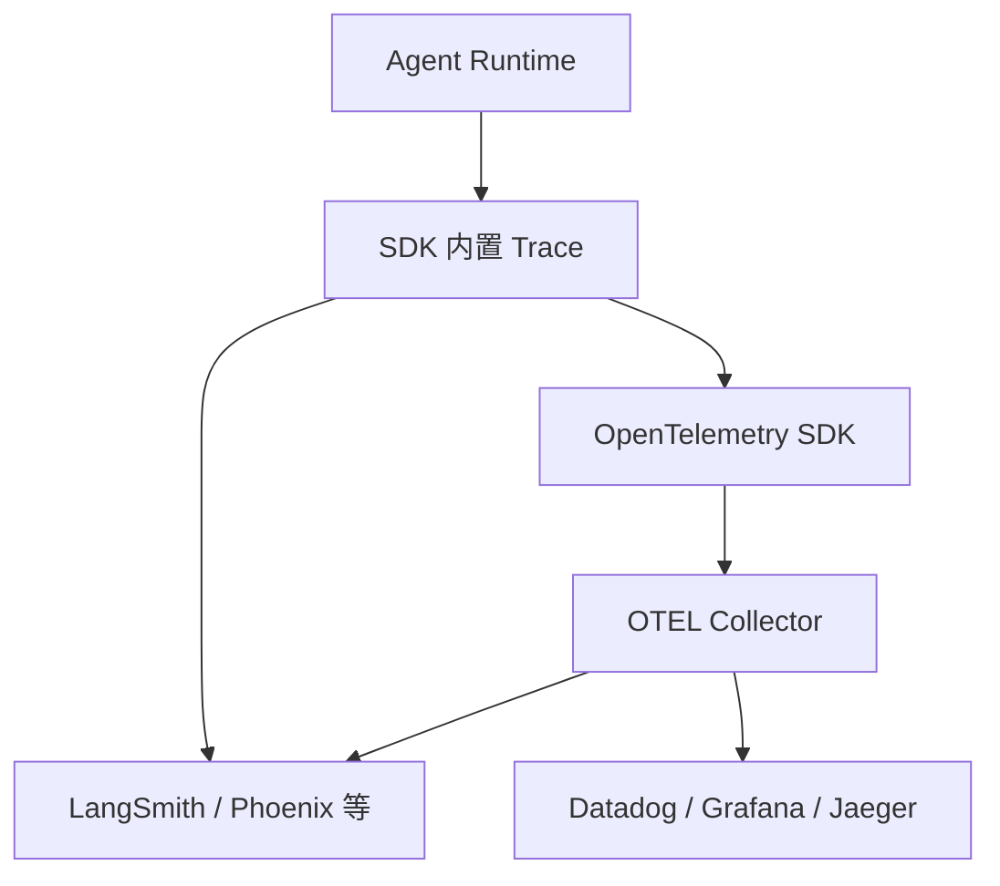

---
tags:
  - harness
  - observability
aliases:
  - Agent 可观测性
  - Agent Observability
prerequisites:
  - "[[harness-engineering]]"
  - "[[agent]]"
  - "[[agent-evaluation]]"
related:
  - "[[langgraph]]"
  - "[[tool-use]]"
  - "[[cursor-hooks]]"
stability: mid
layer: methodology
updated: 2026-06-15
---

# Agent 可观测性（Agent Observability）

> [!tip] 核心本质
> **Agent 可观测性**把多步 LLM 调用、工具执行、状态迁移与成本**可追溯、可对比、可告警**——没有 trace，[[agent-evaluation]] 的离线 golden set 无法解释线上退化，[[harness-engineering]] 的错误分层也缺证据。Chat 日志只看输入输出；Agent 必须看**轨迹树**：哪一步选错工具、哪一步 token 爆炸、哪条检索 chunk 进了 context。

适合已部署 [[agent]] / [[langgraph]]、需要联调与生产的工程师。本篇讲三层栈（SDK trace → Agent 平台 → OpenTelemetry），与评测分工见 [[agent-evaluation]]。

*检索说明：对照 [LangSmith OTEL](https://docs.langchain.com/langsmith/trace-with-opentelemetry)、[LangChain OTEL 博客 2025](https://www.langchain.com/blog/end-to-end-opentelemetry-langsmith)、[DEV Agent Observability 2026](https://dev.to/chunxiaoxx/ai-agent-observability-in-2026-openai-agents-sdk-langsmith-and-opentelemetry-3ale)（观测 2026-06-15）。*

## 生命周期与演进

**当前定位**：Wave 2 P1 缺口——[[harness-engineering]] 提到可观测性但未专文；2026 生产标配为 **Agent-native 平台 + OTEL 导出** 双轨。

**预期寿命**：中期。产品（LangSmith、Phoenix、Braintrust）变快；OTEL GenAI 语义约定趋稳。

**近期演进**：LangSmith 端到端 OTEL（`LANGSMITH_OTEL_ENABLED`）；Collector **fan-out** 同时送 LangSmith 与 Datadog/Grafana；OpenAI Agents SDK 默认 trace。

**终极威胁**：托管 Agent 黑盒只给摘要 trace；自研 Agent 仍要可移植 telemetry。

## 1 观测什么

| 信号 | 用途 |
| --- | --- |
| **Span 树** | 每步 LLM / tool / 子 Agent  latency 与 I/O |
| **Token / 成本** | 按 run、按用户、按工具聚合 |
| **状态快照** | LangGraph checkpoint、中间变量 |
| **检索上下文** | 进了 prompt 的 chunk id（联调 RAG） |
| **错误与重试** | 工具失败、CRAG 换源次数 |

与 [[agent-evaluation]]：观测是**连续/采样**；评测是**版本化 golden + 分数门槛**。

## 2 推荐三层架构（2026）

| 层 | 角色 |
| --- | --- |
| **Runtime SDK** | OpenAI Agents SDK、LangGraph callback、LangSmith `@traceable` |
| **Agent 平台** | 调试单 run、dataset 评测、反馈、实验对比 |
| **OTEL** | 厂商中立；GenAI/agent/MCP 语义约定；与企业 APM 汇合 |

**LangSmith 原生 trace** vs **OTEL**：仅 LangSmith 时用原生格式更低开销；要 **fan-out 多后端** 时用 OTEL + Collector（见 [LangSmith OTEL 文档](https://docs.langchain.com/langsmith/trace-with-opentelemetry)）。

## 3 与 Harness 闭环

1. **开发**：trace 定位错 tool / 错 chunk
2. **离线**：失败 run 沉淀进 [[agent-evaluation]] dataset
3. **CI**：评测回归 + 可选 trace diff
4. **生产**：延迟/成本/错误率告警；[[prompt-injection]] 异常工具序列

[[cursor-hooks]] 做**同步门禁**；可观测性做**异步发现与归因**。

## 4 选型简表

| 需求 | 倾向 |
| --- | --- |
| LangGraph 深度调试 | LangSmith / LangGraph Studio |
| 开源本地 | Arize Phoenix（OTEL/OpenInference） |
| 已有 Datadog/Grafana | OTEL export + Collector fan-out |
| pytest 指标 | DeepEval + 可选 trace 附件 |

`latest/langsmith` 待建产品专文；本篇保留**架构分工**。

## 5 坑

| 误区 | 做法 |
| --- | --- |
| 只有最终答案日志 | 逐步 span + tool I/O（脱敏） |
| 生产不采样 | 高流量采样 + 错误全量 |
| 可观测≠评测 | golden set + 阈值 block 发布 |
| 忽视成本 span | 每 run 记 token 与模型 id |

## 要点收束

- Agent 可观测性 = 轨迹树 + 成本 + 上下文证据，不是单行日志。
- SDK trace + Agent 平台 + OTEL 三层可并存。
- 与 [[agent-evaluation]]、[[harness-engineering]] 组成闭环。
- OTEL fan-out 适合 LangSmith 与 APM 双收。

## 进一步阅读

### 库内

- [[agent-evaluation]] — 离线指标与 golden
- [[harness-engineering]] — 边界、门禁、错误分层
- [[langgraph]] — 图 trace 与 checkpoint
- [[retrieval-pipeline]] — 检索 span 该记什么

### 外部

- [Trace with OpenTelemetry (LangSmith)](https://docs.langchain.com/langsmith/trace-with-opentelemetry)
- [End-to-end OTEL in LangSmith](https://www.langchain.com/blog/end-to-end-opentelemetry-langsmith)
