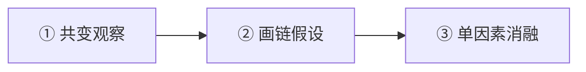
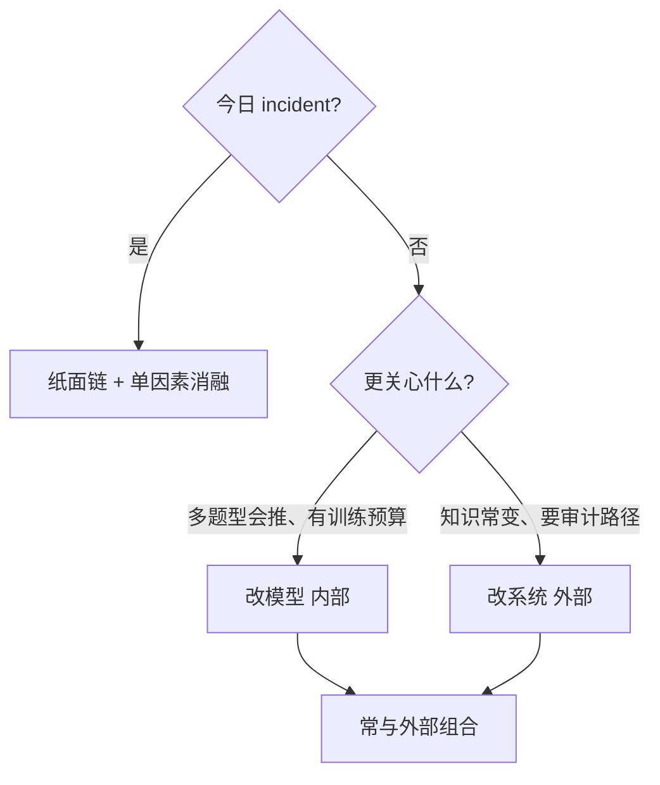

---
tags:
  - reasoning
  - methodology
  - causal
related:
  - "[[chain-of-thought]]"
  - "[[planning]]"
  - "[[reflection]]"
  - "[[reAct]]"
  - "[[prompt-engineering]]"
  - "[[context-engineering]]"
  - "[[rag]]"
  - "[[tool-use]]"
  - "[[retrieval-pipeline]]"
  - "[[inductive-bias]]"
aliases:
  - 因果链
  - 因果推理
  - 因果分析
  - causal reasoning
  - 因果思维
stability: long
layer: methodology
updated: 2026-06-05
---

# 因果链

> [!tip] 核心本质
> **因果链**是一种分析习惯：不只记录**发生了什么**，还要追问**上一步为什么**、**改哪一处配置才能改变结果**。没有它，团队看到指标一起变好就会直接「换模型试试」，却说不清该动检索、提示词还是评测集里的哪一环——排障停在**相关叙事**，无法形成可复现的干预。

**读者契约**：正在 incident 排障者，读完「三层链」与「排错卡片」即可动手（约 15 分钟）；系统学习者建议顺序读完前三节再练一次单因素消融；架构/训练选型者再读第五节「LLM 因果集成」。本节不替代动手：合格最低线是**一条可干预假设 + 一次单因素对比 + 一句反事实预测**。

## 生命周期与演进

**当前定位**：AI 系统设计、调试与文档写作里的通用分析框架，不绑定某一种模型或框架；与 [[prompt-engineering]]、[[context-engineering]]、[[harness-engineering]] 同属方法论层——回答「怎么想清楚再动手」，而非具体组件实现。

**预期寿命**：长期。具体产品会变，但**先画链、再每次只改一项**不会过时；会逐渐融入 [[planning]]、[[reflection]]、[[reAct]] 等执行模式，而不是单独挂在嘴边。

**近期演进**：[[chain-of-thought|思维链]] 把推理步骤写进上下文，人更容易对照链检查跳步；研究侧则从「提示里多说因果」走向**改训练目标**与**运行时因果结构**（因果 RAG、工具前门禁等，见第五节）。

**终极威胁**：没有新技术能取代**问为什么**；只会换包装。真正削弱因果链习惯的是**同周多变量齐变却不做消融**——用更炫的术语把共变包装成因果。

## 相关、因果与共变陷阱

本节建立直觉：**相关**只说明共现，**因果**（工程语境）要求你能指出**只改哪一环、其余冻结时，结果如何变**。图 1 左栏即这一区分。

![[causal-reasoning-basics.png]]

**图 1：** 左：相关与因果；中：描述 / 机制 / 干预三层；右：设计时正向推、排错时逆向追。

### 1.1 证据流水线

整条方法论可收成三步——动手改参之前，至少走完 ②，最好做完 ③：



| 阶段 | 笔记里写什么 | 常见错误 |
| --- | --- | --- |
| ① 共变 | **A 与 B 共变，机制待证** | 直接写 **A 导致 B** 并立刻改参 |
| ② 画链 | 中间步骤 + 标 **D / M / I**（见下节） | 只有两个指标，没有机制路径 |
| ③ 消融 | 冻结基线，**每次只改一项**；写「撤回 X，症状是否回来」 | 同周改多项，用逆向树「讲故事」 |

工程上可操作的因果判据：**只改 A（控制项不动）→ B 按预期变 → 撤回 A 症状可回**。不能从「这周 A、B 一起变好」直接跳到「该动 A」。

### 1.2 三个典型反例

下面三则都是**误判范本**——团队常听到的解释，听起来像因果，其实仍是相关叙事。

| 反例 | 相关叙事 | 应改用 |
| --- | --- | --- |
| 长链共变 | 召回多了，回答就好了 | 头尾指标可同涨，中间任一步断了都不行；画清链看断点 |
| 混杂齐变 | 换了新模型，分数就涨了 | 同周还改了提示/评测/流量时，**任何逆向树都只是故事** |
| 指标错位 | NDCG 升了，用户仍答非所问 | 问断在检索、引用还是生成；左边指标 ≠ 右边体验 |

**长链示例**：召回率高与回答质量好常同时出现，但中间至少三步——片段是否真相关（精排）→ 进上下文后是否被引用 → 题型是否本来就要靠检索。**误判**是推出「再抬召回就一定更好」；**应改用**在链上标「共变、机制待证」，再选一环做单因素消融。

### 1.3 与共现偏置的关系

大模型在**旁观式文本**上训练，学会的是「A 后面常跟 B」，不是「我执行 A 会不会改变 B」（见 [[inductive-bias]]）。因此：**人会画链 ≠ 模型会自动遵守因果**；提示里强调「请做因果推理」往往只改善话术，不保证干预判断正确。第五节讨论可选的系统/训练补强；**今日排障仍只需纸面链 + 消融**。

## 三层链：描述、机制与干预

分析时不要混层。三层对应：**发生了什么 → 为什么 → 改哪里**（图 1 中栏）。

### 2.1 D / M / I 各层问什么

| 层 | 问什么 | 约束 |
| --- | --- | --- |
| **描述 D** | 按时间发生了啥？ | 只记事件顺序，不写原因、不写修复 |
| **机制 M** | 断在哪一跳？为什么？ | 从症状往回问「← 为什么」；真实排障要在节点旁写 **或：…** |
| **干预 I** | 改哪一处**你能动**的配置？ | 不能是「换更强的模型」，除非 M 层已证明能力才是断点 |

**干预层**的试金石：若说不出「去掉这项改动，症状会怎样变」，就还没进入干预——只是在描述层多写了一句「我们换了模型」。

### 2.2 RAG 答错：一条链贯穿

用同一故障贯穿三层（可与 1.2 长链、指标错位对照）：

```
描述：  提问 → 检索 → 生成 → [答案错了]
机制：  [答案错了] ← 未引用 ← 缺依据 ← 未命中 ← 术语错位
干预：  在「术语错位」加查询改写（其余冻结，做单因素消融）
```

机制层教学用单路径即可；排障时在「未命中」旁写 **或：精排把正确文档压后**，并用日志区分。干预要落到具体名字：`rewrite` 模板、chunk 策略、schema 字段——不是「优化检索」。


## 三种走法：设计、排错与验证

同一条链，按场景选方向（图 1 右栏）：**设计**从干预往前推副作用；**排错**从症状往回追；**验证**用消融检验是不是在猜。

### 3.1 排错：从症状往回追

硬规则：**一次会话只改一项**。

| 步骤 | 时间 | 做什么 |
| --- | --- | --- |
| 钉症状 | ~2 min | 一句坏结果 + 复现路径（query、trace、截图） |
| 描述层 | ~2 min | 事件链止于症状；>7 节点则收到子系统（RAG / Agent / 提示） |
| 机制层 | ~5 min | 「← 为什么」直到叶子是**可改配置** |
| 标可控 | ~1 min | 叶子标 **我方能改 / 需他人 / 未知**；本次只动「我方能改」 |
| 选干预 | ~2 min | 一个节点 + 具体改动（不要「优化提示」） |
| 单因素消融 | ~2 min | 只改 X，其余冻结；**撤回 X 症状是否回来** |
| 收尾 | ~1 min | 证实 / 推翻 / 不明；推翻则回机制层换**兄弟分支** |

**可抄模板**：

```
症状：
复现：
描述层：___ → ___ → ___ → [症状]
机制层：[症状] ← ___ ← ___ ← [叶子：具体控制项]
干预：节点 ___ ，改动 ___ ，预期影响 ___
消融：冻结 ___ ，只改 ___ ；若撤回则 ___
```

**Agent 总选错工具**示例：现象 ← 以为两工具都能用 ← 说明太像 ← 没写「何时不用」**或**路由默认打到工具 A → 干预：各工具加「适用/不适用」示例；无效再查路由，不要只加「请仔细选」。

何时才考虑第五节集成方案（须同时满足）：① 找不到可控干预，或连续两次消融仍不明；② 问题是跨文档因果问答或高风险不可逆工具；③ 有人维护图/门禁并接受建设成本——**不是热修捷径**。

### 3.2 验证：单因素消融

只有做完消融，才能把链上的「A 与 B 共变」升级为「在你关心的场景下，A 导致 B」。

声称「查询改写提升命中率」时，至少对比：

| | 只开改写 | 只换 embedding | 两者都开 |
| --- | --- | --- | --- |
| 命中率 | ? | ? | ? |
| 引用率 | ? | ? | ? |

- 只有「只开改写」明显变好 → 主因多半是改写  
- 只有「只换 embedding」变好 → 链要改，上游可能是向量表示  
- 多列同时变好 → **本次归因作废**，重新冻结基线  

日常一句：**去掉这一步，问题还在吗？**——还在，这条边尚未证实。

### 3.3 设计：从改动往前推

从**准备加的改动**往结果推，并**同时写副作用**——每次干预都是下注。

```
准备加：查询改写（口语 → 文档术语）

主链：改写 → 更易命中 → 上下文更贴 → 少胡编 → 回答更准
副作用：多一次调用（延迟、token）；改写错专有名词 → 检索更差
```

Agent 给两工具加「不适用」示例时，同样画两条 3–4 节点的正向树：**主效果**与**副作用**（延迟、误拒、token 至少写一条具体代价）。

## 写作与 Agent 模式衔接

### 4.1 文档里的因果表述

| 写法 | 例子 | 问题 |
| --- | --- | --- |
| 只描述现象 | 用了 RAG 能提升质量 | 没说任务与机制 |
| 只有相关 | 上了 RAG 的团队效果更好 | 无法复现，不知抄哪一步 |
| 有因果链 | RAG 把文档塞进上下文，补训练截止后的知识，在强事实题上减少胡编 | 有机制与边界 |

自检：每写一句「所以……」，连问三次「所以呢？」。复盘里的 DAG、后门调整等术语，必须能对应**关掉/改了什么、指标怎么变**；否则删掉，避免用 jargon 包装共现。

### 4.2 与执行模式的关系

[[planning]]、[[chain-of-thought]]、[[reflection]]、[[reAct]] 不是另一套理论，而是**同一条链的不同走法**——不能替代画链与消融。

| 模式 | 在链上怎么走 |
| --- | --- |
| [[planning]] | 从目标往回拆：要达成 X，必须先有什么 |
| [[chain-of-thought]] | 从条件往前推：步骤进上下文，方便查跳步 |
| [[reflection]] | 从坏结果往回查：哪一步或哪条信息有问题 |
| [[reAct]] | 往前推 + 环境反馈修正：行动 → 观察 → 再决定 |

## LLM 因果集成：可选路线

人会画链，不等于 [[agent|Agent]] 运行时自动遵守。预训练的**共现偏置**（见 1.3）使模型擅长续写「A 后常跟 B」，不擅长回答：**若我执行这个操作，结果会不会变？** 或 **是 A 导致 B，还是混杂因素 C 同时导致两者？**

因此存在**可选**路线：用训练或运行时结构减少共现冒充因果。**观测截至 2026-06**：方向是从「提示里多说因果」走向**改权重**与**改系统架构**；具体仓库名变得快，选型盯住 **改模型 / 改系统** 即可。

> [!warning] 集成不是门槛
> Causal RAG、CIVeX、[公理训练][axiom-train] 等是**可选增强**。合格排障最低线仍是：**一条可干预假设 + 一次单因素对比 + 一句反事实预测**。没有图数据库也可以做因果链分析。

### 5.1 路线总览



### 5.2 改模型（内部）

在**训练或对齐**阶段，让权重不只记共现，而记**满足某种因果推理规则**。

- **公理式训练**：用同一类推理规则的大量变体练**规则**，减轻「因果鹦鹉」——话术像、新图不会推（[Axiomatic Training][axiom-train]，ICML 2025）。
- **因果思维链 + 对齐**：先建因果图（含混杂）再推理；奖励可同时看答案与图是否合规。**同答案、不同推理过程**可训出很不同的行为——只筛最终答案难稳因果能力。

**何时优先内部**：要在多种新题、新图上都会推；有干预类数据与训练成本；不急于上因果图基础设施。

### 5.3 改系统（外部）

不重训大模型，在运行时把**谁导致谁**交给可更新结构。

**因果 RAG（摘要）**：在相似度检索之外，沿原因—结果方向扩展并重排，把**链条说明 + 文档**交给生成。难点：自动抽边常错（先发生后发生、定义关系当因果），**不能盲信图上每一条边**——与上文「链上是假设」一致，自动化后更易忘记（[CausalRAG][causal-rag]、[CC-RAG][cc-rag]）。

**何时考虑**：要跨文档的 cause→effect 链，而非相似段落；领域边常变且要审计路径；多次单因素消融仍显示问题在**检索结构**而非措辞。

**CIVeX（摘要）**：在 [[tool-use]] 的 schema/策略校验之外，问这次工具调用在因果上是否说得通——把**执行工具**视为对世界的**干预**，返回 EXECUTE / REJECT / EXPERIMENT / ABSTAIN 四类可审计结论（[CIVeX][civex]）。**观测截至 2026-06**：论文强调「合法 tool call ≠ 合法干预」；混杂工作流下，观测日志里看起来最优的动作，执行后可能降效用。

**何时考虑**：不可逆或高爆炸半径（写库、发邮件、扣款、生产变更）；提示与 schema 已调仍反复选错工具。

### 5.4 内部 vs 外部

| 对比项 | 改模型（内部） | 改系统（外部） |
| --- | --- | --- |
| 更新业务知识 | 常需再训练或再对齐 | 改图、改库即可 |
| 结论可追溯 | 难（权重不透明） | 易（图与检索路径可记） |
| 典型翻车 | 干预类训练数据太少 | 自动抽因果边抽错 |
| 与今日排障 | 长期能力；不替代消融 | 架构选型；不替代画链 |

常见组合：**外部图管事实与可追溯** + **内部训练更会读图** + **CIVeX 挡高风险工具**。集成是在帮某一层自动化，**不能取代**机制层的「或：…」与单因素消融。

## 进一步阅读

### 库内关联

- [[chain-of-thought]] — 推理步骤外显，便于对照链查跳步
- [[planning]] / [[reflection]] / [[reAct]] — 同链上的不同走法
- [[rag]] / [[retrieval-pipeline]] / [[query-transformation]] — 检索链路上的干预示例
- [[tool-use]] — 工具执行与 CIVeX 针对的干预风险
- [[inductive-bias]] — 共现偏置与「改权重」路线的动机
- [[knowledge-extraction]] — 抽错 vs 融错时的链上归因

### 外部参考

- [Axiomatic Training of Language Models][axiom-train] — 第五节「改模型」公理训练路线
- [SCM-GRPO (2026)][scm-grpo] — 因果图 + 强化学习对齐
- [CausalRAG (2025)][causal-rag] · [CC-RAG (2025)][cc-rag] — 因果结构检索与实现评估
- [CIVeX: Causal Intervention Verification for Language Agents][civex] — 工具调用前的干预可识别性门禁

[axiom-train]: https://arxiv.org/abs/2407.07612
[scm-grpo]: https://arxiv.org/html/2605.01482v2
[causal-rag]: https://arxiv.org/html/2503.19878
[cc-rag]: https://arxiv.org/html/2506.08364v1
[civex]: https://arxiv.org/abs/2605.09168
