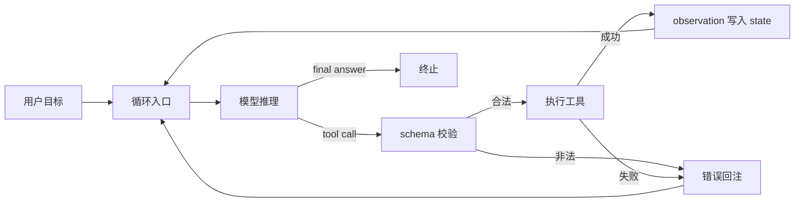

---
tags:
  - concept
aliases:
  - harness engineering
  - 驾驭工程
  - 系统工程
prerequisites:
  - "[[llm]]"
  - "[[agent]]"
  - "[[prompt-engineering]]"
  - "[[context-engineering]]"
related:
  - "[[prompt-engineering]]"
  - "[[context-engineering]]"
  - "[[agent]]"
  - "[[workflow]]"
  - "[[skill-loading-library]]"
  - "[[cursor-hooks]]"
  - "[[building-effective-agents]]"
stability: mid
layer: application
updated: 2026-06-05
---
# Harness Engineering（驾驭工程）

> [!tip] 核心本质
> Harness Engineering 是在 LLM 外包一层可控运行系统——循环、工具编排、状态、错误恢复与安全边界——把单次生成串成可终止的多步任务。若没有它，系统会在「第一步输出之后」断掉：模型碰不到真实 API、记不住上一步结果、工具失败后没有统一收敛路径，任务无法稳定交付。

## 生命周期与演进

**当前定位**：三代范式顶端；Agent Runtime、LangGraph、Cursor/Claude Code 宿主均属 Harness 实践。

**预期寿命**：长期；具体框架实现会轮换，但「模型外循环 + 工具 + 状态」结构稳定。

**近期演进**：推理模型承担更多规划，Harness 变薄、偏执行与安全；Skill/MCP/Hooks 标准化工具面。

**终极威胁**：平台内置不可替换的 Harness 时，自建编排价值下降；但领域边界与安全策略仍须本地定制。

## 核心原理

*检索说明（2026-06-05）：对照 [Anthropic: Building effective agents](https://www.anthropic.com/engineering/building-effective-agents)（发布 2024-12-19）、[LangGraph overview](https://langchain-ai.github.io/langgraph/concepts/why-langgraph/)，以及库内 [[agent]]、[[tool-use]]、[[workflow]]、[[cursor-hooks]]；外链验真见 _meta/article-reviews/ 当轮 verification_log。*

本文面向已了解 [[llm]] 与 [[agent]] 的工程师：说明 Harness 解决什么问题、与 Prompt/Context 两代范式的分界，以及设计 Harness 时四个机制性抉择。**读完「四个机制抉择」四节即可判断自己的任务是否需要 Harness**；实现选型与框架对比见「典型实现」与「实践与应用」。

**本篇权威范围**：多步 Runtime 机制与四抉择在此展开；[[agent]] 讲谱系、感知-思考-行动循环与薄循环代码示例；[[tool-use]] 讲单次调用的 schema/风险分层；[[workflow]] 讲代码写死的控制流；[[cursor-hooks]] 讲 Cursor 上的硬边界——本篇不复制上述原理段，只链出。

### 从「说话」到「干活」的鸿沟

本节回答：**单次 LLM 调用优化，为什么解决不了多步任务？**

[[prompt-engineering|Prompt Engineering]] 决定单次调用里**怎么说**；[[context-engineering|Context Engineering]] 决定单次调用里**给模型看什么**。二者都只优化「一问一答」这一拍。

真实任务却是链式的：查资料、调 API、写文件、根据上一步结果改计划。模型本身无持久状态、不能直接触达外部系统，也不会在某步失败后自动换策略——这些能力必须写在模型**外面**。若只靠加长 prompt，你会遇到三类硬限制：上下文装不下完整执行史；模型无法真正执行工具；某步 JSON 解析失败后没有统一的重试与降级路径。Harness 就是补上这三块缺口的运行层。

### Harness 是什么

本节回答：**Harness 由哪些模块组成，各模块缺了会在哪一环断掉？**

Harness 借自软件测试里的 test harness：包裹被测核心、提供受控入口与观测面的基础设施。在 Agent 语境里，它把 LLM 当作「推理核」，外面接上表 1 所列能力，才构成可上线的 [[agent|Agent Runtime]]。

**表 1 — Harness 组成与存在理由**

| 组成部分 | 作用 | 没有它会怎样 |
|---------|------|-------------|
| 循环管理 | 维持「推理 → 行动 → 观察」直到任务完成或达步数上限 | 模型一次输出即结束，多步任务无法推进 |
| 工具编排 | 定义可调工具、参数 schema、结果回注 context 的格式 | 模型只能「说」不能「做」，或幻觉出不存在的 API |
| Skill 加载 | Discovery 注入 listing、Activation 载入 `SKILL.md`、Execution 调 scripts/MCP | 能力全堆进 system prompt，token 爆炸且难以版本化 |
| 状态管理 | 跨轮保留任务进度与中间产物 | 每轮失忆，无法基于上一步结果继续 |
| 错误处理 | 工具失败、格式错误、死循环的兜底 | 一步失败整链崩溃，或 token 在无效重试中烧光 |
| 安全边界 | 审批、配额、路径白名单；含 [[cursor-hooks]] | 自主 Agent 可能误删、超支或越权访问 |

读表 takeaway：六块能力可逐项对照现有 Runtime——缺哪列「没有它会怎样」，就在哪补模块；不宜无差别堆满工具或记忆层。

### 和前两代的关系

本节回答：**Harness 与 Prompt/Context、与 Agent 产品的边界各在哪？**

易与「Agent 产品」混为一谈：Agent 是面向用户的整体能力，Harness 是其中的 **Runtime 层**——负责循环与工具，不负责模型权重或业务 UI。三代范式则解决不同粒度的问题；Harness 不取代 Prompt/Context，而是**在每次循环迭代里仍依赖它们**：

```
Prompt Engineering → Context Engineering → Harness Engineering
   单次怎么说            单次给什么信息            多步怎么跑起来
```

箭头表示**能力粒度递进**，不是「后者替代前者」：在每次 loop 迭代内，三者**并列**——每轮仍要写 prompt、管 context，再由 Harness 负责多步编排与收敛。

Harness 内每一轮模型调用，仍要写对 prompt、管对 context；Harness 额外负责**把多轮调用编排成可终止、可恢复的任务**。

一次多步任务在 Harness 里的最小因果链如下（对照 [[causal-chain]]；与 [[agent]] 图 L2 同构，本篇强调 Harness 侧职责）：用户目标进入循环 → 模型基于当前 state 推理下一步 → 若输出 tool call 则 Harness 校验并执行 → observation 写回 state → 直至终止条件或 `max_steps`。断在任一环节，任务就不会收敛：没有循环则只有一拍；没有校验则工具幻觉直达生产；没有 state 回注则模型看不见自己上一步做了什么。Anthropic 将自主 Agent 概括为「LLM 依环境反馈在循环中使用工具」[^anthropic-agent-loop]，并建议显式设置停止条件（如最大迭代次数）[^anthropic-stop]。



**图 1 — Harness 最小循环**：安全与配额检查在 Validate/Execute 之前由 [[cursor-hooks]] 等横切，图中未画出。

读图 takeaway：多步任务至少要闭合「推理 →（可选）校验 → 执行 → 回注」；若使用托管 `tool_use`，Validate/Execute 可能在 API 侧完成，Harness 仍须维护 state 并接住 observation，否则闭环在平台边界处断开。

### 四个机制抉择

以下四个机制抉择决定 Harness 是「能跑」还是「能稳跑」；答案背后是机制权衡，不是配置清单。请依次阅读下面四节——工具面、状态、错误与边界——再在「四抉择如何相互制约」对照联动表。

### 工具怎么给

本节回答：**工具面该多大、调用如何在校验层拦住？**

在工具描述噪声较大、或模型 tool-calling 能力有限时，工具面越大，选错工具或捏造参数的概率往往越高——因为 action space 与描述噪声同步增长。（当 schema 与 few-shot 示例质量高、且模型 tool 选择已较稳时，这一风险可显著降低。）Harness 因此按**任务域**裁剪工具集，并为每个工具提供可校验的 schema；非法调用在到达真实 API 前被拦截，把排障面收敛到「schema 不匹配」而非「生产环境已执行」。schema 设计与风险分层详见 [[tool-use]]。

Action space 随工具面同步膨胀、而 schema 校验未跟上时，选错工具与捏造参数的代价会被放大到真实 API 层——无效 observation 与重试轮番回注，token 在排障扩散前已烧光。弱描述叠加宽工具面时，幻觉 API 名也会混入循环；表面是「模型不听话」，实质是校验层未在触盘前收口。

### 状态怎么管

本节回答：**跨步任务如何记进度又不爆 context？**

多步任务既要记住进度，又不能把完整执行史长期留在 context——在缺少压缩/归档策略时，成本会随步数近似线性上升，并干扰注意力。Harness 区分短期任务态（当前计划、上几步 observation）与长期偏好（跨会话用户设定）；并在步数或 token 达阈值时压缩或归档。压缩过早，模型会重复已完成步骤；过晚则会因 context 溢出而静默丢信息。排障时先问「丢的是任务态还是偏好」，再定压缩阈值，而不是一味加长 context。

Context 逼近上限后旧 observation 会被静默截断，模型上一轮读过的文件内容在推理里「消失」，下一轮又发起 `read_file`——这是 state 未归档的可复现症状，而非模型不可靠。若同时压缩过早，摘要会丢掉路径与关键字段，已完成步骤被重复执行，burn token 且可能触发幂等风险。

### 错误怎么处理

本节回答：**策略性失败与瞬态失败各走哪条收敛路径？**

工具超时、4xx/5xx、模型输出非 JSON 都是常态而非异常。**策略性失败**（参数/schema 错、业务拒执）适合把结构化错误回注模型，让下一轮换策略；**幂等性瞬态失败**（网络超时、临时 5xx）在重试上限内静默重试往往更省 token。解析失败须设重试上限；循环须设 `max_steps`，避免无限 burn。没有分层兜底，单次失败就会表现为「Agent 卡住」或「用户看到半截结果」。三类拦截在链路上的先后与回注格式，见下文「走读：一次 tool 失败如何收敛」。

把 503 当 schema 级策略失败回注，与把格式错静默重试一样，都是错误分层错位——前者让模型在同一 HTTP 调用上无限换措辞，后者让非法参数直达生产。正确分层应让瞬态 5xx 在重试上限内静默收敛，schema/参数错在 Validate 层拒执并结构化回注，两侧都不应越层执行。

### 边界怎么划

本节回答：**自主循环的红线应写在哪一层、如何可审计？**

自主性越高，越需要红线外置：删文件、付款、发外部消息等操作走人工或 Hook 审批；token 与 API 调用设配额；敏感路径只读。在主要依赖自然语言 system 禁令、且缺少代码级 Hook 时，模型对禁令的服从往往不稳定；删库、付款等红线因此宜写在 Harness 代码拦截层，可审计、可测试。Cursor 上的事件 Hook 与 `block` 回注约定见 [[cursor-hooks]]。

红线若只留在自然语言 system 禁令里，高危 shell 往往在 Hook 介入前已发出，事后缺少可审计的 block reason，回滚与追责成本陡增。把 Hook block 当成普通 tool 可重试错误同样危险——Agent 会反复撞同一条红线直至 `max_steps` 触顶，仍无交付。

### 四抉择如何相互制约

本节回答：**工具/状态/错误/边界四抉择会不会互相打架？**

四节机制定好后，对照下表看联动。四个设计问题不是正交配置项，而是**牵一发而动全身**的杠杆——改一个抉择会放大或抵消另一个。

| 若你先… | 会挤压… | 典型失败模式 |
| --- | --- | --- |
| 扩大工具面 | 状态与错误策略 | 工具选错次数上升，context 塞满错误 observation，重试 burn token |
| 加长 state 不压缩 | 工具选择与边界 | context 溢出后静默丢步，模型重复调用已执行工具 |
| 只回注错误不换策略 | 工具 schema 质量 | 同一 schema 错误循环重试，`max_steps` 触顶无交付 |
| 边界只写 prompt 无 Hook | 工具与自主循环 | 高危调用在审批前已发出，事后无法审计 |

设计顺序上，与 [[building-effective-agents]]「先最简单、可度量后再加复杂度」一致：宜 **先划边界与工具 schema → 再定 state 压缩 → 最后调错误分层**；在边界未硬编码前扩工具面，失败面最大。读表 takeaway：排障时先问「是哪一个抉择失衡」，而不是再加一个工具或加一段 system prompt。

### 典型实现

本节回答：**现有框架与薄循环各适合什么场景？**

Harness 不必从零造轮子，但选型取决于你要的是「低层编排运行时」还是「直接 API + 薄循环」。

**自定义薄循环**适合工具集稳定、步数可预期、无需跨会话恢复的任务。Anthropic 建议**先用 LLM API 直接实现**可组合模式，许多生产 Agent「本质上就是带环境反馈的 LLM–工具循环」[^anthropic-thin]；完整 Python 示例见 [[agent]]「Runtime」节。机制上，薄循环自带循环、schema 校验与 observation 回注，但通常**缺 durable execution 与 human-in-the-loop**：进程崩溃或 `max_steps` 触顶后 state 即失，长任务断点恢复与人工审核节点须自建或外接存储。

**LangGraph**（[overview](https://langchain-ai.github.io/langgraph/concepts/why-langgraph/)，检索 2026-06-05）是**低层编排运行时**，在薄循环之上补持久 state、检查点、HITL 与跨失败恢复[^langgraph-core]；不抽象 prompt 架构，常与 LangChain 集成但可独立使用。适合需要人工审核节点、长任务断点恢复、LLM 动态分支的流程（与 [[workflow]] 图编排场景重叠，但控制流不必写死）。简单、工具集稳定的任务，薄循环往往比全功能框架更易调试（Anthropic 亦指出框架额外抽象会增加排障难度[^anthropic-framework]）。

**LlamaIndex Agents**（[模块指南](https://docs.llamaindex.ai/en/stable/module_guides/deploying/agents/)，检索 2026-06-05）面向检索与知识管理导向的 Agent 栈；本篇未逐页核对 API 细节，实现选型请以官方文档为准。

选型 takeaway：先问任务是否需要 durable state 与 HITL——不需要则薄循环足够；需要检查点、人工节点或长任务恢复时再引 LangGraph 类运行时，避免为稳定小任务叠框架抽象。下文「走读」以自建薄循环演示四机制在同一条任务链上的落点——校验拒执、state 重拉、Hook block 与 503 分层各走不同收敛路径，可用来对照你的 Runtime 是否缺层。若走读中的场景在自家系统里无法定位（不知落在 Validate、state 还是 Hook），往往说明编排层尚未把四抉择硬化为可观测模块。

### 走读：一次 tool 失败如何收敛

本节回答：**图 1 与错误/边界分层在链路上怎么落地？**

> **性质**：教学走读，场景对齐 [[tool-use]]（schema 校验、风险分层）与 [[cursor-hooks]]（`beforeShellExecution` 硬拦截），**不是**某次生产 incident 的实录。

下面走读把「工具 / 状态 / 错误 / 边界」四机制落到同一条任务链：工具 schema 在校验层收口，observation 写入 state 供后续推理，错误按策略性/瞬态分层，高危命令在 Hook 处硬拦截。

假设自建薄循环（非托管 `tool_use` API），任务从一次 **工具** 层的 schema 拒执起步：模型输出 `read_file` 调用，JSON 里漏掉必填 `path`，Harness 对照 schema **不触盘**并回注 `{field:"path", expected:"string"}`（机制同 [[tool-use]]「预定义 schema 校验」）——对应 §工具怎么给，排障面留在 Validate 而非生产副作用。模型补全 `path` 后校验通过，`read_file` 成功，observation 写入 state。

几轮工具调用后，**状态** 成为下一道坎：context 逼近 token 上限，若未触发压缩则旧 observation 被静默截断，模型在推理里「忘记」刚读过的文件片段，又发起一次 `read_file`；若压缩过早，摘要丢掉路径细节，同样导致重复拉取——对应 §状态怎么管，症状是可复现的 re-fetch，而非模型不可靠。Harness 须在阈值处归档或压缩，并把关键路径保留在任务态，否则 state 层与工具层会互相放大 token 浪费。

任务继续推进时，**边界** 与 **错误** 分层先后登场。模型输出 `run_terminal_cmd(command="rm -rf ./build")`，`beforeShellExecution` Hook 直接 **block** 并返回明确 reason 回注（见 [[cursor-hooks]]「block 时返回 reason」）——这是 §边界怎么划 的策略性拒执，须换路径或请求用户确认，**不是**瞬态 503 的静默重试。模型改为列出目录后，若调用外部 HTTP 工具遇 503，Harness 在重试上限内静默重试一次；仍失败则回注 `{status, body_snippet}`，由模型换策略或降级答复——对应 §错误怎么处理 的瞬态/策略性分层。链路最终在 `max_steps` 触顶或模型输出 final answer 时终止（对照图 1 `Done`）。

走读 takeaway：**schema 拒执、state 重拉、Hook block、503 重试**落在不同层——前三者消耗「规划质量」与「上下文预算」，后者才消耗外部配额；把 Hook block 当成可无限重试的 tool 错误，会反复撞红线。排障时先定位落在 Validate、state 归档、边界 Hook 还是 Execute，再选回注/重试/人工。

---

## 实践与应用

原理节的四个设计问题在实现里落成具体策略；用同一任务可以看出 Harness 何时值得付出复杂度。

同一任务「写一篇技术博客」，三种编排方式体现 Harness 的价值边界：

| 方式 | 实现 | 局限 |
|------|------|------|
| 纯 Prompt | 一次性生成全文 | 无法查资料；长文易跑题；无中间态可恢复 |
| [[workflow\|Workflow]] | 固定：大纲 → 查资料 → 正文 → 润色 | 步骤写死；资料不足时无法改计划 |
| Harness（Agent） | 循环：模型择下一步；工具负责搜索与读写；状态记录已完成节 | 成本高；须 Harness 提供工具、状态与步数上限 |

读表 takeaway：三种方式差在**有无外部工具、状态与收敛**——需要查资料或分步写长文时，纯 Prompt 不够；步骤可预先写死且异常少时，Workflow 往往比 Agent 更省；只有计划常变、须工具与恢复时，才值得上 Harness。

第三种若去掉 Harness，就退化为第一种——模型没有可调用的搜索与文件工具，也没有跨步记忆。

若以 Harness 写这篇博客，四抉择可落成检查单：**工具**只保留搜索与读写并做 schema 校验；**状态**记录大纲与已完成节、步数达阈时压缩；**错误**对搜索超时静默重试、对格式/schema 错回注换策略；**边界**对外发布与文件删改走审批或 Hook。逐项对照可判断 Workflow 是否已够用，还是必须上 Agent 级 Runtime。

---

## 常见误区与边界

**Non-goals**：Harness 不负责单次调用的措辞质量（归 [[prompt-engineering]]）或上下文裁剪策略（归 [[context-engineering]]）；不替代 [[workflow]] 能覆盖的固定 DAG；也不是「模型越强就越可省略」——推理模型减轻的是**规划**负担，**执行、状态、工具、安全**仍须在模型外实现。

**表 2 — 易混概念对照**

| 概念 | 决定什么 | 典型误判 |
|------|---------|---------|
| Agent 产品 | 面向用户的整体能力（UI、模型、策略） | 把产品名当 Runtime；忽略其下的 Harness 层 |
| Harness / Runtime | 多轮循环、工具、状态、安全 | 与 Agent 产品混谈；或以为可完全内置于模型 |
| Prompt Engineering | 单轮怎么说 | 用更长 system prompt 代替循环与工具 |
| Context Engineering | 单轮看什么 | 用 RAG 塞满 context 代替跨步 state 管理 |
| Workflow | 步骤固定的 DAG | 步骤写死后当 Agent 用，遇异常无法改道 |
| Harness | 多轮如何跑、失败如何收 | 堆满工具与记忆层，把本该用 Workflow 的任务复杂化 |

读表 takeaway：先对照「决定什么」列定层级——Agent 产品≠Runtime，Prompt/Context 管单轮，Workflow 管固定 DAG，Harness 管多轮收敛；误判多发生在把低层问题用高层能力硬顶。

「模型越强，Harness 越不重要」：[[agent]] 已述——Reasoning 模型（如 o3 / Claude 3.7+）改善的是链内**单步规划**，但 LLM 仍**无状态**，循环、工具执行、权限边界无法内化；Harness 可更薄，却不会消失（与 [[agent]]「坑与误区」、Anthropic「agents 仍需 stopping conditions 与 sandbox 测试」[^anthropic-stop] 一致）。

过度设计是另一头：工具过多、记忆层级过深、规划套规划，延迟与失败面同步放大。能用 [[workflow]] 封死的任务不必上 Agent 级 Harness；好的 Harness 默认**薄、可组合、可替换**。

---

## 进一步阅读

**库内**

- [[agent]] — 谱系、薄循环代码示例；Runtime 层即 Harness 的产物
- [[prompt-engineering]] / [[context-engineering]] — Harness 每轮调用仍依赖这两层
- [[workflow]] — 何时不必上 Harness；与 Anthropic Workflow 定义互证
- [[tool-use]] — schema 校验、工具风险分层（走读 schema 拒执场景依据）
- [[cursor-hooks]] — `beforeShellExecution` 硬边界（走读 Hook block 场景依据）
- [[building-effective-agents]] — Workflow vs Agent、先简单后复杂
- [[skill-loading-library]] — Skill 注入流水线

**外部**

- [LangGraph overview](https://langchain-ai.github.io/langgraph/concepts/why-langgraph/) — 低层编排、durable execution、HITL（检索 2026-06-05）
- [Anthropic: Building effective agents](https://www.anthropic.com/engineering/building-effective-agents) — Workflow vs Agent、先 API 后框架、停止条件（发布 2024-12-19）
- [Cursor Docs — Hooks](https://cursor.com/docs/agent/hooks) — 事件类型与配置（走读中的 Hook 步骤以官方为准；库内见 [[cursor-hooks]]）

[^anthropic-agent-loop]: Anthropic, *Building effective agents*, 2024-12-19: “Agents are typically just LLMs using tools based on environmental feedback in a loop.”
[^anthropic-stop]: 同上: stopping conditions such as a maximum number of iterations; extensive testing in sandboxed environments with guardrails.
[^anthropic-thin]: 同上: start with LLM APIs directly; successful implementations use simple, composable patterns.
[^anthropic-framework]: 同上: frameworks add abstraction that can obscure prompts/responses and make debugging harder.
[^langgraph-core]: LangGraph overview, 检索 2026-06-05: persistence, human-in-the-loop, durable execution for long-running stateful agents.
