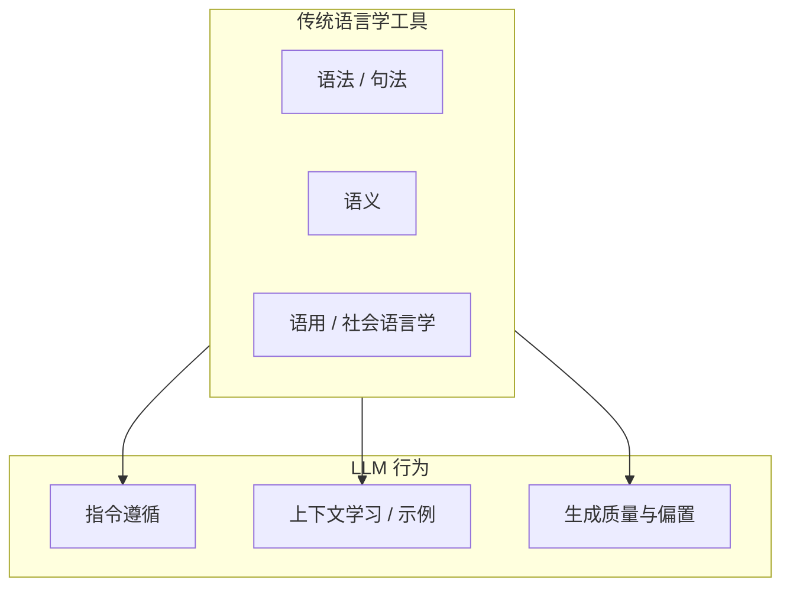

# 指令语言学（Instruction Linguistics）

> [!tip] 核心本质
> 用户消息、Rules、Skill、system prompt 在模型侧都是同一 context 里的语言输入——但「人和模型怎么说话才有效」长期被当作 prompt 技巧或工程经验，缺少系统化的语言学研究。指令语言学描述的是**正在成形的研究交叉区**：用语法、语义、语用、社会语言学等工具，分析措辞、语气、结构和示例如何改变 LLM 的行为与执行。若没有这个视角，容易把单次 A/B 测试当成 universal 规则，或把工程直觉误当成已证实的语言学定律。

## 生命周期与演进

**当前定位**：活跃的研究前沿，**尚未**成为像「计算语言学」那样有独立院系、教材和统一命名的成熟学科。2023–2026 年论文、taxonomy 和会议数量快速增加，与 [[instruction-design]] 的工程实践形成「研究 ↔ 应用」互补。

**预期寿命**：中长期。只要 LLM 仍通过自然语言接收指令，「语言形式如何影响模型行为」就是可研究、可测量的对象；具体结论会随模型代际更新，但问题本身不会消失。

**近期演进**：PromptPrism（EACL 2026）提出语言学 taxonomy；Imperative Interference（2026）引入社会 register 视角；SUSTAINSCORE / When Thinking Fails 量化约束与推理对任务的干扰；SkillOpt 从轨迹优化 Skill 文本。研究从「哪个 prompt 更好」转向「为什么某种语言形式在何种条件下有效」。

**终极威胁**：端到端优化（SkillOpt 类）自动推导指令文本，人类语言学分析退居「初稿设计 + 审计」；模型能力跃升后，部分措辞敏感性可能下降——但 register、冲突、示例干扰等结构性问题在可预见未来仍会存在。

---

## 有没有独立学科？

**简短答案：没有统一命名的成熟学科，但有清晰的研究地图。**

| 名称 | 状态 | 典型内容 |
|---|---|---|
| **Computational Linguistics（计算语言学）** | 成熟学科，向 LLM 扩展 | 语法、语料、句法分析；LLM 内部语言表征 |
| **Applied Linguistics × AI** | 有会议（如 AIRiAL），未成一级学科 | 语言学习、评测、多模态交互中的 AI |
| **Language of Prompting** | 明确研究议题（EMNLP 2023 等） | mood、时态、情态、同义词与任务表现 |
| **Prompt Linguistics / PromptPrism** | 2026 框架化 | prompt 的功能结构、语义成分、句法模式 |
| **Instruction Following 研究** | NLP 子领域 | 约束遵循、层级冲突、IFEval / ComplexBench |
| **Prompt / Instruction Engineering** | 工业实践 | 怎么写 prompt、Skill、Rules（见 [[instruction-design]]） |

工程侧常统称「prompt engineering」；学术侧更接近 **Human–LLM Instruction Linguistics（人机指令语言学）**——强调「语言输入如何被模型处理」，而非单次任务调参。

---

## 研究地图：五条主线

### 1. Prompt 的语言学属性（Language of Prompting）

**代表**：[The language of prompting](https://aclanthology.org/2023.findings-emnlp.618/)（EMNLP 2023 Findings）

在语义等价前提下，系统改变 **mood（祈使/疑问/陈述）**、时态、aspect、**modal verb（must / might / should）**、同义词，测量 LLM 在分类、QA 等任务上的表现。

**主要发现**：
- 措辞变化可导致显著准确率波动（例如 OPT-30B 上 must→might 差约 17 点）
- **没有**跨模型、跨任务的 universal 最优句式
- 低 perplexity、词频、长度**不能**可靠预测 prompt 优劣

**对工程的含义**：措辞重要，但不存在「换几个词就通吃」的 magic words——须针对模型 + 任务实测。详见 [[instruction-design#约束写法：有实验数据的部分]]。

### 2. Prompt 的结构化 taxonomy（PromptPrism）

**代表**：[PromptPrism](https://aclanthology.org/2026.findings-eacl.61/)（EACL 2026 Findings）

用语言学原则分解 prompt 的三层：
- **Functional structure**：prompt 在对话中的功能角色
- **Semantic component**：任务语义与约束的打包方式
- **Syntactic pattern**：句式、分隔符、列表结构

提供：taxonomy 引导的 prompt  refinement、数据集 profiling、语义重排与 delimiter 修改的敏感性实验。

**对工程的含义**：把 Skill / Rules 当作**可分析的语言对象**，而不只是「一段 Markdown」——结构、语义、句法应分开优化。

### 3. 语用与社会 register（Pragmatics & Social Register）

**代表**：[Imperative Interference](https://arxiv.org/abs/2603.25015)（2026）；Deontological Keyword Bias（ACL 2025）

**Imperative Interference**：system prompt 指令被模型当作 **social act（社会行为）**，而非纯技术规格。命令式（「NEVER do X」）在不同语言/语域下 obligatory force 不同；英语下指令可「合作」，西班牙语下同类堆叠可「竞争」。陈述式（「X: disabled」）在某些设置下降低跨语言方差（单块改写约 81%，p=0.029）。

**Deontological Keyword Bias**：prompt 中加入 must / ought to / should 等，模型在义务判断任务上 >90% 将非义务场景判为「有义务」——modal 词会系统性改变模型对「义务强度」的解读。

**对工程的含义**：「必须/严禁」不是 neutral 的技术词，而是带 register 的语用信号；多语言或多约束场景下，陈述式事实描述有时比命令堆叠更稳（边界：中文单语场景的直接数据仍少）。**跨语言差异、MaXIFE 与混合指令策略**见 [[cross-lingual-instruction]]。

### 4. 示例与上下文学习（ICL / Few-shot Linguistics）

**代表**：[Demonstration Conflict in ICL](https://arxiv.org/html/2603.04464)；[From Harm to Help](https://arxiv.org/abs/2509.23196)；[When Thinking Fails](https://arxiv.org/abs/2505.11423)

- **示例冲突**：少量 corrupted demo 即可大幅降性能；示例 pattern 可与显式指令竞争（Control Illusion：冲突指令下多模型平均约 48% 正确解析层级）
- **Reasoning 模型 + CoT 示例**：few-shot 推理示例在 o1/R1 类模型上常**反效果**（AIME'25 上 3-shot 最多约 -35%），机制含语义误导与策略迁移失败
- **CoT 与约束**：显式推理可能分散对 constraint token 的注意力，损害 ComplexBench 类复合约束任务

**对工程的含义**：「示例优于形容词」**仅对格式/结构类示例较稳**；推理类示例在强 reasoning 模型上应慎用。见 [[instruction-design#行业共识但缺严格 benchmark]]。

### 5. 约束、对齐与 context–参数博弈

**代表**：[SUSTAINSCORE](https://arxiv.org/abs/2601.22047)；Context-Parametric Inversion（IFT 相关研究）

- **SUSTAINSCORE**：在模型本可答对的样本上追加「自明约束」，任务成功率普遍下降（Claude-Sonnet-4.5 多跳 QA 96.7%→45.1%）——IFEval 高不等于「加约束后仍稳」
- **Context-Parametric Inversion**：指令微调过程中，模型对 context 的依赖可能先升后降，更依赖参数记忆——解释部分「强模型对 few-shot 不敏感」现象

**对工程的含义**：约束三分类（默认正确 / 需触发 / 需 Harness 验证）有研究支撑，见 [[instruction-design#约束三分类：决定「加不加」的判断框架]]。

---

## 与 Transformer 机制的关系

指令语言学**不是**独立于模型机制的「话术学」，而是建立在：

| 机制 | 语言学现象如何与之耦合 |
|---|---|
| **Self-Attention** | 不同来源 token（用户 / Rule / Skill / 示例）竞争权重；示例 pattern 可与指令争 attention |
| **Next-token 预测** | 前文结构（列表、对称格式）绑定后续生成（Pattern Completion） |
| **RLHF 对齐** | 训练奖励「全面、端水、安全」，抑制「取立场、非对称深度」（见 [[llm-generation-traps]]） |
| **In-context learning** | 示例作为 context 中的「伪训练样本」，与参数知识博弈 |

[[instruction-design]] 从工程侧综合上述机制；本篇从**研究脉络**标注哪些结论有论文、哪些仍是推断。

---

## 置信度分层（读论文时的习惯）

读 instruction linguistics 相关论文时，建议区分：

| 层级 | 含义 | 例子 |
|---|---|---|
| **有较强实验支持** | 多样本、可引用数字、peer-reviewed | SUSTAINSCORE 约束干扰；SkillOpt 文本优化增益 |
| **有方向性支持 + 边界** | 结论成立但场景有限 | Imperative Interference 的跨语言 register；Language of Prompting 的 modal 效应（老模型） |
| **行业共识 / 待验证** | 生产实践多、严格 AB 少 | 格式示例优于纯文字描述；核心约束放前 500 词 |
| **尚无直接研究** | 合理推断 | 中文 Skill「必须」vs「X：禁用」；Rule vs Skill 优先级量化 |

避免把不同论文测量的现象（遵循率、任务准确率、跨语言方差、hedging）混成一条「沟通定律」。

---

## 与 [[instruction-design]] 的分工

| 文档 | 回答的问题 |
|---|---|
| **本篇（instruction-linguistics）** | 这个交叉领域**是什么**、有哪些研究线、证据边界在哪 |
| **[[instruction-design]]** | **怎么做**——契约四要素、约束三分类、排版、Harness |

读工程文档时，若某条原则需要「为什么」，回溯本篇对应研究线；读本篇时，若需要「明天怎么写 Skill」，去看 [[instruction-design]]。

---

## 进一步阅读

### 本库

- [[instruction-design]] — 人机指令设计的工程综合
- [[cross-lingual-instruction]] — 中英文 prompt 差异与混合指令策略
- [[prompt-engineering]] — 单次调用措辞
- [[context-engineering]] — context 里放什么
- [[llm-generation-traps]] — RLHF 与生成偏置
- [[attention]] — 注意力竞争机制

### 外部论文与资源

- [The language of prompting](https://aclanthology.org/2023.findings-emnlp.618/) — mood / modality / 同义词系统实验
- [PromptPrism](https://aclanthology.org/2026.findings-eacl.61/) — 语言学 taxonomy
- [Imperative Interference](https://arxiv.org/abs/2603.25015) — register 与指令拓扑
- [SUSTAINSCORE](https://arxiv.org/abs/2601.22047) — 约束与任务求解的 paradoxical interference
- [From Harm to Help](https://arxiv.org/abs/2509.23196) — reasoning 模型上的 few-shot CoT 反效果
- [When Thinking Fails](https://arxiv.org/abs/2505.11423) — CoT 与指令遵循的冲突
- [AIRiAL Conference](https://sites.google.com/tc.columbia.edu/airialconference/) — Applied Linguistics × AI 会议
