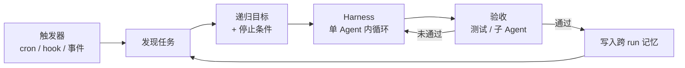

---
tags:
  - concept
  - methodology
aliases:
  - Loop Engineering
  - loop engineering
  - 循环工程
  - Loop 工程
prerequisites:
  - "[[llm]]"
  - "[[agent]]"
  - "[[harness-engineering]]"
  - "[[prompt-engineering]]"
  - "[[context-engineering]]"
related:
  - "[[harness-engineering]]"
  - "[[prompt-engineering]]"
  - "[[context-engineering]]"
  - "[[skill]]"
  - "[[cursor-hooks]]"
  - "[[claude-code]]"
  - "[[openclaw]]"
  - "[[reflection]]"
  - "[[workflow]]"
stability: short
layer: methodology
updated: 2026-06-13
---

# Loop 工程（Loop Engineering）

> [!tip] 核心本质
> Loop 工程（Loop Engineering）是 2026 年 6 月社区命名的新范式：**你不再亲手逐轮 prompt 编码 Agent，而是设计一套在 Harness 之上、按日程或条件自驱的外层系统**——由它发现任务、派发 prompt、执行、验收、记状态，并在停止条件满足前反复调用模型。若没有这层「系统替人 prompt」，开发者仍是循环里的引擎：离开键盘 Agent 就停在中途；Leverage 仍绑在单次对话质量上，无法把重复性工程工作交给可审计的自治循环。

适合已理解 [[prompt-engineering]]、[[context-engineering]]、[[harness-engineering]] 的读者。读到「与三代范式的关系」可判断 Loop 工程是否比手写 prompt 更值得投入；具体产品命令与 API 见 [[claude-code]] 与延伸阅读。

*检索说明（2026-06-13）：对照 Peter Steinberger 2026-06-07 公开表述、Boris Cherny（Claude Code）同期演讲、[Addy Osmani 归纳](https://addyo.substack.com/)、[Firecrawl: Loop Engineering](https://www.firecrawl.dev/blog/loop-engineering)（2026-06-11）、[Lushbinary 指南](https://lushbinary.com/blog/loop-engineering-ai-coding-agents-guide/)（2026-06-09）；产品特性以各厂商文档为准。*

## 生命周期与演进

**当前定位**：2026 年 6 月上旬由 Steinberger（[[openclaw]] 作者）、Cherny（Anthropic Claude Code 负责人）、Osmani 等推动的**话语与工程实践共振**——底层能力（定时任务、`/goal`、Hooks、[[skill]]、子 Agent、MCP）已在 Claude Code、OpenAI Codex 等宿主中落地，术语把既有做法收束成可传授的第四层范式。

**预期寿命**：中短期概念名可能随产品改名而淡化；**「外层系统驱动内层 Agent 循环」** 的结构会留下——与 cron + CI、overnight agent 实验、[[reflection]] 式双 Agent 审阅等同源，只是 2026 年 6 月后更易被产品化。

**近期演进**：`/loop`、`/goal`、Automations、GitHub Actions 触发、worktree 并行、跨 run 的 markdown/JSON 状态文件；与长程 Agent（median 20+ 分钟自主执行，见 trends 对 Perplexity Computer 数据的引用）叠加，checkpoint 与验收 rubric 成为 Loop 设计核心。

**终极威胁**：平台把「发现任务 → 验收 → 重试」全部收进托管 Orchestrator 时，自建外层 Loop 变薄；但若验收标准与组织边界仍须本地定义，Loop 工程退化为**配置与 rubric 设计**而非消失。

## 与三代范式的关系

2026 年 6 月前的递进链常写为 Prompt → Context → Harness。Loop 工程被描述为**再上一层**——Harness 仍负责单次 Agent 会话内的循环与工具；Loop 工程负责**谁、何时、以什么目标与验收规则去启动 Harness**，并在多轮会话之间维持记忆与分工。

```
Prompt Engineering     → 单次怎么说
Context Engineering    → 单次给什么信息
Harness Engineering    → 单 Agent 多步怎么跑起来
Loop Engineering       → 谁替你在日程/条件下反复启动 Harness，直到可验证的完成
```

内层 **Agent 循环**（感知 → 推理 → 行动 → 观察）不变；Loop 工程加的是 **外层控制**：触发器、递归目标、验收门、子 Agent、跨 run 状态。Osmani 的楼层比喻：Prompt 一层、Harness 一层、Loop 再上一层——Loop 跑在 Harness 上，可定时、可 spawn 助手、可自我喂任务[^osmani-floor]。

### 1.1 与 Prompt、工作流、Harness 的边界

| 范式 | 你优化什么 |  autonomy | 典型单元 |
| --- | --- | --- | --- |
| **Prompt 工程** | 单轮措辞与约束 | 无：你在键盘前 | 一次输入输出 |
| **Agent 工作流** | 已知形状的多步链 | 中：步骤预定义，模型填缝 | 一条 pipeline |
| **Harness 工程** | 单会话内的循环、工具、状态 | 中–高：单任务内多轮 | 一次「跑完这个 issue」 |
| **Loop 工程** | 触发、目标、验收、记忆、分工 | 高：可无人值守直到停止条件 | 跨多次会话的自驱周期 |

Prompt 与 Context 不会消失——Loop 由大量 prompt 构成，劣质 prompt 只会**更快地产出劣质结果**。Loop 工程也不是把 cron 换个名字：cron 只负责定时；Loop 还包含**可表达的完成标准、验收子 Agent、与 Harness 的深度集成**（否则只是定时跑脚本）[^firecrawl-cron-debate]。

## 外层 Loop 的解剖

生产里能活下来的 Loop 通常解决同一组问题；Claude Code 与 Codex 命名不同，职责对齐[^firecrawl-anatomy]。



**图 1 — 外层 Loop 相对 Harness 的位置**：内层 H 即 [[agent]] 的 tool 循环；外层负责何时启动、何时停、结果是否可信。

### 2.1 触发器（Trigger）

Something 必须在**不是你打字时**启动一次 run：Codex 的 Automations（仓库 + prompt + 日程 + sandbox）；Claude Code 的 `/loop`、`/goal`、scheduled tasks、[[cursor-hooks|Hooks]]、GitHub Actions 等组合[^firecrawl-trigger]。触发器必须与**停止条件**成对设计，否则要么只跑一轮，要么 token 在无效重试中烧光。

### 2.2 递归目标与停止条件

**递归目标**：用自然语言或结构化 rubric 定义「什么叫做完」——Cherny 表述为不再亲自 prompt，而是让 loops 决定下一步问 Claude 什么[^cherny-loops]。产品层常见 `/goal`：Agent 在多轮内自行规划，直到满足终局条件或触达上限。

停止条件类型：测试/类型检查通过、子 Agent 签核、diff 符合规则、步数/token 上限、人工卡点。Loop 工程的核心难度在**可验证的 Done**——若无法定义 passing，Loop 不知道何时停[^firecrawl-three-checks]。

### 2.3 技能与上下文复用

[[skill]]（`SKILL.md` + 脚本/夹具）把项目专有知识从「每次重讲」变成按需加载；Loop 跨 run 时尤其依赖 Discovery 描述准确，否则 Agent 每轮重新发现同一套约定。与 [[context-engineering]] 的关系：Loop 决定**每轮把什么塞进窗口**，Skill 是其中一块可版本化资产。

### 2.4 子 Agent 与验收分离

回报最快的模式之一是 **Maker / Checker 分离**：一 Agent（或链）改代码，另一 Agent 用更 lean 的指令与独立 context 按项目规则与测试打分——避免「自己批改自己的作业」[^cherny-verify]。这与 [[reflection]] 同构，但 Loop 工程强调**制度化、可重复 spawn**，而非偶发一轮自检。

### 2.5 隔离、连接与跨 run 记忆

**Worktree**：并行 Agent 各用分支与工作副本，避免同 checkout 竞态。**Connectors（MCP）**：Loop 需触达 issue tracker、CI、Slack、线上 API，否则只是目录内脚本。**记忆**：刻意 boring——repo 内 markdown 清单、JSON 状态、Linear 板、SQLite；每次 run **开头读、结尾 append**，才能在 crash 或 context 重置后续跑[^firecrawl-memory]。

## 开放 Loop 与封闭 Loop

社区常用两轴选型[^firecrawl-open-closed]：

| 类型 | 契约 | 适合 | 风险 |
| --- | --- | --- | --- |
| **开放 Loop** | 目标 + 护栏，路径由 Agent 自选 | 探索、原型、未知地形 | 标准模糊则输出噪声大 |
| **封闭 Loop** | 步骤与验收预映射，Agent 在脚手架内迭代 | 重复工程、可回归任务 | 设计成本高，但更省 token、结果可比较 |

多数团队从**封闭 Loop**（固定：改代码 → 跑测试 → 子 Agent review）起步，再对少数任务放开路径。

## 任务是否「Loop 形」

在投入设计前，Firecrawl 等实践者建议三问[^firecrawl-three-checks]：

1. **重复性**：做得够多，设计系统的摊销才划算。
2. **可验收**：「完成」能写成 Agent 或 verifier 可执行的检查（测试、lint、视觉规则、diff 策略）。
3. **价值密度**：产出 worth token 与失败重试成本； trivial 任务不如手 prompt 或普通脚本。

三缺一时，优先 [[workflow]] 或单次 Prompt，而非外层 Loop。

## 实践要点与误区

**典型落地路径**（Claude Code 语境，2026-06 观测）：`CLAUDE.md` 编码非协商规则 → `/goal` 或 scheduled task 承载递归目标 → Hooks 硬边界 → 独立 review 子 Agent 门控合并 → GitHub Action 作触发器。Codex 侧用 Automations + agent skills + `.codex/agents/` 子 Agent，形状类似。

**Leverage 转移的真实含义**：Cherny 等 practitioner 早在 2025 年已高比例用 routine 写代码；2026-06 的公开讨论是把**从业者与「仍逐轮 chat」者之间的 gap 摆到台面上**[^medium-timeline]——不是 Loop 从零发明，而是产品原语与命名同时到位。

**常见误区**：

- **Loop 工程 = Agent 内 while 循环**：那是 [[harness-engineering]] / [[agent]] 层；Loop 工程管**谁在外层 repeatedly 启动**该 while。
- **Loop 工程 = 多 Agent 编排**：多 Agent 可以是 Loop 内一种分工，但单 Agent + 强验收也可以是 Loop。
- **无人值守 = 无责任**：Loop 放大错误速度与范围；Hooks、路径白名单、只读 token、人工 merge 门仍是必需。
- **验收可有可无**：没有 rubric 的开放 Loop 在强模型下仍可能「看起来完成」却未通过回归。

**成本与债务**：Loop 越顺，**错误自动化**与**组织依赖隐形脚本**的债务越隐蔽——需为 Loop 本身做版本化、日志与定期人工抽检，而非 set-and-forget。

## 进一步阅读

### 库内关联

- [[harness-engineering]] — 单 Agent 会话内的循环、工具、状态四抉择
- [[prompt-engineering]] / [[context-engineering]] — Loop 内每一轮仍依赖的输入层
- [[skill]] — Loop 跨 run 的能力包与按需加载
- [[cursor-hooks]] — Loop 触发前后的硬边界
- [[claude-code]] — Claude Code 宿主与 agentic loop 产品化
- [[openclaw]] — Steinberger 生态与 personal agent 路线
- [[reflection]] — Maker/Checker 与验收门
- [[workflow]] — 步骤已知时不必上 Loop

### 外部参考

- [Firecrawl: Loop Engineering](https://www.firecrawl.dev/blog/loop-engineering) — 定义、解剖、开放/封闭、三问筛选（2026-06-11）[^firecrawl-anatomy]
- [Lushbinary: Loop Engineering Guide](https://lushbinary.com/blog/loop-engineering-ai-coding-agents-guide/) — 五块构建 + 记忆、Claude Code vs Codex（2026-06-09）
- [Kilo: What Is Loop Engineering?](https://kilo.ai/articles/what-is-loop-engineering) — 反馈环与验证导向迭代（2026-06-10）
- [Addy Osmani — 相关 Substack 归纳](https://addyo.substack.com/) — Prompt / Harness / Loop 楼层比喻（2026-06，具体篇目以站点为准）[^osmani-floor]

[^osmani-floor]: 见 Firecrawl、Lushbinary 等对 Osmani「prompt → harness → loop 三层楼」的转述；原文链接以 Osmani 站点当时发布为准。
[^firecrawl-cron-debate]: Firecrawl 文引用社区争论：「真抽象层」vs「戴帽子的 cron」——差异在验收、状态与 Harness 集成深度。
[^firecrawl-anatomy]: Firecrawl, *Loop Engineering*, 2026-06-11：触发、worktree、skill、子 Agent、connector、memory 六块。
[^firecrawl-trigger]: 同上；Claude Code：`/loop`、`/goal`、scheduled tasks、hooks、GHA。
[^cherny-loops]: Cherny 公开表述（2026-06 初）：「I don't prompt Claude anymore… My job is to write loops.」见 Firecrawl、Medium 等转述。
[^cherny-verify]: Anthropic 验证类 demo：SKILL.md + 浏览器验收 + review Agent 门控；见 Medium 等对 Cherny 路线的拆解（2026-06）。
[^firecrawl-three-checks]: Firecrawl：Repetitive / Reviewable / Valuable 三问。
[^firecrawl-memory]: Firecrawl：跨 run 状态宜 boring storage，每 run 读入并 append。
[^firecrawl-open-closed]: Firecrawl 引 Shann Holmberg 开放 vs 封闭 Loop 区分。
[^medium-timeline]: Medium 等文指出 2026-06 讨论是把既有 practitioner gap 公开化，非 Loop 从零诞生。
