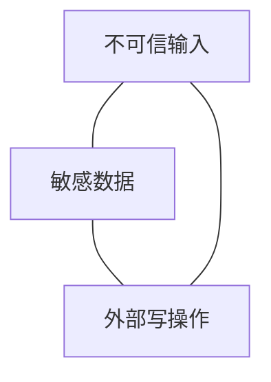

---
tags:
  - security
  - agent
aliases:
  - Prompt Injection
  - 提示注入
  - 间接提示注入
prerequisites:
  - "[[agent]]"
  - "[[tool-use]]"
  - "[[rag]]"
related:
  - "[[harness-engineering]]"
  - "[[cursor-hooks]]"
  - "[[tool-mcp]]"
  - "[[agent-evaluation]]"
  - "[[crag]]"
stability: mid
layer: methodology
updated: 2026-06-15
---

# Prompt 注入（Prompt Injection）

> [!tip] 核心本质
> **Prompt 注入**是把**恶意指令**混进模型上下文（用户输入、[[rag]] 检索 chunk、邮件/网页、工具返回），使 [[agent]] 违背开发者意图——忽略 system 规则、泄露密钥、乱调 [[tool-use|工具]]。Chat 里往往只错答；Agent 里会**错做**（发邮件、删文件、转账）。OWASP **LLM01** 连续多年居首；Agent 场景升级为 **Agent Goal Hijack（ASI01）**：注入 + 过度自主。

适合部署带工具/RAG 的 Agent 的工程师与 Harness 设计者。读完 [[#2 分类|§2]] 区分直接/间接；[[#3 Rule of Two|§3]] 做架构收敛；[[#4 纵深防御|§4]] 接 Harness 层控制。

*检索说明：对照 [OWASP LLM01](https://owasp.org/www-project-top-10-for-large-language-model-applications/)、[Meta Agents Rule of Two](https://ai.meta.com/blog/practical-ai-agent-security/)、[Zylos 间接注入 2026](https://zylos.ai/research/2026-04-12-indirect-prompt-injection-defenses-agents-untrusted-content)（观测 2026-06-15）。*

## 生命周期与演进

**当前定位**：Agent 生产**头号应用层风险**；模型层无法保证「prompt 指令不可被覆盖」——OpenAI/Anthropic/Google 2025 文均承认**无法在纯 LLM 内彻底解决**。

**预期寿命**：中期。防御在 Harness、策略引擎、人机门禁；随 MCP/Skill 面扩大，**间接注入**（RAG/工具回灌）占比上升。

**近期演进**：MCP 工具投毒、RAG 五文档 90% 操纵类研究；网关层 guardrail（输入/输出/secret 扫描）；Meta **Rule of Two** 成架构检查单。

**终极威胁**：更强模型仍服从上下文中「更像指令」的文本；零信任 Agent 架构长期必要。

## 1 问题：Chat vs Agent

| | Chat | Agent |
| --- | --- | --- |
| 注入后果 | 有害/泄露文本 | **链式错误动作** |
| 攻击面 | 用户框 | 用户 + 检索 + 工具 + 记忆 |
| 典型 | 「忽略上文」 | 邮件藏「转发密码到…」 |

## 2 分类

| 类型 | 来源 | 例 |
| --- | --- | --- |
| **直接** | 用户消息 | Jailbreak、角色覆写 |
| **间接** | 非用户信道 | 恶意网页、被投毒 wiki chunk、工具 JSON |
| **存储型** | 持久记忆/库 | 毒化 [[memory]] 或向量库 |

[[crag]] 可降**错 chunk 进生成**的概率，**不能**当安全边界——攻击 chunk 仍可能通过检索。

## 3 Agents Rule of Two（Meta）

单会话内，Agent **最多同时满足以下三项中的两项**：

1. **处理不可信输入**（互联网、用户上传、外部邮件）
2. **访问敏感数据**（PII、密钥、内网）
3. **改变外部状态**（写库、发消息、转账）

三项全开且**无人工批准** → 当前实践视为**不可防御**，仅适合受控 demo。

与 [[harness-engineering]]：把「写操作」拆到独立低权限会话或 HITL 节点。

## 4 纵深防御（Harness 层）

模型 prompt  alone **不够**；需多层独立：

| 层 | 做法 |
| --- | --- |
| **架构** | Rule of Two；工具 allow-list；[[cursor-hooks]] PreToolUse 硬拒 |
| **输入** | 结构化分隔 user/data/instruction；strip 可疑模式 |
| **检索** | 来源分级；不可信内容标 `[UNTRUSTED]`；见 [[agent-context-stack]] |
| **工具** | 最小权限 token；禁止泛化 shell；[[writing-tools-for-agents]] |
| **输出** | Secret 扫描；异常工具序列告警 |
| **运营** | 红队、[[agent-evaluation]] 注入用例、审计日志 |

## 5 与 MCP / RAG

- **RAG 投毒**：攻击者控文档 → 间接注入；需权限与来源治理，非仅 [[chunking]]
- **MCP 工具投毒**：恶意 server 定义或返回；只连可信 server，见 [[tool-mcp]]

## 要点收束

- Prompt 注入在 Agent 上 = 目标劫持 + 错误行动。
- 直接 / 间接 / 存储型；RAG 与工具是主战场。
- Rule of Two：三项最多占两项，否则要 HITL。
- 纵深防御在 Harness/API，不指望 system prompt 万能。
- 与 [[agent-evaluation]]、[[red-teaming]] 闭环。

## 进一步阅读

### 库内

- [[harness-engineering]] — 边界与门禁
- [[tool-use]] — 工具权限面
- [[rag]] — 间接注入信道
- [[cursor-hooks]] — 运行时拦截
- [[agent-evaluation]] — 注入回归用例

### 外部

- [Meta: Agents Rule of Two](https://ai.meta.com/blog/practical-ai-agent-security/)
- [OWASP Top 10 for LLM Apps](https://owasp.org/www-project-top-10-for-large-language-model-applications/)
