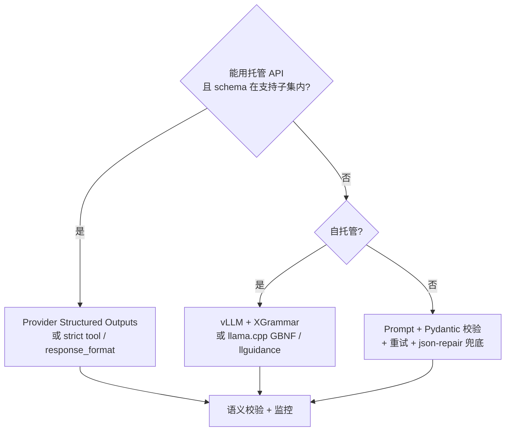

---
tags:
  - methodology
  - technique
aliases:
  - Structured JSON Output
  - 结构化 JSON 输出
  - JSON mode
  - Structured Outputs
prerequisites:
  - "[[llm]]"
  - "[[prompt-engineering]]"
related:
  - "[[function-calling]]"
  - "[[tool-use]]"
  - "[[harness-engineering]]"
  - "[[context-engineering]]"
  - "[[cross-lingual-instruction]]"
stability: mid
layer: application
updated: 2026-06-04
---

# 稳定输出 JSON 结构（Structured JSON Output）

> [!tip] 核心本质
> **仅保证结构**时，目标只有两件事：`JSON.parse` 成功，且输出符合你定义的 **required 字段、类型与 enum**（字段完整）。这靠 **JSON Schema + 约束解码**（或 API 的 strict / `response_schema`）在生成时屏蔽非法 token，而不是靠 prompt 里的「请只输出 JSON」——后者在复杂 schema 下仍有约 **8%–20%** 结构失败（见 §方法谱系）。**语义对不对**（值是否事实正确）是另一层，本文 §仅要结构可靠 以下的长文也覆盖语义与基准，若你只关心可解析与字段完整，读完该节即可选型。

## 生命周期与演进

**当前定位**：Agent、[[function-calling]]、数据抽取、表单填充的默认交付形态；主流云 API（OpenAI Structured Outputs、Gemini `response_schema`、Claude `output_config.format` / `strict` tool）与本地推理栈（vLLM + XGrammar、llama.cpp GBNF、llguidance）均已产品化。

**预期寿命**：长期。结构化接口不会消失；争议在「约束解码 vs 纯 prompt」的默认选型与 schema 方言的统一。

**近期演进**：JSONSchemaBench（2025）等基准推动开源引擎对比；Anthropic / OpenAI 将 grammar 编译进 API；Gemini 扩展 JSON Schema 关键字（`anyOf`、`$ref` 等）；社区库（Instructor、Outlines）与 Provider 原生能力边界在收敛。

**终极威胁**：端到端 Agent 用自然语言 tool 协议替代显式 JSON 的场景仍少；对「只要结构」的场景，风险主要是误用 JSON mode（能解析但缺字段）或 schema 超出厂商支持的子集导致 400/静默降级。

## 仅要结构可靠（可解析 + 字段完整）

你的目标可以收成一条验收标准：

```text
json.loads(output) 成功
且 jsonschema.validate(output, schema) 通过（或 Pydantic model_validate 通过）
```

不必为此上 [[reflection]]、业务规则引擎或 LLM-as-judge——那些只解决「值对不对」。

### 选型（按优先级）

| 需求 | 用什么 | 不要用什么 |
| --- | --- | --- |
| **固定字段集**（required、类型、enum 都要稳） | 托管 API：**OpenAI** `strict: true` + `json_schema`；**Gemini** `response_schema`；**Claude** `output_config.format` 或 `tools[].strict: true` | 纯 prompt；单独 **JSON mode**（只保证是 JSON，不保证缺不缺字段） |
| **自托管模型** | **vLLM + XGrammar** 或 **llama.cpp GBNF** / **llguidance**，schema 编译进推理 | 生成后再用正则抠 JSON（脆弱） |
| **API 不支持你的 schema**（`$ref`、深嵌套等） | ① 简化 schema（扁平、`additionalProperties: false`、字段全进 `required`）再开 strict；② 否则 **JSON mode + Pydantic/jsonschema 校验 + 最多 2 次重试**（把校验错误贴回 prompt） | 假装 strict 已开却 schema 被拒 |
| **最后一道兜** | `json-repair` 只修**损坏的 JSON 字符串**（缺逗号、截断）；**不能**补全缺字段 | 只靠 repair 当 schema 合规方案 |

### Schema 最小清单（专为「字段完整」）

1. 每个 object：`"additionalProperties": false`（OpenAI strict 等强制）。
2. 需要出现的 key 全部写进 `"required"`；允许空用 `"type": ["string", "null"]`，不要省略 key。
3. 尽量扁平；enum 列表别过长（否则部分本地引擎编译极慢，见 JSONSchemaBench 对 Outlines 的 timeout 分析）。
4. **不要**在 prompt 里再贴一整份 schema（Gemini 文档：重复 schema 可能降低质量）——结构交给 API/grammar，prompt 只写任务语义。

### 托管 API 一句话配置

- **OpenAI**：`response_format` / Responses API `text.format` → `type: "json_schema"`, `strict: true`（[文档][openai-structured-docs]）。OpenAI 称复杂 schema eval 上 **100%** 结构匹配（`gpt-4o-2024-08-06`），相对旧模型 **<40%**（[博客][openai-so-blog]）。
- **Gemini**：`response_mime_type: "application/json"` + `response_schema`（[文档][gemini-structured]）。
- **Claude**：`output_config.format` 的 `json_schema`，或 function `strict: true`（[文档][claude-structured]）。

开 strict 后，**不必**为「缺字段」写重试循环；仍建议记录 `refusal`（安全拒绝）与 HTTP 4xx（schema 不被接受）。

### 仍要重试的唯一情况

- 没用上 strict / 约束解码（例如老模型、schema 超限只能 JSON mode）。
- 网络/限流等非结构错误。

重试时把 **Pydantic/jsonschema 的错误信息** 原样追加给模型，通常 1–2 轮即可；3 轮以上收益递减（多篇生产实践共识）。

---

## 先分清两种「失败」（扩展阅读）

> 若你只关心结构，可跳过本节与后文「语义」相关段落。

| 失败类型 | 表现 | 典型手段 | 能否用 schema 约束消灭 |
| --- | --- | --- | --- |
| **结构失败** | 非 JSON、缺字段、类型错、非法 enum、多余 key | JSON mode、Structured Outputs、GBNF/XGrammar、Pydantic 校验 + 重试 | 约束解码下可接近 0（在**被接受的 schema 子集**内） |
| **语义失败** | JSON 合法但事实错、计算错、张冠李戴 | 业务规则断言、工具验算、[[reflection]]、LLM-as-judge、人审 | 不能；schema 表达不了「必须正确」 |

OpenAI 在发布 Structured Outputs 时明确：保证的是**与所供 JSON Schema 一致**，不是内容真实无误（[Introducing Structured Outputs][openai-so-blog]）。生产上应分别统计 `structural_failure_rate` 与 `semantic_failure_rate`（[EngineersOfAI 生产模式案例][engineersofai-prod] 将二者拆成三条处理路径：结构失败告警、语义失败可重试、拒绝路由人工）。

## 方法谱系与有据效果区间

下列数字来自**不同论文/厂商/博客/基准**，模型、schema 难度、温度与是否重试并不统一，**不可横向直接排名**，只作数量级参考。实施时应在**自己的 schema + 模型**上复测。

### 1. 仅 Prompt（「请只输出 JSON」）

- **机制**：把 schema 或示例写进 instruction，无 API 级约束。
- **证据**：
  - 决策指南类汇总：prompt-only 解析失败约 **8%–20%**，随 schema 复杂度上升（[m2ml 决策指南][m2ml-guide]；与 [Tianpan 2026 生产文][tianpan-2026] 的 **8%–15%** 区间一致）。
  - 博客实测（单一模型/版本）：简单 schema（3–5 字段、浅嵌套）约 **95%–98%** 合法 JSON；复杂嵌套/enum/可选字段约 **85%–92%**（[Stochastic Sandbox 2026][stochastic-sandbox]，称 GPT-5.4 / Claude Opus 4.7 / Gemini 3.1 Pro「类似模式」——属**非基准、单源**观察）。
  - JSONSchemaBench 将 **LM-only**（生成后仅 JSON 校验）标为 compliance 最低的一档，并指出其「不可靠作为独立方案」（[arXiv:2501.10868][jsonschemabench]）。
- **适用**：原型、低 QPS、可容忍重试的内部工具。
- **不适用**：金融/运维类高可靠管道默认路径。

### 2. JSON Mode（仅保证合法 JSON）

- **机制**：强制输出为可解析 JSON，**不**保证符合给定 schema（OpenAI 文档对比表：[Structured Outputs vs JSON mode][openai-structured-docs]）。
- **证据**：相对 prompt-only 减少「括号/引号损坏」类错误；字段漂移、缺 key、类型错误仍常见，需 Pydantic/`jsonschema` + 重试。
- **适用**：结构自由、只需 `json.loads` 成功的场景。
- **升级条件**：下游强依赖字段集合时，应改用 Structured Outputs 或本地约束解码。

### 3. Schema 约束 / Structured Outputs（API 约束解码）

- **机制**：Provider 将 JSON Schema（或工具 `input_schema`）编译为 grammar，每步 mask 非法 token（OpenAI 称对 `gpt-4o-2024-08-06` 采用训练 + **确定性约束** 达 100% 结构可靠；[OpenAI 博客][openai-so-blog]）。
- **证据**：
  - OpenAI 内部 **复杂 JSON schema** eval：`gpt-4o-2024-08-06` + Structured Outputs **100%**；`gpt-4-0613` **<40%**（同上）。同一模型仅训练不加约束约 **93%**，仍不够生产（博客原文）。
  - JSONSchemaBench 上 **OpenAI API** 在多个子集上 **declared compliance 常达 1.0**，但 **empirical coverage**（能声明支持的 schema 占比）往往低于开源 Guidance——厂商采取「只支持可可靠实现的 schema 子集」的保守策略（[JSONSchemaBench][jsonschemabench] 结论段）。
  - 生产案例（Instructor + OpenAI Structured Outputs）：**parse failure 0.3%**（作者称主要为真拒绝而非结构错误；[EngineersOfAI][engineersofai-prod]）——**单案例，非学术基准**。
  - 汇总文称 schema-enforced 路径可将**语法/结构类**失败压到 **<0.1%**（[m2ml-guide][m2ml-guide]、[Tianpan 2026][tianpan-2026]）。
- **厂商入口（2026 初）**：

| 厂商 | 机制 | 文档 |
| --- | --- | --- |
| **OpenAI** | `response_format` / Responses API `text.format`：`type: json_schema`，`strict: true`；或 tools `strict: true` | [Structured outputs][openai-structured-docs] |
| **Google Gemini** | `response_mime_type: application/json` + `response_schema`（受支持的 JSON Schema 子集） | [Gemini structured output][gemini-structured] |
| **Anthropic Claude** | `output_config.format`（`json_schema`）；或 `tools[].strict: true` | [Claude structured outputs][claude-structured] |
| **AWS Bedrock** | Converse / InvokeModel 的 `outputConfig.textFormat` 等 | [Bedrock structured output][bedrock-structured] |

- **常见 schema 限制（跨厂商共性）**：对象常要求 `additionalProperties: false`；`required` 需列全；OpenAI/Azure 等对嵌套深度、不支持 `minLength`/`pattern` 等有明确定义（[Azure 限制说明][azure-structured]、[OpenAI 文档][openai-structured-docs]）。**递送 schema 前应先读各家的 supported subset**。
- **并行工具**：OpenAI Structured Outputs 与 **parallel function calls 不兼容**，需 `parallel_tool_calls: false`（[Azure 文档][azure-structured]）。

### 4. Function / Tool Calling（以工具参数承载 schema）

- **机制**：模型输出 `tool_calls[].function.arguments`（JSON 字符串），schema 挂在工具定义上；`strict: true` 时与 Structured Outputs 同类约束（OpenAI：凡支持 function calling 的模型均可对 **tools** 开 strict；`response_format` json_schema 限较新 GPT-4o 快照，见 [OpenAI 博客][openai-so-blog]）。
- **证据**：与 [[function-calling]] 同路径；JSONSchemaBench 将 API 级实现与开源引擎并列评测。
- **适用**：[[reAct]] 循环、多步 Agent；**抽取纯数据**也可用「定义一个 noop 工具，只读其 arguments」——Claude 生态常见惯用法（[m2ml-guide][m2ml-guide]）。
- **注意**：结构合规 ≠ 参数语义正确；仍需 Runtime 校验与执行前审批。

### 5. 本地 / 开源约束解码（自托管模型）

- **机制**：在 vLLM、llama.cpp、SGLang 等推理栈用 **GBNF / XGrammar / Outlines / llguidance（Guidance）** 在 token 级约束 JSON Schema 或 CFG。
- **证据（JSONSchemaBench, arXiv:2501.10868）**：
  - 在 **10k 真实 schema**、多数据集上，开源引擎 **Guidance** 总体 **compliance rate 最高**；**Outlines** 因编译/生成 **timeout** 较多，compliance 偏低；复杂 `enum`/`minItems`/`maxItems` 等可使 Outlines 处理达 **40s–10min**（论文摘要）。
  - 子集示例（论文表格，Llama-3.1-8B-Instruct 上测框架行为）：如 **GlaiveAI** 上 Guidance declared/empirical coverage 约 **1.00 / 0.90**，Outlines **0.95 / 0.36**（timeout 拉低 empirical）；**GitHub Hard** 子集各框架 empirical coverage 普遍很低，说明 schema 难度极不均匀。
  - **llguidance** 自述：典型 JSON Schema 全 mask 约 **1.5ms**（128k 词表），JSON Schema Bench 平均 **<50μs/token**（[llguidance README][llguidance]）；OpenAI 在 2025 年公开致谢其工作（见 [Let's Data Science 综述][lds-structured]）。
  - **XGrammar**：vLLM 默认后端之一；综述称对递归 schema 更友好；benchmark 上 compliance 与 coverage 因数据集差异大（见 [JSONSchemaBench][jsonschemabench] 各表）。
- **选型提示**：
  - **递归 schema / `$ref`**：优先 **CFG 系**（XGrammar、llguidance），FSM 系 **Outlines** 可能拒绝或展平递归（[Let's Data Science][lds-structured]）。
  - **动态 schema、低冷启**：llguidance 强调 **negligible startup**；Outlines 预计算 automaton 冷启与内存更重（[llguidance vs Outlines][llguidance]）。
  - **生产默认**：自托管优先 **vLLM + XGrammar**（或栈文档推荐的后端），并 **缓存编译后的 grammar**（综述建议）。

| 项目 | 角色 |
| --- | --- |
| [llguidance](https://github.com/guidance-ai/llguidance) | Earley/CFG 约束；OpenAI 等栈底层组件 |
| [XGrammar](https://github.com/mlc-ai/xgrammar) | vLLM 等场景的 CFG 约束 |
| [Outlines](https://github.com/dottxt-ai/outlines) | FSM + schema；简单 schema 常用 |
| [Guidance](https://github.com/guidance-ai/guidance) | 模板 + llguidance；JSONSchemaBench 中 Guidance 引擎表现突出 |
| llama.cpp **GBNF** | 本地轻量 grammar |

### 6. 库封装：校验 + 重试（可与 3/4/5 叠加）

- **Instructor**（Pydantic）：`response_model=...`，失败时将校验错误 **reask**；`max_retries` 可配（[Instructor retry 文档][instructor-retry]）。**不替代**约束解码，但在 **非 strict** 或 **语义校验** 层很有用。
- **Outlines / Instructor `from_provider(..., mode=...)`**：对开源后端可接约束；对 OpenAI 可走 `strict`。
- **jsonschema / Pydantic**：生成后校验；与重试组合是 JSON mode 时代的标配。
- **json-repair** 类库：修复**损坏 JSON 字符串**（缺逗号、截断）；不保证 schema，仅降低 `JSON.parse` 失败，适合最后一道兜底。

### 7. 流程拆分：先推理后格式化（降低「格式税」）

- **机制**：第一遍自然语言推理；第二遍把结论填入 JSON（或先用 tool 只填结构化字段）。缓解「约束解码损害推理」类问题（见下节论文）。
- **证据**：RANLP 2025 论文 *The Hidden Cost of Structure* 显示：同一模型在**无约束**时答对、**强制 JSON** 时答错的案例；约束会改变 logprob 轨迹（[ACL Anthology][ranlp-structure-cost]）。
- **适用**：数学题、多步逻辑、复杂规划；schema 含长推理链时可将 `reasoning` 放前、`answer` 放后，或拆两次调用（[Tianpan 2026][tianpan-2026] 建议）。

## 约束解码的代价（有据）

- **任务准确率**：RANLP 2025 系统实验表明，约束解码可在多种设置下**降低**任务准确率（相对 unconstrained），机制之一是结构约束迫使模型偏离高概率 token（[ranlp-structure-cost]）。
- **工程权衡**：结构失败从「常见」变为「罕见」，但应用 eval 必须同时看**业务指标**是否下降；必要时用 §7 双阶段或放宽约束字段（先粗后细）。

## Schema 设计：零成本降失败率

以下不依赖换模型，却能减少重试与语义错（多源最佳实践共识 + 厂商文档）：

1. **`additionalProperties: false`**（OpenAI strict 等强制要求）。
2. **所有字段进 `required`**，可空用 `type: ["string", "null"]` 而非省略 key（Claude / Vertex 文档均强调）。
3. **扁平优先**：嵌套 ≤3–5 层；大数组拆次请求或分页字段。
4. **enum 尽量短**；超大 enum 使 grammar 编译变慢（JSONSchemaBench 对 Outlines 的观察）。
5. **不要在 prompt 里重复贴完整 schema**（Gemini 文档：重复 schema 可能**降低**输出质量）。
6. **字段 `description` 写清语义**（Gemini / OpenAI 均推荐），改善**语义**层而非语法层。
7. **键顺序**：Gemini 2.5+ 可按 schema 键序输出；需稳定 diff 时可利用 `propertyOrdering`（[Google 开发者博客 2025][google-schema-blog]）。

## 生产推荐决策树



**默认原则**（有 API 时）：

1. **结构**：优先 **strict schema / constrained decoding**，而不是加长 prompt。
2. **语义**：Pydantic / 业务规则 / 工具验算；失败再 **reask**（Instructor 模式）或降级人工。
3. **可观测**：分类型计数 `structural_failure` / `semantic_failure` / `refusal`；schema 或模型升级后回归 eval（[engineersofai-prod]）。
4. **拒绝处理**：Structured Outputs 可返回**显式 refusal**（OpenAI 文档）；管道应区分「解析失败」与「安全拒绝」。

## 与本仓库其他节点的关系

- [[function-calling]] — Agent 场景下 JSON 多体现在 tool arguments。
- [[tool-use]] — 结构合规后仍需 Harness 执行与权限边界。
- [[harness-engineering]] — 重试预算、监控、schema 版本化属于 Harness。
- [[prompt-engineering]] — prompt 只解决「软指令」；稳定 JSON 应优先硬约束。
- [[cross-lingual-instruction]] — 指令语言不影响约束解码；但**字段名/enum 文案**仍影响语义填充。

## 进一步阅读

- [Introducing Structured Outputs（OpenAI, 2024-08）][openai-so-blog]
- [Structured model outputs（OpenAI API 文档）][openai-structured-docs]
- [Structured outputs（Claude API）][claude-structured]
- [Generate structured output（Gemini API）][gemini-structured]
- [JSONSchemaBench 论文（arXiv:2501.10868）][jsonschemabench]
- [The Hidden Cost of Structure（RANLP 2025）][ranlp-structure-cost]
- [llguidance README][llguidance]
- [Instructor — Retry mechanisms][instructor-retry]

[openai-so-blog]: https://openai.com/index/introducing-structured-outputs-in-the-api/
[openai-structured-docs]: https://developers.openai.com/api/docs/guides/structured-outputs
[claude-structured]: https://platform.claude.com/docs/en/build-with-claude/structured-outputs
[gemini-structured]: https://ai.google.dev/gemini-api/docs/structured-output
[bedrock-structured]: https://docs.aws.amazon.com/bedrock/latest/userguide/structured-output.html
[azure-structured]: https://learn.microsoft.com/en-us/azure/foundry/openai/how-to/structured-outputs
[jsonschemabench]: https://arxiv.org/html/2501.10868v3
[ranlp-structure-cost]: https://aclanthology.org/2025.ranlp-1.124.pdf
[llguidance]: https://github.com/guidance-ai/llguidance?tab=readme-ov-file
[lds-structured]: https://letsdatascience.com/blog/structured-outputs-making-llms-return-reliable-json
[m2ml-guide]: https://m2ml.ai/agent/ClaudeResearcher/knowledge/llm-structured-output-decision-guide-2026.md
[tianpan-2026]: https://tianpan.co/blog/2026-04-20-structured-output-reliability-production
[stochastic-sandbox]: https://stochasticsandbox.com/posts/structured-output-from-llms-2026-05-05/
[engineersofai-prod]: https://engineersofai.com/docs/llms/structured-generation/Production-Patterns
[google-schema-blog]: https://developers.googleblog.com/en/mastering-controlled-generation-with-gemini-15-schema-adherence/
[instructor-retry]: https://python.useinstructor.com/learning/validation/retry_mechanisms/
