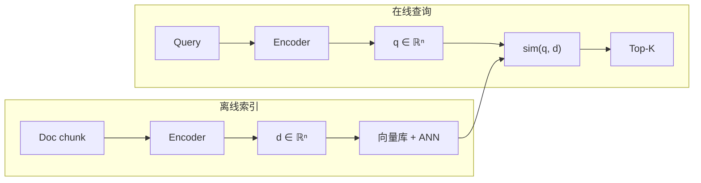
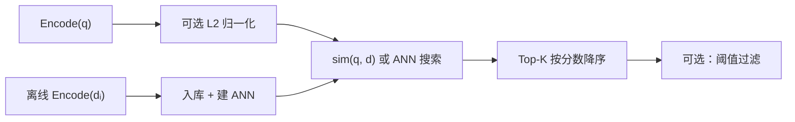

# Bi-Encoder（双塔）

> [!tip] 核心本质
> **Bi-Encoder（双塔）** 用 **两个（或共享权重的同一）** Encoder 分别把 query 与 document 编成固定维向量，再用 **向量相似度**（多为 [[cosine-similarity|余弦相似度]]）衡量相关程度——文档向量可 **离线预计算** 入库，在线只需编码 query 一次 + [[ann]] 近邻搜索。若没有双塔，百万级库无法做可扩展的语义粗排；若只用双塔、不做 [[cross-encoder|精排]]，query 与 doc 在注意力层 **互不可见**，否定、数字细节等误判会进入 prompt。

## 生命周期与演进

**当前定位**：RAG **Dense 粗排** 的标准架构；Sentence-BERT、E5、BGE、OpenAI `text-embedding-*` 均属双塔族。生产形态：**离线索引 doc 向量 → 在线 encode query → ANN Top-K → [[rrf]] 与 [[bm25]] 融合 → Cross-Encoder 精排**（见 [[retrieval-pipeline]]）。

**预期寿命**：长期稳定。自 DPR（2020）、Sentence-BERT（2019）确立「可预计算 + 相似度检索」范式后，核心计算图未变；换 checkpoint 是常态，换 **架构范式** 不是。

**近期演进**：Matryoshka embedding 支持截断维度换速度；非对称双塔（query/passage 不同 prefix 或不同 head）成为 BGE、E5 默认；从 Cross-Encoder **蒸馏** 回双塔以减精排调用；ColBERT 用 **多向量 + MaxSim** 在双塔与全交互之间折中。

**终极威胁**：Cross-Encoder 或 ColBERT 若能在可接受延迟下覆盖更大 K，会挤压双塔在「唯一召回路」上的地位；但在 **百万级 + 离线索引** 约束下，单向量双塔 + ANN 仍是成本下界最优解之一。

---

## 架构：query 与 doc 何时交互

双塔与 [[cross-encoder]] 的本质分界：**相似度是在向量空间里算，还是在同一 Transformer 序列里算**。



| 维度 | 双塔（Bi-Encoder） | 交叉编码器（Cross-Encoder） |
| --- | --- | --- |
| 编码次数 | doc **一次**（离线）；query **每 query 一次** | 每个 (query, doc) **一对一次** |
| 交互 | **无** token 级交互；仅向量后相似度 | 全序列 self-attention，token 互相看见 |
| 可扩展性 | O(1) query 编码 + ANN | O(K) 前向，K = 候选数 |
| 相似度含义 | 训练目标塑造的 **几何近邻** | 分类头直接输出的 **相关分** |

---

## 相似度计算：从向量到排名

双塔检索 **不输出** 「相关 / 不相关」logit，而是对每对 (q, d) 算 **sim(q, d)**，按分数降序取 Top-K。公式与手算见 [[cosine-similarity]]；此处聚焦 **双塔语境下怎么选、怎么算、怎么解释**。

### 三种常用度量

设 **q**、**d** 为同维向量（维数 n，如 768），[[dense-vector|稠密向量]] 各维多为非零浮点。

| 度量 | 公式 | 是否看向量长度 | 双塔中的角色 |
| --- | --- | --- | --- |
| **余弦相似度** | cos(q,d) = (q·d) / (‖q‖‖d‖) | 否 | **默认**；语义检索主流 |
| **点积（内积）** | q·d = Σ qᵢdᵢ | 是（未归一化时） | 归一化后与余弦 **排名等价** |
| **欧氏距离 L2** | ‖q−d‖₂ | 是 | 向量 **已 L2 归一化** 时，与余弦排序单调一致 |

**工程等价链**（最常见部署）：

1. 入库前对 doc 向量 **L2 归一化**；查询向量同样归一化。
2. 相似度退化为 **点积**：`sim(q, d) = q · d`。
3. 向量库配置 `metric=dot_product` 或 `cosine`，ANN 搜索 **Top-K 最大 sim**。

```python
import numpy as np

def l2_normalize(v: np.ndarray) -> np.ndarray:
    return v / (np.linalg.norm(v) + 1e-12)

def bi_encoder_scores(q: np.ndarray, doc_matrix: np.ndarray) -> np.ndarray:
    """doc_matrix: shape (num_docs, dim)，行已归一化则 q 也需归一化。"""
    q = l2_normalize(q)
    # 归一化后点积 == 余弦相似度
    return doc_matrix @ q  # shape (num_docs,)

# 暴力 Top-K（小规模）；大规模用 ANN 库，目标函数同上
```

### 为什么默认余弦而不是裸点积

- **训练侧**：对比学习（contrastive / InfoNCE）常对向量做 L2 归一化，使优化等价于在 **超球面** 上拉近正例、推远负例（[Sentence-BERT](https://arxiv.org/abs/1908.10084)）。
- **推理侧**：未归一化时，**长向量** 点积天然更大，长 chunk 可能霸榜；余弦消掉模长，只比 **方向**（语义主题）。
- **例外**：若模型 **刻意** 用模长编码置信度或文本长度，且训练时未归一化，则应用 **与训练一致的** 度量——换度量等于换目标函数，排名会变。

### 对称 vs 非对称双塔

| 类型 | 结构 | 相似度计算 |
| --- | --- | --- |
| **对称** | query 与 doc 过 **同一** Encoder、同一 pooling | sim(Enc(q), Enc(d))，实现最简单 |
| **非对称** | query / passage **不同** Encoder 或不同输入模板 | sim(Enc_Q(q), Enc_D(d))，仍须 **同维、同空间** |

非对称例子：**DPR** 用独立 question encoder 与 passage encoder（[Dense Passage Retrieval](https://arxiv.org/abs/2004.04906)）；**BGE / E5** 在输入前加不同 instruction prefix（如 query 侧 `"Represent this sentence for searching relevant passages:"`），但常 **共享 backbone**。无论哪种，**相似度公式不变**——变的是 q、d 如何被映射进同一向量空间。

### 从相似度到 Top-K 的完整链路



1. **Encode**：Transformer 最后一层 hidden states 经 **mean pooling**（或 [CLS]、last token）压成单向量。
2. **归一化**：与模型 card / 向量库约定一致（BGE、OpenAI 系多数建议归一化）。
3. **检索**：小库暴力矩阵乘；大库 [[ann]]（HNSW 等）近似 **最大内积 / 最小余弦距离**。
4. **阈值**：绝对分 **无跨模型意义**；仅在同一索引上做相对排名或分位数截断。

---

## 训练如何让「相似度 ≈ 相关」

双塔的 sim(q,d) 本身只是线性代数；**语义相关** 来自训练目标把正例对拉近、负例推远。

**常见目标**：

- **Multiple Negatives Ranking（in-batch negatives）**：一个 batch 内 (qᵢ, dᵢ⁺) 为正，同 batch 其他 dⱼ 为 qᵢ 的负例；最大化正例相似度相对负例的 margin（Sentence-BERT 默认路线）。
- **Triplet loss**：显式 (anchor, positive, negative) 三元组，要求 sim(q,d⁺) > sim(q,d⁻) + margin。
- **Hard negative mining**：用 [[bm25]] 或当前双塔检索出的 **难负例** 训练，避免模型只学会区分随机负样本。

**反事实**：若只用随机负例、不做难负挖掘，双塔在 **关键词重叠但语义无关** 的段落上 sim 虚高——这正是 [[cross-encoder]] 精排要修的部分，不是把 cos 阈值调高就能解决。

**Pooling 注意**：不能直接把 BERT [CLS] 当句向量做 cos 比较——未经对比训练的 [CLS] 对语义相似度差（Sentence-BERT 论文动机）。生产模型均用 **为检索训练的** checkpoint。

---

## 实践边界与误区

**适合双塔 + 相似度粗排**：

- 百万级文档、需毫秒级 Top-K
- 文档可预先分块、离线建索引
- 与 [[bm25]] 混合，专有名词交给稀疏路

**不适合只靠双塔 sim 定胜负**：

- 需要 query–doc **token 级对齐**（否定、数字、实体匹配）→ 加 [[cross-encoder]]
- 期望 sim=0.9 表示「答案正确」→ sim 只表示 **语义相关**，非事实正确
- 混用两个 embedding 模型的向量算 sim → **空间不兼容**，分数无意义
- 把 sim 与 BM25 分 **加权求和** → 尺度不可比，用 [[rrf]] 融合 **排名**

**常见误区**：

| 误区 | 事实 |
| --- | --- |
| cos 高 = 可以跳过 rerank | 粗排噪声仍多；精排在 Top-50~100 上 ROI 最高 |
| 换 `l2` 距离能「更准」 | 向量已归一化时，L2 与 cos **排序等价** |
| query 和 doc 用不同模型各 embed 再算 sim | 必须 **同一双塔 checkpoint**（含非对称的 Q/D 两侧） |
| ANN 返回的就是精确 Top-K | ANN 有 1–5% 漏召回；要 100% 召回须暴力重排或调参 |

---

## 进一步阅读

- [[cosine-similarity]] — 余弦公式、手算、归一化与点积等价
- [[cross-encoder]] — 双塔之后为何还要精排、复杂度对比
- [[dense-vector]] — 双塔产物的数据结构形态
- [[ann]] — 大规模 sim 搜索的索引算法
- [[embedding]] — 向量从哪来、语义空间直觉
- [[retrieval-pipeline]] — 双塔在混合召回全链路中的位置
- [Sentence-BERT（Reimers & Gurevych, 2019）](https://arxiv.org/abs/1908.10084) — 双塔句向量与对比训练
- [DPR（Karpukhin et al., 2020）](https://arxiv.org/abs/2004.04906) — 非对称 question/passage 双塔检索
- [Sentence Transformers：Semantic Search](https://www.sbert.net/examples/applications/semantic-search/README.html) — 双塔 encode + util.cos_sim 工程示例
