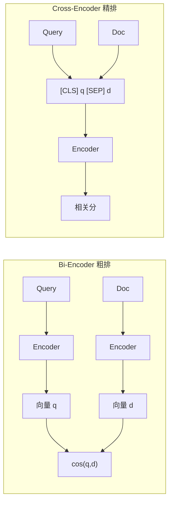

# Cross-Encoder（交叉编码器）

> [!tip] 核心本质
> **Cross-Encoder** 把查询与候选文档 **拼成一条序列** 送入同一个 Transformer，让两侧 token 在注意力层 **互相看见**，直接输出「这一对有多相关」的标量分数。它不能像 [[embedding|双塔 embedding]] 那样为全库文档离线存向量，因此 **不能** 对百万文档暴力打分；若没有它，粗排 Top-K 里「关键词像、语义偏」的段落会大量进入 prompt，RAG 会以更高置信度答错。工业默认是：**双塔/BM25 保召回，Cross-Encoder 保精准**（见 [[retrieval-pipeline]]）。

## 生命周期与演进

**当前定位**：RAG 与搜索引擎的 **精排（rerank）** 标配；MS MARCO 系预训练模型与 BGE-Reranker、Cohere Rerank 等 API 已工程化。粗排侧仍是 [[bm25]] + [[dense-vector|稠密向量]] + [[rrf]] 融合。

**预期寿命**：中长期。具体 checkpoint 每 1–2 年迭代，但 **「先宽召回、再窄精排」** 的两阶段漏斗不因单模型变大而消失——全库 pairwise 推理的复杂度下界仍在。

**近期演进**：ColBERT 等 **late interaction** 在精度与速度间折中；从 Cross-Encoder **蒸馏** 回双塔以减少在线 rerank 调用；多语言 reranker（bge-reranker-v2-m3、jina-reranker-v2）取代英文 MiniLM 基线。

**终极威胁**：端到端检索头或超长上下文「全库入窗」在 **小库** 上绕过显式 rerank；但在权限分域、版本治理、百万级私有库场景，显式精排与可观测分数长期存在。ColBERT 类方案吸收部分 Cross-Encoder 份额，未必完全替代全交互精排。

---

## 与 Bi-Encoder 的分工

两者通常都是 BERT 类 **Encoder-only** 模型，差别在于 query 与 document **何时进入同一计算图**。



| 维度 | Bi-Encoder（双塔） | Cross-Encoder（交叉编码） |
| --- | --- | --- |
| 输入 | query、doc **分别** tokenize | 常拼为 `[CLS] query [SEP] doc [SEP]` |
| 注意力 | 各自 self-attention，**互不看见** | **同一序列内** full self-attention |
| 文档表示 | 可 **预计算** 入库（配合 [[ann]]） | **不可** 为固定 doc 存唯一向量（query 变则交互变） |
| 单次查询代价 | O(1) 次 query 编码 + ANN | O(K) 次前向，K = 候选对数 |
| 典型位置 | 初召回 Top-500~1000 | 精排 Top-50~100 → Top-3~10 |

**反事实**：若对 100 万文档逐对跑 Cross-Encoder，单次查询需百万次前向，延迟不可接受。因此必须先由 [[embedding]]、[[bm25]] 等把空间缩到 **几十到上百** 候选，再精排——召回与精准 **因果分离**，不是「换更大的 reranker」能单独弥补粗排漏召。

双塔的架构与相似度计算见 [[bi-encoder]]（度量公式见 [[cosine-similarity]]）；全链路阶段划分与模型选型表见 [[retrieval-pipeline]]。

---

## 打分机制与训练

**推理**：每个 `(query, passage)` 对过 Transformer，分类头输出相关 logit 或 0–1 分；对 K 个候选 **argsort** 取 Top-N。

**训练**：多在 **MS MARCO** 等 passage ranking 数据上，以「query–相关段」为正、「随机或 BM25 难负」为负，做二分类或排序损失。Nogueira & Cho（2019）用 BERT 做 passage reranking，奠定「Cross-Encoder 作 reranker」范式（[Passage Re-ranking with BERT](https://arxiv.org/abs/1901.04085)）。

**与 Sentence-BERT 的关系**：Sentence-BERT 训练的是 **双塔** 句向量；Cross-Encoder 在 Sentence Transformers 库里是另一类 `CrossEncoder` API，任务形态是 **配对打分** 而非句向量（[Retrieve & Re-Rank](https://www.sbert.net/examples/cross_encoder/applications/retrieve_rerank/README.html)）。

```python
from sentence_transformers import CrossEncoder

model = CrossEncoder("cross-encoder/ms-marco-MiniLM-L-6-v2")
scores = model.predict([[query, doc] for doc in candidates])
```

---

## 实践与边界

**适合**：问答型 RAG、客服库、代码/文档搜索——粗排噪声明显，且可接受每 query **几十到数百毫秒** GPU 精排。

**不适合**：

- **全库相似度扫描** → 用双塔 + [[ann]]。
- **用 RRF 分数代替精排** → [[rrf]] 只做排名融合，无 query–doc token 交互。
- **指望精排挽救粗排漏召** → 未进 Top-K 的文档，Cross-Encoder **永远看不见**。

**常见误区**：

- **分数跨模型可比**：不同 reranker 标定不同，换模型须在同一验证集 A/B。
- **双塔余弦相似度很高就不必 rerank**：[[embedding]] 对否定、数字细节不敏感时，精排增益最大。
- **与 Encoder-Decoder 的 cross-attention 混淆**：后者是生成架构里的跨层注意力，与本文 **检索配对打分** 不是同一概念。

**ColBERT（简述）**：文档侧预存 token 向量，查询侧 **MaxSim** late interaction——比全 Cross-Encoder 快一个数量级以上，精度常介于双塔与全交互之间；`bge-m3` 等可同时出 dense + ColBERT 路。生产上 **K≤100 且有 GPU** 时，全交互 Cross-Encoder 仍是默认首选；更大 K 或 CPU 约束再评估 ColBERT（[ColBERT](https://arxiv.org/abs/2004.12832)）。

---

## 进一步阅读

- [[retrieval-pipeline]] — 混合召回、RRF、Reranker 选型表与 FlagEmbedding / Milvus 代码示例（应用编排）
- [[bi-encoder]] — 双塔架构、相似度计算与训练目标
- [[embedding]] — 双塔表示与 RAG 初召回为何依赖向量
- [[rrf]] — 多路融合与精排的职责边界
- [Hugging Face cross-encoder 组织](https://huggingface.co/cross-encoder) — 预训练 reranker 模型卡
- [Sentence Transformers：MS MARCO Cross-Encoders](https://www.sbert.net/docs/cross_encoder/pretrained_models.html) — 模型列表与任务说明
