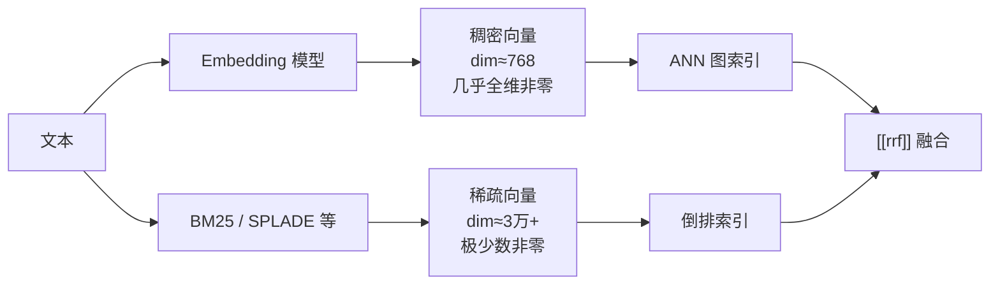

# 稠密向量（Dense Vector）

> [!tip] 核心本质
> **稠密向量**是把文本（词、句、段）映射成 **固定维度、几乎每一维都有非零实数值** 的连续向量——典型维度 384～1536，由 [[embedding]] 模型产出。检索时用 [[cosine-similarity|余弦相似度]] 或内积衡量语义接近，配合 [[ann]] 在百万级库上做近似最近邻。若没有稠密表示，系统只能依赖词面匹配（[[bm25]]）：「汽车」搜不到只写「车辆」的段落，同义改写与跨语言召回会大面积失效。

## 生命周期与演进

**当前定位**：RAG 与语义搜索的 **Dense 召回路** 标配；[[bi-encoder|Sentence-BERT 系双塔]] + HNSW 索引是工业默认形态。生产系统几乎一律 **BM25 + 稠密向量 + [[rrf]]** 混合，再经 [[cross-encoder]] 精排（见 [[retrieval-pipeline]]）。

**预期寿命**：长期稳定。「固定维连续向量 + 距离度量 + ANN 索引」这一范式自 Word2Vec（2013）经 Sentence-BERT（2019）延续至今；具体 checkpoint 每 1–2 年迭代，但 **表示形态本身** 不会消失。

**近期演进**：多向量 / late interaction（ColBERT）在精度与速度间折中；**bge-m3** 等模型 **同一次前向** 输出 dense + learned sparse，向量库（Milvus 2.5+、Qdrant）原生支持混合索引；Matryoshka embedding 允许同一向量截断维度以换速度。

**终极威胁**：learned sparse（SPLADE）与 ColBERT 在部分 BEIR 榜单上逼近或超越单向量 dense；超长上下文「少检索、多入窗」削弱粗排权重。但在 **百万级私有库、权限分域、精确语义召回** 场景，离线可索引的单向量 dense 仍是成本与延迟最优解之一。

---

## 稠密与稀疏：两种表示形态

信息检索里「向量」常按 **非零元素占比** 分为稠密与稀疏——这是 **存储与索引形态** 的分野，不是「有没有语义」的简单二分。



**表 1：** 稠密向量与常见稀疏表示对比

| 维度 | 稠密向量（Dense） | 稀疏向量（Sparse） |
| --- | --- | --- |
| 典型维度 | 384、768、1024、1536 | 词表规模（≈3 万～30 万） |
| 非零比例 | 绝大多数维度非零 | 绝大多数维度为 0 |
| 典型来源 | [[embedding]] 双塔、OpenAI `text-embedding-*` | [[bm25]] 权重、TF-IDF、SPLADE、ELSER |
| 索引结构 | [[ann]]（HNSW、IVF-PQ） | 倒排索引（与关键词搜索同族） |
| 强项 | 同义改写、抽象语义、跨语言 | 专有名词、错误码、编号、精确词面 |
| 弱项 | 精确 token 匹配、可解释性 | 低资源域泛化、需规则或训练做扩展 |
| 相似度 | 余弦 / L2 / 内积（同空间可比） | 稀疏内积（仅非零维相交时累加） |

**关键辨析**：[[embedding]] 回答「向量 **怎么来、语义怎么被压进空间**」；**稠密向量** 回答「检索侧拿到的 **是什么形态的数据结构**」。现代 embedding 模型的输出 **就是** 稠密向量——二者是 **机制与产物** 的关系，不是并列替代品。

---

## 工作机制：从文本到 Top-K

### 离线索引

1. 文档分块（chunk）后，逐块过 embedding 模型，得到固定维浮点数组。
2. 可选 **L2 归一化**（入库或查询时），使余弦相似度与点积排名一致（见 [[cosine-similarity]]）。
3. 向量写入向量库并建 [[ann]] 索引；**同一模型、同一归一化策略** 必须贯穿索引与查询，换模型须 **全量重建**。

### 在线检索

1. 用户查询同样 embedding 成 **q**。
2. ANN 返回与 q 最近的 Top-K 文档向量（允许 1–5% 漏召回换毫秒延迟）。
3. 分数常为 cos(q, d) 或归一化后的点积；相似度选型与 Top-K 链路见 [[bi-encoder]]。**绝对分只在同索引、同模型内有意义**，不可与 [[bm25]] 分直接加权相加——多路合并用 [[rrf]]。

```python
# 概念示意；完整双塔相似度链路见 [[bi-encoder]]
from sentence_transformers import SentenceTransformer
import numpy as np

model = SentenceTransformer("BAAI/bge-small-en-v1.5")

query = "如何缓解工作压力"
docs = [
    "冥想和规律运动有助于降低焦虑感",
    "Python asyncio 异步编程入门",
]

q_vec = model.encode(query, normalize_embeddings=True)
d_vecs = model.encode(docs, normalize_embeddings=True)

# 归一化后点积 == 余弦相似度
scores = d_vecs @ q_vec
ranked = sorted(zip(docs, scores), key=lambda x: -x[1])
```

### 与精排的分工

双塔稠密检索 **不能** 让 query 与 document 在注意力层交互——「不支持 XX」与「支持 XX」可能向量很近（见 [[embedding#实践边界与误区]]）。因此工业默认 **宽召回（dense + BM25）→ 窄精排（[[cross-encoder]]）**；稠密向量负责 **不漏掉语义相关候选**，不负责最终对错。

---

## 实践边界与选型

### 适合用稠密向量的场景

- 用户问法与文档用词差异大（口语 vs 书面、同义词）
- 需要跨语言召回（多语言 embedding 把相近语义映射到邻近区域）
- 库规模在 **千～亿级**，需毫秒级语义 Top-K
- 与 [[bm25]] 互补的混合召回（专有名词仍靠稀疏路）

### 不适合单独依赖稠密向量的场景

- **精确匹配**：合同编号、API 路径、版本号——应保留 [[bm25]] 或 sparse 路
- **逻辑与否定**：「是否支持退款」类需精排或结构化过滤
- **超长文档单向量**：整篇论文压成一个 768 维向量会丢细节，须分块后再 embed
- **频繁换模型却不重建索引**：不同模型的向量空间 **不兼容**，相似度无意义

### 与 learned sparse 的取舍

SPLADE、ELSER 等 **可学习的稀疏向量** 兼具词面可解释性与一定语义扩展，仍走倒排索引，在 BEIR 等榜单上常优于纯 BM25，部分设置逼近 dense（[SPLADE 综述](https://arxiv.org/abs/2306.16680)）。选型简表：

| 情况 | 倾向 |
| --- | --- |
| 零训练、要可解释、错误码/日志检索 | [[bm25]] 或 FTS |
| 要语义 + 词面、能接受模型推理 | dense + SPLADE 混合（[[rrf]]） |
| 标准 RAG、库 ≤ 千万、有 GPU/向量库 | dense + BM25 已是默认起点 |
| 延迟极敏感、库较小 | 可先 dense-only POC，再补 BM25 |

---

## 进一步阅读

- [[embedding]] — 稠密向量的训练动机与语义空间直觉
- [[bi-encoder]] — 双塔粗排：相似度计算、对称/非对称、训练目标
- [[cosine-similarity]] — Dense 检索默认度量与归一化等价
- [[ann]] — 大规模稠密向量的索引算法（HNSW / IVF-PQ）
- [[bm25]] — 稀疏 baseline，与 dense 互补而非替代
- [[retrieval-pipeline]] — 混合召回、RRF、精排的全链路选型
- [Sentence-BERT（Reimers & Gurevych, 2019）](https://arxiv.org/abs/1908.10084) — 句子级稠密 embedding 的奠基工作
- [SPLADE（Formal et al., 2021）](https://arxiv.org/abs/2107.05700) — learned sparse 与 dense 的精度对比基准
- [Dense vs sparse vectors — Elasticsearch Labs](https://www.elastic.co/search-labs/blog/sparse-vector-embedding) — 两种表示的形态与工程差异
- [BGE-M3（Chen et al., 2024）](https://arxiv.org/abs/2402.03216) — 单模型同时输出 dense + sparse + ColBERT 的混合检索实践
