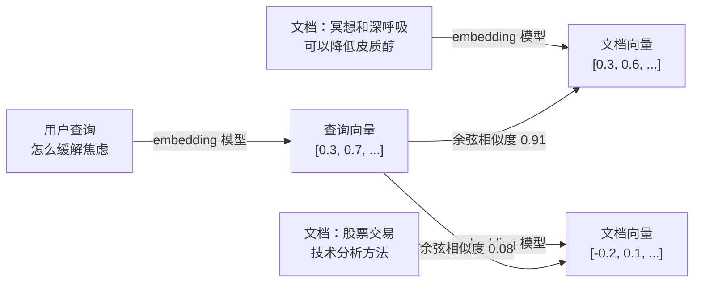

# Embedding（向量嵌入）

> [!tip] 核心本质
> **Embedding** 把文本（词、句、段）映射成 **固定维的连续向量**，使「意思相近」在几何距离上也相近——检索时用 [[cosine-similarity|余弦相似度]] 等度量比较方向，配合 [[ann]] 做语义近邻搜索。若没有 embedding，每个 token 只是孤立编号（「猫」=3567、「狗」=2841），数字之间无数学关系，模型无法迁移「动物—食物」这类模式，RAG 也只能靠关键词字面匹配，同义改写与跨语言召回会大面积失效。

## 生命周期与演进

**当前定位**：RAG、语义搜索、推荐召回的 **表示层地基**；生产侧多为专用 embedding API（OpenAI `text-embedding-*`、BGE、E5）或 [[bi-encoder|双塔]] checkpoint，产出 [[dense-vector|稠密向量]] 后入库检索。

**预期寿命**：长期稳定。「连续向量 + 距离度量」自 Word2Vec（2013）经 Transformer 句向量（2019）延续至今；具体模型每 1–2 年迭代，但 **把语义压进可计算距离** 这一范式不会消失。

**近期演进**：上下文感知 token 表示（同一词多义可分）；Matryoshka / 可变维度；多语言单空间（mE5、BGE-M3）；与 learned sparse 同模型输出（BGE-M3 dense+sparse）。ColBERT 等多向量方案在精度与索引成本间折中，但不取代「需要单向量粗排」的主路径。

**终极威胁**：端到端检索头或超长上下文「少检索、多入窗」削弱单向量粗排权重；多模态统一编码器可能吸收纯文本 embedding 的独立产品形态。但在 **百万级私有库、权限分域、可换 checkpoint 的离线索引** 场景，专用 embedding 仍是成本与延迟最优解之一。

---

## 语义空间：训练动机与相似度

### 没有 embedding 时会发生什么

没有 embedding，模型只能把每个 token 当成孤立编号——「猫」是 3567 号，「狗」是 2841 号，「汽车」是 10234 号，三者之间 **没有任何数学关系**。模型看到「猫喜欢吃鱼」之后，在处理「狗喜欢吃骨头」时无法迁移「动物—食物」关系，因为「猫」和「狗」对它来说是两个陌生符号；每个词都是孤岛，训练数据再多也积累不出可泛化的语义。

从第一性原理：需要一种表示，使 **意思相近** 在 **数学距离** 上也相近。向量有方向与模长，可算距离、可做加减。问题变为：如何把词/句映射到向量空间并保留语义？答案是让模型在大规模文本上 **自己学出映射**——训练目标为预测上下文（或被上下文预测），语义相近的词常共现，收敛后向量自然聚类。

### 相似度是可计算的，不是隐喻

检索里常用 [[cosine-similarity|余弦相似度]] 衡量方向是否接近（约 -1～1，越接近 1 越像）。公式、手算与 L2/点积对比见该节点；此处只保留直觉：

```
vec("猫")   ≈ [0.2, 0.8, -0.1, 0.5, ...]   # 维度通常 768 或 1536
vec("狗")   ≈ [0.2, 0.7, -0.2, 0.5, ...]   # 和猫的方向很接近
vec("汽车") ≈ [0.9, 0.1,  0.7, -0.3, ...]  # 方向完全不同
```

向量空间里还可出现近似语义运算（经典例子）：

```
vec("国王") - vec("男人") + vec("女人") ≈ vec("女王")
```

说明不同语义因素可在空间中被编码为 **近似独立的方向**；尽管单维人类可解释性弱，几何结构对检索仍有效。

---

## 演进：从静态词向量到上下文与句向量

| 阶段 | 代表 | 特点 | 局限 |
| --- | --- | --- | --- |
| 静态词向量 | Word2Vec、GloVe | 一词一向量，训练快 | 「苹果」在「苹果树」与「苹果手机」同向量，多义不分 |
| 上下文 token 表示 | [[transformer]] 各层 hidden | 同词在不同句中向量不同 | 单 token 向量不便直接做 **句级** 相似度检索 |
| 句/段级 embedding | Sentence-BERT、E5、BGE、OpenAI embedding API | 整段压缩为单向量，为 [[bi-encoder]] / RAG 粗排设计 | 超长文本单向量会丢细节，须分块 |

**关键辨析**：[[llm]] 生成用的模型与 **检索专用 embedding 模型** 是两类产品——后者只输出向量，延迟与成本通常低一两个数量级，不要混用同一 API 承担两职。句级向量为何不能直接用 BERT [CLS] 做 cos 比较，见 [Sentence-BERT（2019）](https://arxiv.org/abs/1908.10084)。

---

## RAG 中的角色：语义如何进入距离

RAG 检索步骤：用户查询 → embedding → 在文档向量库中找近邻。能匹配 **语义相关** 而不只是 **关键词相同**，是因为 embedding 把语义压进了距离关系。



查询里没有「皮质醇」，文档里没有「焦虑」，但模型在训练中学到的主题邻近仍使向量接近——这是 [[bm25]] 单独难以覆盖的。工业默认 **embedding 粗排 + [[bm25]] + [[rrf]] → [[cross-encoder]] 精排**（见 [[retrieval-pipeline]]）；embedding 负责 **不漏语义候选**，不负责最终对错。

---

## 实践示例

**场景一：向量近邻与相似度**

```python
from openai import OpenAI
import numpy as np

client = OpenAI()

def embed(text):
    resp = client.embeddings.create(
        model="text-embedding-3-small",
        input=text
    )
    return np.array(resp.data[0].embedding)

# 相似度计算见 [[cosine-similarity]]
from numpy import dot, linalg
def cosine_sim(a, b):
    return dot(a, b) / (linalg.norm(a) * linalg.norm(b))

query = embed("如何缓解工作压力")
doc1  = embed("冥想和规律运动有助于降低焦虑感")
doc2  = embed("Python 的 asyncio 库使用方法")

print(cosine_sim(query, doc1))  # ~0.88，高度相关
print(cosine_sim(query, doc2))  # ~0.12，几乎无关
```

**场景二：RAG 离线索引与在线检索**

```python
# 离线索引：文档库 → 向量入库
docs = ["冥想可以降低皮质醇...", "深呼吸技巧...", "股票技术分析..."]
doc_vectors = [embed(d) for d in docs]
# 存入向量库（Chroma、Pinecone、pgvector 等）

# 在线：query 向量 → ANN Top-K → 拼进 prompt 再调 [[llm]]
query_vec = embed("怎么缓解焦虑")
# 向量库返回 top-3；大规模库用 [[ann]] 而非暴力全表
```

双塔离线 encode、归一化与 ANN 的工程细节见 [[bi-encoder]]、[[dense-vector]]。

---

## 实践边界与误区

### 适合与不适合

| 适合 | 不适合单独依赖 embedding |
| --- | --- |
| 语义相似搜索、RAG 粗排 | 合同编号、API 路径等 **精确 token 匹配**（保留 [[bm25]]） |
| 文本聚类、主题分类 | **否定与逻辑**（「不支持 XX」与「支持 XX」可能很近） |
| 跨语言召回（多语言模型） | **超长文档单向量**（须分块后再 embed） |
| 推荐相似内容召回 | 把 **向量近** 当成 **事实正确** |

### 常见误区

| 误区 | 事实 |
| --- | --- |
| embedding 模型可以随便换 | 不同模型向量 **空间不兼容**；换模型须 **全量重建索引** |
| 向量距离近 = 答案正确 | 衡量 **语义相关**，非事实准确；「地球是平的」与「地球是圆的」可能都很近 |
| chunk 越长信息越丰富 | 句级模型有有效长度上限（常 ~512 token）；超长会截断或稀释 |
| 理解否定语义 | 需 [[cross-encoder]] 精排或规则过滤 |
| 检索直接调 [[llm]] 拿向量 | 应用 **专用 embedding 模型**；生成与表示分工不同 |

---

## 进一步阅读

- [[dense-vector]] — embedding 产物的数据结构形态，与稀疏/BM25 的分工
- [[bi-encoder]] — 双塔如何把 embedding 变成可扩展的相似度检索
- [[cosine-similarity]] — 检索用的相似度公式与工程等价（归一化 + 点积）
- [[cross-encoder]] — 粗排之后的精排，弥补向量检索的交互缺失
- [[ann]] — 大规模近邻搜索为何需要近似算法
- [[rag]] — embedding 最重要的下游应用；与本文合读才完整
- [[retrieval-pipeline]] — 混合召回、RRF、精排全链路
- [Illustrated Word2Vec - Jay Alammar](https://jalammar.github.io/illustrated-word2vec/) — 词向量训练直觉可视化
- [OpenAI Embeddings 指南](https://platform.openai.com/docs/guides/embeddings) — 生产级维度、定价与注意事项
- [Faiss 文档](https://faiss.ai/) — 向量近邻库与 ANN 工程背景
- [Sentence-BERT（Reimers & Gurevych, 2019）](https://arxiv.org/abs/1908.10084) — 句级 embedding 与对比训练奠基工作
