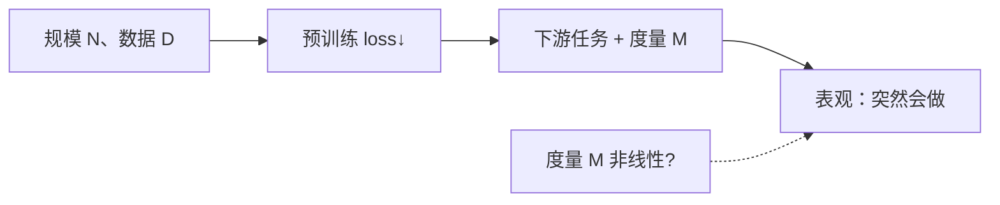

---
tags:
  - concept
aliases:
  - Emergence
  - 涌现
  - 涌现能力
  - Emergent Abilities
prerequisites:
  - "[[llm]]"
  - "[[token-prediction]]"
  - "[[scaling-laws]]"
related:
  - "[[llm]]"
  - "[[token-prediction]]"
  - "[[scaling-laws]]"
  - "[[transformer]]"
  - "[[training-data]]"
  - "[[rlhf]]"
  - "[[rlvr]]"
  - "[[chain-of-thought]]"
  - "[[agent]]"
stability: long
layer: model
updated: 2026-06-14
---

# 涌现（Emergence）

> [!tip] 核心本质
> **涌现**在复杂系统里指：微观规则不变，宏观规模或组织方式一变，整体出现**无法从局部简单外推**的定性新行为。大语言模型语境下的**能力涌现（Emergent Abilities）**特指：同一模型族在小规模上近乎随机或极弱的下游任务，到大规模上突然可用——且不能靠「把小模型的曲线延长」提前预知。若没有这个概念，团队会把「7B 做不了」误判成「70B 也做不了」，或在产品宣传里把**评测曲线的垂直跳变**当成**智能相变**的硬证据，从而在 Agent 预算与能力承诺上踩空。

适合已读 [[llm]]、[[token-prediction]]，要分清「规模涌现」「预训练顺带学会」「对齐/强化后新行为」三种说法的读者。读完 [[#2 三种「涌现」别混用|§2]] 能避免概念混用；[[#4 争议：相变还是度量幻觉|§4]] 能解释为何论文与 benchmark 图会「突然竖起来」。算力与幂律细节见 [[scaling-laws]]，本篇专注**能力如何从规模与评测中显现**。

*检索说明：Wei et al. (2022) [arXiv:2206.07682](https://arxiv.org/abs/2206.07682)；Schaeffer et al. (2023) [arXiv:2304.15004](https://arxiv.org/abs/2304.15004)；GPT-3 few-shot [Brown et al. 2020](https://arxiv.org/abs/2005.14165)（观测 2026-06-14）。*

## 生命周期与演进

**当前定位**：LLM 领域的**核心叙事之一**，也是**方法论争议焦点**。工业界默认「更大通常更强」；学术界同时争论「突变是否真实存在」。Wei 等把涌现与 [[scaling-laws|缩放法则]] 并列为规模研究的两大发现；Schaeffer 等则主张许多突变来自**度量选择**与**小样本估计误差**。

**预期寿命**：长期。只要预训练仍靠扩参、扩数据，「何时出现新能力」就是产品与科研的共同问题；争议不会消灭「规模重要」，但会重塑**如何读曲线、如何写评测**。

**近期演进**：[[chain-of-thought]]、指令微调、[[rlhf]] / [[rlvr]] 把部分能力从「纯规模」部分解耦到**训练阶段与推理时计算**；reasoning 模型在固定参数量下用更长「思考链」换性能，使「涌现」叙事从**参数量阈值**扩展到**训练配方 + 测试时算力**。

**终极威胁**：若能力随规模**平滑可外推**且评测范式统一为连续指标，「不可预测跃迁」的故事会褪色；更现实的威胁是**小模型 + 检索 + 工具 + 验证器**在任务级逼近大模型，使「必须千亿才涌现」不再是工程默认。

## 1 问题从哪来

你拿同一套 benchmark 横轴画参数量、纵轴画准确率：7B 模型在多项任务上接近瞎猜，13B 仍平平，到某一档之后曲线**近乎垂直**——像相变。GPT-3 时代起，这种图支撑了「scale is all you need」的投资逻辑；也带来直接焦虑：**下一档模型会不会又突然出现我们没设计过的能力？**

更麻烦的是**决策不可外推**：在小模型上把数据、架构、损失调到最优，仍可能**完全估不到**大模型在 few-shot 算术、多步推理、复杂指令上的表现。这对 Agent 意味着：不能仅用「当前 8B 试点失败」否定「换 70B + 同样 Harness 是否够用」——但也不能假设「过了 100B 自主性必涌现」。

## 2 三种「涌现」别混用

日常讨论里「涌现」至少有三层含义，机制与证据不同，不宜混为一谈。

**表 1 — 三种常见「涌现」**

| 说法 | 指什么 | 典型证据 | 本篇是否展开 |
| --- | --- | --- | --- |
| **能力涌现（Emergent Abilities）** | 同族模型随**规模**在下游任务上从「不会」到「会」的**不可外推跃迁** | Wei 2022；BIG-Bench 曲线 | **核心** |
| **目标附带能力** | 为 [[token-prediction\|下一 token 预测]] 优化，语法/事实/推理等**被压进权重**，非单独设计 | [[llm]] 预训练段；「有损压缩」 | 相关，见 [[#3.2 与预训练 loss 的关系|§3.2]] |
| **后训练 / 推理时涌现** | SFT、[[rlhf]]、[[rlvr]] 或长链思考后出现的**新行为模式**（如自洽推理、自我纠错） | DeepSeek-R1 类工作 | 边界：不全是「纯 scale」 |

上图强调：**表观跃迁**可能来自规模，也可能来自**你选的 M**（exact match vs 连续分数）——§4 展开。

## 3 能力涌现的操作性定义

### 3.1 Wei et al.（2022）怎么说

[Emergent Abilities of Large Language Models](https://arxiv.org/abs/2206.07682) 给出 LLM 语境下可操作的定义：

> 若某能力在**较小规模**模型上不存在或极弱，在**较大规模**模型上出现，且**不能**通过外推较小模型的性能改进来预测，则称该能力为涌现。

两个伴随特征（后文争议焦点）：

- **尖锐性（sharpness）**：曲线在某尺度附近陡升；
- **不可预测性（unpredictability）**：跃迁点难以从小模型提前读出。

作者按**使用方式**归纳观测场景，而非单一架构定理：

| 场景 | 例子（文献中常引） |
| --- | --- |
| **少样本提示（Few-shot Prompting）** | BIG-Bench 算术、多选、TruthfulQA 等：小模型近随机，大模型骤升 |
| **增强提示策略（Augmented Prompting）** | [[chain-of-thought]]、零样本 CoT、多语言 CoT、指令微调后零样本遵循 |

这与 [GPT-3](https://arxiv.org/abs/2005.14165) 的叙事一脉相承：规模增大改善 in-context 学习，但**哪些任务**在**哪一档**突变，事前并不完整可知。

### 3.2 与预训练 loss 的关系

涌现讨论的是**下游任务 + 提示设定**，不是训练 loss 本身。[[scaling-laws]] 说 pretrain loss 对 N、D、C 往往**平滑幂律**；Wei 文 Appendix 亦指出：对若干 BIG-Bench 任务，**交叉熵**在小模型上已改善，而 exact match / accuracy 仍近随机——**微观概率在变好，宏观「对错」指标尚未翻过阈值**。

因此：

- **loss 平滑**与**能力表观突变**可以同时成立（度量非线性 + 任务阈值）；
- 「顺带学会语法/事实」是 [[token-prediction]] 目标的**压缩副产物**；「能力涌现」强调**在特定评测协议下**从小模型**外推失败**——二者相关但不等价。

## 4 争议：相变还是度量幻觉

### 4.1 Schaeffer et al.（2023）的核心主张

[Are Emergent Abilities a Mirage?](https://arxiv.org/abs/2304.15004) 并不否认大模型更强，而是质疑**突变作为本体论事实**：

1. **度量**：exact match、多选题对错等**非线性/不连续**指标，会把平滑的 per-token 误差「压」成垂直跳变；换成 **Brier score**、编辑距离等**连续**指标，同一模型族往往呈现**平滑、可预测**改进。
2. **小样本**：小模型评测样本少时，性能被估成「完全不会」，放大断崖感。

他们用简单数学模型 + InstructGPT/GPT-3 族 + BIG-Bench 元分析 + 视觉任务复现：**换度量可造出或抹掉涌现**。结论应读作：**已报道的涌现列表**可能高度依赖**研究者选的 M 与统计功效**，而非证明「智能在某 B 参数发生相变」。

### 4.2 如何同时接住两边

| 立场 | 可保留的陈述 |
| --- | --- |
| **Wei / 规模派** | 许多复杂能力**首次**在大模型 + 特定提示下才**实用**；扩 scale 仍可能解锁未列进论文的能力 |
| **Schaeffer / 度量派** | 单条 benchmark 曲线的「断崖」**不足以**证明本质相变；读图必须看指标、样本量、是否报告连续分数 |
| **工程折中** | **更大模型通常更好用**（与缩放法则、部署经验一致）；**「垂直曲线 = 灵魂觉醒」**则过度解读 |

Wei 文自身也提醒：应用 exact match 会长序列任务上**掩盖** loss 改善——与 Schaeffer 的批评**部分同向**，差异在是否把剩余「不可预测的下游跃迁」视为待解释真现象。

## 5 工程含义

### 5.1 Agent 与产品选型

- **规模是实用前提之一，非充分条件**：复杂 [[planning]]、tool 调用、长上下文利用常随模型档位改善，但无「超过 X B 必涌现 Agent」的普适阈值。
- **试点失败不可直接外推**：小模型上的 Harness 失败，应区分「能力不够」与「提示/工具/检索未配好」；升档前用**同协议**复测。
- **评测协议即能力定义**：换 metric（pass@k、LLM-as-judge、连续打分）可能改变「何时算会做」——见 [[scaling-laws#5 能力涌现与争议|scaling-laws §5]] 的 Agent 提醒。
- **后训练可模拟「涌现感」**：[[rlvr]]、长 CoT 推理模型在**固定参数量**下也能新增行为；选型要把 **pretrain scale、对齐、推理预算** 分开列项。

### 5.2 读论文与宣传话术

可信表述：「在 **BIG-Bench 任务 X、few-shot、accuracy 指标**下，LaMDA/GPT-3 族在约 **Y** 计算量后出现陡升。」  
过度表述：「AI 在 **Y** 参数产生意识/通用推理相变。」

## 6 常见误区

- **涌现 = 预训练 loss 也断崖**：多数情况下 loss 仍平滑；断崖多在**离散下游指标**。
- **涌现 = 科学定论的智能相变**：Schaeffer 线活跃；应区分**工程经验**与**本体论主张**。
- **没有垂直曲线 = 规模无用**：连续指标下的平滑改进仍支持加大规模与数据；争议的是**叙事强度**。
- **所有新能力都来自 scale**：指令微调、CoT、[[rlhf]]、测试时扩展思考都会移动曲线，不全是参数量。
- **涌现消除幻觉**：能力变强不保证事实性；见 [[hallucination]]。
- **与小模型 + RAG 矛盾**：涌现论强调大模型**潜在上限**；工程上常靠检索与工具**补足**而非等待规模。

## 要点收束

- **涌现**：复杂系统宏观定性新行为；LLM **能力涌现** = 小模型不可测、大模型可用的下游能力，**不能**靠小模型外推。
- **三种说法**：规模下游跃迁（本篇核心）、预训练目标附带、后训练/推理时新行为——机制不同。
- **Wei 定义** + few-shot / 增强提示两类观测场景；与 [[scaling-laws]]、[[token-prediction]] 分工明确。
- **Schaeffer**：非线性度量与小样本可制造「突变」；换连续指标曲线常变平滑。
- **工程**：更大模型往往更够用，但无通用参数阈值；评测协议与 Harness 与 scale 同等重要。

## 进一步阅读

### 库内关联

- [[scaling-laws]] — 幂律与算力分配；§5 与本篇互补，偏标度与 Agent 选型
- [[llm]] — 预训练「顺带涌现」与能力边界
- [[token-prediction]] — 简单目标为何压入复杂能力；loss 与下游指标脱节
- [[chain-of-thought]] — 增强提示如何移动「涌现」曲线
- [[rlvr]] — 非纯 scale 的推理行为出现方式
- [[agent]] — 规模、工具与 Harness 的实际组合

### 外部参考

- [Wei et al., Emergent Abilities of Large Language Models (2022)](https://arxiv.org/abs/2206.07682) — 定义、分类与 BIG-Bench 案例
- [Schaeffer et al., Are Emergent Abilities a Mirage? (2023)](https://arxiv.org/abs/2304.15004) — 度量选择与突变再解释
- [Brown et al., Language Models are Few-Shot Learners / GPT-3 (2020)](https://arxiv.org/abs/2005.14165) — 规模与 in-context 学习里程碑
- [Kaplan et al., Scaling Laws (2020)](https://arxiv.org/abs/2001.08361) — 与涌现并提的平滑 loss 标度
- [BIG-Bench (2022)](https://arxiv.org/abs/2206.04615) — 涌现曲线的主要评测来源之一
