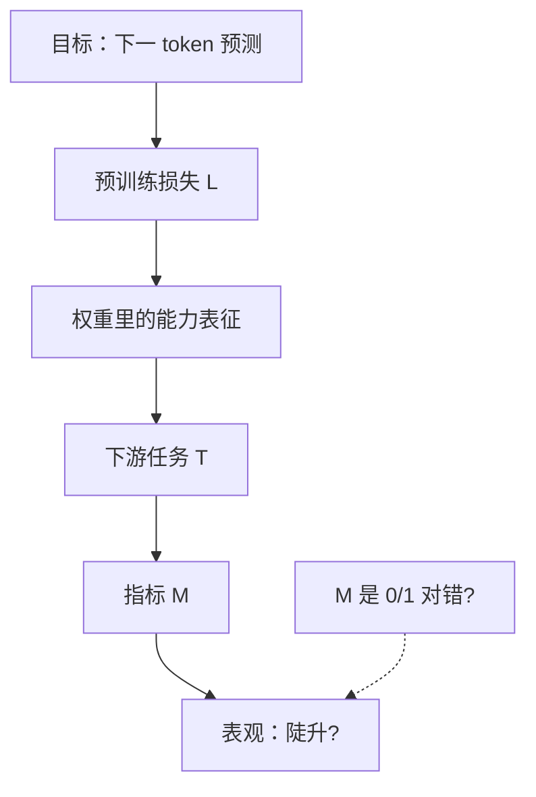

---
tags:
  - concept
aliases:
  - Emergence
  - 涌现
  - 涌现能力
  - Emergent Abilities
prerequisites:
  - "[[llm]]"
  - "[[token-prediction]]"
  - "[[scaling-laws]]"
related:
  - "[[llm]]"
  - "[[token-prediction]]"
  - "[[scaling-laws]]"
  - "[[transformer]]"
  - "[[training-data]]"
  - "[[rlhf]]"
  - "[[rlvr]]"
  - "[[chain-of-thought]]"
  - "[[agent]]"
stability: long
layer: model
updated: 2026-06-16
---

# 涌现（Emergence）

> [!tip] 核心本质
> **涌现**在复杂系统里指：微观规则不变，宏观规模或组织一变，整体出现**无法从局部简单外推**的定性新行为。放进 LLM：预训练目标始终是 [[token-prediction|下一 token 预测]]，没有单独为「算术」「推理」设损失，但模型变大、训到更低**预训练损失**后，某些下游任务会从「近随机」跳到「可用」——且横轴若画参数量，跃迁点往往**估不准**。竖起来的 benchmark 曲线，是**压缩进权重的能力**、**任务自身的难度门槛**与**你怎么打分**三者叠出来的表观现象，不是「参数一过线灵魂觉醒」。

适合已读 [[llm]]、[[token-prediction]]、[[scaling-laws]]，想弄清「评测曲线为何突然变陡、能不能信」的读者。本篇按**机制**组织：先定义，再拆三条成因，最后说明学术分歧与陈述边界。算力配比见 [[scaling-laws]]；对齐与推理时算力见 [[rlhf]]、[[chain-of-thought]]。

*检索说明：Wei et al. (2022) [arXiv:2206.07682](https://arxiv.org/abs/2206.07682)；Schaeffer et al. (2023) [arXiv:2304.15004](https://arxiv.org/abs/2304.15004)；Du et al. loss 视角 [arXiv:2403.15796](https://arxiv.org/abs/2403.15796)（观测 2026-06-16）。*

## 生命周期与演进

**当前定位**：连接「扩规模」与「突然能做复杂题」的核心叙事，也是**机制尚未定论**的研究前沿。工业界经验是更大基座通常更好用；学术界在争：陡升有多少是模型真门槛、有多少是打分方式造成的。

**预期寿命**：长期。只要预训练仍靠扩参、扩数据，「何时够用」就是共同问题；争论会推动大家改看**预训练损失**与**连续指标**，而不只盯参数量。

**近期演进**：[[chain-of-thought]]、[[rlhf]] / [[rlvr]]、测试时加长思考，把部分能力从「纯参数量」解耦到**后训练与推理算力**；Du 等（2024）主张用**预训练损失阈值**重述涌现，比「第几 B 参数」更可外推。

**终极威胁**：若下游能力对损失**平滑可外推**且评测统一用连续分数，「不可预测跃迁」叙事会褪色；工程上**小模型 + 检索 + 工具**已在许多任务逼近大模型，「必须千亿才够用」不再是默认。

## 1 定义：涌现指什么

### 1.1 复杂系统：微观不变，宏观质变

蚂蚁没有「造巢」子程序，但蚁群能造巢；这是宏观组织带来的定性新行为。LLM 里**没有**为每个下游任务单独设计模块，却在规模与训练深度上去之后，在评测上表现出算术、多步推理、复杂指令等能力——看起来像「新能力从参数里长出来」。

关键限定：**涌现说的是表观行为**，不是证明模型内部发生了物理学意义上的相变。你看到的是 benchmark 曲线；曲线背后可能是真门槛，也可能是度量方式的问题（后文 [[#3 机制：benchmark 曲线为何变陡|§3]]）。

### 1.2 大模型：评测上的不可外推跳变

文献里 **Emergent Abilities** 通常指三件事同时成立：

1. 同模型族里，小档在近随机，大档突然可用；
2. 只凭小档曲线**外推**，估不准大档何时、是否变强；
3. 现象绑在**具体任务 + 提示 + 指标**上，不是「参数量 > X 万能」。

日常说的「7B 不会、70B 会」，说的是这种**评测上的不可外推跳变**；不是 [[agent]] 自动诞生，也不是意识出现。

![[emergence-scaling-curve.png]]

**图 1：** 横轴参数量、纵轴任务准确率时的**表观涌现**——小档近随机，大档陡升；虚线表示「沿小档外推」往往失败（示意图，非某一具体 benchmark 实测）。

## 2 三种说法勿混用

| 说法 | 机制 | 本篇 |
| --- | --- | --- |
| **能力涌现** | 规模/损失跨过任务门槛后，下游评测跳变 | **核心** |
| **目标附带能力** | [[token-prediction]] 把语法、事实、推理模式压进权重 | 见 [[#3.1 压缩：单一训练目标压入多能力\|§3.1]] |
| **后训练 / 推理时新行为** | SFT、[[rlhf]]、长 CoT 等在固定参数量下改行为 | 见 [[#4 参数量之外的变量\|§4]] |

## 3 机制：benchmark 曲线为何变陡

benchmark 曲线在某一规模附近**突然变陡**，通常是下面三条机制**叠加**的结果，不必非此即彼。

![[emergence-three-mechanisms.png]]

**图 2：** 三条机制常同时作用——能力压进权重、任务损失门槛、离散指标放大跳变——最终叠成 benchmark 上的陡升曲线。

### 3.1 压缩：单一训练目标压入多能力

预训练只优化 [[token-prediction]]：给定前文，猜下一个 token。没有「算术损失」「推理损失」，但海量文本里**已经编码**了计算步骤、事实关联、论证结构。更大模型 = 更多参数去拟合这些统计规律，相当于在权重里塞进更复杂的**算法近似**（有损压缩，见 [[llm]]）。

直觉：小模型容量不够，连「模仿多位加法」的表征都装不下，输出近随机；容量够了之后，同一损失下降过程里**顺带**学会多步模式，评测分数才跳。这不是训练目标变了，而是**表示够用了**。

### 3.2 门槛：预训练损失与任务难度

[[scaling-laws]] 说预训练损失随参数量、数据量、算力**平滑**下降。但下游任务各自有**难度**：有的要模型先具备足够强的语言建模，才能在 few-shot 下做对。

Du 等（2024）用实验主张：横轴换成**预训练损失**比换参数量更能对齐不同尺寸模型——**同一损失，下游表现相近**。许多「涌现」任务在损失高于某阈值时一直像瞎猜，低于阈值后陡升；即**任务相关的损失门槛**，不是神秘的「第 100B 参数开关」。

这与 [[#3.1 压缩：单一训练目标压入多能力|§3.1]] 一致：陡升常是「模型终于够格做这道题」，只是画图时用参数量当横轴，门槛被看成参数门槛。

### 3.3 度量：离散打分放大跳变

很多 benchmark 用 **exact match**（整段答案完全一致才算对）或选择题 **accuracy**（非对即错）。模型内部可以是**逐 token 误差平滑下降**——每个词猜得更准了，但整题仍错，分数停在 0。

Schaeffer 等（2023）用数学与复现说明：把同一模型族的平滑误差通过**非线性、不连续**的指标映射成准确率，可以**人为压出**竖墙；换 Brier 分数、编辑距离等连续指标，曲线往往变平滑。Wei 文 Appendix 也承认：交叉熵已改善时，exact match 仍可能近随机。

因此读图时要问：**陡升有多少反映模型变强，有多少来自度量方式**。

![[emergence-loss-vs-accuracy.png]]

**图 3：** 同一模型族里，预训练损失往往平滑下降，但 0/1 类准确率可在某一规模附近看似断崖——微观在变好，宏观「整题对错」可能仍未过线。

| 层次 | 量什么 | 随规模典型形态 |
| --- | --- | --- |
| **训练** | 预训练损失（交叉熵） | 平滑下降 |
| **微观** | 逐 token 预测误差 | 往往平滑改善 |
| **宏观评测** | 对错、exact match | 可能看似断崖 |

### 3.4 协议：少样本提示依赖规模

少样本提示依赖**上下文学习**（in-context learning：不微调，靠提示里的示范临时做题）。GPT-3 以来已知：规模增大，ICL 才从「几乎没用」变为「明显有用」。这是**用法 × 规模**的交互：同一任务在裸提示下不跳，在 few-shot 或 [[chain-of-thought]] 下才跳——不是架构定理，而是**机制在特定协议下才显现**。

## 4 参数量之外的变量

下列因素都会移动「何时算会做」，却**不**等于 Wei 式「纯规模涌现」：

| 因素 | 做什么 | 后果 |
| --- | --- | --- |
| **训练数据与配方** | 同参数量，多训 token、改混合 | 损失更低，门槛可能提前跨过 |
| **对齐** | SFT、[[rlhf]]、[[rlvr]] | 固定参数量也能新增推理、工具行为 |
| **推理预算** | 长 CoT、多次采样 | 测试时加算力，不增参也能跳分 |
| **提示与 Harness** | 工具、检索、规划循环 | 小模型 + 外挂可补足基座 |

「涌现」若只画预训练参数量，会把后训练与推理时算力误算成「参数灵魂」。

## 5 争议：陡升曲线如何解释

争论**不是**「大模型有没有用」——有用，且 [[scaling-laws]] 与部署经验都支持。争的是**陡升曲线该怎么读**：

| 读法 | 主张 | 保留什么 |
| --- | --- | --- |
| **表观涌现** | 特定任务上，小档外推失败、大档突然实用 | 选型时别因 8B 失败就否定 70B；也别信固定参数魔法数 |
| **度量因素** | 不少陡升来自 0/1 指标与小样本估计 | 读论文必须看指标、样本量、有无连续分数 |
| **损失门槛** | 真门槛在预训练损失，不在参数标签 | 同损失的不同尺寸模型，下游应接近；Chinchilla 式「小模型训足」可提前跨槛 |

三者可并存：损失平滑下降 + 任务门槛 + 离散指标，足以产生「看起来像涌现」的图；是否还有**额外的、不可还原为这三者的跃迁**，仍是开放问题。

## 6 陈述范围：能推出与不能推出

一条负责任的「涌现」陈述，须钉住**任务、提示、指标、模型族、规模轴**（参数量 / 算力 / 损失中的哪一个）。缺一项就无法复现，也容易把评测事实说成「智能相变」。

**能推出**：在该设定下大模型显著更好用；小档不足以外推大档；扩规模常是因素之一。  
**不能推出**：普适参数阈值、意识、[[agent]] 自动可用、训练损失同步断崖、任意任务同点跃迁。

## 7 常见误区

- **陡升 = 预训练损失也断崖**：多数情况损失仍平滑；断崖多在离散下游指标。
- **陡升 = 灵魂觉醒**：超出 Emergent Abilities 定义；见 [[#6 陈述范围：能推出与不能推出|§6]]。
- **没有陡升 = 规模无用**：损失与连续指标仍随规模改善；争的是叙事强度与读图方式。
- **涌现 = 只有参数量**：数据、对齐、推理预算、提示都会移曲线。
- **7B 失败则 70B 必败 / 70B 必成 Agent**：前者过于悲观，后者过于乐观；须同 Harness 复测。

## 要点收束

- **涌现**：复杂系统宏观定性新行为；LLM 里指**特定评测协议下**从小档不可外推的跳变，不是 Agent 或意识。
- **三条机制**：能力被下一 token 目标压进权重；任务损失门槛；离散指标放大跳变——常叠加出现。
- **损失轴**：预训练损失平滑；Du 等主张用损失阈值比参数量更可外推；与 [[scaling-laws]] 一致。
- **争议**：大模型有用无争议；争陡升有多少来自度量、有多少来自真门槛。
- **陈述范围**：须钉死五要素；表观跃迁推不出普适阈值与自动 Agent。

## 进一步阅读

### 库内关联

- [[scaling-laws]] — 损失幂律与 N、D、C 配比
- [[token-prediction]] — 单一目标为何压入多能力
- [[llm]] — 预训练压缩与硬边界
- [[chain-of-thought]] — 增强提示如何移门槛
- [[rlvr]] — 固定参数量下的推理行为
- [[agent]] — 基座之外还需 Harness 与工具

### 外部参考

- [Wei et al., Emergent Abilities of Large Language Models (2022)](https://arxiv.org/abs/2206.07682) — 术语来源与 BIG-Bench 案例
- [Schaeffer et al., Are Emergent Abilities a Mirage? (2023)](https://arxiv.org/abs/2304.15004) — 非线性度量与突变再解释
- [Du et al., Understanding Emergent Abilities from the Loss Perspective (2024)](https://arxiv.org/abs/2403.15796) — 损失阈值视角
- [Brown et al., GPT-3 (2020)](https://arxiv.org/abs/2005.14165) — 规模与上下文学习
- [Kaplan et al., Scaling Laws (2020)](https://arxiv.org/abs/2001.08361) — 平滑损失标度
