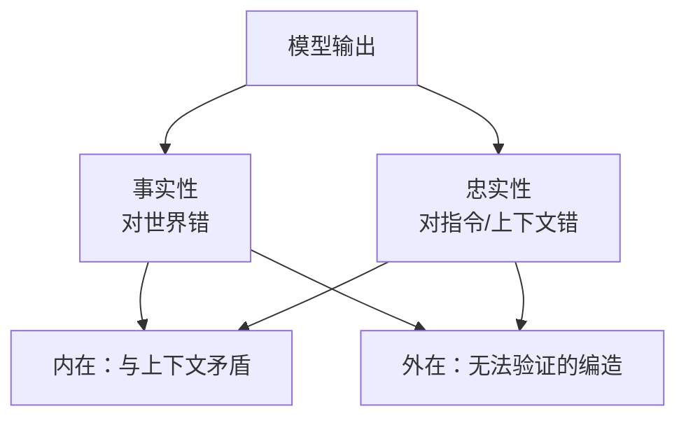
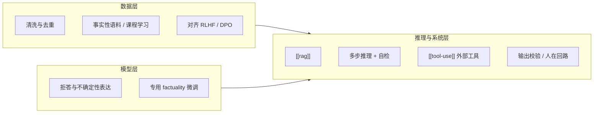

---
tags:
  - concept
  - reliability
aliases:
  - Hallucination
  - 模型幻觉
  - 大模型幻觉
  - LLM 幻觉
prerequisites:
  - "[[llm]]"
  - "[[token-prediction]]"
related:
  - "[[llm]]"
  - "[[rag]]"
  - "[[training-data]]"
  - "[[rlhf]]"
  - "[[tool-use]]"
  - "[[chain-of-thought]]"
  - "[[reflection]]"
  - "[[agent]]"
stability: permanent
layer: model
updated: 2026-06-14
---

# 模型幻觉（Hallucination）

> [!tip] 核心本质
> 模型幻觉（Hallucination）指大语言模型（LLM）生成的内容在**事实**、**给定上下文**或**用户指令**上不可靠——编造不存在的实体、事件或细节，或在摘要/翻译等任务中偏离源文。根因不是「模型故意说谎」，而是 [[token-prediction|下一 token 预测]] 目标只优化**流畅且像真的续写**，没有内置事实核查；在知识缺口或推理链断裂时，仍会**过度自信**地补全。若不把幻觉当作结构性风险，Agent 会把错误当工具输入，把编造当可执行计划。

适合已读 [[llm]]、要在产品里区分「听起来对」与「可验证对」的读者。读完 [[#2 常见分类|§2]] 能按场景命名幻觉类型；[[#5 检测与缓解|§5]] 对应数据、模型与推理三层工程对策；[[#4 Agent 场景|§4]] 用旅游规划说明业务后果。

*检索说明：分类与成因对照 [Huang et al. 2023](https://arxiv.org/abs/2311.05232)、[Zhang et al. 2023](https://arxiv.org/abs/2309.01219)；RAG 缓解 [Lewis et al. 2020](https://arxiv.org/abs/2005.11401)（观测 2026-06-14）。*

## 生命周期与演进

**当前定位**：LLM 落地的首要可靠性风险之一；RAG、工具调用、对齐与验证循环是 Agent 栈的标配，但**不能**假设幻觉可归零。

**预期寿命**：长期。只要训练目标仍是自回归语言建模，「高概率 ≠ 真」的缝隙就存在；部分综述认为在可计算 LLM 上幻觉在理论上难以彻底消除，工程重点是**检测、约束与人在回路**。

**近期演进**：检索增强（[[rag]]）、Agentic 多步验证（[[reflection]]）、结构化输出与 [[function-calling|工具调用]] 成为主流缓解层；事实性评测（TruthfulQA、FActScore 等）与 RAG 专用幻觉 benchmark 快速增多。

**终极威胁**：若 world model / 可验证推理栈取代纯文本续写，或训练目标显式优化「可引用、可拒答」，幻觉形态会变；短期仍须按**任务风险**分层治理（客服 FAQ vs 医疗 vs 订票）。

## 1 定义：续写，不是检索

LLM 推理时在参数里做模式匹配，逐 token 采样最「合理」的延续——**没有**访问真实世界数据库的步骤，也**没有**对每条陈述的事后验真模块（除非你在系统层外加）。

因此会出现：

- 训练语料里**从未出现**或**记错**的事实，仍被写成完整、自信的句子；
- 多步推理中某一步偏离，后续 token 会继续「圆」错误结论；
- 与 [[context-window]] 中已给文档**矛盾**的陈述（检索到了却没用好，或 Lost in the Middle）。

这与 [[llm-generation-traps]] 不同：后者是对齐与平滑带来的**风格偏置**；幻觉是**内容与事实/上下文不一致**，二者可同时出现。

## 2 常见分类

学界有多套彼此重叠的分类；工程上常用两维组合理解（见 [Huang et al.](https://arxiv.org/abs/2311.05232)）：

**表 1 — 幻觉类型（互补维度）**

| 维度 A | 含义 | 例子 |
| --- | --- | --- |
| **事实性幻觉（Factual）** | 与可验证的**现实世界**知识不符 | 错报首都、虚构人物履历、编造论文 DOI |
| **忠实性幻觉（Faithfulness）** | 未忠实于**用户指令**或**提供的上下文** | 摘要漏掉关键否定；翻译添加源文没有的信息 |

| 维度 B | 含义 | 例子 |
| --- | --- | --- |
| **内在幻觉（Intrinsic）** | 与**输入/上下文**直接矛盾 | RAG 文档写「2024 年关闭」，回答仍推荐该店 |
| **外在幻觉（Extrinsic）** | 输出含**输入未提供**且**无法从源验证**的内容 | 给一段新闻，模型补充未出现的「内幕细节」 |

**读表注意**：同一错误可能贴多个标签——「虚构景点」既是事实性，在 Agent 对话里往往也是外在幻觉；摘要里捏造数据则是忠实性 + 外在。

## 3 成因：数据、机制与任务

### 3.1 训练数据

[[training-data]] 决定知识上限与偏见下限：

- **错误与矛盾**：语料中的过时信息、互斥陈述被一并压缩进参数；
- **知识截止**：训练截点之后的事件、产品、政策模型**未见过**，却可能仍生成 plausible 答案；
- **社会偏见与刻板印象**：数据中的偏见会被统计性地复现——这不总是「事实错」，但属于**不可靠生成**，与事实性风险并列治理。

### 3.2 自回归机制

[[token-prediction]] 只最大化「像训练语料的下一段文本」；**流畅、自信、具体**与**正确**在损失函数里并未分离。低 temperature 减少随机性，**不**保证真；模型也不会默认输出「我不知道」。

### 3.3 复杂推理与长链任务

[[chain-of-thought]] 等长链生成中，早期一步错误会被后续 token **锁定**并放大；没有外部校验时，表现为逻辑幻觉或事实幻觉。对齐（[[rlhf]]）可减轻某些有害或明显胡说，但**不能**从机制上消除所有事实错误。

## 4 Agent 场景

无 grounding 的 Agent 会把幻觉**执行化**：

| 场景 | 幻觉表现 | 后果 |
| --- | --- | --- |
| 旅游规划 | 推荐不存在的景点、错误开放时间 | 用户白跑、信任崩塌 |
| 订票/查价 | 编造航班号、虚假余票 | 无法出票、合规风险 |
| 知识问答 | 虚构引用、错链法规条文 | 错误决策 |
| 代码 Agent | 调用不存在的 API、错包名 | 运行失败或安全漏洞 |

因此 [[agent]] 设计默认假设：**基座会错**——需要检索、工具、校验与人在高风险环节把关，而不是「模型足够大就不会编」。

## 5 检测与缓解

幻觉**短期内难以完全消除**；目标是按风险分层**降低频率与危害**。

### 5.1 数据与对齐

- **高质量清洗**：减少矛盾样本与低质抓取；
- **注入可验证知识**：百科、结构化 KB 等在预训练/SFT 中的占比与课程设计；
- **[[rlhf]] / 偏好优化**：奖励「诚实、拒答、引用依据」，惩罚捏造——缓解明显胡说，但对长尾事实仍有限。

### 5.2 模型与训练

- 训练模型在不确定时** abstain** 或给出置信度（产品层常仍不足，需系统补位）；
- 面向事实性的 SFT 与评测驱动迭代（TruthfulQA 等）。

### 5.3 推理与系统（Agent 主战场）

| 手段 | 作用 | 局限 |
| --- | --- | --- |
| **[[rag]]** | 生成前从外部库检索，把证据塞进 [[context-window]]；[Lewis et al.](https://arxiv.org/abs/2005.11401) 报告 RAG **更少**幻觉 | 检索错 → **带引用的错**；模型仍可能无视文档 |
| **多步推理 + 验证** | [[chain-of-thought]] + [[reflection]] / 自检 prompt / 第二遍 critic | 增加成本；自检也可能错 |
| **[[tool-use]]** | 搜索、计算器、数据库、代码执行——用**可验证源**替代参数记忆 | 工具结果需解析正确；API 幻觉另论 |
| **结构化输出 + 校验** | JSON schema、规则引擎、与知识库比对 | 仅覆盖可形式化的字段 |

**RAG 特别说明**：它是目前缓解**开放域事实幻觉**最有效的架构之一，但不是银弹——见 [[rag]] 中「检索到错误 chunk 比不检索更危险」。工程上应要求**引用来源**、低置信度拒答，并对高风险动作（下单、发邮件）加**硬 gate**。

## 6 常见误区

- **更大模型就不会幻觉**：规模降低频率，不消除；长尾事实与实时信息仍会错。
- **RAG = 无幻觉**：检索质量、融合与忠实性仍是瓶颈。
- **幻觉 = 模型「说谎」**：机制上是错误续写，用「恶意」框架不利于设计 mitigation。
- **只要 RLHF 就够了**：对齐改善体验与部分有害输出，不能替代检索与验证。
- **混淆幻觉与偏见**：偏见可能是「符合训练分布但有害/不公平」；治理手段部分重叠，诊断不同。

## 要点收束

- 幻觉：生成内容与事实、上下文或指令不符；本质是**自回归续写**而非事实检索。
- 分类：**事实性 / 忠实性** × **内在 / 外在**（标签可重叠）。
- 成因：[[training-data]] 噪声与截止、[[token-prediction]] 机制、长链推理错误；偏见与时效性加剧不可靠。
- Agent 会把幻觉变成**错误行动**——旅游、订票等场景必须 grounding + 校验。
- 缓解：数据与 [[rlhf]] 打底；**RAG、工具、多步验证、人在回路**是系统层主力；无法指望短期归零。

## 进一步阅读

### 库内关联

- [[llm]] — 幻觉在核心局限表中的定位
- [[token-prediction]] — 为何「像真」不等于「真」
- [[training-data]] — 知识上限、截止与偏见来源
- [[rag]] — 检索增强如何降幻觉及失效模式
- [[tool-use]] — 用外部可验证源替代参数记忆
- [[chain-of-thought]] / [[reflection]] — 多步推理与自检
- [[rlhf]] — 对齐如何塑造拒答与诚实偏好

### 外部参考

- [Huang et al., A Survey on Hallucination in LLMs (2023)](https://arxiv.org/abs/2311.05232) — factuality / faithfulness 分类与缓解图谱
- [Zhang et al., Siren’s Song… (2023)](https://arxiv.org/abs/2309.01219) — 检测、benchmark 与 mitigation 综述
- [Lewis et al., RAG (2020)](https://arxiv.org/abs/2005.11401) — 检索增强减少幻觉的经典论据
- [Maynez et al., On Faithfulness and Factuality… (2020)](https://arxiv.org/abs/2005.00661) — intrinsic / extrinsic 在摘要任务中的定义
- [Lin et al., TruthfulQA (2022)](https://arxiv.org/abs/2109.07858) — 衡量模型是否复现常见误解
