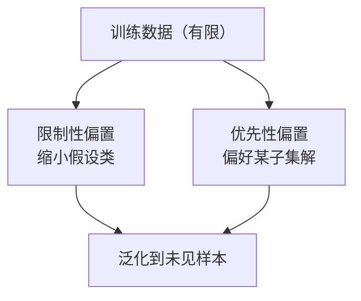

---
tags:
  - concept
aliases:
  - 归纳偏置
  - Inductive Bias
  - 归纳偏差
prerequisites:
  - "[[llm]]"
related:
  - "[[llm]]"
  - "[[transformer]]"
  - "[[token-prediction]]"
  - "[[attention]]"
  - "[[world-model]]"
  - "[[llm-generation-traps]]"
  - "[[causal-chain]]"
  - "[[embedding]]"
stability: permanent
layer: model
updated: 2026-06-14
---

# 归纳偏置（Inductive Bias）

> [!tip] 核心本质
> 归纳偏置（Inductive Bias）是学习算法在有限样本上泛化时**预先偏向某类假设**的结构性倾向——没有它，与训练数据一致的可能函数有无穷多种，模型只能接近随机猜测。CNN 的局部性与平移等变、线性模型的低阶假设、大语言模型的「下一个 token」目标，都是归纳偏置。偏置与任务**错位**时会系统性欠拟合或学到伪规律；选型本质不是找万能算法，而是找**偏置与问题结构对齐**的模型。

适合已读 [[llm]]、要在选型与微调时问清「模型默认在假设什么」的读者。读完 [[#2 两类偏置与 No Free Lunch|§2]] 能区分限制性/优先性偏置与 NFL 的工程含义；[[#4 工程杠杆|§4]] 给出架构、目标、继续训练三条改偏置杠杆。

*检索说明：NFL 与 Kolmogorov 立场文 [Goldblum et al., ICML 2024](https://proceedings.mlr.press/v235/goldblum24a.html)；CNN 局部偏置 [Cao et al., 2024](https://arxiv.org/abs/2403.15707)；教学直觉 [Flatiron 归纳偏置指南](https://resources.flatiron.com/flatiron-stories/using-inductive-bias-as-a-guide-for-effective-machine-learning-prototyping)（观测 2026-06-14）。*

## 生命周期与演进

**当前定位**：机器学习基础概念；深度学习时代从「架构硬约束」扩展到「过参数 + 优化 + 数据」共同形成的**软偏置**（平坦极小值、隐式正则、预训练先验）。

**预期寿命**：永久。只要学习是从样本归纳到未见样本，就必然存在偏置；变的是偏置落在架构、目标函数还是训练动态里。

**近期演进**：大模型用**极弱架构偏置**（Transformer 对序列几乎不硬编码局部性）+ **极强目标与数据偏置**（下一 token、互联网文本分布）；「改偏置」常指继续预训练/微调/RLHF，而非换 CNN 式硬结构。

**终极威胁**：无单一偏置能在所有任务上最优（NFL）。争议在于通用大模型是否在「真实世界低复杂度分布」上已足够通用——见 Goldblum et al.（2024）与经典 NFL 的对话，而非「偏置将消失」。

## 1 为何有限数据必须「偏心」

归纳学习：从有限训练样本推断未见样本上的规律。对同一组训练点，往往存在**无穷多**与之一致的假设——分类里未观测点的标签可任意指定。

经典教学例子：100 个整数已有标签，要预测第 101 个——数学上有 \(2^{100}\) 种与观测一致的标注；人却会猜「偶数为真、奇数为假」等**简单规律**，而非「前 50 随机、后 50 另随机」。对简单、平滑、可组合假设的优先，就是归纳偏置。

**结论**：偏置不是缺陷，而是泛化的**必要条件**。统计学习里的「去偏」通常指去掉**社会偏见**，不要与 inductive bias 混为一谈。

## 2 两类偏置与 No Free Lunch

### 2.1 限制性 vs 优先性

| 类型 | 含义 | 例子 |
| --- | --- | --- |
| **限制性（restrictive）** | 假设类里**直接排除**一批函数 | 线性回归只允许线性；树深度限制 |
| **优先性（preferential）** | 可表达很多函数，训练**更常收敛到**某子集 | L2 偏好小权重；SGD 偏好平坦极小值；预训练偏好「像语料」的续写 |

深度网络常二者兼有：卷积限制局部感受野，优化轨迹再偏好特定解。

### 2.2 No Free Lunch（NFL）

**NFL 定理**（Wolpert & Macready 等）：在**所有问题上的均匀平均**意义下，任意两种算法期望表现相同——A 在一类问题上优于 B，必存在另一类使 B 优于 A。

工程含义：

- 不存在打遍一切任务的「主算法」。
- 成功来自偏置与**真实问题结构**对齐（图像局部性、语言序列性、因果干预语义等）。

Goldblum et al.（ICML 2024）补充：均匀抽样的「问题」多为**高 Kolmogorov 复杂度**、不可压缩噪声；**真实数据与神经网络都偏向低复杂度模式**——这解释为何 Transformer 在多种域上仍能工作：我们关心的分布远非 NFL 的最坏均匀分布，并不否定「须选对偏置」。

## 3 常见模型里的归纳偏置

**表 1 — 模型族与任务对齐**

| 模型 / 目标 | 主要归纳偏置 | 匹配时 | 错位时 |
| --- | --- | --- | --- |
| **k 近邻** | 相近输入标签相似（局部平滑） | 低维、局部光滑边界 | 高维稀疏、长程依赖 |
| **线性 / 逻辑回归** | 低曲率、近似全局线性 | 特征已线性可分 | 强非线性、需手工交互特征 |
| **CNN** | **局部性**、**平移等变**、层次组合 | 图像、时空局部相关 | 长程关系、全局排列关键 |
| **RNN** | 顺序处理、隐状态压历史 | 短序列、强马尔可夫 | 极长依赖、难并行 |
| **Transformer** | 弱局部硬约束；任意位置可交互（[[attention]]） | 长程依赖、大数据预训练 | 小数据样本效率可能不如 CNN |
| **LLM（下一 token）** | 左到右续写；语料共现与世界知识压缩 | 开放域语言、代码补全 | 严格因果干预、精确数值时共现≠因果 |

### 3.1 CNN：硬偏置的教科书例

视觉任务常具**局部相关**与**平移结构**。卷积核与权值共享把「附近像素相关」「同一模式可平移」写进架构。Cao et al.（2024）在「信号+噪声+局部+平移不变」类任务上给出样本复杂度分离：CNN 相对全连接可更少样本学平移不变模式。

强偏置在**不匹配**时成枷锁——长程关系主导时，全局 [[attention]] 更易胜出（Vision Transformer 在大数据上兴起的背景之一）。

### 3.2 Transformer / LLM：偏置后移

相对 CNN，标准 Transformer **少硬编码空间结构**，假设空间更大，通常需**更多数据与算力**，换得长程依赖与跨模态扩展。

LLM 的核心目标偏置是 [[token-prediction|下一 token 预测]]：

- **偏好**：流畅高概率续写；训练语料共现与文体。
- **不保证**：因果方向正确、事实恒真、识别干预 `do(X)`（需 [[causal-chain]] 的外部结构或专门训练）。

对齐与解码叠加出可观测偏置（对称性、顺从惩罚等），见 [[llm-generation-traps]]。与 [[world-model]] 对比：下一 token 偏置优化**文本统计**，不保证学到可滚动的**状态动力学**。

## 4 工程杠杆：选型与改偏置

### 4.1 选型 = 对齐偏置与问题结构

| 任务结构 | 偏置更匹配的起点 |
| --- | --- |
| 表格/显式规则 | 梯度提升、浅层模型 |
| 图像局部模式 | CNN / 带视觉偏置的 ViT |
| 开放文本、工具、长 context | 大 Transformer + 预训练 |

核心问句：**「我的任务里，什么是永远成立的结构性假设？」**——写进架构、损失或数据，而非指望模型自己发现。

### 4.2 改偏置的三条杠杆

| 杠杆 | 做法 | 效果 |
| --- | --- | --- |
| **架构** | 换模型族、加卷积 stem / 状态空间层 | 改变限制性偏置 |
| **目标与数据** | 因果公理示例、RL 奖励、清洗语料 | 改变优先收敛到哪类函数 |
| **继续训练** | 预训练 → SFT → RLHF/DPO | 在通用续写偏置上叠领域/行为偏置 |

「内部路线改写权重里的归纳偏置」（[[causal-chain]]）即通过**目标与训练数据**把模型从共现预测拉向因果结构。

### 4.3 过参数化与隐式偏置

现代网络常**参数远多于样本**仍泛化：除显式正则外，**优化轨迹、初始化、增广**引入隐式偏置（偏好平坦、可压缩解）。这不推翻 NFL，而是说明工程关心的是**特定数据流形上的偏置是否合适**，而非所有可计算函数上的平均表现。

## 5 常见误区

- **偏置越少越先进**：Transformer「偏置弱」往往更**吃数据**；小样本下强结构模型仍可能更稳。
- **大模型没有归纳偏置**：下一 token、语料分布、对齐数据都是强偏置，只是未必与下游任务一致。
- **去掉偏置更公平**：没有 inductive bias 就没有泛化；公平性针对**社会偏见**，需单独治理。
- **验证集高 = 偏置正确**：可能只是测试分布与训练接近；新域、干预式决策会暴露错位。

## 要点收束

- 归纳偏置：有限数据下泛化所必需的「偏心」；非社会偏见意义上的 debias。
- 限制性偏置缩小假设类；优先性偏置让训练更常落入某子集；深度模型常二者兼有。
- NFL：均匀平均无免费午餐；真实低复杂度数据 + 神经网络偏好解释大模型跨域可用性。
- LLM 的核心偏置是下一 token 续写——强大但不保证因果与可滚动动力学。
- 工程上对齐偏置与任务结构；改偏置靠架构、目标/数据、继续训练三条杠杆。

## 进一步阅读

### 库内关联

- [[llm]] — 下一 token 目标带来的能力与边界
- [[token-prediction]] — LLM 训练目标即核心归纳偏置
- [[transformer]] / [[attention]] — 弱局部硬偏置的序列架构
- [[world-model]] — 状态动力学目标 vs 文本续写偏置
- [[causal-chain]] — 共现偏置 vs 因果结构；改写权重的集成路线
- [[llm-generation-traps]] — 对齐与解码层的可观测偏置

### 外部参考

- [Goldblum et al., NFL & Kolmogorov & Inductive Biases (ICML 2024)](https://proceedings.mlr.press/v235/goldblum24a.html)
- [Cao et al., Benefits of locality and weight sharing in CNNs (2024)](https://arxiv.org/abs/2403.15707)
- [Flatiron, Using inductive bias as a guide](https://resources.flatiron.com/flatiron-stories/using-inductive-bias-as-a-guide-for-effective-machine-learning-prototyping)
- [Mindful Modeler, From theory to practice: inductive bias](https://mindfulmodeler.substack.com/p/from-theory-to-practice-inductive)
- Mitchell, *Machine Learning* — 教科书级 NFL 与假设空间（经典参考）
