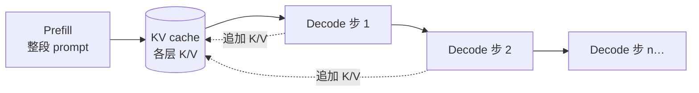

---
tags:
  - inference
  - mechanism
  - performance
aliases:
  - KV Cache
  - 键值缓存
  - KV 缓存
  - Decode KV Cache
prerequisites:
  - "[[attention]]"
  - "[[transformer]]"
  - "[[llm]]"
related:
  - "[[prefix-cache]]"
  - "[[vllm]]"
  - "[[context-window]]"
  - "[[quantization]]"
  - "[[agent]]"
stability: mid
layer: model
updated: 2026-06-22
---

# KV Cache（键值缓存）

> [!tip] 核心本质
> **KV cache（键值缓存）** 是自回归大模型**推理**里的标配数据结构：在生成每个新 token 时，把此前各层注意力算出的 **Key / Value 张量存下来**，下一步只算新 token 的 Query，与缓存的 K/V 做注意力——避免对整段历史重复前向。若没有它，decode 阶段每步都要对全部历史 token 重算 K/V，总计算量随已生成长度平方增长，长回复在工程上不可行。KV cache 解决的是**单请求、逐 token 生成**的效率问题；与跨请求复用前缀的 [[prefix-cache]] 是不同层。

适合已理解 [[attention]]、正在读 [[vllm]] 或优化 Agent 多轮延迟与成本的读者。读完 [[#2 核心原理|§2]] 能画出 prefill → decode 与 cache 如何增长；[[#2.5 三层「缓存」别混|§2.5]] 分清与前缀缓存；[[#3 对 Agent 与 Serving 的含义|§3]] 可对照自己的 Harness。

*检索说明：prefill/decode 与 KV 数据流对照 [JAX scaling book — inference](https://jax-ml.github.io/scaling-book/inference)、[MachineLearningMastery — prefill/decode/KV](https://machinelearningmastery.com/from-prompt-to-prediction-understanding-prefill-decode-and-the-kv-cache-in-llms/)；PagedAttention [Kwon et al., 2023](https://arxiv.org/abs/2309.06180)；Llama 3 8B 超参 [Llama 3 技术报告](https://arxiv.org/abs/2407.21783) Table 3；FlashAttention 与 GQA/MQA [NVIDIA inference optimization](https://developer.nvidia.com/blog/mastering-llm-techniques-inference-optimization/)（观测 2026-06-22）。*

## 生命周期与演进

**当前定位**：2026 年所有生产级 Transformer 推理栈（[[vllm]]、SGLang、TensorRT-LLM、云 API 底层）都内置 decode KV cache；与 FlashAttention 类融合算子、PagedAttention 分页、[[prefix-cache]] 前缀复用组合成完整 serving 故事。

**预期寿命**：中期偏长。只要主流架构仍是自回归 Decoder-only Transformer，且注意力需要「看见」历史 token，每层就要么存 K/V、要么用等价的状态（如线性注意力状态）——**「不重复算历史」**这一需求不会消失。

**近期演进**：分组查询注意力（GQA）/多查询注意力（MQA）缩小 KV 体积；FP8/INT8 **KV 量化**；chunked prefill 与 **prefill/decode 分离部署**（disaggregated serving）；长上下文下 KV  offload、压缩与驱逐（滑动窗口注意力等）。

**终极威胁**：非自回归或固定深度状态模型若能在同等质量下用 O(1) 状态替代全长 KV，cache 体积压力下降；或单次推理算力便宜到「重算历史」也可接受——但在可见窗口内，KV 仍是显存与带宽的主矛盾之一。

## 1 问题语境：推理为何分两段

用户发一条长 prompt，模型要先「读完」再「一个字一个字写答案」。工程上把这拆成两阶段：

| 阶段 | 输入 | 并行性 | 典型瓶颈 |
| --- | --- | --- | --- |
| **Prefill（预填充）** | 整段 prompt（含 system、历史、tool 结果） | 高：所有 prompt token 可并行算 | **算力**（compute-bound） |
| **Decode（解码）** | 每次仅 1 个新 token | 低：必须等上一步 token 出来 | **显存带宽**（memory-bound） |

Prefill 结束时，模型已为 prompt 里每个 token、每一层注意力头算出一组 K/V，并写入 **KV cache**；同时得到「下一个 token」的 logits。Decode 从该 logits 采样出一个 token，再把它送进网络：**只算这个新 token 的 Q**，与 cache 里已有全部 K/V 做注意力，得到新 logits，循环直到结束符或长度上限。每生成一个 token，就把该 token 在各层的 K/V **追加**进 cache。

若没有 KV cache，decode 第 \(t\) 步要对长度 \(t\) 的序列重算所有层的 K/V，\(n\) 步生成总 work 约为 \(1 + 2 + \cdots + n = O(n^2)\) 量级对序列长度——越长越慢，与「流式输出」体验直接冲突。[JAX scaling book][jax-inf] 把 cache 描述为：保存过去 token 的 key/value 投影，未来 token 只做 \(q \cdot k\) 而不再对早期 token 做完整前向。

**有 cache 时**：decode 每步只对**一个新位置**做前向，attention 要读长度为 \(L\) 的 K/V cache，单步 work 约为 **\(O(L)\)**；生成 \(n\) 个 token 总 work **\(O(n^2)\)** 但常数项远小于无 cache 情形——瓶颈从「重复算」变成「每步读 growing cache」。



**图 1：** Prefill 初始化 cache；Decode 每步读全量 cache、只写新 token 的 K/V。

Agent 多轮对话里，每一轮新的 user 消息与 tool 输出都会拉长 prompt，触发**新一轮 prefill**（至少对增量部分）；稳定不变的 system 前缀则可被 [[prefix-cache]] 在**跨请求**层复用——那是产品优化，不改变单请求内 decode 仍依赖 KV cache 的事实。

## 2 核心原理

### 2.1 Attention 里缓存的是什么

在 [[attention]] 中，每个 token 经线性层得到 Query、Key、Value。自注意力里，位置 \(i\) 的 token 用 \(Q_i\) 与所有 \(j \le i\) 的 \(K_j\) 算权重，再对 \(V_j\) 加权求和。

**为何只 cache K/V、不 cache Q？** 历史位置 \(j < i\) 的 \(Q_j\) 在 decode 步 \(i\) **不会再被用到**——每一步只有**最新 token** 需要新的 \(Q_i\) 去查询全部历史 \(K_j\)。\(K_j, V_j\) 一旦算定就不变，值得存；\(Q_j\) 存了也无读者，故 cache 只含 K/V。

**Decode 时**，历史 token 的 \(K_j, V_j\) 在 prefill 或此前 decode 步已算过且不再变化。因此每层只需：

1. 对新 token 算 \(Q, K, V\)；
2. 用 \(Q_{\text{new}}\) 与 **cache 中全部** \(K\) 算 attention weights（causal mask 保证只看 \(\le\) 当前位置，decode 步通常不再物化整表）；
3. 对 cache 中全部 \(V\) 加权；
4. 把新 token 的 \(K_{\text{new}}, V_{\text{new}}\) **append** 到该层 cache。

**每一层、每一个 KV 头**各维护一份增长的 K/V 张量（实现上常合并为 `[batch, num_kv_heads, seq_len, head_dim]`）。

#### 单步 Decode 微观流程

以「已 prefill 完、正要生成下一个 token」为例，一层内的数据流大致是：

```text
新 token id → embedding
  → 各 Transformer 层（循环）：
       仅对「最后位置」做 Q/K/V 线性层
       RoPE 作用在新 token 的 Q、K 上（历史 K 在写入 cache 时已带位置）
       Attention：Q_new × cache_K → softmax → × cache_V → 输出末位置 hidden
       append K_new, V_new 到本层 cache
       MLP 也只对末位置 hidden 计算（不全序列重算）
  → lm_head → logits → 采样下一个 token
```

**图 2：** Decode 是「末位置进、末位置出」；cache 在层间传递并在每层 append。

### 2.2 Prefill 与 Decode 在 cache 上的分工

- **Prefill**：对 prompt 长度 \(L_p\)，**并行**为每个位置算 K/V 并**写入** cache（不是等 decode 才开始写）；填满前 \(L_p\) 个槽位后，输出最后一个位置的 next-token logits。长 prompt 的 **TTFT（首 token 时间）** 主要由 prefill 算力决定。
- **Decode**：在已有 \(L_p\) 长度 cache 上继续；每步长度 +1，为新 token append 一层层 K/V。步数越多，每步要从 HBM **读取**的 K/V 越长。

Decode 常被标为 **memory-bandwidth-bound（显存带宽瓶颈）**：每步 FLOPs 约随 \(L\) 线性增，但相对固定，而要从显存搬动的 K/V 体积也随 \(L\) 线性增——**算术强度**（FLOPs / 字节读写）偏低，GPU 大量时间在等 HBM 带宽，算力单元吃不饱。Prefill 则 token 并行度高，更易吃满算力。

二者共用同一块逻辑 cache：**prefill 一次性写入 prompt 段，decode 在其后追加生成段**。

### 2.3 显存占用与 GQA / MQA

KV cache 常是**多请求并发时 GPU 显存的第一大户**（权重可固定，cache 随 batch × 序列长线性涨）。

粗算单条序列、单层 KV 元素数：

\[
\text{KV elements per layer} = 2 \times H_{\text{kv}} \times L \times D
\]

其中 \(H_{\text{kv}}\) 为 **KV 头数**（多查询注意力 MQA 里 \(H_{\text{kv}}=1\)；分组查询注意力 GQA 里 \(H_{\text{kv}} < H_{\text{q}}\)），\(L\) 为当前序列长（prompt + 已生成），\(D\) 为 head_dim。全模型：

\[
\text{KV bytes} = 2 \times N_{\text{layers}} \times H_{\text{kv}} \times L \times D \times \text{bytes\_per\_elem}
\]

**算例（Llama 3 8B，[技术报告][llama3] Table 3）**：32 层、\(H_{\text{kv}}=8\)、\(D=128\)；序列 \(L = 8192\) prompt + \(2048\) 生成 = **10240**。FP16（2 字节/元素）：

\[
2 \times 32 \times 8 \times 10240 \times 128 \times 2 \approx 1.25\ \text{GiB}
\]

仅 **KV cache** 一条序列。若用 MHA（\(H_{\text{kv}}=32\)）同配置约 **5.0 GiB**——GQA 在此为 **约 1/4**，与「8 个 KV 头 vs 32 个 Q 头」一致。`batch=8` 并发同长序列时 KV 约 **10 GiB** 量级（不含权重与激活），高并发 OOM 常由此而来。

Llama 3 8B 采用 GQA 正是为在质量接近 MHA 的前提下缩小 decode 读带宽与显存；MQA（\(H_{\text{kv}}=1\)）更激进。

| 注意力变体 | Q 头数 | KV 头数 | 对 KV cache 的影响 |
| --- | --- | --- | --- |
| MHA（多头注意力） | \(H\) | \(H\) | 体积最大，表达力最全 |
| GQA | \(H\) | \(H_{\text{kv}} \ll H\) | 主流推理模型的平衡点 |
| MQA | \(H\) | 1 | KV 最小，读带宽最省 |

### 2.4 FlashAttention 与 PagedAttention：各管什么

初学者常把三者混为一谈；工程上职责不同：

| 技术 | 解决什么 | 与 KV cache 的关系 |
| --- | --- | --- |
| **Decode KV cache** | 单请求内不重算历史 K/V | **本文核心**：逻辑上的缓存内容 |
| **FlashAttention** | 分块算 softmax attention，减少 HBM 读写 | **算子实现**：prefill/decode 算 attention 更快、更省显存；不替代「要存 K/V」 |
| **PagedAttention** | KV 切成固定大小 block，block table 映射逻辑位置 | **显存管理**：多请求共享 GPU 时减碎片、支撑 continuous batching（[[vllm]] 核心） |

[FlashAttention][fa]（Dao et al.）通过 IO-aware 分块避免物化完整 \(N \times N\) attention 矩阵；[PagedAttention][paged]（Kwon et al.）类比 OS 虚拟内存，请求结束释放 block，新请求插入空闲块。多请求并发时，各序列 KV 经 **block table** 映射到不连续物理块；**continuous batching** 在某序列 decode 结束或让出槽位时，把空闲块分给新 prefill——与单请求 decode cache **逻辑相同**，差在调度与碎片管理，详见 [[vllm]]。现代 serving **同时用**：FA 算得快，分页管得多请求放得下。

### 2.5 三层「缓存」别混

日常口语「KV cache」可能指三件事；读文档要对表：

| 名称 | 作用域 | 缓存对象 | 典型实现 |
| --- | --- | --- | --- |
| **Decode KV cache** | 单次请求、逐 token 生成 | 已出现 token 各层 K/V | 推理引擎内部（**本文**） |
| **PagedAttention / 分页 KV** | 多请求、GPU 显存调度 | 同上，但物理存储分块 | [[vllm]]、SGLang |
| **Prefix cache / Prompt Caching** | **跨请求**、相同 prompt 前缀 | 前缀 token 的 prefill KV | 云 API、vLLM APC、[[prefix-cache]] |

第一层是**自回归能跑起来**的前提；第二层是**高并发 serving**；第三层是**多轮 Agent 降 prefill 成本**。缺第一层，后两层无从谈起。

chunked prefill、prefill/decode 分离部署（disaggregated serving）、KV 量化等产品形态见 [[vllm]]、[[quantization]] 与文首「生命周期与演进」；本文主轴仍是单请求内的 decode KV cache。

## 3 对 Agent 与 Serving 的含义

| 现象 | 机制原因 | 可动方向 |
| --- | --- | --- |
| 长 system + tool schema，首字慢 | prefill 算力、序列长 | 缩短前缀、[[prefix-cache]] 命中稳定前缀 |
| 多轮后每轮都贵 | 每轮 prefill 变长的**增量**（新消息 + tool 输出） | 摘要写回、冻结快照、RAG 外挂长文 |
| 高并发 OOM | batch × 平均序列长 × KV 体积 | [[vllm]] 分页、降 batch、GQA 模型、KV 量化 |
| 生成长回答越来越慢 | decode 每步读更长 cache | 正常；**推测解码**（speculative decoding）用草稿模型提议多 token、目标模型一次验证，两模型各维护独立 KV cache |

Harness 设计里：**稳定前缀 + 可变后缀** 既服务于 [[prefix-cache]] 命中率，也减少无意义的 prefill 重算；但**只要 decode 在继续**，单请求内的 KV cache 仍在增长——这是流式生成的物理代价。

## 读完后自测

1. 无 KV cache 时生成 \(n\) 个 token 为何总 work \(\sim O(n^2)\)？有 cache 后单步相对当前长度 \(L\) 约多少？  
2. 为何只 cache K/V、不 cache Q？  
3. FlashAttention、PagedAttention、[[prefix-cache]] 各解决什么、能否互相替代？

**参考**：1→§1、§2.2；2→§2.1；3→§2.4、§2.5。

## 要点收束

- KV cache 存的是各层历史 token 的 **K/V**，让 decode 每步只算新 token 的 Q，避免 \(O(n^2)\) 重算。
- **Prefill** 并行**写入** cache 并定 TTFT；**Decode** 逐步 append，单步 \(O(L)\) 读 growing cache，常为带宽瓶颈。
- KV 显存 \(\propto\) 层数 × KV 头数 × 序列长 × head_dim；GQA/MQA 为减体积的主流手段。
- **FlashAttention** 是 attention 算子优化；**PagedAttention** 是多请求 KV 显存管理；**[[prefix-cache]]** 是跨请求复用——三层别混。
- Agent 成本：每轮增量 prefill + 变长 decode cache；优化前缀与上下文结构比调 decode 算法更常见效。

## 进一步阅读

### 库内关联

- [[attention]] — Q/K/V 与注意力计算
- [[prefix-cache]] — 跨请求前缀 KV 复用（Prompt Caching）
- [[vllm]] — PagedAttention 与 continuous batching 产品栈
- [[context-window]] — 序列长上限与 KV 体积
- [[quantization]] — 权重与 KV 低精度

### 论文与官方

- [The Llama 3 Herd of Models][llama3] — 8B GQA 超参（Table 3）
- [Efficient Memory Management for LLM Serving with PagedAttention][paged] — OS 式分页 KV
- [FlashAttention: Fast and Memory-Efficient Exact Attention][fa] — IO-aware attention
- [How To Scale Your Model — Inference][jax-inf] — prefill/decode、disaggregated serving
- [Mastering LLM Techniques: Inference Optimization][nv-inf] — prefill vs decode、MQA/GQA

[llama3]: https://arxiv.org/abs/2407.21783
[paged]: https://arxiv.org/abs/2309.06180
[fa]: https://arxiv.org/abs/2205.14135
[jax-inf]: https://jax-ml.github.io/scaling-book/inference
[nv-inf]: https://developer.nvidia.com/blog/mastering-llm-techniques-inference-optimization/
