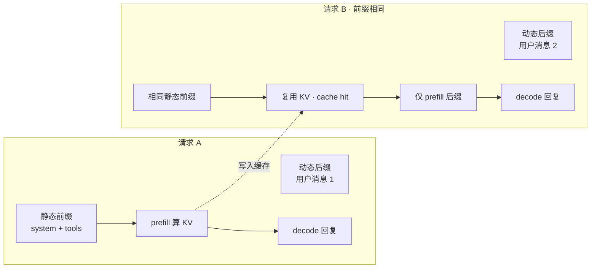

# Prefix Cache（前缀缓存）

> [!tip] 核心本质
> 前缀缓存（Prompt Caching / Prefix Caching）是推理侧优化：**多次 API 调用若共享相同的 prompt 前缀，服务商或自托管引擎复用该前缀在 prefill 阶段算出的 Key-Value（KV）张量**，跳过重算，从而降低延迟与输入算力成本。若没有这层复用，Agent 每轮都把 system prompt、工具 schema、长文档从头跑一遍 attention——成本随轮次线性放大，长会话的 TTFT（首 token 延迟）也会失控。前缀缓存**不是**模型「记住」用户；缓存的是**计算中间态**，且通常要求**字节级一致的前缀**。

*（观测日期 2026-06-08；厂商阈值与定价比率以各平台文档为准。）*

适合已理解 [[attention]] 与 [[context-window]]、正在设计多轮 Agent 或长 system prompt 的读者。读完 [[#先分清两层「缓存」|§1]] 与 [[#对 Agent / Harness 的含义|§4]] 即可调整 prompt 结构与观测 `cached_tokens`。

## 生命周期与演进

**当前定位**：2026 年主流云 API（OpenAI、Anthropic、Google Gemini）与开源 serving（vLLM、SGLang）均已产品化前缀缓存或等价的块级 KV 复用；Agent Harness 开始把「稳定前缀」当作一等工程约束（如 Hermes 冻结快照，见 [[hermes-agent-memory]]）。

**预期寿命**：中期偏长。只要 Transformer 推理仍是 prefill + decode 两阶段，跨请求复用 prefill KV 就有价值；具体 API 字段、定价比率、路由策略会持续变。

**近期演进**：从「全 prompt 哈希命中」演进到**块级**前缀匹配（vLLM Automatic Prefix Caching、SGLang RadixAttention）；Agent 论文开始系统评估「别把缓存打碎」（如 *Don't Break the Cache*，2026）；多模态与 tool result 是否进缓存前缀成为产品差异点。

**终极威胁**：单次调用 context 极长且成本足够低时，缓存收益相对变小；或架构演进使 prefill 成本占比下降。跨会话「语义相似但 token 不同」的前缀仍无法命中，需靠 RAG/记忆层而非缓存本身。

## 先分清两层「缓存」

日常讨论里「KV cache」一词常混用；工程上须拆开。

### 1.1 Decode 阶段 KV cache（单请求内）

自回归生成时，每产生一个新 token，都要对**此前所有 token**做 attention。若在每步重算整段历史的 K/V，复杂度近似 O(n²)。

Decode KV cache 在**同一次请求**内缓存已生成 token 的 K/V，下一步只算新 token 的 Q 并与缓存的 K/V 做 attention——这是现代推理的标配，与是否调用云 API 的 Prompt Caching **无关**。

### 1.2 前缀缓存 / Prompt Caching（跨请求）

跨请求优化：若请求 B 的 prompt **前缀**与请求 A 完全一致，则 B 可**跳过**该前缀的 prefill 计算，直接复用 A（或共享池）里已算好的 KV，从首个「未命中」token 继续。机制层见 [[kv-cache-inference]]。



**图 1：** 前缀缓存只省「共享前缀」的 prefill；后缀（对话增量、tool 结果）每轮仍要算。

| 维度 | Decode KV cache | 前缀缓存 / Prompt Caching |
| --- | --- | --- |
| 作用域 | 单次请求、逐 token 生成 | 多次请求、共享 prompt 前缀 |
| 缓存内容 | 已生成 token 的 K/V | 前缀 token 在 prefill 后的 K/V |
| 谁实现 | 推理引擎内部 | 云 API 产品 + vLLM/SGLang 等 |
| 典型收益 | 生成长回复可行 | 降 TTFT、降输入算力成本（常 50–90% 输入侧折扣） |

## 前缀缓存如何工作

### 2.1 Prefill 与 KV 张量

一次调用的 attention 可分两段：

1. **Prefill**：对 prompt 中每个 token，逐层计算并保存 K、V（供后续 attention 读取）。
2. **Decode**：每步只为**新 token**算 Q，与已有 K/V（含缓存）做 attention，再写出下一个 token。

前缀缓存存的是 **prefill 完成后、前缀各 token 的 K/V 张量**（常在 GPU 显存），不是 prompt 原文。命中时服务端（或本机引擎）用这些张量直接进入 decode 或仅对后缀做 prefill。

### 2.2 精确前缀匹配与失效

产品化前缀缓存几乎普遍要求：**从前缀第一个 token 起，连续完全相同**才命中。改一个字符、多一个空格、换模型版本、换 tokenizer，都可能导致整段前缀 miss。

常见失效来源：

- 每轮改写 system prompt（注入「当前时间」、递增计数器）
- 在静态段末尾追加 UUID 或随机 salt（有时**故意**用来截断缓存，见 [[#4.2 稳定前缀与动态后缀|§4.2]]）
- 工具定义、JSON schema、示例顺序变动
- 多租户路由：请求被调度到未持有该前缀 KV 的机器（OpenAI 等用前缀哈希 + 可选 `prompt_cache_key` 改善亲和性）

观测方式：API 响应里的 `cached_tokens`、`cache_read_input_tokens` 等字段（各厂商命名不同）；为 0 表示未命中或未满最小阈值。

## 云 API 与自托管（观测 2026-06）

**表 1：** 典型实现差异（细节以官方文档为准）

| 提供方 | 模式 | 开发者动作 | 备注 |
| --- | --- | --- | --- |
| OpenAI | 自动 | 无需参数；长 prompt 自动尝试 | 约 ≥1024 tokens 起；`usage.prompt_tokens_details.cached_tokens`；可用 `prompt_cache_key` 助路由 |
| Anthropic | 显式断点 | `cache_control` 标在 content block 上 | 写缓存有溢价、读缓存大幅降价；TTL 5min/1h；最少 token 阈值因模型而异 |
| Google Gemini | 隐式 + 显式 | 2.5 系可自动；或创建命名 cache | 隐式/显式折扣与阈值分模型 |
| DeepSeek 等 | 自动前缀 | 类似自动检测 | 定价比率见各平台价目 |
| vLLM / SGLang | 服务端块缓存 | 部署配置 | 块级哈希（如 16 token/block）+ Radix 树等，多请求共享物理块 |

定价逻辑一致：**cache read** 反映「省下的 prefill 算力」，故单价低于普通 input；**cache write** 部分厂商收取一次性写入费（Anthropic）。

## 对 Agent / Harness 的含义

多轮 Agent 每轮重建 prompt：`system + tools + 历史 + 新用户消息`。若历史或 tool 结果插进「本应静态」的前缀区，前缀每轮都变，缓存永远 miss。

### 4.1 静前动后（static-first, dynamic-last）

遵循静前动后（static-first, dynamic-last）的上下文排序（见 [[context-engineering]]）：

```
[ 稳定：system · 工具 schema · 长期记忆快照 · 大段参考文档 ]
[ 易变：对话轮次 · tool 输出 · 本轮用户输入 ]
```

把大块、少改的内容固定在**最前**；每轮只在后缀追加。高优先级内容放开头既利注意力（Attention），也利前缀缓存（见 [[context-window]]）。

### 4.2 稳定前缀与动态后缀

Hermes 的冻结快照（[[hermes-agent-memory#2.2 冻结快照（Frozen Snapshot）与双态一致|§2.2]]）是 Harness 层实践：会话内 `MEMORY.md` / `USER.md` 注入段不变，避免每轮改 system 打碎前缀；新记忆先落盘，下一会话 `/new` 再刷新快照。

*Don't Break the Cache*（arXiv:2601.06007，2026）对长程 Agent 的实验还表明：在 system 末或每个 tool result 后插入 UUID **故意截断**缓存边界，有时比让动态 tool 输出污染长前缀更可预测——取舍是「只缓存 system」vs「缓存更长但易碎前缀」。

### 4.3 与「记忆」勿混淆

| | 前缀缓存 | [[memory]] / [[rag]] |
| --- | --- | --- |
| 存什么 | K/V 计算中间态 | 事实、文档、会话语义 |
| 跨会话 | 依赖服务商 TTL 与路由，非用户可控长期库 | 显式持久化设计 |
| 相似文本 | 须 token 级一致 | 可语义近似检索 |

## 工程实践

1. **量后再优化**：先读 `cached_tokens` / 账单中的 cache 行；无命中时不要假设「长 system 一定省钱」。
2. **版本化静态段**：工具 schema、Skill 正文用 Git 管理，避免无意义抖动；时间戳放动态后缀。
3. **控制 tool 结果位置**：长 tool 输出放对话后缀，不要拼进 system；必要时用摘要再注入。
4. **自托管**：vLLM APC / SGLang 前缀树适合多用户共享同一 system 的 SaaS；注意显存 eviction 与并发。
5. **安全**：缓存驻留在服务商 GPU；极敏感内容评估合规与租户隔离（Anthropic 等工作区级隔离）。

## 进一步阅读

### 库内关联

- [[attention]] — K/V 从哪来；decode cache 的注意力基础
- [[context-window]] — 前缀越长，prefill 越贵，缓存收益越大
- [[context-engineering]] — 静前动后与 token 预算
- [[hermes-agent-memory]] — 冻结快照保护前缀的 Harness 实例
- [[agent]] — 多轮循环如何每轮组装 prompt

### 外部参考

- [OpenAI Prompt caching](https://developers.openai.com/api/docs/guides/prompt-caching) — 自动缓存、`cached_tokens`、`prompt_cache_key`
- [Anthropic Prompt caching](https://docs.anthropic.com/en/docs/build-with-claude/prompt-caching) — `cache_control`、TTL 与定价
- [Google Gemini context caching](https://ai.google.dev/gemini-api/docs/caching) — 隐式/显式缓存
- [Don't Break the Cache (2026)](https://arxiv.org/html/2601.06007v2) — 长程 Agent 缓存策略评估
- [vLLM Automatic Prefix Caching](https://docs.vllm.ai/en/latest/design/automatic_prefix_caching.html) — 块级哈希与 APC
- [SGLang RadixAttention](https://docs.sglang.ai/advanced_features/prefix_routing.html) — Radix 树前缀复用
