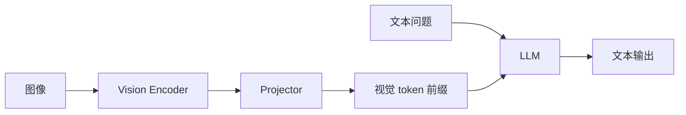

---
tags:
  - multimodal
  - vision
  - model
aliases:
  - VLM
  - Vision-Language Model
  - 视觉语言模型
prerequisites:
  - "[[llm]]"
  - "[[transformer]]"
  - "[[embedding]]"
related:
  - "[[context-window]]"
  - "[[rag]]"
  - "[[chunking]]"
  - "[[tool-use]]"
stability: mid
layer: model
updated: 2026-06-15
---

# 视觉–语言模型（VLM）

> [!tip] 核心本质
> **视觉–语言模型（Vision-Language Model, VLM）** 把图像（或视频帧）编码成可与文本同一空间推理的 token 序列，再接 **大语言模型（LLM）** 做理解、描述、问答与工具规划。没有 VLM，[[agent]] 只能处理文本与结构化 API；屏幕截图、图纸、图表、相机输入无法进入同一推理链——多模态 RAG 与 Computer Use 都依赖这条桥。

适合已懂 [[llm]] 与 [[embedding]]、要选型开源/闭源多模态基座或设计图文 RAG 的工程师。读完应能复述 CLIP 双塔与 LLaVA 式「投影 + LLM」两条主线，以及动态分辨率、视频扩展等近期演进。

*检索说明：架构分期对照 [An Introduction to Vision-Language Modeling](https://arxiv.org/pdf/2405.17247)（2024）、[LVLM Survey arXiv:2501.02189](https://arxiv.org/pdf/2501.02189v5)（观测 2026-06-15）。*

## 生命周期与演进

**当前定位**：多模态基座从「研究组合件」进入 **API 生产**（GPT-4V/o、Claude Vision、Gemini、Qwen-VL 等）；开源 LLaVA 系、InternVL、LLaVA-NeXT 可自托管。

**预期寿命**：mid–long。骨干架构向「LLM 为躯干 + 视觉适配器」收敛，细节（分辨率、任意长视频）仍快速迭代。

**近期演进**：动态/原生高分辨率（LLaVA-NeXT、Qwen2-VL）；视频时间维；统一 tokenizer 的 Era-3 方向（图文音同一序列）。

**终极威胁**：端到端原生多模态预训练吞掉「冻结 CLIP + 投影」拼装路线；对应用者接口仍类似「图+文进、文出」。

## 1 问题语境

**场景**：客服读截图、仓库盘点、文档 OCR+理解、Agent 看 GUI。纯文本 [[llm]] 需外部 OCR 把图变成字，丢失布局与细粒度视觉线索；VLM 在 patch 级保留空间结构。

**与 [[rag]] 分工**：图文 RAG 仍要 [[chunking]] 与索引；VLM 是**编码与理解**层，不是向量库替代品。

## 2 架构主线

### 2.1 对比学习时代：CLIP

**CLIP**（Contrastive Language-Image Pre-training）：图像编码器 + 文本编码器，用大规模图文对**对比损失**对齐嵌入空间。强在零样本分类与检索；生成式问答需另接 LLM。

### 2.2 LLM 为躯干：LLaVA 配方

经典三件套：

1. **冻结视觉编码器**（常为 CLIP ViT）
2. **投影层**（MLP）把视觉 patch token 映射到 LLM 词嵌入维
3. **LLM**（Vicuna / LLaMA / Qwen…）把视觉 token 当前缀，与文本 token 联合自回归

训练常两阶段：① 仅训投影对齐特征；② 视觉指令微调（合成对话数据）。

### 2.3 其他重要模式

| 模式 | 要点 |
| --- | --- |
| **Q-Former（BLIP-2）** | 可学习 query 压缩视觉特征 |
| **Flamingo** | 冻结 LM + 门控 cross-attention；少样本多模态 |
| **任意分辨率** | 切 tile 或原生分辨率编码，补细粒度 OCR |

## 3 能力与边界

| 擅长 | 局限 |
| --- | --- |
| 图表/场景描述、视觉问答 | 精确计数、微小文字仍易错 |
| 多图对比（视模型） | 长视频成本与遗忘 |
| 驱动 [[tool-use]] / GUI Agent | 幻觉与坐标漂移需工具验证 |

评测：MMMU、MathVista、DocVQA 等；与 [[llm-benchmarks]] 并列阅读。

## 4 Agent 与产品含义

- **Computer Use**：VLM + 动作空间（点击/键入）→ 闭环 [[agent]]
- **多模态 RAG**：图进索引或实时编码；注意与 [[dense-vector]] 维度和模态对齐
- **闭源 API** vs **开源权重**：隐私、成本、可微调（[[lora-peft]]）权衡

## 要点收束

- VLM = 视觉编码 +（通常）投影 + LLM 联合推理；CLIP 对齐检索，LLaVA 类拼装生成理解。
- 动态分辨率与视频是 2024–2026 主战场；选型看任务（文档 OCR vs 场景问答）。
- 多模态 Agent 仍需 ground truth 与工具校验，不能盲信视觉描述。
- 与纯文本栈衔接：[[context-window]] 对图 token 同样计费。

## 进一步阅读

### 库内关联

- [[llm]] — 文本基座能力边界
- [[embedding]]、[[bi-encoder]] — 图文检索双塔
- [[rag]]、[[chunking]] — 多模态入库
- [[agent]] — Computer Use 类 Agent

### 论文与综述

- [An Introduction to Vision-Language Modeling](https://arxiv.org/pdf/2405.17247) — 教学向综述（2024）
- [LVLM Survey arXiv:2501.02189](https://arxiv.org/pdf/2501.02189v5) — 对齐、基准与挑战（2025）
- [CLIP](https://arxiv.org/pdf/2103.00020) — 对比学习奠基（2021）
- [LLaVA](https://arxiv.org/abs/2304.08485) — 视觉指令微调（2023）
