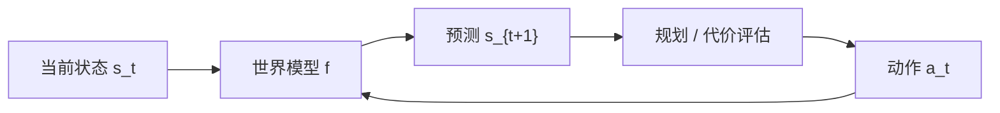

---
tags:
  - concept
aliases:
  - World Model
  - 世界模型
  - 环境模型
  - 内部模型
prerequisites:
  - "[[llm]]"
  - "[[token-prediction]]"
related:
  - "[[llm]]"
  - "[[token-prediction]]"
  - "[[agent]]"
  - "[[planning]]"
  - "[[hallucination]]"
  - "[[inductive-bias]]"
  - "[[transformer]]"
stability: long
layer: model
updated: 2026-06-14
---

# 世界模型（World Model）

> [!tip] 核心本质
> 世界模型（World Model）是智能体对环境**如何随时间与行动演化**的内部表征与预测器——给定当前状态与动作，估计下一状态（或其在潜空间中的嵌入），从而支持**想象、推演与规划**，而不必每一步都在真实世界里试错。心理学上可追溯至 Craik 的「大脑维持内部模型以预测行动后果」；与 [[llm|LLM]] 的 [[token-prediction|下一 token 预测]] 不同：后者优化的是**文本续写**，不保证学到可执行、可滚动的**状态动力学**。若没有显式或可学习的 world model，[[agent]] 只能靠 [[tool-use|工具]] 把外部反馈当 Observation，无法在脑中「先演再动」，长程规划与物理 grounding 会系统性偏弱。

适合已读 [[llm]]、要理解「世界模型 vs 大语言模型」「为何 LeCun 主张 JEPA」「Ha 的梦境训练在解决什么」的读者。读完 [[#3 两条技术脉络|§3]] 能区分 RL 生成式世界模型与 LeCun 非生成式 JEPA；[[#5 与 Agent、LLM 的关系|§5]] 说明工程落地边界。

*检索说明：LeCun [A Path Towards Autonomous Machine Intelligence (2022)](https://openreview.net/pdf?id=BZ5a1r-kVsf)；Ha & Schmidhuber [World Models (2018)](https://arxiv.org/abs/1803.10122)；JEPA 实现线 [I-JEPA](https://arxiv.org/abs/2301.08243)、[V-JEPA 2](https://arxiv.org/abs/2506.09985)；Physical AI [NVIDIA Cosmos 3](https://huggingface.co/blog/nvidia/cosmos-3-for-physical-ai)（观测 2026-06-14）。*

## 生命周期与演进

**当前定位**：概念横跨认知科学、RL 与基础模型三条线；**研究活跃、产品未统一**。LLM 参数里压缩了大量**陈述性**世界知识，但多数系统仍缺可验证的**动力学**模拟器；LeCun 路线的 I-JEPA / V-JEPA / V-JEPA 2 在视觉与机器人规划上验证 latent 预测；NVIDIA Cosmos 等把「物理世界生成+推理」推向 Physical AI。

**预期寿命**：长期。只要任务需要**前瞻**（驾驶、机器人、科学推演、多步决策），「内部模拟环境」就不会被纯对话模型取代；形态会从像素生成式 RNN 演进到潜空间 JEPA 与专用物理引擎混合。

**近期演进**：视频世界模型（V-JEPA 2 等）从网络视频学表征再做零样本规划；Cosmos 3 类 omni 模型统一文本/图像/视频/动作；LLM 侧以 **reasoning + 工具 + 验证器** 近似「软模拟」，而非可微 world rollout。

**终极威胁**：若端到端 RL 或超大生成模型在真实环境直接学策略、且规划算力足够便宜，独立 world model 模块可能被摊进单一策略网络；但**安全关键场景**仍需要可解释、可约束的显式模拟层。

## 1 世界模型要回答什么

一个可用的 world model 通常承担三件事（LeCun / JEPA 文献中的共识）：

| 能力 | 含义 | 没有时会怎样 |
| --- | --- | --- |
| **编码当前状态** | 把传感器/文本/图像压成状态 \(s_t\) | 无法一致地「记住现在在哪」 |
| **预测状态演化** | \(s_{t+1} \approx f(s_t, a_t)\) 或在潜空间预测嵌入 | 行动后果不可预期，只能试错 |
| **支持规划** | 在预测轨迹上搜索低成本动作序列 | 长程任务靠逐步 [[reAct]]，成本高、易偏 |

这与人类「在脑子里先试一遍再动手」一致；Craik（1943）提出生物体用小型内部模型预测事件后果，现代 AI 讨论常回到这一隐喻。

## 2 与 LLM、token 预测的区别

| 维度 | [[token-prediction]] / LLM | 世界模型 |
| --- | --- | --- |
| **预测对象** | 下一个 **token**（离散符号） | 下一 **状态/观测**（潜向量、图像、物理量等） |
| **训练信号** | 文本语料自监督 | 视频、交互轨迹、传感器序列等 |
| **行动接口** | 无原生动作维度；靠 [[function-calling]] 外挂 | 显式输入动作 \(a_t\)，输出后果 |
| **规划方式** | 链式文本推理（[[chain-of-thought]]）、[[planning]] 文本计划 | 在 learned simulator 上 **rollout** 多条未来 |
| **知识类型** | 大量**事实与语言模式**（有损压缩） | **动力学与因果**（谁动、环境怎么变） |

LLM 的预训练确实把「世界知识」压进权重（见 [[llm]]），但这是**统计关联**，不是可滚动的模拟器：模型可以「描述」抛物线，却不会在内部一致地积分物理状态，除非再接工具或专门模块。也见 [[hallucination]]——文本高概率 ≠ 状态预测正确。

LeCun 立场论文认为：仅靠自回归文本生成难以达到人类级**自主智能**；需要可配置的 world model + 代价模块 + Actor，在潜空间做预测（JEPA），而非 endless token 生成。

## 3 两条技术脉络

### 3.1 RL 脉络：Ha & Schmidhuber（2018）

[World Models](https://arxiv.org/abs/1803.10122) 在 RL 环境里用 **RNN（+ Mixture Density 输出）** 无监督学习环境的压缩时空表征：

- **V 模型**：编码视觉；**M 模型**：预测下一帧潜状态；**C 控制器**：小策略网络
- 可在 world model **生成的「梦境」**里训练 C，再把策略迁回真实环境
- 亮点：策略搜索空间小、样本效率相对高；弱点：生成像素/帧的模型易被 exploit，仿真与真实有 **sim-to-real gap**

这条线代表「**生成式** world model」——显式建模观测分布，能「 hallucinate 」整个游戏画面。

### 3.2 自主智能脉络：LeCun 与 JEPA（2022+）

[A Path Towards Autonomous Machine Intelligence](https://openreview.net/pdf?id=BZ5a1r-kVsf) 提出模块化架构（Configurator、Perception、**World Model**、Cost、Actor、Short-term Memory）。核心 **Joint Embedding Predictive Architecture（JEPA）** 是**非生成式**的：

- 编码器把 \(x\)（当前）与 \(y\)（未来）映射到表征 \(s_x, s_y\)
- **预测器**在表征空间预测 \(s_y\)，能量 = 预测误差——**不**重建像素/token
- 主张忽略不可控细节，保留规划所需的语义结构；层次化 **H-JEPA** 覆盖多时间尺度

**表 1 — JEPA 家族（研究进展，非穷尽）**

| 工作 | 要点 |
| --- | --- |
| [I-JEPA](https://arxiv.org/abs/2301.08243) (2023) | 图像潜空间预测，验证非生成式目标 |
| [V-JEPA](https://arxiv.org/abs/2404.08471) (2024) | 扩展到视频 |
| [V-JEPA 2](https://arxiv.org/abs/2506.09985) (2025) | 网络视频预训练 + 少量机器人数据，零样本规划 |
| Cosmos 3 等 (2026) | Physical AI：统一生成/推理/action 的物理世界 omni 模型 |

完整 H-JEPA + Configurator + 内在动机在 2026 年仍**未**作为成熟产品闭环；文献与 wiki 综述多标为进行中。

## 4 反应式 vs 审议式：两种使用模式

JEPA 社区常用双模式类比（System 1 / System 2）：

| 模式 | 流程 | 类比 |
| --- | --- | --- |
| **Mode-1 反应式** | 感知 → 策略 → 动作（无 rollout） | 接球、习惯动作 |
| **Mode-2 审议式** | 感知 → **world model 展开多条未来** → 代价评估 → 选动作 | 规划路线、下棋验算 |

现代 LLM [[agent]] 默认接近 Mode-1 + 外部工具：每步真调 API 当 Observation。Mode-2 需要**可负担的想象 rollout**（算力与模型精度）；reasoning 模型在文本空间里做长链思考，是 Mode-2 的**语言近似**，不是物理状态模拟。

## 5 与 Agent、LLM 的关系

**当前工程栈**（本库 [[agent]] / [[agent-paradigms]]）：

- **ReAct / Plan-and-Solve**：用 LLM 推理 + 工具获取真实 Observation，**不依赖** learned world model
- **RAG / Memory**：补事实与历史，不预测「我推这个按钮会发生什么」
- **Reflection**：评已有输出质量，不是向前模拟环境

世界模型若成熟，可能改变：

| 环节 | 可能变化 |
| --- | --- |
| 规划 | 在内部 rollout 再选工具调用序列，减少昂贵试错 |
| 机器人 / 物理 AI | 从视频学 world model，再零样本迁移策略 |
| 安全 | 危险动作先在模拟器拒绝，而非真环境执行 |

**诚实边界（2026）**：通用聊天 Agent **仍以 LLM + Harness 为主**；world model 在机器人、自动驾驶、Physical AI 更近落地。把 LLM 称为「已有世界模型」需限定为**隐式、不可 roll 的文本知识**，避免与 JEPA/RL 意义上的动力学模型混淆。

## 6 常见误区

- **LLM = 世界模型**：LLM 预测 token，不默认提供一致的状态转移函数 \(f(s,a)\)。
- **生成视频 = 完整 world model**：视频生成可模拟**外观**，未必学到**可控动力学**（同一动作是否导致可重复后果）。
- **世界模型消除幻觉**：模拟器也会错；需与真实 Observation、验证器结合。
- **世界模型已替代 LLM**：语言接口、知识检索、工具编排仍依赖 LLM；趋势是**组合**而非单点替换。
- **只有 LeCun 一条线**：Ha 2018、Dreamer/PlaNet 等 model-based RL、游戏引擎仿真都是 world model 实践，目标与表征不同。

## 要点收束

- 世界模型：对环境**状态演化**的内部预测，支撑想象与规划；源于认知「内部模型」隐喻。
- 与 LLM 区别：预测 **状态/潜表征** 而非 **token**；强调动力学与行动后果，非仅陈述性知识。
- **两条脉络**：RL 生成式 RNN 梦境（Ha 2018）；LeCun **非生成式 JEPA** 潜空间预测（I/V-JEPA、V-JEPA 2、Cosmos 等）。
- Agent 现状：Mode-1 工具循环为主；Mode-2 审议式 rollout 在 Physical AI 探索中，通用 Agent 尚未标配。
- 选型：要**物理前瞻**看 world model + 仿真；要**语言任务**仍以 LLM + 工具 + 验证为主。

## 进一步阅读

### 库内关联

- [[llm]] — 隐式世界知识 vs 显式动力学；「终极威胁」中的 world model 方向
- [[token-prediction]] — 自回归 token 目标与 world model 目标的张力
- [[agent]] — 当前落地靠工具 Observation，非 learned simulator
- [[planning]] / [[agent-paradigms]] — 文本规划 vs 模拟器 rollout
- [[hallucination]] — 文本流畅与状态预测正确性的脱节
- [[inductive-bias]] — 何种架构偏向前向模型与因果结构

### 外部参考

- [LeCun, A Path Towards Autonomous Machine Intelligence (2022)](https://openreview.net/pdf?id=BZ5a1r-kVsf) — 模块化架构与 JEPA 立场论文
- [Ha & Schmidhuber, World Models (2018)](https://arxiv.org/abs/1803.10122) — RNN 梦境训练与策略迁移
- [I-JEPA (Assran et al., 2023)](https://arxiv.org/abs/2301.08243) — 图像潜空间预测
- [V-JEPA 2 (Bardes et al., 2025)](https://arxiv.org/abs/2506.09985) — 视频表征与机器人规划
- [NVIDIA Cosmos 3 for Physical AI](https://huggingface.co/blog/nvidia/cosmos-3-for-physical-ai) — 物理世界 omni 模型（产品向）
- [World Models 交互页](https://worldmodels.github.io/) — Ha 2018 演示与代码
