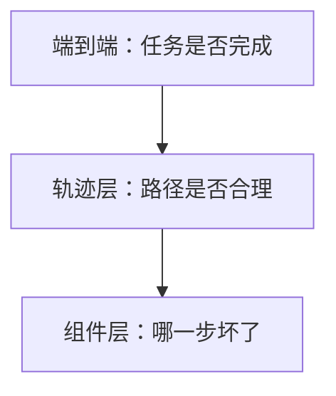

---
tags:
  - evaluation
  - agent
aliases:
  - Agent 评测
  - Agent Evaluation
  - 轨迹评测
prerequisites:
  - "[[agent]]"
  - "[[tool-use]]"
  - "[[harness-engineering]]"
related:
  - "[[recall-at-k]]"
  - "[[memory]]"
  - "[[reflection]]"
  - "[[langgraph]]"
  - "[[function-calling]]"
stability: mid
layer: application
updated: 2026-06-15
---

# Agent 轨迹评测（Agent Evaluation）

> [!tip] 核心本质
> **Agent 轨迹评测**衡量的不只是最终答案对不对，而是**多步执行路径**是否选对工具、参数是否合理、步数是否冗余、成本是否失控。单轮 [[llm|LLM]] 评测看输出；Agent 可能在「答对」的同时走了危险或极贵的路径——没有轨迹层指标，生产系统会在 demo 与回归之间失去可见性。

适合已部署或设计 [[agent]]、[[tool-use]] 闭环的工程师。读完 [[#2 三层评测|§2]] 能区分端到端 vs 轨迹 vs 组件评测；[[#3 核心指标|§3]] 可复述 5–8 个生产常用指标；[[#4 落地|§4]] 知道 golden set 与 CI 怎么接 [[harness-engineering]]。

*检索说明：指标与工具对照 [LangSmith Trajectory Evals](https://docs.langchain.com/langsmith/trajectory-evals)、[genai.qa Agent Trajectory Testing 2026](https://genai.qa/ai-agent-trajectory-testing-2026/)、[DeepEval Agent Eval Tutorial 2026](https://turion.ai/blog/agent-evaluation-testing-2026/)、[CORE arXiv:2509.20998](https://arxiv.org/abs/2509.20998)（观测 2026-06-15）。*

## 生命周期与演进

**当前定位**：2025–2026 社区从「最终状态对错」转向**全路径评测**——TRAJECT-Bench、CORE 等强调工具序列、有害调用率、路径效率；工业界常用 LangSmith / DeepEval 做回归集。

**预期寿命**：中期。指标名与平台会变，但「Agent = 多步 + 工具 + 成本」使轨迹层评测长期必要。

**近期演进**：LLM-as-Judge 评轨迹（语义匹配 golden）；组件级 span 打分；注入故障测恢复率；与 [[cursor-hooks]] / Harness 门禁联动。

**终极威胁**：端到端 RL 或强监督使路径被内化后，外露轨迹变短——但工具权限边界仍在，组件评测仍要保留。

## 1 问题：为什么最终答案不够

| 现象 | 仅看最终答案 | 轨迹层能发现 |
| --- | --- | --- |
| 答对但多调 5 次 API | ✅ 通过 | 成本回归、延迟超标 |
| 答对但跳过审批 | ✅ 通过 | HITL 门禁失效 |
| 答错但路径合理 | ❌ 失败 | 可定位到第几步工具 |
| 注入攻击下乱调工具 | 可能偶然对 | 安全/工具 P&R 失败 |

[[memory]] 与 [[reflection]] 改善行为，但不替代**可重复的回归集**；Harness 需要数值门槛才能做 CI。

## 2 三层评测

| 层级 | 问什么 | 典型指标 |
| --- | --- | --- |
| **端到端** | 用户任务完成了吗 | Task success / completion rate |
| **轨迹层** | 工具序列与效率 | Trajectory match、step efficiency、tool P/R |
| **组件层** | 检索/单工具/子 Agent | [[recall-at-k]]、argument correctness、plan adherence |

先端到端定「能不能用」，再轨迹层防**静默退化**，组件层做**排障**（DeepEval v3 等框架的 span 打分）。

## 3 核心指标

生产项目常同时跟踪 **5–8 项**（不必一开始全上）：

| 指标 | 含义 | 备注 |
| --- | --- | --- |
| **任务完成率** | 最终是否满足用户意图 | LLM-as-Judge 或规则；最便宜的门面指标 |
| **轨迹匹配** | 实际工具序列 vs golden | LangSmith：strict / unordered / subset / superset |
| **工具精确率 / 召回** | 是否调错工具 / 漏调工具 | ToolCorrectnessMetric 类 |
| **参数正确性** | schema 与业务约束 | 规则 + Judge；MCP-Bench 类 benchmark |
| **路径效率** | 实际步数 vs 最短合理路径 | CORE Path Correctness、step redundancy |
| **成本效率** | token、工具次数、墙钟时间 / 成功任务 | 成本回归是 silent killer |
| **有害调用率** | 越权、危险工具、错误顺序 | CORE Harmful-Call Rate |
| **恢复率** | 注入故障后能否完成 | 混沌式 agent 测试 |

**Golden trajectory**：输入 + 期望工具序列（可无序或 superset 模式）；新模型/ prompt 改版跑同一集，diff 轨迹而非只看答案。

## 4 落地：数据集、Judge 与 CI

**Golden set 构建**：

1. 从生产 trace 抽样**成功且代表**的任务（脱敏）
2. 标注期望工具链或「允许集合」（superset 适合多解任务）
3. 版本化 dataset；改 prompt/工具 schema 必跑回归

**LLM-as-Judge**：用较强 rubric + 便宜 Judge 模型（如小型 GPT/Claude）评 task completion、轨迹合理性；需**人工 spot-check** 校准阈值（0.7 对不同 metric 含义不同）。

**框架分工（2026 常见选型）**：

| 能力 | LangSmith | DeepEval |
| --- | --- | --- |
| 与 LangGraph trace 集成 | 强 | 通用 trace |
| 轨迹 match evaluator | agentevals 包 | DAG / 自定义 GEval |
| pytest / CI | 支持 | 原生 pytest 风格 |
| 组件 span 指标 | 有 | ToolCorrectness、TaskCompletion 等 |

库内 [[langgraph]] 编排的 Agent 宜优先对齐 LangSmith 轨迹评测；框架无关逻辑可抽成「指标定义」放本篇，产品细节放 `latest/langsmith`（待建）。

**与 Harness 衔接**（[[harness-engineering]]）：评测不是事后报告——阈值失败应 block 发布或触发人工审核；[[cursor-hooks]] 可做运行时门禁，评测做**离线回归**。

## 5 坑与误区

| 误区 | 更稳做法 |
| --- | --- |
| 只有人工点测 | 版本化 golden + CI |
| 轨迹必须 exact match | 多解任务用 subset/superset 或 Judge |
| 只看 success rate | 同时看 cost、harmful-call |
| 用最强模型当 Judge 跑全量 | 便宜 Judge + 分层抽样 |
| 评测集永不更新 | 生产新 failure 反哺 dataset |

## 要点收束

- Agent 评测必须含**轨迹层**，不能只看最终答案。
- 三层：端到端 → 轨迹 → 组件；排障从组件往上聚合。
- 核心指标：完成率、轨迹匹配、工具 P/R、路径与成本效率、有害调用、恢复率。
- Golden trajectory + 版本化 dataset + CI 回归是生产最低配。
- 与 [[harness-engineering]] 联动：阈值失败应阻断发布。

## 进一步阅读

### 库内关联

- [[agent]] — Agent 循环与停止条件
- [[tool-use]] — 工具调用架构
- [[function-calling]] — schema 与参数契约
- [[harness-engineering]] — 边界、门禁、错误分层
- [[reflection]] — 运行时自检 vs 离线评测
- [[recall-at-k]] — RAG 组件侧指标
- [[langgraph]] — 图 trace 与检查点

### 外部来源

- [LangSmith Trajectory Evals](https://docs.langchain.com/langsmith/trajectory-evals) — match 模式与 agentevals
- [Agent Trajectory Testing 2026](https://genai.qa/ai-agent-trajectory-testing-2026/) — 指标清单与平台对比
- [DeepEval Agent Eval Tutorial](https://turion.ai/blog/agent-evaluation-testing-2026/) — pytest + 组件评测
- [CORE: Full-Path Evaluation](https://arxiv.org/abs/2509.20998) — 路径正确性、有害调用、效率
- [TRAJECT-Bench](https://arxiv.org/abs/2510.04550) — 工具轨迹 benchmark
