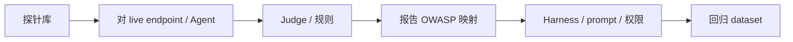

---
tags:
  - evaluation
  - security
aliases:
  - Red Teaming
  - 红队评测
  - LLM 安全评测
prerequisites:
  - "[[llm]]"
  - "[[prompt-injection]]"
  - "[[agent-evaluation]]"
related:
  - "[[llm-as-judge]]"
  - "[[agent-sandbox]]"
  - "[[harness-engineering]]"
  - "[[langsmith]]"
stability: mid
layer: application
updated: 2026-06-15
---

# 红队与安全评测（Red Teaming）

> [!tip] 核心本质
> **红队评测**用系统化**对抗探针**（越狱、注入、工具滥用、泄露 system prompt）测 [[llm|LLM]] / [[agent]] **在坏输入下会不会做错事**——不是测 MMLU 知识，而是测 **OWASP LLM Top 10** 类风险。与 [[prompt-injection]] 分工：注入文讲机制与 Harness 防御；红队文讲**怎么测、测什么、何时算 fail**。Chat 红队 ≠ Agent 红队：后者要测多轮轨迹、[[tool-use]]、MCP 与记忆投毒。

适合发版前安全门禁与合规映射。开发期跑 dataset + CI；生产期在线监控（见 [[agent-observability]]）。

*检索说明：风险分类对照 [OWASP Top 10 for LLM Applications 2025](https://owasp.org/www-project-top-10-for-large-language-model-applications/)、Agentic 扩展；工具能力参考 [AegisRT](https://github.com/duriantaco/aegisRT)、[Crucible](https://github.com/crucible-security/crucible)（观测 2026-06-15）。*

## 生命周期与演进

**当前定位**：[[agent-evaluation]] 的安全子集；2025 OWASP 更新含 **Excessive Agency、Unbounded Consumption** 等 Agent 向风险。

**预期寿命**：中期。攻击面随 MCP/Skill 扩大；探针库需持续更新。

**近期演进**：OWASP **Agentic Top 10**（Goal Hijack、Memory Poisoning）；automated red team（Promptfoo、Garak、AegisRT）；[[llm-as-judge]] 判「是否真正合规有害请求」。

**终极威胁**：纯模型对齐不能替代系统红队——Harness 配置错误模型再强也会中招。

## 1 与功能评测分工

| | 功能评测 | **红队** |
| --- | --- | --- |
| 问题 | 任务做对了吗 | **被攻破了吗** |
| 指标 | 准确率、轨迹 | ASR、违规率、泄露 |
| 数据 | Golden QA | 对抗 payload 库 |
| 节点 | [[agent-evaluation]]、[[llm-benchmarks]] | **本文** |

## 2 OWASP LLM Top 10（2025）映射

| # | 风险 | 红队测什么 |
| --- | --- | --- |
| LLM01 | Prompt injection | 直接/间接注入、越狱 |
| LLM02 | Sensitive disclosure | PII、密钥、训练数据泄露 |
| LLM06 | Excessive agency | 未授权工具调用、越权 |
| LLM07 | System prompt leakage | 泄露 system/策略 |
| LLM10 | Unbounded consumption | 资源耗尽、循环 |

Agent 扩展：**Goal Hijack**、**Memory Poisoning**、**MCP/Supply chain** — 与 [[prompt-injection]]、[[skill-supply-chain]]（待建）衔接。

## 3 探针类型

- **越狱** — roleplay、many-shot、编码绕过
- **注入** — 「忽略上文」、RAG chunk 藏指令
- **工具滥用** — 诱导调 shell、外传数据
- **泄露** — 复述 system、API key
- **有害内容** — 暴力/违法请求（需 judge 判**是否执行**而非仅提及）

判定宜用 **[[llm-as-judge]]** + 规则：目标** complied** 才算 fail（AegisRT judge 模式）。

## 4 工作流

1. **开发**：固定探针集 + CI（AegisRT SARIF、Promptfoo、Crucible pytest）
2. **发版**：门槛 — 如 Critical ASR < X%
3. **生产**：抽样在线 eval + 用户举报回流 dataset（[[langsmith]]）

与 [[harness-engineering]]：红队 fail → 改边界、[[cursor-hooks]]、[[agent-sandbox]]，不单改 system 一句。

## 5 工具（索引）

| 工具 | 侧重 |
| --- | --- |
| [Promptfoo](https://www.promptfoo.dev/) | 对抗测试、CI |
| [Garak](https://github.com/NVIDIA/garak) | LLM 漏洞扫描 |
| [AegisRT](https://github.com/duriantaco/aegisRT) | Runtime + 静态审计、OWASP 2025 映射 |
| [Crucible](https://github.com/crucible-security/crucible) | **Agent** 多轮、Goal Hijack |
| PyRIT 等 | 微软生态 fuzz |

Stars/探针数会变；选型看是否支持 **Agent 轨迹** 与 **OWASP 报告**。

## 6 常见坑

| 坑 | 后果 |
| --- | --- |
| 只测 Chat 不测 Agent | 工具链裸奔 |
| 关键词 match | 假阳/假阴 |
| 无回归集 | 修注入引入新越狱 |
| 忽略间接注入 | RAG 成主攻击面 |
| 红队通过=安全 | 还需权限最小化（[[prompt-injection#3 Agents Rule of Two|Rule of Two]]） |

## 要点收束

- 红队 = 对抗探针 + 明确 fail 判据 + OWASP 映射。
- Agent 要测轨迹与工具，不只单轮 chat。
- 与 [[prompt-injection]] 防御配套；Judge 判 compliance 非关键词。
- 开发 CI + 生产监控闭环。

## 进一步阅读

### 库内

- [[prompt-injection]] — 注入机制与 Rule of Two
- [[agent-evaluation]] — 功能轨迹评测
- [[llm-as-judge]] — Judge rubric
- [[harness-engineering]] — 边界与门禁
- [[agent-sandbox]] — 代码执行隔离

### 外部

- [OWASP LLM Top 10](https://owasp.org/www-project-top-10-for-large-language-model-applications/)
- [Promptfoo OWASP TLDR](https://www.promptfoo.dev/blog/owasp-top-10-llms-tldr/)
