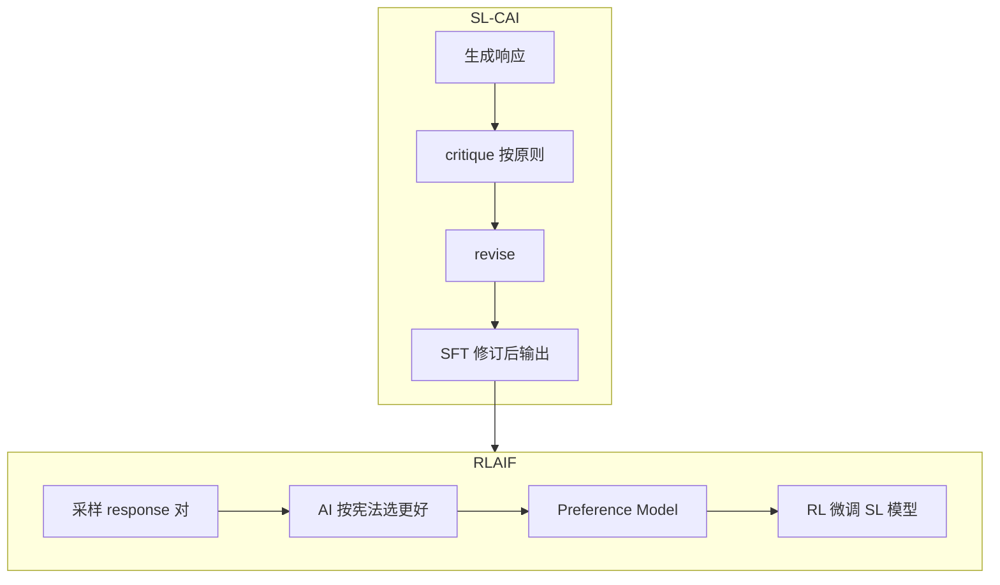

---
tags:
  - training
  - alignment
aliases:
  - Constitutional AI
  - CAI
  - RLAIF
  - 宪法人工智能
prerequisites:
  - "[[rlhf]]"
  - "[[sft]]"
  - "[[reflection]]"
related:
  - "[[dpo]]"
  - "[[rlhf-bias]]"
  - "[[red-teaming]]"
  - "[[llm-as-judge]]"
stability: mid
layer: model
updated: 2026-06-15
---

# Constitutional AI（宪法人工智能）

> [!tip] 核心本质
> **Constitutional AI（CAI）**用一组显式**自然语言原则（constitution）**引导模型自我批评与修订，并以 **RLAIF**（Reinforcement Learning from AI Feedback）用 AI 而非人工标注**有害性偏好**——减少标注员接触 toxic 内容，并把价值观写进可审计文本。两阶段：**SL-CAI**（critique → revise → SFT）与 **RLAIF**（AI  pairwise 比较 → PM → RL）。与 [[rlhf]] 并列： helpfulness 仍可用人类偏好，harmlessness 可由 AI 按宪法评判。

Anthropic Bai et al. 2022；Claude 公开对齐方法论之一。

*检索说明：流程对照 [Bai et al., Constitutional AI (arXiv:2212.08073)](https://arxiv.org/abs/2212.08073)；与 [[rlhf]]、[[reflection]] 分工经库内交叉核对（观测 2026-06-15）。*

## 生命周期与演进

**当前定位**：对齐 mid 节点；工业界部分 harm 分类已被更大 judge 模型与规则混合替代，但「显式原则 + AI 反馈」仍常见。

**预期寿命**：中期。宪法内容与治理争议长期存在；技术形态与 [[llm-as-judge]] 收敛。

**近期演进**：多原则轮换 critique；与 [[dpo]] 直接偏好优化并行；产品层「可定制 constitution」。

**终极威胁**：宪法质量上限 = 撰写者价值观；AI judge 系统性偏见会被 RL 放大（[[rlhf-bias]]）。

## 1 两阶段 pipeline

### Stage 1：SL-CAI

1. 模型对 prompt（含 red-team 有害 prompt）生成初稿
2. 按 constitution 中**一条原则**要求 self-critique
3. 按 critique **revise**
4. 对 **修订后** 响应做 SFT

与 [[reflection]] 同形（Generate→Critique→Revise），但原则**外置为 constitution** 且面向 **harmlessness**。

### Stage 2：RLAIF

1. SL-CAI 模型对 harmful prompt 采样 **response 对**
2. 另一 LM 按原则做 **multiple-choice**：哪条更合宪法
3. 构建 AI preference 数据 → 训 PM
4. 与 helpfulness 人类偏好数据 **混合** → RL（同 [[rlhf]] PPO 骨架）

**RLAIF** = RLHF 里 harm 标签换 AI 生成。

## 2 Constitution 是什么

- 短条自然语言规则（例：拒绝协助非法活动、不侮辱群体…）
- **可轮换**：每条原则单独 critique，增多样性
- **治理问题**：谁写、如何迭代、多文化冲突 — 技术不能替政治选择

## 3 与兄弟范式

| | [[rlhf]] | **CAI / RLAIF** | [[dpo]] |
| --- | --- | --- | --- |
| Harm 标签 | 人类 | **AI + 宪法** | 偏好对（任意来源） |
| 显式价值观 | 隐式于标注 | **constitution 文本** | 隐式于 chosen/rejected |
| 阶段 | SFT→RM→PPO | SL-CAI→RLAIF | 闭式偏好 loss |

CAI **不替** capability SFT；主要扩 **无害** 且减人工 harm 标注。

## 4 优劣

| 优点 | 局限 |
| --- | --- |
| 可扩展 harm 监督 | 宪法覆盖不全 |
| 标注员少看 toxic | AI judge 偏见 |
| 原则可审计 | 过度 revise 损 helpfulness |
| 与 RLHF 基础设施复用 | 仍要 RL 工程 |

评测：harm bench + helpfulness；配合 [[red-teaming]]。

## 5 何时用

| 适合 | 不适合 |
| --- | --- |
| 需规模化 harm 对齐 | 纯能力/推理（用 [[rlvr]]） |
| 能维护原则文档 | 无法定义原则边界 |
| 已有 RLHF 栈 | 小团队可先用 [[dpo]] + rubric |

## 要点收束

- CAI = constitution + SL-CAI + RLAIF；harm 用 AI 反馈。
- 原则外置可审计；治理与 [[rlhf-bias]] 风险仍在。
- 与 [[rlhf]]、[[reflection]]、[[llm-as-judge]] 紧密相关。
- 开放域 helpful+harmless 常与人类偏好混合。

## 进一步阅读

### 库内

- [[rlhf]] — 经典三阶段
- [[dpo]] — 无 RM 的偏好优化
- [[reflection]] — critique-revise 范式
- [[red-teaming]] — 发版安全评测

### 外部

- [Constitutional AI (Bai et al., 2022)](https://arxiv.org/abs/2212.08073)
