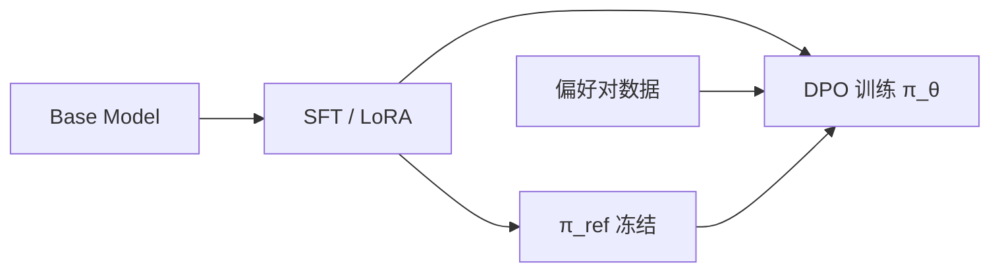

---
tags:
  - training
  - alignment
aliases:
  - DPO
  - Direct Preference Optimization
  - 直接偏好优化
prerequisites:
  - "[[sft]]"
  - "[[rlhf]]"
  - "[[lora-peft]]"
related:
  - "[[rlhf-bias]]"
  - "[[agent-evaluation]]"
stability: long
layer: model
updated: 2026-06-15
---

# DPO（直接偏好优化）

> [!tip] 核心本质
> **DPO**（Direct Preference Optimization，直接偏好优化）在 Bradley-Terry 偏好假设下，用**成对偏好数据**（chosen vs rejected）直接优化策略，**无需单独奖励模型与 PPO 在线展开**——把 [[rlhf]] 的后两阶段收成监督式损失。若没有这类闭式偏好优化，中小团队很难稳定做「哪种回答更好」的对齐；但 DPO **offline**，不能替代需要环境反馈的 Agent 强化学习。

适合已读 [[rlhf]]、要在 SFT 后做偏好对齐的工程师。读完 [[#2 与 RLHF 分工|§2]] 知何时 DPO、何时 RLHF/PPO；[[#3 beta 与数据|§3]] 调参与数据契约；流水线见 [[#4 标准管线|§4]]。

*检索说明：对照 [Rafailov et al., 2023](https://arxiv.org/abs/2305.18290)、[Hugging Face RLHF→DPO](https://huggingface.co/blog/ariG23498/rlhf-to-dpo)、[OpenAI DPO guide](https://developers.openai.com/api/docs/guides/direct-preference-optimization)（观测 2026-06-15）。*

## 生命周期与演进

**当前定位**：2025–2026 开源 chat 模型 post-training **默认偏好阶段**（Llama 3 类配方）；[[rlhf]] 仍讲经典三阶段，本篇专述 DPO 机制与工程。

**预期寿命**：长期。ORPO/IPO 等变体出现，但「偏好对 + 参考模型 KL」范式稳定。

**近期演进**：SFT → DPO → 小量 on-policy RL（可验证奖励，如推理）；与 [[lora-peft|QLoRA]] 组合降显存；监管场景偏好 offline 可审计。

**终极威胁**：强 base + 约束解码覆盖格式偏好；深 Agent 轨迹对齐仍可能要 RL。

## 1 问题：RLHF 哪里太重

[[rlhf]]：SFT → 训 RM → PPO。瓶颈在 **RM 质量、PPO 不稳定、三模型显存**。

DPO 关键：最优 RLHF 策略有闭式，可改写为只含 \(\pi_\theta\) 与 **参考策略** \(\pi_{\text{ref}}\)（通常 SFT checkpoint）的损失，在偏好对上最大化 chosen 相对 rejected 的对数几率。

## 2 与 RLHF 分工

| 维度 | DPO | RLHF (PPO) |
| --- | --- | --- |
| 训练 | Offline 偏好对 | 常需 online rollout |
| 组件 | policy + ref | SFT + RM + policy (+ value) |
| 稳定性 | 较高 | RM/PPO 调参难 |
| 适合 | 语气、格式、无害性、简洁 | 多步探索、动态奖励、Agent 轨迹 |

**2026 常见管线**：[[sft]]（+ [[lora-peft]]）→ **DPO** →（可选）RLVR/GRPO 做可验证推理。

## 3 Beta 与数据

**β（beta）**：控制相对 \(\pi_{\text{ref}}\) 的偏离强度——损失里放大 chosen/rejected 的对数概率差。

| β | 效果 |
| --- | --- |
| 低（0.05–0.1） | 更贴偏好，易漂移 |
| 中（0.1–0.3） | 常见起点（原论文 ~0.1） |
| 高（0.5–1+） | 保守，贴近 ref |

**数据**：每条 `(prompt, chosen, rejected)`；500–2000 对可起步；质量 > 数量。DPO 在 **SFT 模型上**做，不在裸 base 上。

**风险**：确定性偏好标签易过拟合；需 held-out 与生成抽检（见 [[rlhf-bias]]）。

## 4 标准管线

工具：TRL、LlamaFactory、Axolotl；API 侧 OpenAI 等曾提供 DPO fine-tune（产品形态随平台变）。

## 5 何时不用 DPO

- 奖励依赖**多步工具轨迹**且只能 online 采样 → PPO/GRPO 类
- 无可靠偏好对，只有标量分 → 仍可能要 RM + RL
- 仅注入事实 → [[rag]]，非 DPO

## 要点收束

- DPO = 偏好对 + ref 模型，无 RM/PPO。
- 标准顺序：SFT → DPO；β 从 0.1 起扫。
- 适合 offline 偏好；Agent 动态对齐常要 RL 补充。
- 与 [[rlhf]] 互补：读机制看 RLHF，做对齐优先 DPO。

## 进一步阅读

### 库内

- [[rlhf]] — 经典三阶段与 DPO 关系
- [[sft]] — DPO 前序
- [[lora-peft]] — 参数高效 DPO
- [[rlhf-bias]] — 偏好数据偏置

### 外部

- [DPO 论文](https://arxiv.org/abs/2305.18290)
- [OpenAI DPO 指南](https://developers.openai.com/api/docs/guides/direct-preference-optimization)
