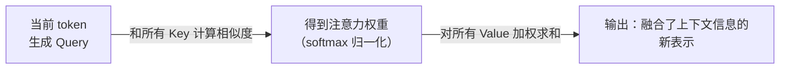
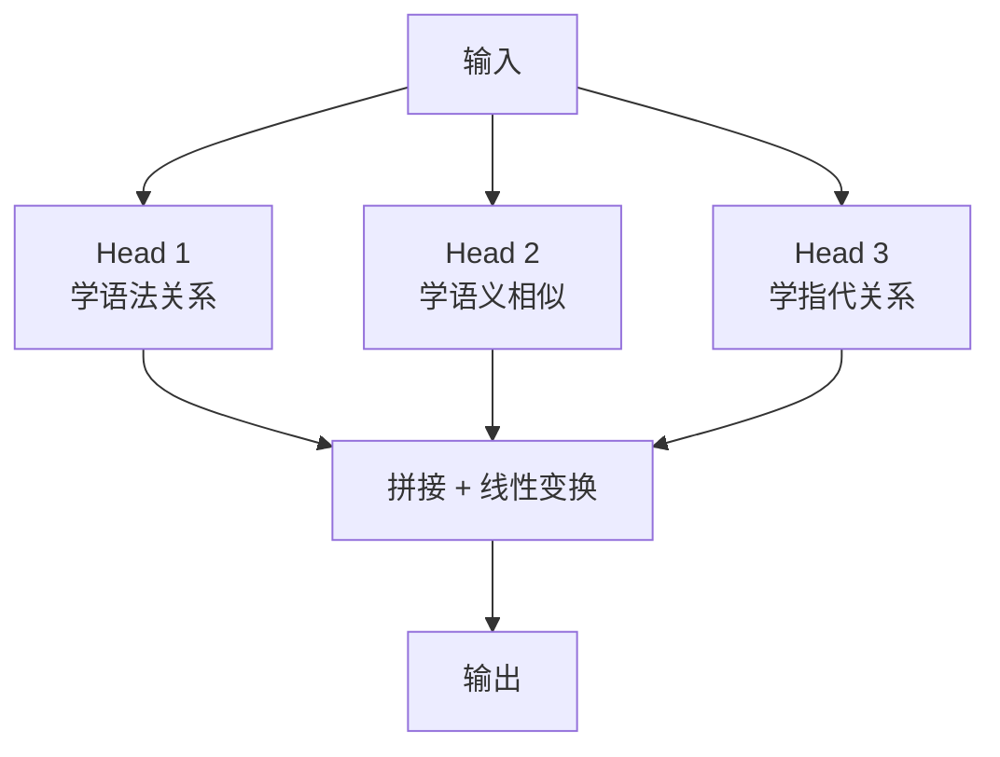

---
tags:
  - mechanism
aliases:
  - Attention
  - 注意力机制
  - Self-Attention
prerequisites:
  - "[[token-prediction]]"
  - "[[llm]]"
related:
  - "[[transformer]]"
  - "[[context-window]]"
stability: permanent
layer: model
updated: 2026-05-26
---

# Attention（注意力机制）

> [!tip] 核心本质
> Attention 让每个 token 在更新表示时能加权「看见」序列中的其他 token——「银行账户」里的「银行」因「账户」「钱」获得金融语义，而非河岸义。若没有这种可学习的相关性聚合，序列模型无法稳定处理长距离依赖与一词多义。

## 生命周期与演进

**当前定位**：Transformer 与一切现代 LLM 的核心算子；Self-Attention、Multi-Head、Cross-Attention 均由此展开。

**预期寿命**：架构层永久；线性/稀疏 Attention 变体在效率上替代全注意力，但「选择性聚合」思想不变。

**近期演进**：长上下文下 FlashAttention、滑动窗口等降低 O(n²) 代价；与 MoE、状态空间模型混合。

**终极威胁**：更强归纳偏置的架构若能在更小算力下达到同等质量，全注意力层占比下降——但消歧与融合需求仍在。

## 核心原理

### 没有 Attention，模型会缺什么

在 Attention 出现之前，处理序列的主流方案是 RNN——从左到右逐个处理 token，每一步把当前状态压缩成一个固定长度的向量传给下一步。

这个设计有一个根本缺陷：**信息必须经过所有中间步骤才能传递，距离越远的 token 影响越小。** 句子开头的词到了句子结尾基本已经"遗忘"了。翻译一个长句子，前面的主语到了谓语位置时已经稀释得差不多了。

从第一性原理想这个问题：如果你要让模型理解"银行账户里的钱"，最直接的方案是什么？

最直接的方案是：处理每个 token 时，直接看全句所有 token，自己决定哪些重要、哪些不重要，然后把重要的信息加权聚合进来。不经过中间人，不压缩，直接连接。这就是 Attention 的核心思路。

### Attention 怎么工作

Attention 给每个 token 分配三个角色：**Query（我在找什么）、Key（我能提供什么标签）、Value（我的实际内容）**。

计算过程：

用"银行账户"举例：处理"银行"这个 token 时，它的 Query 去和句子里所有词的 Key 计算相似度，"账户"和"钱"的 Key 和这个 Query 匹配度高，权重就大，它们的 Value 就被更多地融合进"银行"的输出表示里。这样"银行"的最终表示就带上了金融语义。

### Self-Attention 和 Cross-Attention

**Self-Attention** 是序列内部的注意力——token 关注同一个序列里的其他 token，用于理解上下文。Transformer 的编码器用的是这个。

**Cross-Attention** 是跨序列的注意力——一个序列的 Query 去关注另一个序列的 Key/Value。翻译任务里，解码器生成目标语言时用 Cross-Attention 关注源语言的表示。

### Multi-Head Attention

单个 Attention 只能学一种"关注模式"。**Multi-Head Attention 是并行跑多组 Attention**，每组学不同的关系——有的头学语法依赖，有的头学语义相似，有的头学指代关系。

多头的设计让模型能同时捕捉不同层次的依赖关系，单头做不到这一点。

### 边界：Attention 能做什么，不能做什么

Attention 解决了长距离依赖问题——任意两个 token 之间都是直接连接，不经过中间步骤。这让 [[context-window|context window]] 内的所有信息原则上都能被关注到。

但 Attention 有一个硬约束：**计算复杂度是序列长度的平方**。序列长度翻倍，计算量变四倍。这是 context window 有上限的根本原因之一——不是存不下，是算不起。

另外，Attention 告诉模型"关注哪里"，但不告诉模型"关注完之后怎么用"。后者由 Transformer 里的 FFN（前馈网络）负责。

---

## 实践与应用

还是"银行账户里的钱不多了"，看 Attention 权重怎么消歧义：

| 处理的 token | 高权重位置 | 低权重位置 | 结果 |
|-------------|-----------|-----------|------|
| 银行 | 账户（0.45）、钱（0.38）| 里（0.05）、了（0.03）| 金融机构语义 |
| 不多 | 钱（0.52）、了（0.21）| 银行（0.08）| 数量不足语义 |

处理"银行"时，"账户"和"钱"的权重最高，输出表示带上了金融语义。如果换成"河岸边的银行柳树"，"河岸"和"柳树"权重会更高，"银行"就会得到地理语义。**同一个词，上下文不同，Attention 输出的表示就不同。**

---

## 常见误区

Attention 权重高不等于这个词"重要"，这是最常见的误解。权重反映的是"当前 token 处理时对哪里的依赖更多"，不是语义重要性。可解释性研究早就发现，注意力权重和人类直觉的"重要词"经常对不上。

"Attention 解决了长距离依赖"容易被误读为"context window 里的信息都能被等价利用"。不是的——Attention 建立了连接，但训练数据的分布决定了模型实际上擅长关注哪些模式。训练时没见过的长距离依赖模式，测试时 Attention 也不会自动学会。

**真实使用中容易踩的坑：**

| 风险 | 表现 | 应对 |
|------|------|------|
| **Context 越长性能越差** | 模型在超长文档里"找不到"关键信息 | 重要信息放开头或结尾；用 RAG 切分而不是塞满 context |
| **以为 Attention 能做推理** | 期待模型自动"理解"隐含逻辑 | Attention 是信息聚合，推理能力来自训练，不是 Attention 本身 |
| **混淆 Self-Attention 和 Cross-Attention** | 在解释模型行为时搞混两种机制 | 区分：同序列内部关注 vs 跨序列关注 |

## 进一步阅读

- [[transformer]] — Attention 是 Transformer 核心；还有 FFN、位置编码等
- [[context-window]] — Attention 复杂度是 context 上限的根本原因之一
- [[llm]] — 理解 Attention 后更易解释 LLM 整体行为
