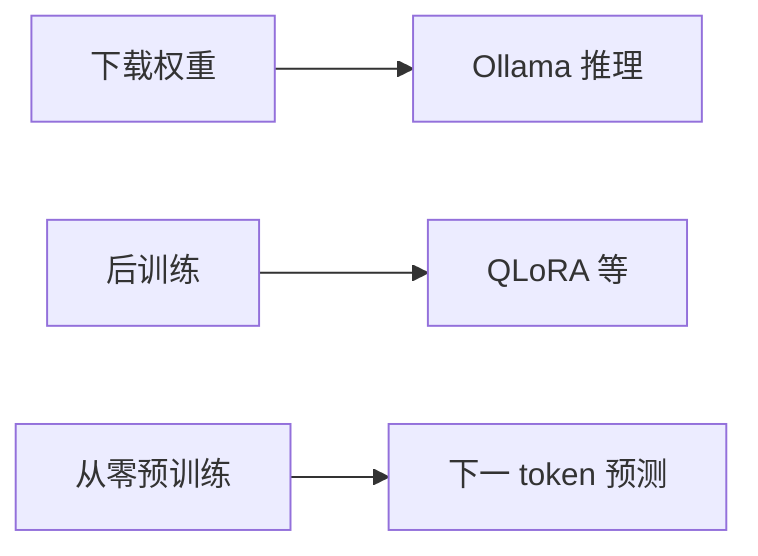
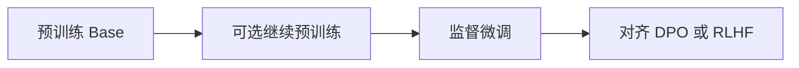
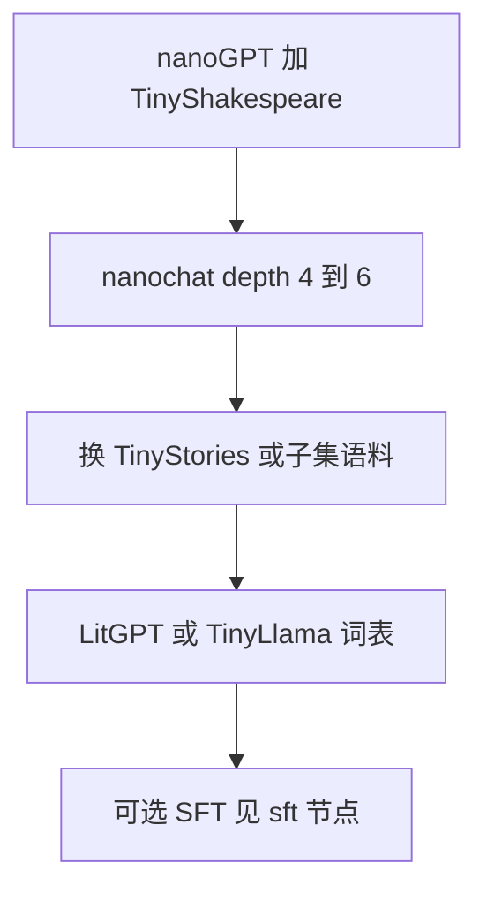

---
tags:
  - training
  - llama
aliases:
  - 本地预训练
  - 从零训练小模型
  - Llama 预训练
  - TinyLlama
prerequisites:
  - "[[llm]]"
  - "[[token-prediction]]"
  - "[[transformer]]"
related:
  - "[[training-data]]"
  - "[[scaling-laws]]"
  - "[[tokenization]]"
  - "[[sft]]"
  - "[[llm]]"
  - "[[ollama]]"
stability: mid
layer: model
updated: 2026-06-15
---

# 本地预训练 Llama 系小模型

> [!tip] 核心本质
> 本地预训练 Llama 系小模型，是在**随机初始化**的解码器（Decoder-only）Transformer 上，用海量纯文本做[[token-prediction|下一词元预测]]，得到会「续写」的基座——架构上对齐 Meta 的 Llama（均方根层归一化、旋转位置编码、SwiGLU 等），但权重由你自己训出。若没有这条路径与「下载现成 Llama」或「在基座上做[[sft|监督微调]]」的区分，会把 Ollama 拉模型、QLoRA 改行为、以及从零搭训练循环混成一件事，选错工具与算力预算。

适合已读 [[llm]] 与 [[token-prediction]]、想在本机或单卡上**亲手跑通预训练**的读者。读完 [[#1 三条路径与何时值得自己做|§1]] 能分清下载、微调、从零预训练并做选型；[[#3 预训练流水线|§3]] 给出五阶段因果链；[[#5 个人可落地的工具链|§5]] 与 [[#7 推荐学习路径|§7]] 对应命令与递进顺序。微调与对齐见 [[sft]]、[[rlhf]]，本篇不展开。

*检索说明：Llama 架构见 [Touvron et al., 2023][llama-paper]；Llama 3.2 1B/3B 训练管线（剪枝、蒸馏）见 [Meta Llama 3.2 Model Card][llama32-card]；TinyLlama 1.1B 与约 3T token 见 [Zhang et al., 2024][tinyllama]；nanochat `--depth` 见 [Base Pretraining][nanochat-pretrain]；LitGPT 见 [pretrain_tinyllama.md][litgpt-tinyllama]（观测 2026-06-15）。*

## 生命周期与演进

**当前定位**：个人与小团队学「基座从哪来」的**教学与实验**主路径——工业级 Llama 3 级预训练仍在 Meta 等闭源/半开源管线内；开源侧以 TinyLlama、nanochat、LitGPT 提供 **Llama 同构架构 + 可复现脚本**，把门槛压到单卡可跑「百万～十亿参数」量级。

**预期寿命**：「理解预训练」长期需要亲手训小模型；「在家复现 7B+ 全量预训练」仍不现实，但小模型实验栈会随框架（nanochat、LitGPT）持续翻新。

**近期演进**：Karpathy [nanochat](https://github.com/karpathy/nanochat) 用单一 `--depth` 旋钮自动配齐 Chinchilla 式数据:参比与 batch 缩放；社区 TinyLlama 在 **1.1B + 约 3T token** 上完成 Llama 2 同构预训练；Meta Llama 3.2 的 1B/3B 则走**剪枝 + 大模型 logit 蒸馏**，与「纯随机初始化预训练」不是同一条路；Apple Silicon 有 [nanogpt-mps-lab](https://github.com/poting-lin/nanogpt-mps-lab) 等 MPS 原生实现。

**终极威胁**：更强开源基座 + 极低成本的适配（RAG、上下文示范）缩小「必须自己预训练」的场景；算力与语料规模仍决定上限，个人小模型难以在通用能力上替代官方 Llama。

## 1 三条路径与何时值得自己做

口语里的「本地搞 Llama」常指三件事，机制与算力完全不同：

**图 1 — 与 Llama 相关的三条路径**



| 路径 | 起点 | 数据 | 典型工具 | 你想「训」时是不是这个 |
| --- | --- | --- | --- | --- |
| **A. 推理** | Meta 已训权重 | 无 | Ollama、`llama3.2:1b` | 否，只下载 |
| **B. 后训练** | 预训练或 Instruct checkpoint | 指令-回答对 | Unsloth、TRL | 否，这是[[sft]] |
| **C. 预训练** | 随机初始化 | 纯文本语料（GB～TB） | nanochat、LitGPT、nanoGPT | **是** |

路径 C 的产出是 **Base 模型**：给半句话会续写，**不会**像 ChatGPT 那样听指令——助手行为要靠路径 B 的[[sft]]及之后的对齐（[[rlhf]] 等）。

### 1.1 何时值得自己做预训练

多数工程场景**不必**从零预训练。先问目标，再选路径：

| 你的目标 | 更合适的做法 |
| --- | --- |
| 本机跑一个能对话的小助手 | 路径 A：`ollama pull llama3.2:3b` |
| 让模型学会你的文档/话术 | 路径 B：RAG 或 QLoRA 微调 |
| 私有语料、离线、权重完全自控 | 路径 C 或继续预训练（Continued PT） |
| 搞懂训练循环、缩放法则、分词器 | 路径 C，从 10M～100M 教学实验开始 |
| 复现「工业级 1B 小 Llama」论文结果 | TinyLlama 式集群预训练，或读 Meta 蒸馏管线而非单卡硬扛 |

路径 C 的价值主要在**可控、可审计、可改架构**，不在「用更少算力打败官方 Llama 3.2」。

## 2 Llama 架构与预训练目标

Llama 与 GPT 同属**仅解码器** Transformer，但工程细节不同，后来 Qwen、Mistral 等多沿 Llama 配方：

| 组件 | Llama 系常见选择 | 说明 |
| --- | --- | --- |
| 归一化 | RMSNorm | 较 LayerNorm 更省算 |
| 位置编码 | RoPE | 相对位置，外推 context 更友好 |
| FFN | SwiGLU | 三门控，参数量与表达力折中 |
| 注意力 | 大模型常用 GQA | 分组查询注意力，减 KV 缓存（Llama 3.2 1B/3B） |
| 偏置 | 线性层常无 bias | 与 GPT-2 等不同 |

预训练目标与 [[token-prediction]] 一致：对 token 序列 $x_1,\ldots,x_T$，最小化

$$
\mathcal{L} = -\sum_{t} \log P(x_t \mid x_{1:t-1})
$$

**整段文本都参与 loss**——这与[[sft]]只在回答区算 loss 形成对比。数据是**连续纯文本**（网页、书籍、代码），不是「用户：… 助手：…」格式。

[Touvron et al.][llama-paper] 在公开语料上训练 7B–65B，并强调**在固定算力下用更多 token 训练较小模型**（与 [[scaling-laws]]、Chinchilla 结论一致）。个人复现时不必追求 65B，但应理解：**参数量、训练 token 数、数据质量**共同决定 loss 与下游表现。

### 2.1 官方小 Llama 与个人「从零训」不是同一件事

Ollama 里的 `llama3.2:1b` / `3b` 名字像「小模型」，Meta 的 [Llama 3.2 Model Card][llama32-card] 写明：1B/3B 由更大 Llama 3.1 **剪枝**，并在预训练阶段用 8B/70B 的 **logit 蒸馏**恢复能力——不是社区 TinyLlama 那种「随机初始化 + 纯下一 token 预测跑满 3T token」。

| 来源 | 典型规模 | 训练故事 | 个人能否复现 |
| --- | --- | --- | --- |
| **官方 Llama 3.2 1B/3B** | 1.23B / 3.21B | 剪枝 + 蒸馏 + SFT/DPO 对齐 | 权重可下载；完整管线需集群 |
| **TinyLlama** | 1.1B | Llama 2 同构，SlimPajama + StarCoder，约 3T token | 代码开源；全量需多卡 |
| **个人教学实验** | 10M～100M | nanoGPT / nanochat 小 depth | 单卡或 Mac 可跑 |

读本文时：**路径 A 用的是 Meta 蒸馏产物**；**路径 C 学的是预训练机制**——二者都叫「小 Llama」，因果链不同。

## 3 预训练流水线

从零预训练无论用哪套框架，因果链都是五步：

**图 2 — 预训练数据与训练流**（细节见下表）


**表 1 — 图 2 各步说明**

| 步骤 | 输入 | 产出 |
| --- | --- | --- |
| 语料 | 网页、书籍、代码等纯文本 | 原始文本集 |
| 分词器 | 文本子集 | BPE 或 SentencePiece 词表 |
| Token 流 | 全文 + 词表 | 连续 token id（bin 或分片） |
| 预训练 | token 批次 | checkpoint |
| 续写推理 | prompt | 续写文本；要对话需 [[sft]] |

训出 Base 后，若要做助手，还要接后训练栈（细节见 [[sft]]）：

**图 3 — Base 之后常见后训练顺序**



### 3.1 语料

[[training-data]] 决定能力边界。入门常用英文合成故事集 TinyStories（简单语法、适合小模型）；正经实验用 SlimPajama、FineWeb 子集等。[TinyLlama 论文][tinyllama] 采用 SlimPajama 与 StarCoder 约 **7:3** 混合，总处理 token 约 **3T**（多 epoch 重复同一语料）。中文需自备清洗语料，并最好在中文上**重训或适配分词器**——硬套英文 GPT-2 词表会浪费参数。

### 3.2 分词与存储

1. 在语料子集上训练 BPE（或沿用 Llama / TinyLlama 词表做兼容实验）。
2. 全文转成 token id，写成连续二进制或分片 parquet，训练时按块随机读取（memory-map 或 streaming）。

工程上这一步常被低估：训练脚本再快，**脏语料、错误分词、重复未去重**都会直接反映在 val loss 与续写样本上。

### 3.3 训练循环

典型配置：AdamW、warmup + cosine 学习率、梯度裁剪、混合精度（`bfloat16` / `float16`）。大模型用 FSDP 或 DDP 多卡；小模型单卡即可。验证指标除 loss 外，**bits-per-byte（bpb）** 可跨词表比较（nanochat 默认记录 `val/bpb`）。

训练过程中建议同时看三类信号，不要只盯 train loss：

| 信号 | 看什么 | 异常时可能原因 |
| --- | --- | --- |
| **val loss / bpb** | 是否随 step 下降 | 过拟合、语料太窄、学习率过大 |
| **续写样本** | 每 N step 人工读一段 | 模式崩塌、分词器错、数据污染 |
| **吞吐与显存** | tokens/s、是否 OOM | batch 过大；可减 `device-batch-size` 或 depth |

### 3.4 产出物

- **checkpoint**：`model.pt` / SafeTensors
- **行为**：Base 续写；要对话需另走[[sft]]管线
- **部署**：常再导出 GGUF 供 Ollama / llama.cpp 推理（属于路径 A 的下游，不是预训练本身）

## 4 规模档位与算力

个人硬件决定「能训多大」；[[scaling-laws]] 决定「训多久才划算」。下表为**经验档位**，非严格下界：

**表 2 — 参数量、硬件与预期**

| 参数量 | 代表配置 | 语料量级 | 硬件 | 时间量级 |
| --- | --- | --- | --- | --- |
| ~10M | nanochat `depth=4–6` | 小数据集（MB 级） | CPU / Mac / 单卡 | 分钟～小时 |
| ~100M | nanochat `depth=12` | 千万～亿 token | 单卡 12–24GB | 小时～天 |
| ~1.1B | TinyLlama 同构 | 缩小版：亿级 token；完整版：约 3T token | 完整训练：多卡集群 | 完整训练：周级 |
| ~7B+ | 官方 Llama | 数 T token | 大规模集群 | 个人从零不现实 |
| GPT-2 级 (~1.5B) | nanochat `depth≈26` | ~10B token 量级 | 文档示例：8×H100，约 3 小时 | 云租 GPU |

[nanochat 文档][nanochat-pretrain]：`depth=12` 约 100M 参数，`depth=20` 约 300M；本机试跑可用 `depth=4`、`num-iterations=20` 验证脚本。LitGPT 的 [TinyLlama 教程][litgpt-tinyllama] 注明默认预训练配置约需 **8×A100**；单卡可跑缩小数据与步数，但完整 3T token 不现实。

### 4.1 按硬件快速选型

| 环境 | 建议起点 | 备注 |
| --- | --- | --- |
| **Mac M 系列** | [nanogpt-mps-lab](https://github.com/poting-lin/nanogpt-mps-lab) + TinyStories | MPS 后端；先跑通再加大 depth |
| **NVIDIA 8–12GB** | nanochat `depth=6–12` 或 nanoGPT | OOM 时减 `device-batch-size` |
| **NVIDIA 24GB+** | LitGPT `tiny-llama-1.1b` 缩小版 | 仍建议缩小 token 总量 |
| **无 GPU** | nanoGPT + TinyShakespeare | 验证代码逻辑，不追求质量 |
| **要冲 GPT-2 级** | 租 8×H100 跑 nanochat speedrun | 与「本机小实验」分开预算 |

## 5 个人可落地的工具链

按「想学什么」选型，而非只看 star 数：

| 工具 | 架构 | 适合 |
| --- | --- | --- |
| [nanoGPT](https://github.com/karpathy/nanoGPT) | GPT-2 默认；可改 | 第一课：最小训练循环 + TinyShakespeare |
| [nanochat](https://github.com/karpathy/nanochat) | Llama 风格；`--depth` 自动缩放 | Llama 系 + 现代超参缩放；冲 GPT-2 级需多卡 |
| [LitGPT](https://github.com/Lightning-AI/litgpt) | 内置 `tiny-llama-1.1b` 等 | 复现 TinyLlama 流程；`litgpt pretrain` |
| [TinyLlama](https://github.com/jzhang38/TinyLlama) | Llama 2 同构 1.1B | 工业设定：数据混合与 3T token 目标 |
| [nanogpt-mps-lab](https://github.com/poting-lin/nanogpt-mps-lab) | GPT 或 `--arch llama` | Apple Silicon，MPS 后端 |

### 5.1 本机试跑（nanochat，极小模型）

```bash
python -m scripts.base_train \
  --depth=4 \
  --max-seq-len=512 \
  --device-batch-size=1 \
  --total-batch-size=512 \
  --num-iterations=20
```

用于确认环境、数据管道与 checkpoint 写出，**不**代表训出了可用助手。

### 5.2 Llama 同构小模型（LitGPT + TinyLlama 词表）

```bash
pip install litgpt
litgpt download TinyLlama/TinyLlama-1.1B-intermediate-step-1431k-3T --tokenizer_only true
litgpt pretrain tiny-llama-1.1b \
  --data OpenWebText \
  --tokenizer_dir TinyLlama/TinyLlama-1.1B-intermediate-step-1431k-3T
```

缩小 `--data` 规模与训练步数可在单卡上做**教学级**运行；与官方 TinyLlama 全量约 3T token 目标相差数个数量级。

### 5.3 只想本地**用** Llama、不训练

```bash
ollama pull llama3.2:1b
ollama pull llama3.2:3b
```

属于路径 A，与预训练无关。

## 6 边界与常见误区

### 6.1 预训练完为什么还不会聊天

Base 模型优化的是「文本续写」分布。Instruct 行为来自[[sft]]及偏好对齐。流水线顺序仍是：**预训练 →（可选）继续预训练 → SFT → 对齐**（见 [[#3 预训练流水线|§3]] 图 3）。

### 6.2 中文小模型

1. **语料**：维基、书籍、新闻等需清洗去重（见 [[training-data]]）。
2. **分词**：中文占比高时建议专用 BPE，避免英文词表切分过碎（见 [[tokenization]]）。
3. **预期**：同等算力下，个人小模型通用能力通常**弱于**官方多语言基座；价值在可控、可审计与**领域续写**，不在全面超越 Llama 3。
4. **继续预训练**：若已有多语言 Base（如 Llama），有时「在中文语料上继续预训练」比从零 100M 模型更划算——那是路径 B 与 Continued PT 的交界，仍不是随机初始化。

### 6.3 常见误区

| 误区 | 实际情况 |
| --- | --- |
| 微调 = 预训练 | 微调在已有权重上改行为；预训练从随机初始化开始 |
| 下载 Llama = 自己训的 | Ollama 拉取的是 Meta 或衍生 checkpoint |
| TinyLlama 名字小 = 单卡能训满 3T | 完整训练仍需集群；单卡应缩小 token 与模型 |
| 预训练完直接部署客服 | Base 会续写而非服从指令，需[[sft]] |
| llama3.2:1b 等于「我训的 1B」 | 官方 1B/3B 含剪枝与蒸馏；个人实验是另一套因果链 |

## 7 推荐学习路径

按递进顺序跑通，比一上来追求 1B 全量更省时间：



| 阶段 | 做什么 | 验证标准 |
| --- | --- | --- |
| **1** | [nanoGPT](https://github.com/karpathy/nanoGPT) + TinyShakespeare | val loss 下降；能续写莎士比亚体 |
| **2** | nanochat `depth=4–6`，确认 checkpoint | 脚本无 OOM；理解 `--depth` 含义 |
| **3** | 换 TinyStories 或 FineWeb 子集 | 续写更像现代英文；对比语料影响 |
| **4** | LitGPT + TinyLlama 词表，缩小 token | 熟悉 Llama 同构配置与词表 |
| **5** | （可选）对自训 Base 做[[sft]] | 从续写机变成听指令——进入后训练栈 |

Karpathy 的 [Let's build GPT](https://www.youtube.com/watch?v=kCc8FmEb1nY) 与 [Let's build the GPT Tokenizer](https://www.youtube.com/watch?v=zduSFxRajkE) 可与阶段 1–2 对照观看。

## 要点收束

- **本地预训练 Llama 系小模型** = 随机初始化 + Llama 风格架构 + 纯文本下一 token 预测；与下载权重、[[sft|监督微调]] 是三条不同路径。
- **官方 Llama 3.2 1B/3B** 含剪枝与蒸馏，与 TinyLlama 式「纯从零预训练」不是同一条工业管线。
- 流水线：**语料 → 分词器 → token 存储 → 训练循环 → 续写 →（可选）SFT → 对齐**；loss 覆盖整段序列。
- 个人现实区间约 **10M～1.1B** 参数；7B+ 与 GPT-2 级全量预训练依赖多卡或云 GPU。
- 入门工具：**nanoGPT** → **nanochat / LitGPT** → **TinyLlama 仓库**；用 val bpb 与续写样本判断是否训偏。

## 进一步阅读

### 库内关联

- [[token-prediction]] — 预训练唯一目标与生成时的自回归
- [[training-data]] — 语料来源、质量与知识截止
- [[scaling-laws]] — 参数量、token 数、算力如何配比
- [[tokenization]] — BPE 与词表设计
- [[sft]] — 预训练之后如何把基座变成听指令的策略
- [[transformer]] — 解码器栈与注意力机制
- [[llm]] — 预训练、微调、对齐在能力栈中的位置
- [[ollama]] — 路径 A：本地加载已训权重

### 论文与仓库

- [llama-paper]: [LLaMA: Open and Efficient Foundation Language Models](https://arxiv.org/abs/2302.13971) — Llama 架构、数据与 7B–65B 结果
- [llama32-card]: [Meta Llama 3.2 Model Card](https://github.com/meta-llama/llama-models/blob/main/models/llama3_2/MODEL_CARD.md) — 1B/3B 剪枝、蒸馏与对齐管线
- [tinyllama]: [TinyLlama: An Open-Source Small Language Model](https://arxiv.org/abs/2401.02385) — 1.1B、约 3T token、Llama 2 同构
- [nanochat]: [karpathy/nanochat](https://github.com/karpathy/nanochat) — 单节点预训练、SFT、评测与 Chat UI
- [nanochat-pretrain]: [nanochat Base Pretraining](https://karpathy-nanochat.mintlify.app/training/pretraining) — `--depth`、batch 与缩放法则
- [litgpt-tinyllama]: [LitGPT — Pretrain TinyLlama](https://github.com/Lightning-AI/litgpt/blob/main/tutorials/pretrain_tinyllama.md) — `litgpt pretrain` 与硬件说明
- [nanogpt]: [karpathy/nanoGPT](https://github.com/karpathy/nanoGPT) — 最小 GPT 预训练教学实现
