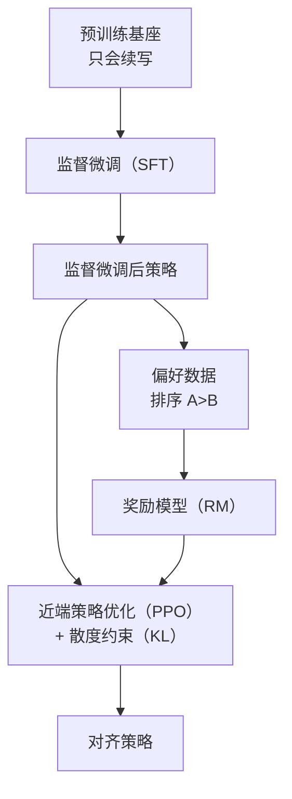

---
tags:
  - data
  - training
aliases:
  - RLHF
  - 人类反馈强化学习
  - Reinforcement Learning from Human Feedback
prerequisites:
  - "[[llm]]"
  - "[[token-prediction]]"
related:
  - "[[llm]]"
  - "[[sft]]"
  - "[[transformer]]"
  - "[[training-data]]"
  - "[[rlhf-bias]]"
  - "[[rlvr]]"
  - "[[llm-generation-traps]]"
  - "[[hallucination]]"
stability: long
layer: data
updated: 2026-06-14
---

# 人类反馈强化学习（RLHF）

> [!tip] 核心本质
> 人类反馈强化学习（Reinforcement Learning from Human Feedback，RLHF）用人类偏好训练奖励模型（Reward Model，RM），再以强化学习把策略推向「更像人愿看到的回答」——弥补预训练只优化「下一词元连贯」与「对人有用、无害」之间的鸿沟。若没有对齐，模型会续写得像文本，却不听指令、不安全或过度端水；奖励模型不完美时，强优化会放大偏置与奖励黑客（reward hacking）。

适合已读 [[llm]] 与 [[token-prediction]]、要理解「对话助手如何从续写机变来」以及「为何业界又转向直接偏好优化（DPO）」的读者。读完 [[#2 经典三阶段|§2]] 能复述监督微调（SFT）→ 奖励模型（RM）→ 近端策略优化（PPO）；[[#4 边界与替代路线|§4]] 说明人类反馈强化学习没解决什么、与直接偏好优化（DPO）/ 可验证奖励强化学习（RLVR）的分工。

*检索说明：流程对照 [InstructGPT / Ouyang et al., 2022](https://arxiv.org/abs/2203.02155)；直接偏好优化（DPO）[Rafailov et al., 2023](https://arxiv.org/abs/2305.18290)；奖励黑客 [Skalse et al., 2022](https://arxiv.org/abs/2209.13085)（观测 2026-06-14）。*

## 生命周期与演进

**当前定位**：对齐范式的**经典教科书流程**（监督微调（SFT）→ 奖励模型（RM）→ 近端策略优化（PPO））；概念上仍是理解偏好对齐的基准，但工业界大量后训练改用直接偏好优化（DPO）/ 赔率比偏好优化（ORPO）等**无显式奖励模型 + 无近端策略优化在线展开（rollout）** 的偏好优化。

**预期寿命**：「用偏好信号对齐」长期存在；完整人类反馈强化学习三阶段在开源与产品里的**工程占比**持续下降。

**近期演进**：从人工智能反馈的强化学习（RLAIF）、[[constitutional-ai|宪法人工智能（Constitutional AI）]] 用模型评判替代部分人工；因果奖励、信息瓶颈奖励模型等缓解 [[rlhf-bias]]；推理域用 [[rlvr]] 的可验证奖励补偏好奖励模型的客观性缺口。

**终极威胁**：环境反馈、自动化可审计评判若更可靠，人类标量奖励模型角色收缩；开放域价值观对齐仍难被纯规则取代。

## 1 对齐问题：预训练缺什么

预训练结束后的模型是极强的**文本补全机**——给它「从前有座山」，它能接出合理下文；给它代码注释，它能续写实现。但相对「助手」目标，常有三类缺口：

| 缺口 | 表现 | 根因 |
| --- | --- | --- |
| **不遵循指令** | 「帮我写周报」→ 续写「周报的写法是…」 | 语料是对话混杂文本，非统一「问→答」 |
| **不知何为好答案** | 流畅但无用、甚至错误也高分 | 目标只有 [[token-prediction\|下一 token 预测]] 概率 |
| **价值观未对齐** | 可能复现有害模式 | 训练分布含互联网噪声与风险内容 |

三者合称**对齐（Alignment）**。人类反馈强化学习是指令调优 GPT（InstructGPT）、Claude 等验证过的经典路线：先把「好不好」变成可收集的**偏好数据**，再优化策略。

## 2 经典三阶段：监督微调（SFT）→ 奖励模型（RM）→ 近端策略优化（PPO）



### 2.1 监督微调（Supervised Fine-tuning，SFT）

用人工「指令 → 优质回答」对直接微调基座（机制与数据谱系见 [[sft]]）。模型学会对话格式与基本服从，但监督微调数据有限，且标注员对「好答案」判断不一致——**示范了怎么做**，未泛化全体偏好。

### 2.2 奖励模型（Reward Model，RM）

同一用户问题让监督微调后策略生成多个回答，标注员做**排序**（如 A > C > B > D），而非绝对打分——相对偏好更稳定。奖励模型学习该标注群体的偏好分布，对任意回答输出标量分数。

### 2.3 近端策略优化（Proximal Policy Optimization，PPO）

用奖励模型当评委：策略生成回答 → 奖励模型打分 → 用强化学习提高期望奖励。关键约束：**相对熵散度惩罚（KL penalty）**——新策略不能离监督微调策略太远，减轻**奖励黑客（reward hacking）**（利用奖励模型漏洞拿高分但质量差）。详见 [[rlhf-bias]]。

## 3 为何用人类偏好，而非单一损失

「有帮助」「无害」「诚实」难以写成闭式损失，且彼此冲突。人类更擅长**比较**两个答案孰优——成本低于写满分答案，且一致性更好。

**人类反馈强化学习把「什么是好答案」转化为「人类更满意哪一个」，用奖励模型泛化到未见用户问题。这是偏好学习的核心逻辑，直接偏好优化（DPO）等变体保留这一点，只是换优化形式。**

## 4 边界与替代路线

### 4.1 人类反馈强化学习解决了什么、没解决什么

| 通常改善 | 通常不解决 |
| --- | --- |
| 指令遵循、助手语气、安全性 | **[[hallucination]]**（奖励模型偏好流畅自信，可能强化奉承） |
| 有害输出概率下降 | **新知识注入**（改行为，不改事实存储） |
| 产品可用性跃升 | 奖励模型偏见、长度偏置等（[[rlhf-bias]]、[[llm-generation-traps]]） |

**奉承性对齐（sycophancy）**：模型更同意用户、更自信地错——奖励学的是「像好助手」，不是「可验证为真」。

### 4.2 直接偏好优化（DPO）与人类反馈强化学习的关系

[直接偏好优化（DPO）](https://arxiv.org/abs/2305.18290)（2023）在 Bradley-Terry 偏好假设下，把「奖励模型 + 近端策略优化」目标改写为**直接优化策略的偏好损失**——策略本身可视为隐式奖励模型。工程上常**更稳、更省**（无需单独奖励模型与在线展开），开源对齐（如 Zephyr 类工作）广泛采用。

**表 1 — 选型速览**

| 方法 | 典型流程 | 优点 | 代价 |
| --- | --- | --- | --- |
| **人类反馈强化学习（近端策略优化）** | 监督微调（SFT）→ 奖励模型（RM）→ 近端策略优化（PPO） | 经典、可在线探索 | 四模型负载、调参难 |
| **直接偏好优化（DPO）/ 赔率比偏好优化（ORPO）等** | 监督微调（SFT）→ 偏好对直接优化 | 实现简单、稳定 | 仍依赖偏好数据质量 |
| **从人工智能反馈的强化学习（RLAIF）/ 宪法人工智能（CAI）** | 原则或模型评判生成偏好 | 降低人工标注成本 | 评判模型偏见传递 |
| **[[rlvr]]** | 规则/测试可验证奖励 | 数学代码等客观对错 | 不适用开放域价值观 |

理解人类反馈强化学习的价值在于理解**偏好对齐逻辑**，不在于它是否仍是 2026 年默认工程栈。部分场景（安全关键近端策略优化、复杂在线奖励）仍保留完整三阶段流程。

## 5 实践与踩坑

**同一用户问题，预训练与对齐后（示意）**：

```
用户：帮我写一份请假条，明天我要去医院看病。

预训练基座（可能）：
  请假条是一种正式文书，通常包含以下要素：1. 称谓…（介绍写法，非直接写条）

对齐后（可能）：
  尊敬的 [领导姓名]：我因身体不适，需于明日前往医院就诊，特申请请假一天…
```

**奖励黑客示意**：标注偏好「详细、有条理」→ 策略学会**版式好看但内容空**的回答 → 奖励模型仍给高分。散度约束（KL）缓解但无法消除，见 [[rlhf-bias]]。

## 6 常见误区

| 误区 | 实际情况 |
| --- | --- |
| 人类反馈强化学习消除幻觉 | 更「好说话」≠ 更真；流畅错误可获更高偏好 |
| 奖励分越高越好 | 过优化奖励模型 → 黑客与分布漂移 |
| 监督微调足够 | 监督微调是示范平均；偏好优化补分布外行为 |
| 人类反馈强化学习是唯一对齐 | 直接偏好优化（DPO）/ 从人工智能反馈的强化学习（RLAIF）/ 可验证奖励强化学习（RLVR）并存；按任务选信号 |
| 直接偏好优化与人类反馈强化学习无关 | 直接偏好优化是同一偏好目标的闭式重参数化，非另一套价值观 |

## 要点收束

- 人类反馈强化学习：监督微调（SFT）学格式与服从 → 奖励模型（RM）学人类排序偏好 → 近端策略优化（PPO）在散度约束（KL）下最大化奖励分。
- 对齐补的是「有用、无害、听指令」，不补事实存储；幻觉与奉承风险仍在。
- 人类**比较**优于直接写损失；偏好数据是对齐的可收集接口。
- 工程上直接偏好优化（DPO）等大量替代显式近端策略优化管线，但逻辑仍是「从偏好改策略」。
- 推理可验证域见 [[rlvr]]；奖励模型结构性偏置见 [[rlhf-bias]]。

## 进一步阅读

### 库内关联

- [[sft]] — 监督微调：对齐前的示范阶段与 PPO 参考策略
- [[llm]] — 预训练、监督微调与人类反馈强化学习在能力栈中的位置
- [[token-prediction]] — 预训练目标与对齐目标的鸿沟
- [[training-data]] — 语料与偏好数据如何塑造行为
- [[rlhf-bias]] — 古德哈特定律（Goodhart）、长度/奉承偏置与缓解
- [[rlvr]] — 可验证奖励 vs 人类偏好奖励模型
- [[llm-generation-traps]] — 对齐后的可观测生成偏置
- [[hallucination]] — 对齐不消除事实性编造

### 外部参考

- [InstructGPT（Ouyang et al., 2022）](https://arxiv.org/abs/2203.02155) — 人类反馈强化学习工程流程原始论文
- [直接偏好优化 / DPO（Rafailov et al., 2023）](https://arxiv.org/abs/2305.18290) — 隐式奖励模型与偏好直接优化
- [宪法人工智能 / Constitutional AI（Bai et al., 2022）](https://arxiv.org/abs/2212.08073) — 从人工智能反馈的强化学习（RLAIF）/ 原则驱动偏好
- [奖励黑客 / Reward Hacking（Skalse et al., 2022）](https://arxiv.org/abs/2209.13085) — 定义与分类
- [Christiano et al., Deep RL from Human Preferences (2017)](https://arxiv.org/abs/1706.03741) — 偏好强化学习早期工作
