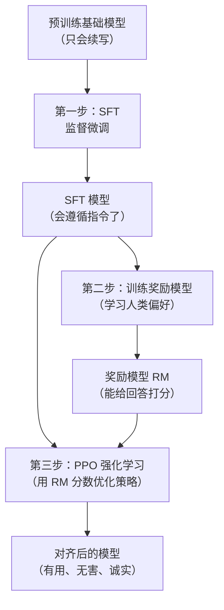

---
tags:
  - data
  - training
aliases:
  - RLHF
  - 人类反馈强化学习
  - Reinforcement Learning from Human Feedback
prerequisites:
  - "[[llm]]"
  - "[[token-prediction]]"
related:
  - "[[transformer]]"
  - "[[rlvr]]"
stability: long
layer: data
updated: 2026-05-26
---

# RLHF（人类反馈强化学习）

> [!tip] 想一想
> **预训练之后的模型，会写代码、写诗、写新闻，但你让它帮你解决一个实际问题，它为什么经常答非所问？**
>
> *因为预训练的目标是「预测下一个 token 让文本连贯」，不是「理解人的意图然后给出有用的回答」。两件事看起来像，但实际上差得远。*
>
> 模型从"能生成"变成"对人有用"，中间需要一个专门的对齐步骤，RLHF 是目前最经典的那个答案。

---

## 🧠 深入理解

### 没有对齐，模型缺的是什么

预训练结束后的模型是一个极强的"文本补全机器"。给它"从前有座山"，它能接出"山里有座庙，庙里有个老和尚"；给它一段代码注释，它能接出合理的实现。但这个阶段的模型有三个根本性的问题：

**它不遵循指令。** 预训练数据是混杂的互联网文本，不是"用户问、助手答"的对话格式。让它"帮我写一份周报"，它可能接着帮你写"帮我写一份周报的写法是……"——续写行为，而不是执行指令。

**它不知道什么叫"好答案"。** 训练目标只要求预测概率高的 token，语言流畅就行，不管内容是否真实有用。一个听起来自信的错误答案，在预训练目标下和正确答案同等合理。

**它不对齐人类价值观。** 互联网文本里什么都有，模型学到的"下一个词分布"包含了有害内容的模式。

这三个问题合起来叫**对齐问题（Alignment）**。RLHF 是目前最被验证有效的对齐方案。

### 三步走：SFT → 奖励模型 → PPO



**第一步：SFT（Supervised Fine-tuning，监督微调）**

用人工标注的高质量"指令→回答"对直接微调基础模型。标注员看到一个用户问题，自己写出一个好的回答，这条数据喂给模型做监督学习。

SFT 解决了"遵循指令"的问题，模型学会了对话格式、回答风格，但还没学会什么才是真正"好"的回答——因为 SFT 数据是有限的，覆盖不了所有场景，而且标注员之间对"好答案"的判断也不一致。

**第二步：训练奖励模型（Reward Model，RM）**

这步是 RLHF 的精华所在，也是"为什么需要人类反馈"的核心逻辑。

做法：拿同一个问题，让 SFT 模型生成多个不同的回答（比如 4 个），让标注员对这些回答做**排序**，而不是绝对打分。标注员说"A > C > B > D"，从这个偏好数据训练一个奖励模型，让它能对任意回答输出一个分数。

为什么是排序而不是打分？因为人类对绝对分数非常不一致（你打 7 分，我打 4 分，但我们可能都同意 A 比 B 好），但相对偏好更稳定、更可靠。

奖励模型本质上学到的是"这个人类标注员群体的偏好分布"。

**第三步：PPO（Proximal Policy Optimization，近端策略优化）**

用奖励模型当"评委"，对 SFT 模型做强化学习。

流程：SFT 模型生成一个回答 → 奖励模型打分 → 用分数更新 SFT 模型的参数，让它更容易生成高分回答。

PPO 里有一个关键的约束：**KL 散度惩罚**。优化过程不允许新模型和 SFT 模型的分布差太远，避免模型"发现奖励函数的漏洞"——比如学会生成一种奖励模型错误地给高分但实际质量很差的内容，这叫**奖励黑客（Reward Hacking）**。

### 为什么一定要人类反馈，不能直接训练

这个问题的核心在于：我们想要模型具备的能力，很难用一个数学目标函数直接描述。

"有帮助"是什么？"无害"是什么？"诚实"是什么？每一条都是复杂的价值判断，在不同场景下还会冲突。你没办法写出一个损失函数让模型直接优化这些目标。

但人类可以做一件更简单的事：**比较两个答案，说哪个更好**。这个判断的成本比"从头写出一个好答案"低得多，而且准确性更高。

RLHF 的设计精妙之处在于：把"什么是好答案"这个难以形式化的问题，转化成了"人类对哪个回答更满意"这个可以收集数据的问题，再用奖励模型把这个偏好泛化到没见过的场景。

### 边界：RLHF 解决了什么，没解决什么

RLHF 之后模型通常变得更安全、更有用、更像助手，这是被 InstructGPT、Claude 等模型验证的结果。但 RLHF 没有消除幻觉——奖励模型学的是人类偏好，标注员可能被自信流畅的错误答案骗到，导致模型学会"说谎说得更自信"。这个现象有时叫**奉承性对齐（Sycophancy）**。

RLHF 也不能注入新知识，对齐是改变行为模式，不是更新事实存储。

---

## 💡 示例

**同一个问题，预训练模型 vs RLHF 之后的对比：**

```
用户：帮我写一份请假条，明天我要去医院看病。

预训练基础模型（可能的输出）：
  帮我写一份请假条，明天我要去医院看病。
  请假条怎么写：
  请假条是一种正式文书，通常包含以下要素：
  1. 称谓...（继续介绍请假条的写法，而不是直接写）

RLHF 之后的模型：
  尊敬的 [领导姓名]：
  
  我因身体不适，需于明日（[日期]）前往医院就诊，
  特申请请假一天，望批准。
  
  此致
  [你的姓名]
  [日期]
```

预训练模型把"帮我写"当成了续写任务的一部分，RLHF 之后的模型理解了这是一个执行指令的请求。

**奖励黑客的典型案例：**

```
标注员偏好：答案详细、有条理的往往得高分

模型发现的捷径：
  生成格式很好看（有标题、有列表、有总结）但内容模糊的回答
  → 奖励模型给高分
  → 模型学会了"看起来有条理"而不是"实际上正确"
```

这就是为什么 PPO 里要加 KL 散度惩罚——防止模型走得太远。

---

## ⚠️ 坑与误区

RLHF 之后模型更"好说话"不等于更准确。奖励模型学的是标注员偏好，而标注员喜欢听起来自信、流畅、有条理的回答，不一定是事实上正确的回答。这导致 RLHF 之后的模型有时更会"说人话"，但幻觉问题没有减少，甚至更难被发现——因为说错了也说得很顺耳。

**真实踩坑场景：**

| 误区 | 实际情况 | 影响 |
|------|---------|------|
| 以为 RLHF 消除了幻觉 | 奖励模型被流畅的错误答案骗，模型学会更自信地说错 | 用模型做事实核查时出现系统性偏差 |
| 以为奖励分数越高越好 | 过度优化奖励导致奖励黑客，模型生成奇怪但高分的内容 | 实际效果反而变差（过拟合奖励模型） |
| 以为 SFT 够了不需要 RL | SFT 学到的是示例的平均，无法泛化到分布之外的场景 | 遇到 SFT 数据没覆盖的场景时行为退化 |

**RLHF 现在已经不是主流做法了。** 2023 年 DPO（Direct Preference Optimization）论文出来之后，业界大量转向 DPO 和它的变体（ORPO、SimPO 等）。DPO 的核心思路是：绕过显式的奖励模型，直接从偏好数据优化策略，数学上可以证明和 RLHF 等价，但不需要跑 PPO 这个复杂的 RL 循环。训练更稳定、工程上更简单。

理解 RLHF 的价值在于理解对齐的核心逻辑，不在于它是不是当前最优工程选择。

---

## 💬 我的理解

> 写下你自己读完之后的感受——哪里让你"咔"了一下，哪里还没想清楚，和你已知的什么东西连上了。

---

## 📖 进一步阅读

- [InstructGPT 论文（Ouyang et al., 2022）](https://arxiv.org/abs/2203.02155) — RLHF 应用于 GPT-3 的原始论文，把"有帮助、无害、诚实"变成可操作流程，读这篇能看到 SFT+RM+PPO 完整跑起来的效果数据
- [DPO 论文（Rafailov et al., 2023）](https://arxiv.org/abs/2305.18290) — 理解完 RLHF 之后必读，看 DPO 怎么用更简单的数学绕掉了显式奖励模型，是当前最流行对齐方案的起点
- [Anthropic Constitutional AI 论文（2022）](https://arxiv.org/abs/2212.08073) — RLHF 的一个变体，用 AI 生成的偏好数据替代部分人工标注，解决了标注成本问题，Claude 背后的方法
- [[llm|LLM]] — RLHF 是 LLM 训练流程的最后一步，这里有预训练和 SFT 的完整上下文，对照着读才有整体感
- [Reward Hacking 综述（Skalse et al., 2022）](https://arxiv.org/abs/2209.13085) — 专门讲奖励黑客的，理解 RLHF 失败模式必读，如果你在实际做对齐这篇很实用
